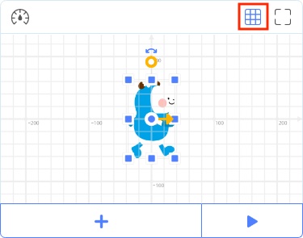
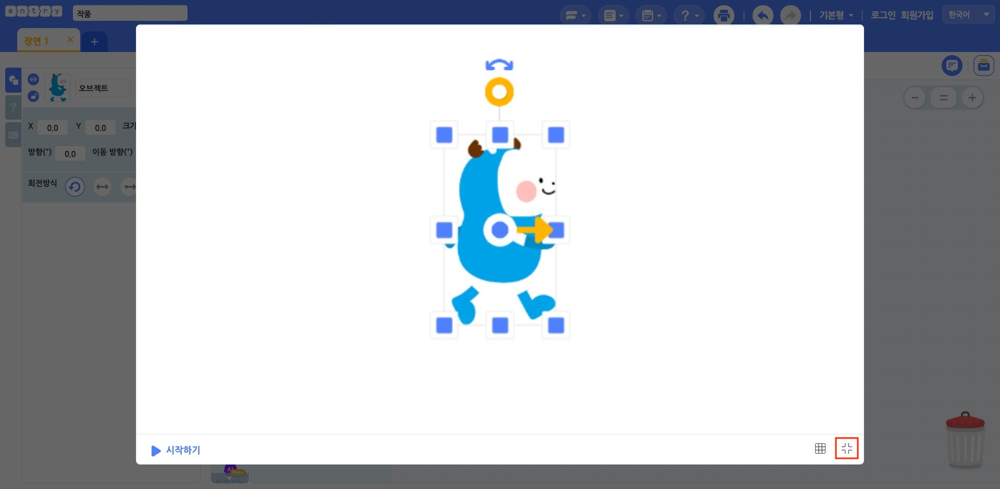
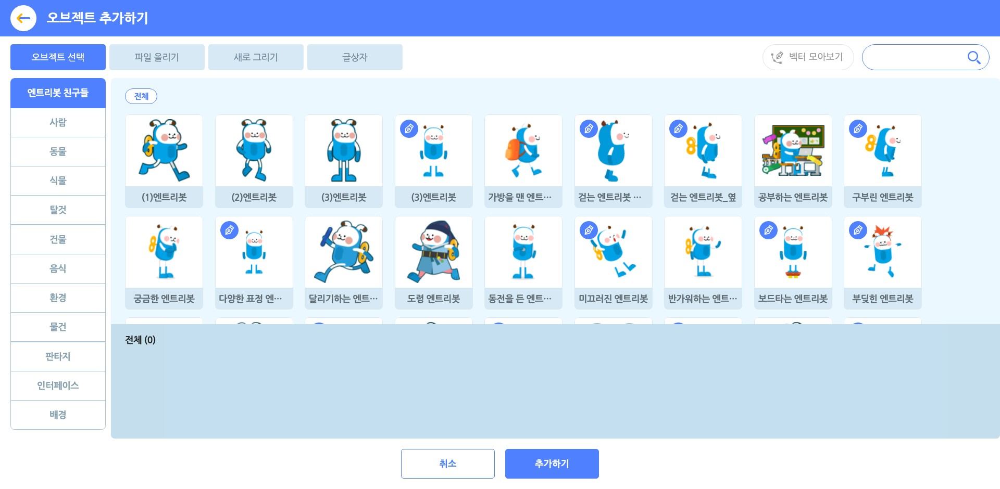
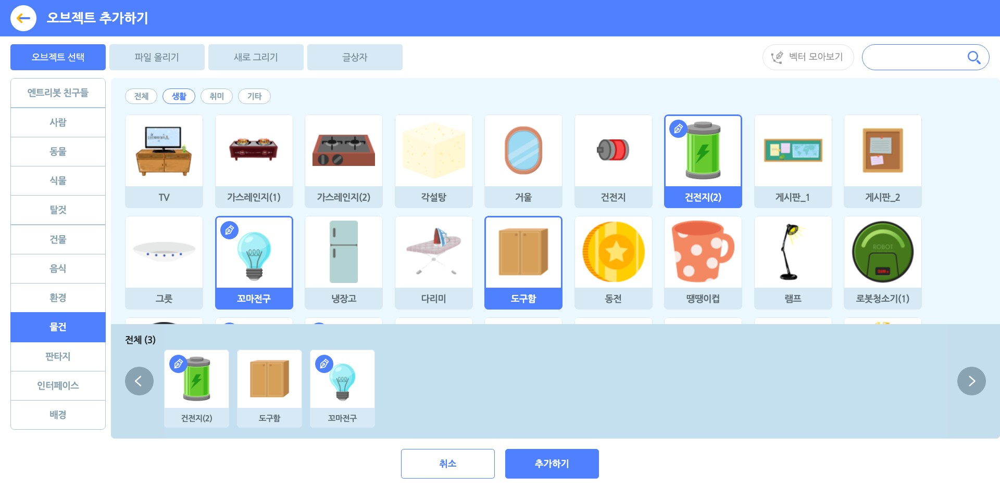
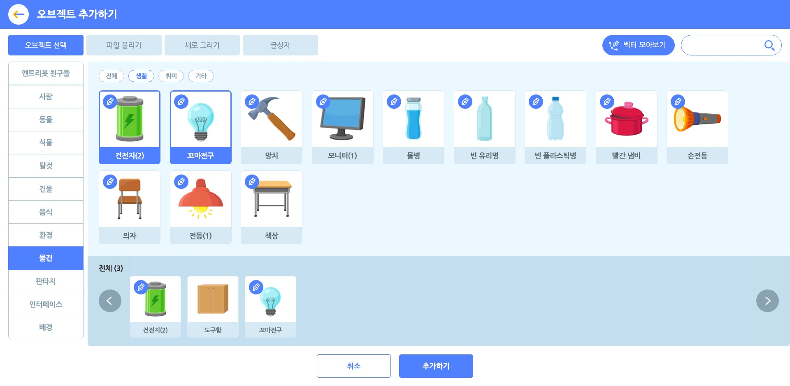
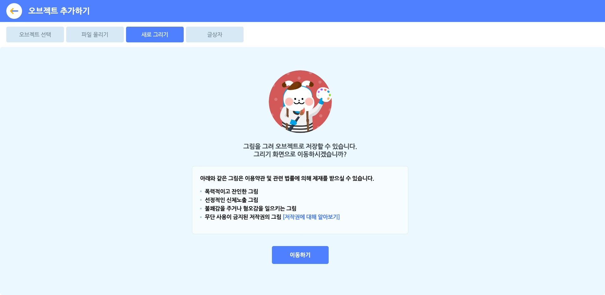
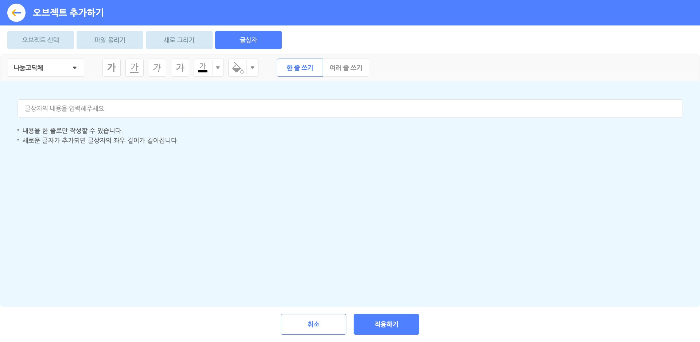
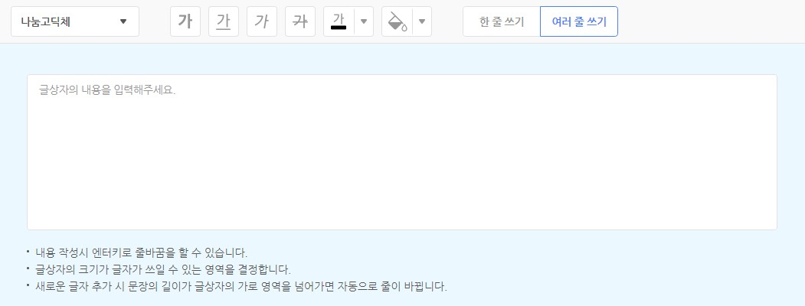

## 작품 실행

작품 만들기 화면의 왼쪽 위에 있는 실행 화면입니다. 작품 시작하기 버튼 을 누르면 작품을 실행할 수 있습니다.

+ 단축키 `ctrl` + `r` 을 눌러서 실행할 수도 있습니다.

작품이 실행 중이라면 작품 일시정지 버튼과 작품 중지하기 버튼이 나타나요.

+ **작품 일시정지 버튼**  : 작품을 잠시동안 정지합니다. 시작하기 버튼 을 다시 누르면 작품이 정지된 곳부터 시작해요.

+ **작품 중지하기 버튼**  : 작품을 완전히 정지하고 처음 상태로 되돌립니다. 단축키 `ctrl` + `r` 을 눌러서 중지할 수도 있습니다.

실행 화면 위에 나타나는 좌표는 마우스 포인터의 좌표입니다. 실행 화면 안에 마우스 포인터를 대보세요.

속도 조절 버튼을 누르면 작품의 실행 속도를 1~5 범위에서 조절할 수 있어요. 블록의 실행 순서를 눈으로 천천히 확인하고자 할 때 유용합니다.

모눈 종이 버튼을 클릭하면 실행 화면에 눈금 좌표계가 나타납니다.

+ 실행 화면의 가운데가 좌표계의 원점입니다.
+ 실행 화면 안의 x 좌표 범위는 -240~240 입니다. 오른쪽으로 갈수록 양수(+)로 커지고, 왼쪽으로 갈수록 음수(-)로 커져요.
+ 실행 화면 안의 y 좌표 범위는 -135~135 입니다. 위로 갈수록 양수(+)로 커지고, 아래로 갈수록 음수(-)로 커져요.

오브젝트의 위치를 파악할 때 유용해요.

오른쪽 위의 크게 보기 버튼을 클릭하면 실행 화면을 크게 볼 수 있어요.

큰 실행 화면 아래에서 속도 조절 버튼을 제외한 모든 기능을 사용할 수 있습니다.

큰 실행 화면은 오른쪽 아래의 작게 보기 버튼을 클릭하면 원래의 크기로 되돌릴 수 있습니다.

## 장면

엔트리의 장면은 영화 구성의 기본 단위인 장면과 비슷하다고 할 수 있어요. 장면들이 모여 영화가 되는 것처럼, 엔트리에서는 장면들이 모여 작품이 됩니다.

한 장면 안에서 영화가 시간에 따라 흘러가듯, 엔트리 작품의 블록 코드들도 장면 안에서 순차적으로 작동합니다. 영화에서 다음 장면으로 넘어가면 화면에 등장하는 인물과 배경에 변화가 있듯이, 엔트리에서도 새로운 장면에서는 새로운 오브젝트들과 코드가 필요하죠.

+ 오른쪽의 장면 추가하기 버튼을 클릭해서 새 장면을 추가합니다.
+ 장면 이름을 클릭하면 이름을 수정할 수 있습니다.
+ 장면을 클릭하면 장면을 선택할 수 있습니다. 해당 장면의 실행화면, 오브젝트 목록이 나타납니다.
+ 선택한 장면 오른쪽의 X 버튼을 클릭해서 삭제합니다.

## 오브젝트 추가

오브젝트 추가하기 버튼을 누르면 원하는 오브젝트를 오브젝트 목록에 추가할 수 있습니다.

오브젝트 추가하기 버튼을 클릭하면 나타나는 팝업 창입니다.

오브젝트를 선택하고, 아래의 '추가하기' 버튼을 클릭해서 오브젝트 목록에 추가해요.

오른쪽 위의 검색창을 통해 원하는 오브젝트의 이름을 검색할 수 있어요. 왼쪽의 카테고리를 선택하면 원하는 오브젝트를 더 쉽게 찾을 수 있습니다.

#### ① 오브젝트 선택

원하는 오브젝트를 클릭해서 선택합니다. 중복 선택이 가능해요. 선택한 오브젝트는 아래의 선택 목록 영역에서 볼 수 있어요.

선택한 오브젝트를 다시 클릭하거나, 선택 목록의 오브젝트에 마우스 포인터를 가져갔을 때 나타나는 X 표시를 누르면 선택을 해제할 수 있습니다.

 오브젝트 선택 영역 상단의 태그를 선택하면 원하는 모양을 더 쉽게 찾을 수 있습니다.

오른쪽 상단의 '벡터 모아보기' 버튼을 클릭하면 벡터 모양의 오브젝트만 모아볼 수 있습니다.

각 모양의 좌측 상단에 있는 만년필 아이콘으로 벡터 오브젝트를 구분할 수 있어요.

벡터를 포함한 오브젝트는 앞으로도 엔트리에 계속 추가될 예정이니, 지켜봐주세요!

#### ② 파일 올리기

원하는 오브젝트의 모양을 직접 올릴 수도 있어요.

모양 파일의 용량은 10MB 이하여야 하고, jpg, png, bmp, svg 또는 eo 형식(확장자)의 파일을 지원해요. jpg, png, bmp 형식은 비트맵 모드, svg 형식은 벡터 모드로 적용합니다.

(eo 형식의 파일은 엔트리 오브젝트 파일입니다. 오브젝트 목록에서, 오브젝트를 우클릭하면 나타나는 메뉴에서 저장할 수 있어요.)

올린 모양은 파일 올리기 목록에서 볼 수 있습니다. 파일을 올리면 기본적으로 선택한 상태가 되며 선택한 모양만 모양 목록에 추가됩니다.

> 아래와 같은 그림은 이용약관 및 관련 법률에 의해 제재를 받을 수 있습니다.
>
> + 폭력적이고 잔인한 그림
> + 선정적인 내용의 그림
> + 불쾌감을 주거나 혐오감을 일으키는 그림
> + 무단 사용이 금지된 저작권의 그림 [[저작권에 대해 알아보기]](https://playentry.org/#!/terms/project)

#### ③ 새로 만들기

원하는 오브젝트를 찾을 수 없다고요? 그럼 직접 그려보는 것은 어떨까요!

그림을 직접 그려서 오브젝트로 저장할 수 있습니다. 아래 '이동하기' 버튼을 클릭해서 새로 그릴 오브젝트를 오브젝트 목록에 추가해요. 뭐든 그릴 수 있는 도화지를 추가하는 셈이죠!

> 아래와 같은 모양은 이용약관 및 관련 법률에 의해 제재를 받을 수 있습니다.
>
> + 폭력적이고 잔인한 그림
> + 선정적인 내용의 그림
> + 불쾌감을 주거나 혐오감을 일으키는 그림
> + 무단 사용이 금지된 저작권의 그림 [[저작권에 대해 알아보기]](https://playentry.org/#!/terms/project)

#### ④ 글상자

글상자 오브젝트를 추가하는 탭입니다.

글상자는 일반 오브젝트와 달리 모양 대신에 문자를 실행 화면에 나타내요. 이 창에서 글상자를 꾸미거나, 바로 아래의 '적용하기' 버튼을 클릭하면(글상자의 내용은 '글상자'가 됩니다) 오브젝트 목록에 추가할 수 있습니다.

+ **첫 번째 목록 상자 (글꼴)**

+ `바탕체`, `한라산체`, `나눔고딕체`, `나눔명조`, `나눔손글씨`, `나눔스퀘어라운드체`, `코딩고딕체`, `잘난체`, `디자인하우스체`, `둥근모꼴체`, `어비마이센체`, `산돌 코믹스탠실`, `산돌 초록우산 어린이`, `산돌 씨네마극장`, `산돌 맵씨`, `산돌 별이샤방샤방`, `산돌 목각`, `산돌 용비어천가`

+ **글씨 효과 (중복 선택이 가능해요)**

  + **볼드체**(굵은 글씨), <u>밑줄</u>, *이탤릭체*(기울어진 글씨), ~~가로줄~~(취소선)

+ **두 번째 목록 상자 (글씨색)** : 글씨색을 정합니다.
  팔레트 모드에서 색깔을 선택하거나 슬라이더 모드에서 색깔을 조절할 수 있어요.

+ **세 번째 목록 상자 (배경색, 채우기 색상)** : 글상자의 영역을 채울 색깔(배경색)을 정합니다.
  팔레트 모드에서 색깔을 선택하거나 슬라이더 모드에서 색깔을 조절할 수 있어요.

+ **쓰기 방식**

  + **한 줄 쓰기** : 내용을 한 줄로만 작성할 수 있습니다.
    새로운 글자가 추가되면 글상자의 좌우 길이가 길어집니다.

  + **여러 줄 쓰기** : 내용 작성시 엔터키로 줄바꿈을 할 수 있습니다.

    

    글상자의 크기가 글자가 쓰이는 영역을 결정합니다.
새로운 글자 추가 시 문장의 길이가 글상자의 가로 영역을 넘어가면 자동으로 줄이 바뀝니다.

+ **글 정렬**

  

글상자 오브젝트를 선택하면 모양 탭 대신에 글상자 탭이 나타나요.

이 탭에서는 글상자의 영역에서 글씨를 왼쪽/가운데/오른쪽으로 정렬하는 버튼을 사용할 수 있습니다.

## 오브젝트 조절

(잠금을 해제한 상태인) 오브젝트는 아래의 그림과 같이 실행 화면에서 오브젝트의 속성을 조절할 수 있어요.

+ 모양을 드래그해서 오브젝트의 위치를 움직입니다.
+ **셀렉트 박스**  : 드래그해서 모양의 가로, 세로 크기를 조절합니다. 오브젝트의 **크기**도 함께 바뀌어요.
+ **중심점, 중심축**  : 드래그해서 중심 위치를 조절합니다. 중심점은 오브젝트 속성의 **좌표**예요. 오브젝트를 이동할 때에도 이 중심점을 기준으로 이동하며 오브젝트의 방향을 회전할 때의 중심축이기도 합니다.
+ **오브젝트 방향 핸들**  : 오브젝트의 중심을 기준으로 드래그를 하며 방향을 조절합니다. 오브젝트 방향 핸들을 바꾸면 오브젝트가 바라보는 **방향**도 함께 바뀌어요.
+ **이동 방향 표시**  : 드래그해서 이동 방향을 조절합니다. 오브젝트 속성의 **이동 방향**도 함께 바뀌어요. 방향과 이동방향은 다른 것임을 주의하세요! 방향을 조절할 때 이동 방향도 함께 바뀌는 것처럼 보이지만, '이동 방향'은 오브젝트가 움직이는 방향이기 때문에 바뀌지 않아요.
