## 블록 카테고리

엔트리의 블록을 카테고리로 분류한 영역입니다.

클릭하면 각 카테고리의 블록 꾸러미를 볼 수 있어요. 아래는 카테고리의 종류입니다.

+ 시작
+ 흐름
+ 움직임
+ 생김새
+ 글상자 (선택한 오브젝트가 글상자일 경우 표시)
+ 붓 (선택한 오브젝트가 글상자일 경우 표시하지 않음)
+ 소리
+ 판단
+ 계산 
+ 자료
+ 함수
+ 데이터분석
+ 인공지능
+ 확장
+ 하드웨어

## 블록 꾸러미

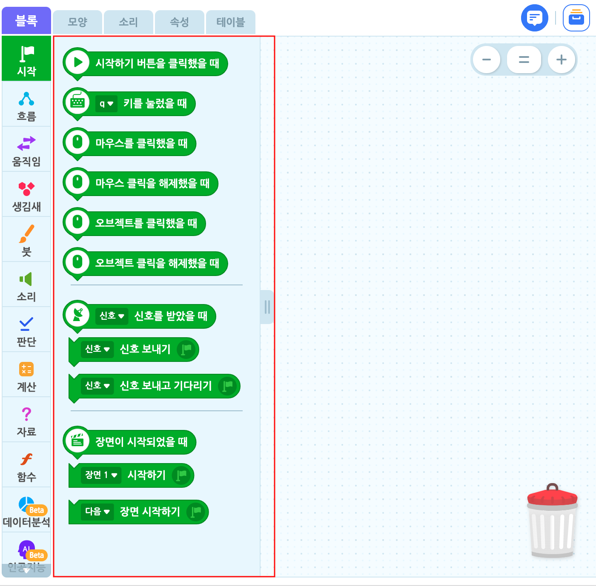

각 카테고리의 모든 블록을 모아놓은 영역입니다.

블록 꾸러미의 블록은 드래그하면 블록 조립소로 옮길 수 있어요. 반대로, 블록을 드래그해서 블록 꾸러미에 놓으면 블록을 삭제할 수 있습니다.

블록 꾸러미의 우측에 위치한 영역 조절 손잡이를 드래그하면 블록 꾸러미의 가로 크기를 조절할 수 있습니다.

## 블록 조립소

블록 꾸러미에서 옮긴 블록을 자유롭게 배치하고 조립할 수 있는 영역입니다.

모든 오브젝트에는 하나의 블록 조립소가 있어요. 블록 조립소에 있는 블록은 해당 오브젝트에 명령할 수 있습니다.

블록 조립소의 빈 공간을 드래그하면 공간을 이동할 수 있어요.

+ 블록 조립소의 빈 공간을 마우스 우클릭한 뒤 '코드 정리하기'를 클릭하여 이 공간의 모든 블록을 정리할 수 있습니다.

- **함수 블록 조립소**

  함수 블록 카테고리의 블록 꾸러미에 있는 '함수 만들기' 버튼을 클릭하거나, 이미 만들어진 함수 블록을 편집할 때 나타나는 블록 조립소입니다.

  일반 블록 조립소와 별개의 공간이며, 모든 함수에는 하나의 블록 조립소가 있어요.

  일반 블록 조립소와 마찬가지로 빈 공간을 드래그하면 공간을 이동할 수 있고, 마우스 우클릭하면 같은 메뉴를 사용할 수 있습니다.

  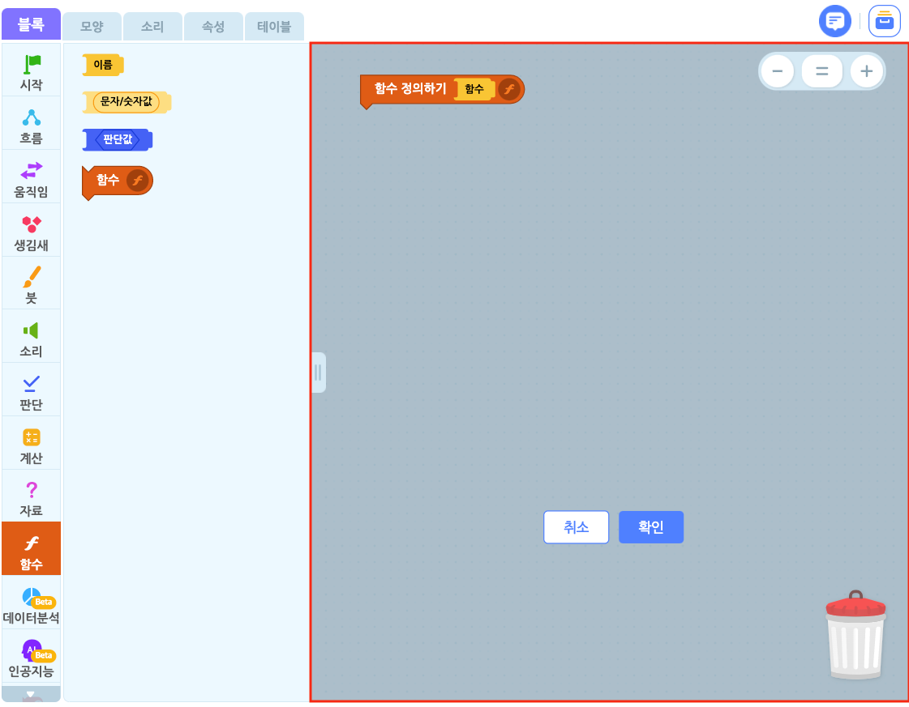

#### 조립 기능

블록 조립소에 있는 블록은 직소 퍼즐처럼 조립할 수 있습니다.

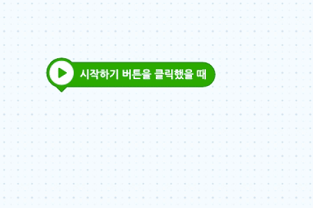

드래그하는 블록을 조립한 형상을 미리 볼 수 있어요. 이 때 블록을 놓으면 '착!' 소리와 함께 조립해요. 조립할 블록 개수에 제한은 없습니다.

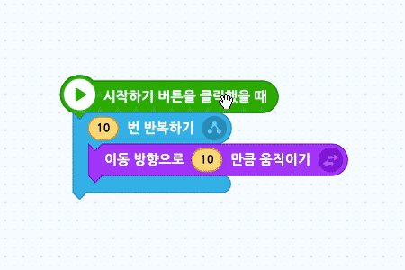

조립한 블록의 상위 블록을 드래그하면 조립한 블록 전체를 옮길 수 있고, 하위 블록을 드래그하면 분리할 수 있어요.

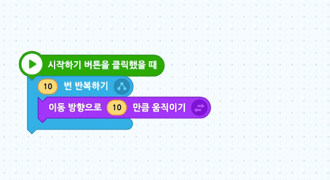

값을 입력할 수 있는 값 블록()에 같은 모양의 둥근 블록을 드래그하면 흰색 테두리가 나타납니다. 이 때 블록을 놓으면 결합할 수 있어요.

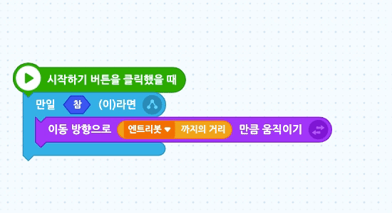

조건을 결합할 수 있는 판단 블록()에 다른 판단 블록()이 가까워지면 흰색 테두리를 볼 수 있습니다. 이 때 블록을 놓으면 결합할 수 있어요.

블록 안에 있는 육각형 모양에는 판단 블록()만, 원 모양에는 값 블록()만 넣을 수 있어요.

#### 복사/붙여넣기, 삭제 기능

블록 조립소에 있는 블록은 복사/붙여넣기, 삭제가 가능합니다.

단축키를 활용해 더 간단하게 기능을 사용할 수 있어요. 하지만 단축키를 이용하려면 먼저 해당 기능을 이용하려는 블록을 클릭해야 합니다.

| 기능     | 단축키 (윈도우/맥 공통) |
| -------- | ----------------------- |
| 복사     | `ctrl` + `c`            |
| 붙여넣기 | `ctrl` + `v`            |
| 잘라내기 | `ctrl` + `x`            |
| 삭제     | `del`                   |

블록 조립소의 블록이나 빈공간을 마우스 오른쪽 클릭하거나 길게 터치하여, 코드 복사 & 붙여넣기(복제), 코드 복사, 코드 삭제가 가능합니다.

#### 메모 기능

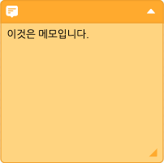

메모 기능을 이용하면 작품이나 장면, 블록의 용도 등을 설명할 수 있습니다.

메모는 블록 조립소에서만 확인할 수 있으며, 작품에 아무런 영향을 주지 않습니다. 그러니 안심하고 마음껏 메모해보세요.

메모를 해 놓으면, 다른 사람에게 블록을 설명하거나 나중에 블록을 다시 확인할 때 편리해요!

**① 메모 접기/열기**

메모의 우측 상단의 화살표를 누르면 메모를 접거나 열수 있습니다.

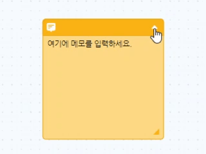

**② 메모 크기 조절하기**

메모의 우측 하단에 위치한 영역 조절 손잡이를 드래그하면 메모의 크기를 조절할 수 있습니다.

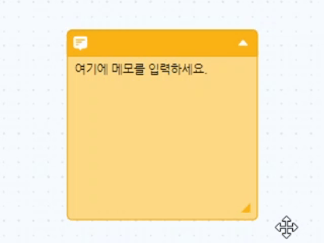

**③ 블록과 메모 연결하기 / 분리하기**

메모를 드래그하면 블록과 연결할 수 있어요. 연결한 상태에서는 해당 블록과 메모가 분리되지 않습니다.

블록 조립소의 빈 공간을 마우스 우클릭하면 메모 추가하기, 모든 메모 숨기기/모든 메모 보이기가 가능합니다.

블록 조립소의 블록을 마우스 우클릭하면 해당 블록과 결합한 메모를 추가할 수 있습니다.

메모를 마우스 우클릭하면 메모 복사 & 붙여넣기(복제), 메모 복사하기, 메모 삭제하기, 메모 접기, (메모가 블록과 결합했다면) 메모 분리하기가 가능합니다.

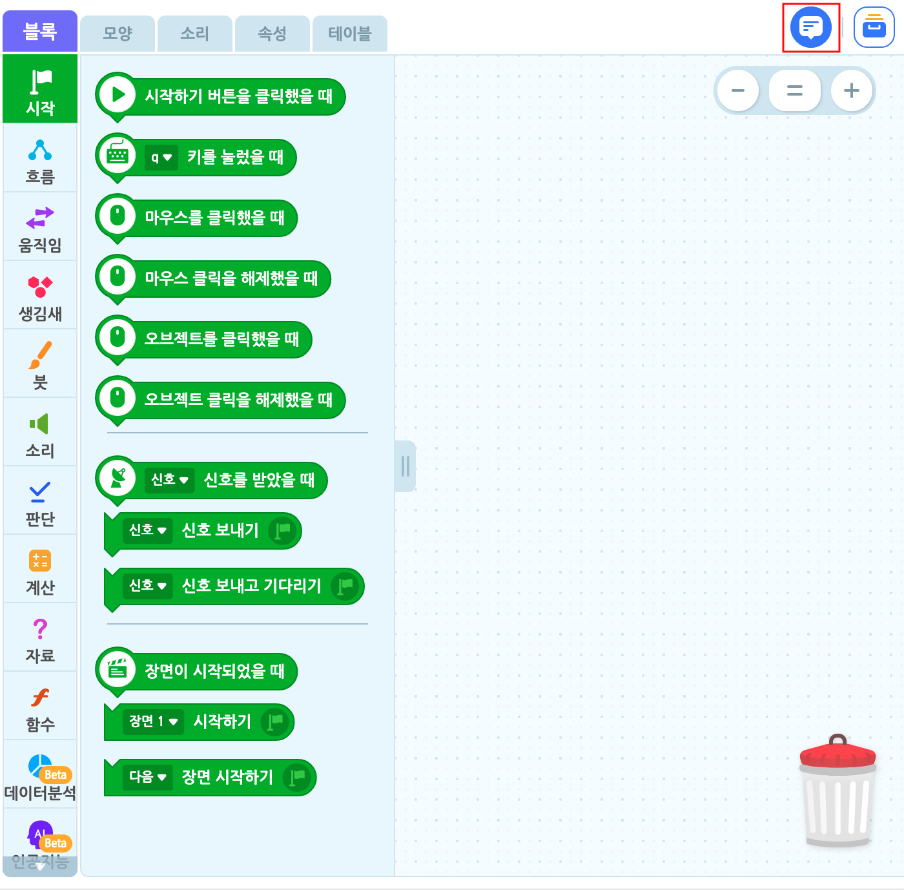

탭 우측의 메모 아이콘을 클릭하는 방법으로도 모든 메모를 숨기거나 보일 수 있습니다.

#### 이미지로 저장

모든 블록은 배경 없는 깔끔한 PNG 이미지로 저장할 수 있습니다.

블록을 마우스 우클릭한 뒤 '이미지로 저장하기'를 클릭하면 해당 블록을 다운로드 할 수 있습니다.

블록 조립소의 빈 공간을 마우스 우클릭한 뒤  '모든 코드 이미지로 저장하기'를 클릭하여 조립소에 있는 모든 블록들의 이미지를 다운로드 할 수 있습니다.

+ 블록 꾸러미의 블록을 마우스 우클릭한 뒤 '이미지로 저장하기'를 클릭하여 해당 블록을 이미지로 저장할 수 있습니다.

+ 블록 조립소의 빈 공간을 마우스 우클릭한 뒤 '모든 코드 이미지로 저장하기'를 클릭하면 해당 블록 조립소에 있는 모든 블록을 이미지로 저장할 수 있습니다.

+ 블록 조립소의 블록을 마우스 우클릭한 뒤 '이미지로 저장하기'를 클릭하면 해당 블록을 이미지로 저장할 수 있습니다.

#### 확대/축소 기능

블록 조립소의 블록과 메모가 한층 더 잘 보이기 위한 기능입니다. 블록의 양에 따라 조절하면 유용합니다.

블록 조립소의 우측 상단에 위치한 버튼을 클릭하면 블록 조립소를 확대 혹은 축소하거나 표준 크기로 조절할 수 있습니다.

표준 크기는 100%이고, 크기는 60%~200% 사이로 조절할 수 있습니다.

## AI 활용 블록 불러오기 팝업

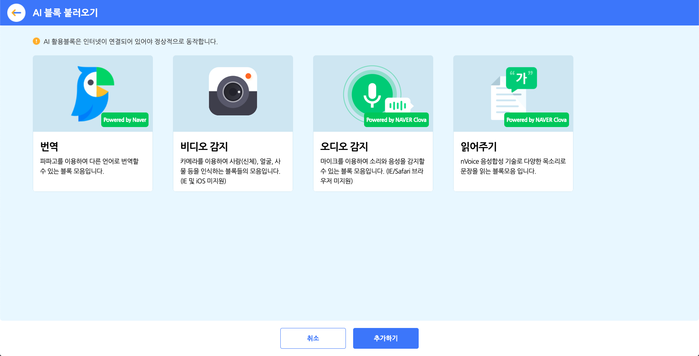

인공지능 블록 카테고리의 블록 꾸러미에 있는 'AI 블록 불러오기' 버튼을 클릭하면 나타나는 팝업 창입니다.

블록 모음을 선택하고 아래의 '추가하기' 버튼을 클릭하면 블록 꾸러미에 불러올 수 있어요. 중복 선택이 가능합니다.

아래는 추가할 수 있는 AI 블록 모음의 종류입니다.

+ **번역** : 파파고를 이용해 언어를 번역하는 블록 모음입니다.
+ **비디오 감지** : 카메라를 이용해 사람(신체), 얼굴, 사물 등을 인식하는 블록 모음입니다. (인터넷 익스플로러 및 iOS는 지원하지 않습니다.)
+ **오디오 감지** : 마이크를 이용해 소리와 음성을 감지할 수 있는 블록 모음입니다. (인터넷 익스플로러/사파리 브라우저는 지원하지 않습니다)
+ **읽어주기** : nVoice 음성합성 기술을 이용해 다양한 목소리로 문장을 읽는 블록 모음 입니다.

## 모델 학습하기 팝업

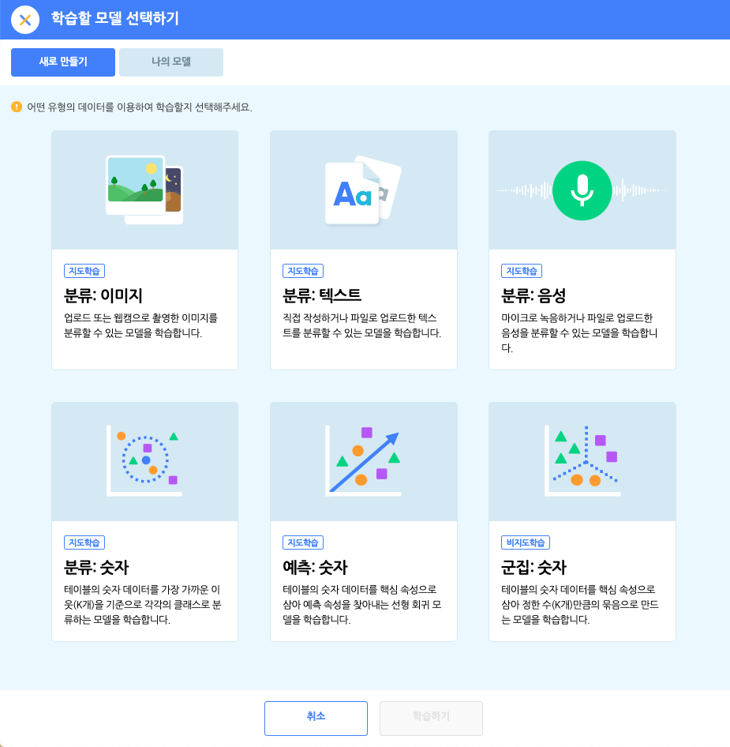

인공지능 블록 카테고리의 '모델 학습하기' 버튼을 클릭하면 나타나는 팝업 창입니다.

학습할 데이터의 유형을 선택하고 모델 학습을 완료하면 해당 유형의 블록을 블록 꾸러미에 추가해요.

아래는 학습할 수 있는 데이터의 유형입니다.

+ **이미지** : 업로드 또는 웹캠으로 촬영한 이미지로 모델을 학습합니다.
+ **텍스트** : 직접 작성하거나 파일로 업로드한 텍스트를 분류할 수 있는 모델을 학습합니다.
+ **음성** : 마이크로 녹음하거나 파일로 업로드한 음성을 분류할 수 있는 모델을 학습합니다.

## 확장 블록 불러오기 팝업

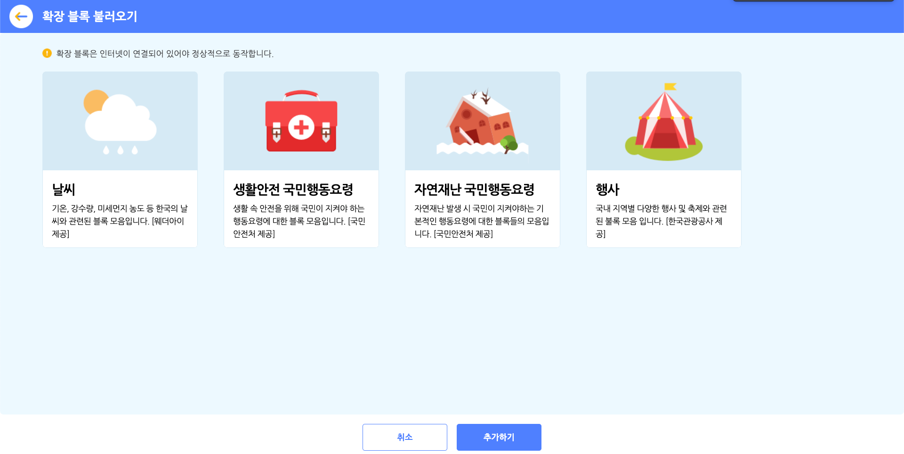

확장 블록 카테고리의 블록 꾸러미에 있는 '확장 블록 가져오기' 버튼을 클릭하면 나타나는 팝업 창입니다.

블록 모음을 선택하고 아래의 '추가하기' 버튼을 클릭해서 블록 꾸러미에 불러올 수 있어요. 중복 선택이 가능해요.

아래는 추가할 수 있는 확장 블록 모음의 종류입니다.

+ **날씨** : 기온, 강수량, 미세먼지 농도 등 한국의 날씨와 관련된 블록 모음입니다. [웨더아이 제공]
+ **생활안전 국민행동요령** : 생활 속 안전을 위해 국민이 지켜야 하는 행동요령에 대한 블록 모음입니다. [국민안전처 제공]
+ **자연재난 국민행동요령** : 자연재난 발생 시 국민이 지켜야 하는 기본적인 행동요령에 대한 블록 모음입니다. [국민안전처 제공]
+ **행사** : 국내 지역별 다양한 행사 및 축제와 관련된 블록 모음입니다. [한국관광공사 제공]
