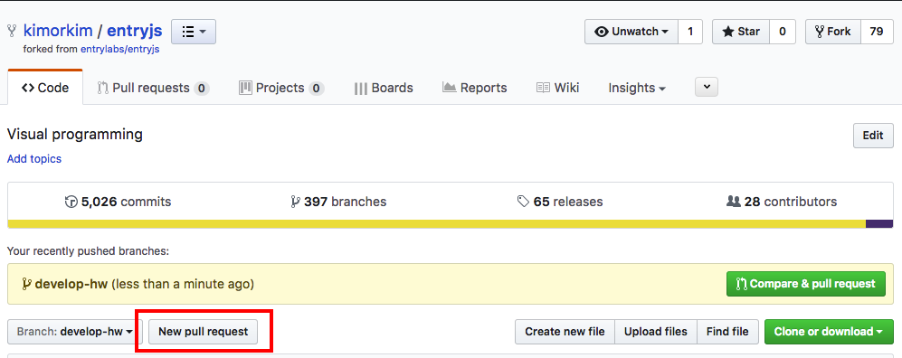
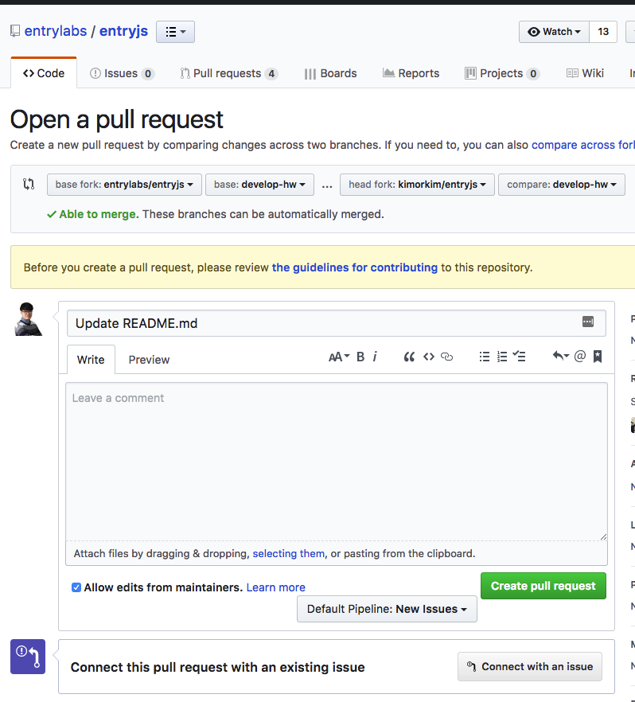
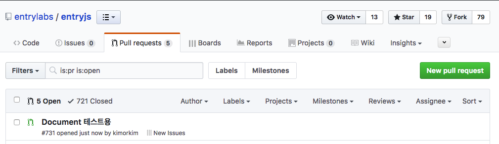

엔트리의 하드웨어 모듈과 블록 개발을 완료했다면 이제 반영하는 과정만 남았습니다.

작성한 소스를 GitHub을 통해 pull request를 생성하면 엔트리 개발팀이 소스를 검토하여 머지하고 실제 운영 환경에 반영합니다. 이 과정에서 소스가 무조건 반영되는 것이 아니라, 코드 분석과 동작 테스트를 거친 후에 반영됩니다.

## Pull Request 생성하기

이 문서의 내용을 이해하고 정상적으로 작업했다면 자신의 GitHub 저장소에 작업된 소스가 올라가 있습니다. 이 상태를 기준으로 설명하겠습니다.

먼저 위의 그림처럼 자신의 브랜치로 이동하여 페이지 왼쪽에 있는 **New Pull Request** 버튼을 클릭합니다.

`base fork`가 `entrylabs/entryjs`이고 `head fork`가 `본인계정/entryjs`이어야 합니다. 반대가 되지 않도록 주의합니다. 또한 `base`에는 pull request를 생성할 브랜치를 지정하고 `compare`에는 작업한 브랜치명을 지정해야 합니다. 반드시 작업한 브랜치명을 정확히 지정해야 합니다. 잘못된 브랜치를 지정한 경우 정상적으로 소스를 머지할 수 없습니다.

> Entry JS 저장소는 기본 브랜치가 `develop`이기 때문에 `develop`을 `base`로 지정하여 pull request를 생성하는 경우가 많습니다.
> 엔트리 하드웨어 개발용 브랜치는 `develop-hw`이므로 `develop-hw`로 pull request를 생성해야 합니다.

브랜치를 지정한 후에는 간단한 제목과 수정 사항을 작성하고 **Create pull request** 버튼을 클릭합니다.

pull request를 생성한 후에는 [Pull Requests](https://github.com/entrylabs/entryjs/pulls)에 접속하여 생성한 pull request를 확인할 수 있습니다.

> Entry Hardware에 생성한 pull request는 [Pull Requests](https://github.com/entrylabs/entry-hw/pulls)에서 확인할 수 있습니다.

pull request가 생성된 후에는 엔트리 개발팀이 소스를 검토하고 필요한 경우 수정을 요청합니다.

Git 사용 방법에 대한 더 자세한 설명은 Etc.의 [Git 사용 방법](./etc/2016-05-03-git_fork.html) 문서를 참고해 주세요.
