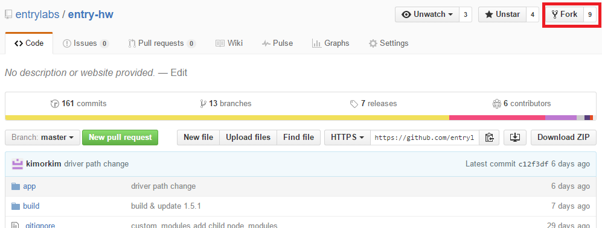

Entry Hardware 는 엔트리에서 개발한 엔트리와 하드웨어를 연동하기 위한 프로그램입니다.  
엔트리에 신규 하드웨어를 등록하기 위해서는 Entry Hardware 에 하드웨어 모듈을 추가해야합니다.

## 엔트리 하드웨어 추가 순서
1. 하드웨어 등록 신청서 작성 및 제출([상세안내](./2017-05-16-enroll_entry-hw.html))
2. [하드웨어 모듈 추가하기](.//2016-05-03-add_module.html)
3. 하드웨어와 연동되는 [엔트리 블록 만들기](..//entryjs/2016-05-22-add_new_blocks.html)
4. 실행하여 테스트하기
5. 테스트코드 [GitHub의 Pull Request로 전달](../etc/2016-05-03-git_fork.html)하기
6. 하드웨어 ID 발급 받기
7. 엔트리 서비스 정기 반영을 통한 하드웨어 추가

엔트리 하드웨어의 개발 환경 및 버전은 아래와 같습니다.
[Electron](https://electronjs.org): 7.x.x
[Node-Serialport](https://serialport.io): 8.x.x


## 개발환경 세팅

### 프로젝트 포크
엔트리 개발시 엔트리의 원본 프로젝트에 직접 작업은 허용되지 않습니다.  
그러므로 프로젝트를 복사하는 `fork` 작업을 거쳐야 합니다.  
먼저, Entry-HW GitHub 페이지에 접속 합니다.  

> [https://github.com/entrylabs/entry-hw](https://github.com/entrylabs/entry-hw)  

사이트 접속 후 우측 상단에 있는 Fork 버튼을 클릭합니다.
  

Fork를 통하여 본인 계정으로 해당 Repository를 복사합니다. 복사한 레포지토리를 git clone으로 내 로컬 컴퓨터에 다운 받아 개발 가능한 상태로 만듭니다.

### 클론

fork 를 통해 원격 저장소를 복사하였으면, 로컬로 저장소를 가져와야 합니다. `git clone`을 수행하여 로컬에 해당 소스를 받습니다.
``` bash
$ git clone https://github.com/(본인의 Repository)/entry-hw.git
```

### Node-gyp 설치

엔트리 하드웨어는 시리얼포트 통신을 위해 [node-serialport](https://github.com/node-serialport/node-serialport) 라이브러리를 사용합니다.
해당 라이브러리를 사용하기 위해서는 C++, python 빌드 환경과 [node-gyp](https://github.com/nodejs/node-gyp) 라이브러리가 필요합니다.  
빌드에 대한 자세한 사항은 [node-gyp#installation](https://github.com/nodejs/node-gyp#installation) 을 참고해 주세요.

윈도우의 경우는 아래의 명령을 통해 파이썬, 윈도우 C++ 관련 툴을 설치해주세요. (관리자 모드 프롬프트에서 입력하세요)
```bash
npm install --global --production windows-build-tools
```

그 다음 빌드 라이브러리인 node-gyp 을 설치해주세요.
```bash
npm install --global node-gyp
```

### 의존성 모듈 설치  

``` bash
$ npm install
```

### Electron Rebuild

엔트리 하드웨어가 디바이스와 통신하기 위한 라이브러리는 C++ 로 개발되어있기 때문에, Native Addon 사용을 위한 빌드가 필요합니다.
의존성 모듈 설치시 자동으로 실행되나, 명시적으로 실행하고자 하는 경우 아래의 명령어를 입력합니다.

```
$ npm rebuild
```

### 실행  
``` bash
$ npm run start
```
