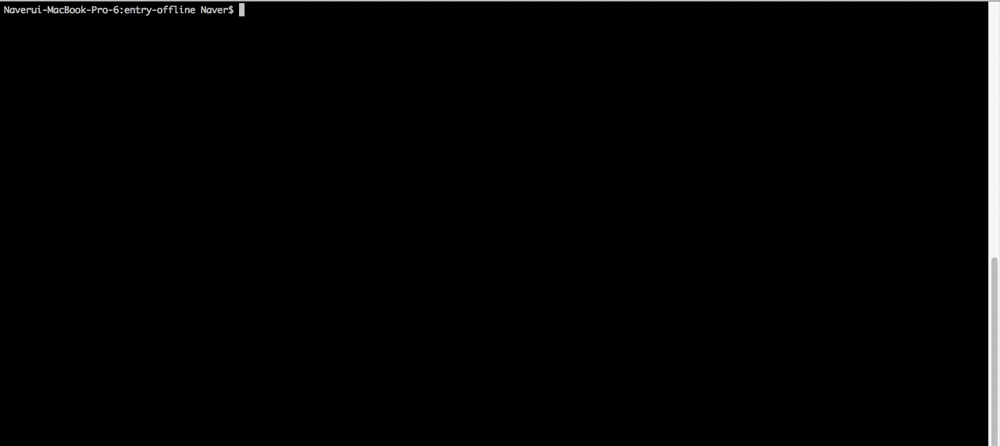

엔트리 오프라인은 엔트리의 만들기 부분을 오프라인 환경에서도 사용할 수 있도록 제작된 프로그램입니다. 엔트리 오프라인은 Electron을 기반으로 하고 있으며, 전반적인 개발을 위해서 Node.js가 필요합니다.

## 시작하기 전에...
엔트리 오프라인은 [Electron](https://electronjs.org/) 기반으로 되어 있습니다. Electron은 github에서 Atom IDE를 만들기 위해 만들어졌으며 현재 수많은 프로젝트들이 Electron 프레임워크 위에서 구동되고 있습니다. Electron은 Node.js를 기반으로 하고 있기 때문에 엔트리 오프라인 개발을 위해서는 Node.js의 기본적인 사용방법과 Javascript의 언어를 이해해야 작업을 진행할 수 있습니다. 또, 엔트리 오프라인은 보다 원활한 개발 환경을 위해 Electron을 바로 사용한 것이 아니고 [Electron-Forge](https://github.com/electron-userland/electron-forge)이라고 하는 도구를 사용하여 개발을 진행하였습니다. 엔트리 오프라인을 개발하고 싶으시다면 먼저 Electron과 Electron-Forge에 대한 문서를 읽고 시작해 주세요.

Electron 개발문서 : https://electronjs.org/docs
Electron-Forge 개발문서 : https://electronforge.io/

## 개발 환경 세팅

### 필수 프로그램 설치
#### 1. Node.js
Node.js는 개발 전반을 위해 반드시 설치가 되어야하는 Framework입니다. 작업전 가장 먼저 설치합니다.

> 사이트 : https://nodejs.org

#### 2. Yarn
엔트리 오프라인에서는 기존의 `npm`을 이용해서도 작업을 진행 할 수 있지만 `yarn`의 사용을 권장 합니다.
> 사이트 : https://yarnpkg.com

#### 3. Bower
엔트리 오프라인에서 정적 라이브러리들은 `bower`를 통해 관리 합니다. `npm` 또는 `yarn`이 설치 되었다면 아래와 같이 설치가 가능합니다.

```bash
# if npm
npm install -g bower

# or yarn
yarn global add bower
```

> 사이트 : https://yarnpkg.com

#### 3. c++ compiler & 파이선
엔트리 오프라인을 최종적으로 빌드 하기 위해서는 컴파일 과정이 수행되어야 합니다. 이 과정에서 파이선과 C++ 컴파일러가 필요하게 됩니다.

### 소스코드 다운로드
```bash
# create a directory of your choice, and copy template using curl
mkdir entry-offline && cd entry-offline
curl -fsSL https://github.com/entrylabs/entry-offline/archive/master.tar.gz | tar -xz --strip-components 1

# or copy template using git clone
git clone https://github.com/entrylabs/entry-offline.git
cd entry-offline

# install dependencies
yarn
bower install
```

엔트리 오프라인은 소스코드를 직접 다운받아서 개발하거나 Git을 통하여 개발을 시작할 수 있습니다. 
만약에 Git을 통해 개발을 시작한다면 Fork 작업을 먼저 하시고 작업을 진행하시는 것을 추천 드립니다.
소스코드가 다운로드되고 난뒤 `yarn`과 `bower`를 이용하여 의존성 패키지를 설치합니다.

## 실행
```bash
# if npm
npm start

# or yarn
yarn start
```
기본적인 환경 구성과 의존성 패키지들이 정상적으로 설치되었다면 실행 화면을 볼 수 있다.

  