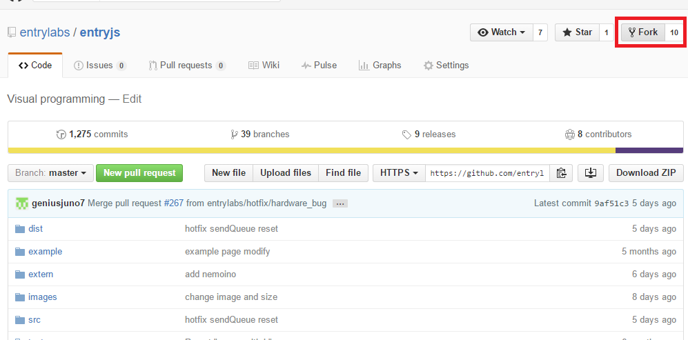

Entry JS를 개발하기 위해 기본적으로 [node.js](https://nodejs.org/en/)가 설치되어 있어야 하며, `npm`을 통하여 `grunt`, `grunt-cli`가 설치되어야 합니다. 또한, 필요한 경우 라이브러리들을 컴파일을 수행하기 위에 visual studio와 python의 설치가 필요할 수 있습니다.  

## Node.js의 설치

EntryJS의 개발 및 빌드를 위해서는 반드시 Node.js를 설치 해야 합니다.  
설치 방법은 [Nodejs.org](http://nodejs.org)를 참고해 주세요.

> 2017-07-25일 기준 현재 Node.js의 6.11.1 버전의 사용을 권장합니다.

## Git 설치하기

Git은 소스코드를 관리하기 위한 버전관리 도구 입니다. 일반적으로 많은 오픈소스들이 [Github](https://www.github.com)를 통해서 소스가 공개되어 지고 관리가 되고 있습니다. 저희의 Entry Hardware와 EntryJS의 경우에도 Github를 통해서 관리되고 있는 상태입니다. Github의 소스를 다운받고 수정한 소스를 반영하기위해서 Git Client 설치가 필수적입니다.

### Git terminal 설치

Git terminal은 다음 [설치방법](https://git-scm.com/book/ko/v2/%EC%8B%9C%EC%9E%91%ED%95%98%EA%B8%B0-Git-%EC%84%A4%EC%B9%98)을 참조 바랍니다.

### Git GUI Tool

Git사용이 익숙치 않은 사용자들을 위해 GUI툴들이 제공되고 있습니다. 이 중에서 사용하기 괜찮은 툴은 Github Desktop과 SourceTree 두가지를 추천합니다. 멀티 플렛폼도 지원하니 한번 확인보길 바랍니다.

> [Github Desktop](https://desktop.github.com/)  
> [SourceTree](https://www.sourcetreeapp.com/)

### Git 자료

Git관련 자료는 Etc. 탭의 [Git 사용방법](../etc/2016-05-03-git_fork.html)에 문서를 작성해 놓왔으니 해당 문서를 확인해 주시기 바랍니다.

## 의존성 모듈 설치

`npm`을 통하여 의존성 모듈을 먼저 설치해야 합니다.
``` bash
$ npm install
```
위와 같이 설치를 진행하면 Entry JS개발에 필요한 의존성 설치가 완료됩니다.

## Grunt 설치

[Grunt](https://gruntjs.com/)는 사전 정의된 Task들을 실행하는 자바스크립트용 빌드 툴 입니다. Entry 에서는 Entry JS의 concatenating, minifying을 수행하기 위해 사용되어지며 Entry JS 개발 후 실제 사용되는 `.js`파일을 만들게 됩니다. 설치는 간단하게 `npm install`으로 수행합니다.
> 하드웨어에서는 `yarn`과 동시에 사용하라고 명시 했지만 Entry JS는 그렇지 않습니다. 물론 `yarn`을 사용해도 사용에 전혀 문제가 없습니다만, Entry JS쪽에서는 `yarn`도입은 검토중 입니다.

기존에는 grunt도 글로벌으로 설치하여 사용하도록 설명했습니다만, 앞으로는 로컬로 설치하여 사용하는것을 권장합니다. 다만, 브렌치에 따라 `package.json`에 `scripts`가 작성되어 있지 않을 수 있기 때문에 전역 사용방법도 설명드립니다.

## Grunt 사용(글로벌)

Grunt 명령어를 전역에서 사용하기 위해 `-g` 옵션을 사용해서 설치합니다.
``` bash
$ npm install -g grunt
$ npm install -g grunt-cli
// 해당 명령어를 수행하기 위해선 java sdk설치가 필요합니다.
$ grunt build
```

Grunt의 Command Line Interface 까지 설치를 해줘야 본격적으로 `grunt`명령어를 콘솔에서 사용할 수 있습니다. 단순 `grunt`만 사용할 경우 taskcase도 같이 동작하기 때문에 일종의 오류메세지를 보실수 있습니다. 때문에 `grunt build` 명령어를 이용하여 빌드를 하실것을 권장 드립니다.

## Grunt 사용(로컬)

로컬설치는 이미 의존성 모듈 설치시에 설치가 되었습니다. `npm install`을 잘 수행하셨다면 기본적으로 추가로 해야할 작업은 없습니다. 이렇게 설치된 `grunt`는 다음과 같이 실행합니다.
``` bash
// 해당 명령어를 수행하기 위해선 java sdk설치가 필요합니다.
$ npm run build
```

다만 위의 명령어는 `package.json`의 `scripts`옵션이 있어야지만 사용이 가능합니다. 현재 과도기적 단계이기 때문에 `package.json`에 해당 내용이 없을 수 있습니다. 만약 해당 내용이 없다면 다음 내용을 `package.json`에 추가해 주시면 됩니다.

``` json
"scripts": {
    "build": "grunt build"
}
```

## EntryJS 세팅하기
EntryJS는 Entry의 Main 서비스는 블록 조립소를 만들기 위한 기능을 제공하는 라이브러리 입니다. 해당 라이브러리는 현재 실제 엔트리와 엔트리 오프라인에서 사용하고 있습니다. 하드웨어 블럭을 추가하기 위해서는 해당 라이브 러리를 수정해야 합니다.

### EntryJS Fork하기
EntryJS를 수정하고 차후에 반영하기 위해서는 Fork하는 과정이 필요합니다.

> 소스를 직접 다운로드하고 해당 파일을 저희 쪽에 보내주는 방법도 있으나 이 방법의 경우 원본과 수정본의 Diff 작업을 수동으로 수행해야 하는 만큼 작업 시간이 오래 걸리고 검증하는데에도 시간이 걸리게 됩니다. 될수 있으면 Fork & Pull request를 활용해 주세요.

먼저, EntryJS GitHub 페이지에 접속 합니다.  

> [https://github.com/entrylabs/entryjs](https://github.com/entrylabs/entryjs)

사이트 접속 후 우측 상단에 있는 Fork 버튼을 클릭합니다.
  

Fork를 통하여 본인 계정으로 해당 Repository를 복사합니다. 복사한 레포지토리를 git clone으로 내 로컬 컴퓨터에 다운 받아 개발 가능한 상태로 만듭니다.  

> ~~EntryJs에서는 기본 브랜치가 master가 아닌 develop입니다. master은 운영용 repo 이기때문에 develop에서 작업해 develop으로 Pull request하시면 됩니다.~~

> Entry JS에서 기본브랜치가 develop인것은 맞지만 하드웨어 업체들의 소스를 관리하기 위해 develop-hw 이라는 브랜치로 따로 관리하고 있습니다. 해당 브랜치에서 작업해 주시고 해당 브랜치에 Pull Request보내주시기 바랍니다.

### EntryJS 의존성 모듈 설치
EntryJS를 사용하기위해 여러가지 라이브러리를 사용하고있습니다. 사용하는 모듈들은 최상위폴더의 package.json에 devDependencies에 정의되어 있습니다. 이를 설치하기 위해서 `npm`을 사용하면 매우 쉽게 설치할수 있습니다.
``` bash
$ npm install
```
위의 명령어를 EntryJS의 최상위 폴더에서 실행시키면 곧바로 모듈을 설치하기 시작합니다.
몇분이 지나면 모든 모듈설치가 종료됩니다.  

### EntryJS 빌드하기
이제 EntryJS의 개발 가능한 환경 설정이 완료되었습니다. 이제 [시작하기](../index.html)나 엔트리 블록추가에 설명드렸던 대로 블록을 수정 또는 추가 하신후 빌드만 수행하며 됩니다. 수행방법은 위의 Grunt 사용 부분에서 자세하게 설명하였습니다. 명령어가 잘 수행되었다면 EntryJS의 최상위 폴더에 dist라는 폴더가 생성되고 dist폴더 안에 entry.css, entry.js, entry.min.js의 3가지 파일이 생성됩니다.

## 마무리
위와 같은 과정을 EntryJS의 코드를 수정하고 빌드 하는 환경을 구성할 수 있습니다.
