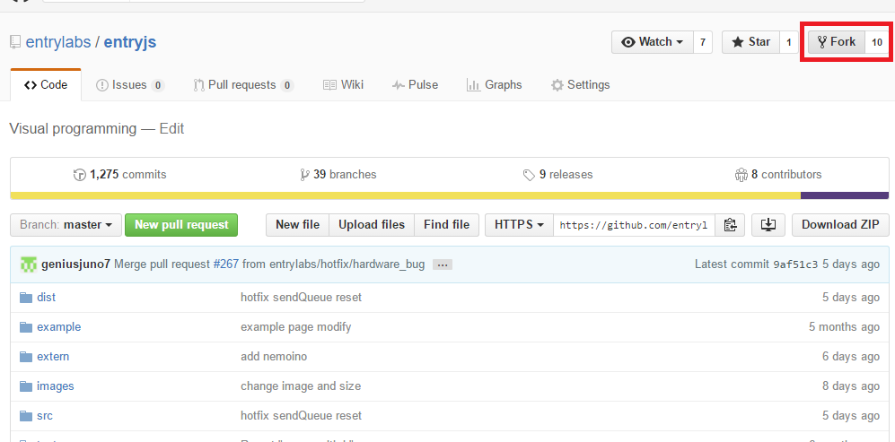

Entry JS는 엔트리에 사용되는 블록과 블록조립소를 만들기위한 라이브러리 입니다.  
하드웨어 업체에서는 하드웨어 블록을 추가하는 용도로 사용됩니다.

## 개발 환경 세팅

### 프로젝트 포크
엔트리 개발시 엔트리의 원본 프로젝트에 직접 작업은 허용되지 않습니다.  
그러므로 프로젝트를 복사하는 `fork` 작업을 거쳐야 합니다.  
먼저, EntryJS GitHub 페이지에 접속 합니다.  

> [https://github.com/entrylabs/entryjs](https://github.com/entrylabs/entryjs)

사이트 접속 후 우측 상단에 있는 Fork 버튼을 클릭합니다.
  

Fork를 통하여 본인 계정으로 해당 Repository를 복사합니다. 복사한 레포지토리를 git clone으로 내 로컬 컴퓨터에 다운 받아 개발 가능한 상태로 만듭니다.  

### 클론
클론을 먼저 하기 전에 Git Fork기능으로 현재 Entrylabs의 Repository를 복사하여 자신의 Repository를 만듭니다. 이후 `Git Clone`을 수행하여 자신의 로컬에 해당 소스를 받습니다.
``` bash
$ git clone https://github.com/(본인의 Repository)/entryjs.git
```

### 브랜치 변경
EntryJS 는 브랜치를 통해 작업내역을 관리중입니다. 
자세한 설명은 [Git - 브랜치란 무엇인가?](https://git-scm.com/book/ko/v1/Git-%EB%B8%8C%EB%9E%9C%EC%B9%98-%EB%B8%8C%EB%9E%9C%EC%B9%98%EB%9E%80-%EB%AC%B4%EC%97%87%EC%9D%B8%EA%B0%80%3F)를 참고하세요.  
기본적으로 개발이 사용되는 브랜치는 develop 입니다.  
**하드웨어 개발시** 사용되는 브랜치는 develop-hw 입니다.

> 이를 지키지 않으면 작업내역을 전부 고쳐야 하는 경우도 발생합니다. 작업 이전에 꼭 확인해야합니다.

### 의존성 모듈 설치  
```bash
$ npm install
// 또는
$ yarn
```

### 실행
```bash
$ npm run serve
// 또는
$ yarn serve
```

### 빌드
1. 개발모드로 실행(파일을 수정하면 실시간으로 빌드 파일 생성됨)
``` bash
$ npm run dev
// 또는 
$ yarn dev
```

2. 단순 빌드파일 생성
``` bash
$ npm run dist
// 또는 
$ yarn dist
```


## 하드웨어 블록 등록
`block_(하드웨어명).js`파일을 추가하여 하드웨어 프로그램에 대응하는 블록 파일을 만들 수 있습니다.  
일반적인 블록 또한 `block_(종류).js` 와 같은 이름을 가지고 있습니다. ex) `block_calc.js`