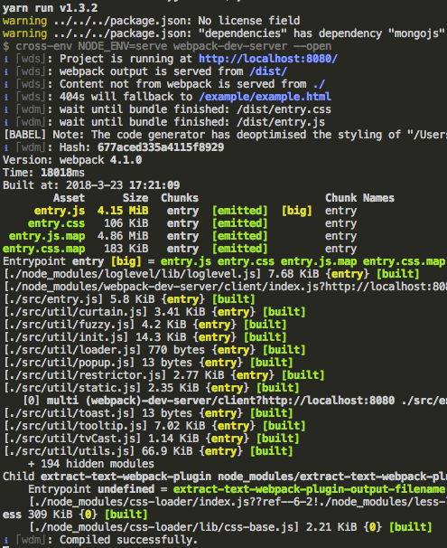

기존 테스트 방법은 단순하게 `(your path)/example/example.html`파일을 브라우저에 실행하여 테스트 하는 방식이었습니다. 현재 크롬이 새버전이 나오면서 보안문제로 local file의 html 파일에서는 CORS문제로 socket 통신이 불가능해 졌습니다. 이에 따라 테스트 방법을 수정하였습니다.

## 테스트 진행

테스트는 `package.json`의 `script`에 정의된 `serve`에 따라 테스트 서버를 실행하여 테스트를 진행하도록 하였습니다.

``` bash
$ yarn serve
// 또는
$ npm run serve
```

위와 같이 실행하면 브라우저가 자동실행되면서 테스트 가능한 페이지가 열리고 자동으로 `entry.js`가 빌드 됩니다. `entry.js`빌드가 완전히 진행되야 수정하신 내용이 반영되므로 빌드 이후에 새로고침을 한번 하시기 바랍니다.

### 빌드 모습


`watch`가 작동하고 있으므로 해당 상태에서 소스파일을 수정하시면 빌드가 자동으로 진행됩니다.