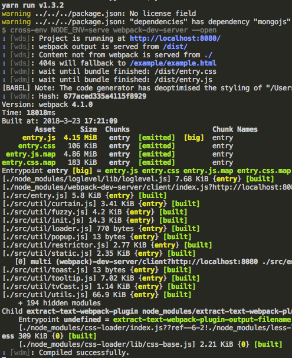

## 테스트 진행

entryjs 는 브라우저 내의 특정 div 를 기준으로 workspace 를 생성하고, 해당 DOM 위에서 실행되는 형태입니다.  
간단한 테스트를 위해서 위와 같은 방법은 번거롭기 때문에, 테스트를 위한 페이지를 실행하는 방법이 구현되어있습니다.

terminal 을 실행 후 entryjs 프로젝트 경로에서 아래 명령어를 입력합니다.

``` bash
$ npm run serve
// 또는 yarn 라이브러리가 설치되어 있는 경우
$ yarn serve
```

위와 같이 실행하면 브라우저가 자동실행되면서 테스트 가능한 페이지가 열리고 자동으로 `entry.js`가 빌드 됩니다. `entry.js`빌드가 완전히 진행되야 수정하신 내용이 반영되므로 빌드 이후에 새로고침을 한번 하시기 바랍니다.

### 빌드 모습


`watch`가 작동하고 있으므로 해당 상태에서 소스파일을 수정하시면 빌드가 자동으로 진행됩니다.