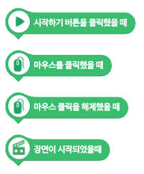
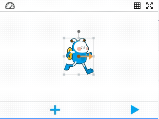

이벤트 블록은 다른블록들과 다르게 블록을 실행 시킬수 있는 블록 입니다.



일단 블록의 값은 다음과 같습니다.

``` js
// 블록명세
Entry.block = {
    "sample_block": {
        "parent": "",
        "color": "",
        "fontColor": "",
        "skeleton": "",
        "statement": [],
        "params": [],
        "events": {},
        "event": "",
        "def": {},
        "paramsKeyMap": {},
        "class": "",
        "isNotFor": [],
        "func": function() {}
    }
}
```

여기서 `event`부분에 해당 이벤트를 등록하고 사용하는 방식입니다. 주의 해야 할점은 `events`가 아닌 `event`입니다.

## 블록 이벤트명 작성하기

먼저, 작성해야 할 내용인 이벤트명 입니다. 이벤트명은 이벤트 블록간에 중복이 되어서는 안되고 고유한 값이어야 합니다. 시작하기 블록의 내용을 보면 아래와 같이 작성되어 있습니다.

``` js
Entry.block = {
    "when_run_button_click": {
        //...
        "event": "start",
        //...
    }
}
```
시작 하기 블록의 이름은 `when_run_button_click`이며 정의된 이벤트의 명칭은 `start`입니다.

## 이벤트 실행하기

이벤트 실행은 `Entry.engine.fireEvent('이벤트명')`으로 수행하게 됩니다. 다만 모든 이벤트는 시작하기 버튼을 눌러 `Entry.engine`이 동작중일 때만 작동하도록 되어 있습니다. 여기서는 동작의 이해를 돕기 위하여 간단한 테스트 방법을 알려드립니다.

먼저 크롬등의 브라우저를 실행하시고 https://playentry.org/ws#!/ 페이에 접속합니다. 이후에 개발자 도구를 실행하시고 나서 아래의 코드를 `Console`에서 순차적으로 실행해 봅니다.

``` js
Entry.engine.state = 'run';
Entry.engine.fireEvent('start');
```

그러면 작품이 실행되지 않았음에도 엔트리봇이 이동하는것을 보실 수 있습니다.



## 하드웨어 블록 이벤트 실행하기

다만, 하드웨어 블록에서 에서는 마땅히 이벤트를 수행 할 위치가 정해져 있지 않기 때문에 지원을 하지 않고 있었습니다. 이부분에 대해서 한 업체에서 요구사항이 왔었고 협의점을 찾아서 `hw.js`파일의 기능 수정으로 하드웨어 오브젝트 파일내에서 이벤트를 실행하는 기준은 마련하였습니다. 먼저 모든 하드웨어는 `Entry.(하드웨어명)`으로 오브젝트를 정의하도록 되어 있습니다. 아두이노 확장모드의 경우에는 `Entry.ArduinoExt`이고 햄스터의 경우에는 `Entry.Hamster`입니다. 위의 내용들은 보통 `(your path)/src/blocks/` 밑에 `block_(하드웨어명).js`로 만들어져 있습니다. 여기서 `dataHandler` 라는 옵션을 추가로 만들어 해당 하드웨어가 연결된 상태에서 하드웨어에서 들어오는 값을 체크 할 수 있도록 처리 하였습니다.

``` js
Entry.SAMPLE = {
    name: 'SAMPLE',
    dataHandler: function(data) {
        // data는 하드웨어 프로그램에서 Entry로 전달된 데이터
        if(data['eventAction'] === 'Action') {
            Entry.engine.fireEvent('Action');
        }
    }
}
```

해당 데이터를 기반으로 특정한 값이 들어 왔을때 체크를 해서 `fireEvent`를 수행하면 됩니다.

> 이벤트 사용시 유의해야 할 점은 데이터는 지속적으로 들어오고 있기때문에 단순체크로 인해 너무 많은 `event`가 `fire`되는것을 현상을 염두해야 합니다.
