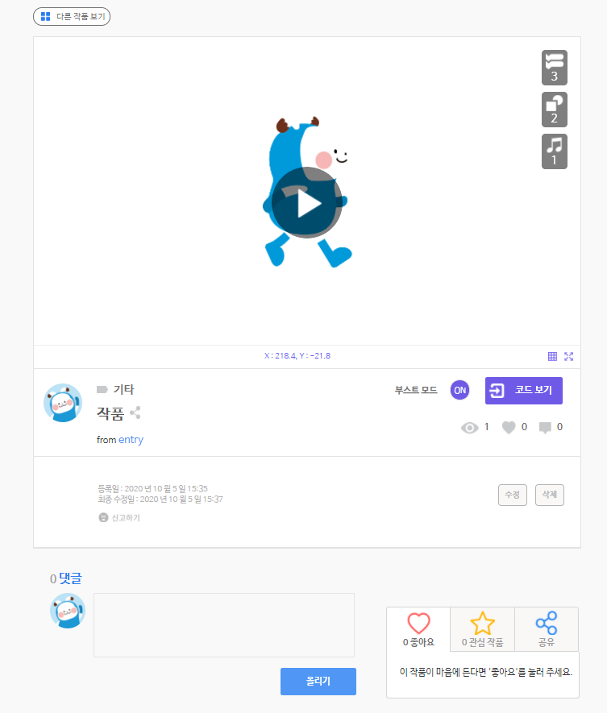
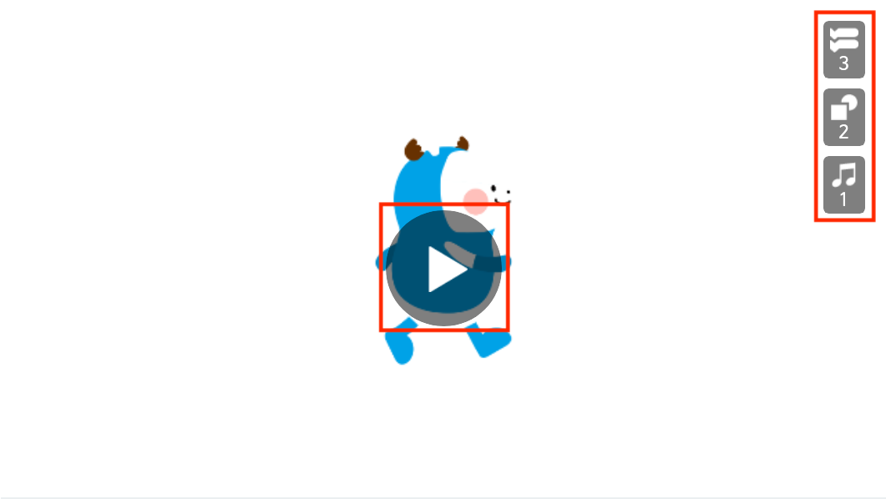

## 작품이란?

엔트리에서 **작품**이란, 작품 만들기 화면에서 그림을 그리거나 업로드하고, 그 그림을 움직이거나 모양을 바꾸는 등 다양하게 동작하도록 여러가지 블록을 조립한 결과물을 말해요.

작품을 만드는 방법은 우리가 흔히 '프로그램'이나 '앱'이라고 부르는 것들을 만드는 과정과 아주 비슷해요.

여러분은 엔트리에서 게임, 애니메이션, 미디어 아트 등 무엇이든지 작품으로 만들어볼 수 있어요. 그리고 그 작품이 여러분이 직접 만든, 여러분만의 프로그램이고 앱이 되는 것이랍니다.

어서 엔트리로 작품을 만들어보고 싶지 않나요?

작품 목록에서 작품을 클릭하면 나타나는 페이지입니다.

실행 화면 가운데의 실행 버튼을 클릭해서 작품을 실행하거나, 작품의 상세한 정보를 확인할 수 있어요. 여러분이 저장한 작품이라면, 정보를 수정하거나 작품을 삭제할 수 있습니다.

#### 1) 작품 실행 화면

작품의 실행 결과를 볼 수 있는 화면입니다.

가운데의 작품 실행하기 버튼을 클릭하면 작품을 실행할 수 있어요.

오른쪽 위의 각 그림과 숫자는 작품을 만들 때 사용한 블록(), 모양(), 소리()의 개수입니다.

#### 2) 작품 관리

'수정' 버튼을 클릭하면 아래와 같이 작품의 카테고리와 제목, 공개 범위, 작품 설명을 수정할 수 있어요.

수정을 마치면 '저장' 버튼을 클릭해서 정보를 저장합니다.

##### ① 카테고리

작품의 카테고리를 정하면 사용자가 어떤 주제의 작품인지 바로 확인할 수 있고, '마이 페이지' 또는 '작품 공유하기' 페이지에서 작품을 검색할 때 카테고리를 선택할 수 있기 때문에 더 쉽게 찾을 수도 있어요.

+ **게임** : 액션, 퍼즐, 모험, 보상 등을 즐길 수 있는 작품입니다.
+ **애니메이션** : 그림을 바꾸거나 움직이며 이야기를 진행하는 작품입니다.
+ **미디어 아트** : 블록을 이용해서 그림을 그릴 수 있는 작품입니다.
+ **피지컬** : 실제 세상의 물리 현상을 재현하는 작품입니다.
+ **기타** : 위의 주제에 해당하지 않을 때 선택합니다.

##### ② 제목

이름 상자를 클릭하면 작품의 이름을 수정할 수 있습니다.

##### ③ 공개 범위

작품을 비공개하거나 공개할 범위를 선택할 수 있어요.

+ **작품 공유하기** : '작품 공유하기' 페이지에 공개합니다.
+ **학급 공유하기** : '학급 공유하기' 페이지에서 선택한 학급에 공개합니다.
+ **나만보기** : 작품을 비공개합니다. '나의 작품' 페이지에서만 볼 수 있어요.

작품의 공개 범위는 '나의 작품'에서도 수정할 수 있어요. 작품 제목 오른쪽의 공유 토글 버튼을 클릭하면 아래와 같이 팝업 창이 나타납니다.

이 팝업 창의 목록 상자에서 작품을 비공개하거나 공유할 범위를 선택할 수 있어요.

##### ④ 작품 설명

작품에 대한 설명을 입력할 수 있습니다.

어떤 작품인지, 어떻게 이용해야 하는지 적어보세요. 엔트리 사용자들에게 하고싶은 말이나, 작품을 만들 때 사용한 요소의 출처를 적는 것은 어떤가요?

#### 3) 저작권 동의

'작품 공유하기'나 '학급 공유하기'를 선택하면 아래에 나타나는 '엔트리 저작권 정책'에 동의해야 작품을 공개할 수 있어요.

+ 내가 만든 작품과 그 소스코드의 공개를 동의합니다.
+ 다른 사람이 나의 작품을 이용하는 것을 허락합니다.(복제, 배포, 공중송신 포함)
+ 다른 사람이 나의 작품을 수정하는 것을 허락합니다.(리믹스, 변형, 2차 저작물 제작 포함)

오른쪽의 물음표 버튼을 클릭하면 세부적인 엔트리 운영정책, 작품/게시물 공유 가이드, 저작권 정책을 확인할 수 있습니다.

#### 4) 나의 작품

'마이 페이지'에 들어오거나 '나의 작품' 탭을 클릭하면 보이는 화면입니다.

로그인한 계정에 저장한 모든 작품을 모아서 볼 수 있어요.

#### 5) 관심 작품

'마이 페이지'에서 '관심 작품' 또는 '학급 관심 작품' 탭을 클릭하면 보이는 화면입니다.

로그인한 계정으로 '관심 작품' 버튼을 누른 모든 작품을 모아서 볼 수 있어요. '학급 공유하기'의 작품은 '학급 관심 작품' 탭에서 볼 수 있습니다.

작품 화면의 오른쪽 아래에 있는 '관심 작품' 버튼에 마우스 포인터를 대면, 작품을 '관심 작품'으로 정한 사용자의 목록을 볼 수 있어요.

'관심 작품' 버튼을 클릭하면 사용자 목록에 로그인한 계정을 추가하고, '관심 작품' 탭에 작품을 추가합니다.

#### 6) 작품 공유

작품은 링크를 통해 쉽게 공유할 수 있어요.

단순히 작품 화면에서 브라우저 링크를 복사해도 되지만, 오른쪽 아래에 있는 '공유' 버튼에 마우스 포인터를 대면 짧고 간단한 링크가 나타납니다.

클릭해서 복사한 다음, 친구들이나 다른 엔트리 사용자에게 주소를 알려주어 작품을 자랑해보세요.

페이스북, 트위터 아이콘을 클릭하면 선택한 SNS에 링크와 함께 바로 게시글을 올릴 수도 있습니다.
