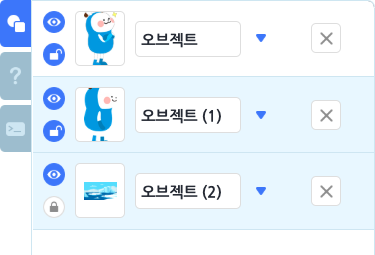
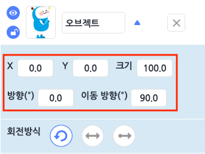
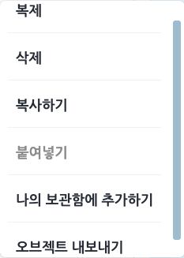
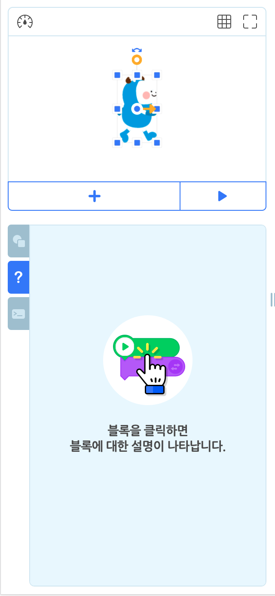
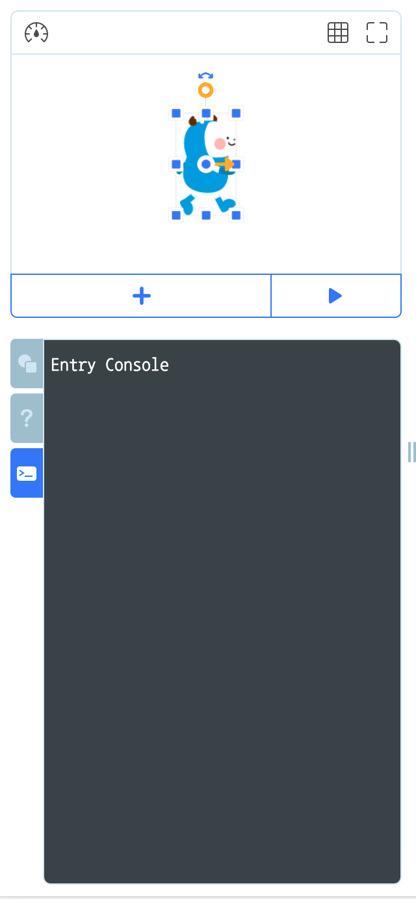
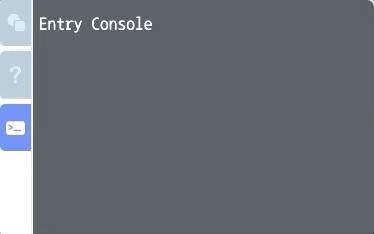
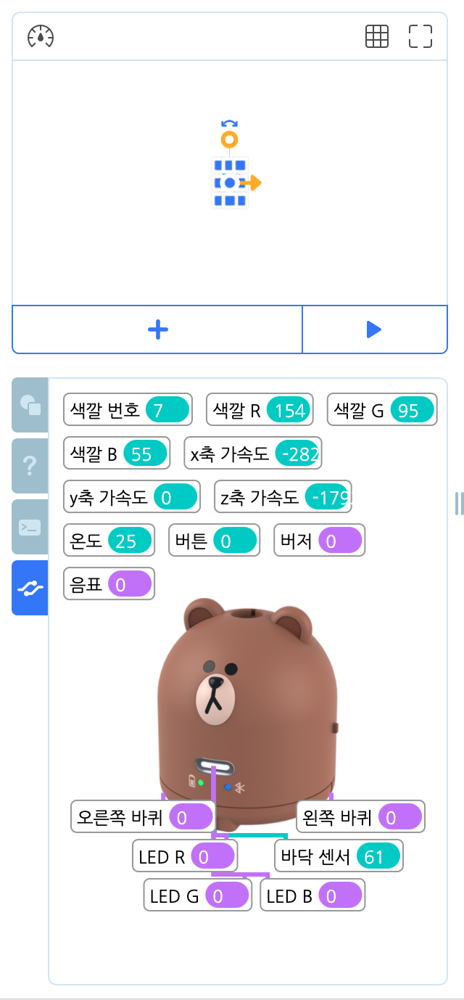

## 보조 조작부

#### 1) 오브젝트 목록 탭

실행 화면 아래에 있는, 선택한 장면에서 오브젝트를 추가하거나 관리하는 영역입니다.

##### ① 오브젝트 목록

+ 이름 상자를 클릭해서 이름을 수정합니다.
+ 이름 상자 오른쪽의 역삼각형 버튼을 클릭해서 오브젝트의 속성을 관리합니다.
+ 오른쪽의 X 버튼을 클릭해서 삭제합니다.
+ 왼쪽의 눈 아이콘을 클릭해서 실행 화면에서 나타내거나 숨깁니다.
+ 왼쪽의 자물쇠 아이콘을 클릭해서 오브젝트를 삭제하거나 속성을 수정할 수 없도록 잠급니다. (배경 오브젝트는 추가할 때 기본으로 잠겨 있습니다.)
+ 왼쪽의 썸네일(또는 각 오브젝트의 빈 공간)을 드래그해서 오브젝트 목록의 순서를 바꿉니다.

##### ② 오브젝트 속성

역삼각형 버튼을 클릭하면 나타나는 오브젝트의 속성입니다.

+ **X (좌표)** : 오브젝트 중심점의 가로(축) 위치입니다. 가운데는 0 이고, 오른쪽으로 갈수록 양수(+)로 커지고, 왼쪽으로 갈수록 음수(-)로 커져요.
+ **Y (좌표)** : 오브젝트 중심점의 세로(축) 위치입니다. 가운데는 0 이고, 위로 갈수록 양수(+)로 커지고, 아래로 갈수록 음수(-)로 커져요.
+ **크기** : 오브젝트의 크기입니다. 일반 오브젝트의 기본 크기는 100 이고, 배경 오브젝트의 기본 크기는 375입니다. 1 보다 작아질 수 없어요.
+ **방향(º)** : 오브젝트가 중심축을 기준으로 바라보는 방향입니다. 0º~360º 범위에서 조절할 수 있어요.
+ **이동 방향(º)** : 오브젝트가 이동하는 방향입니다. 0º~360º 범위에서 조절할 수 있어요.
  실행 화면에서는 방향을 조절할 때 이동 방향도 함께 바뀌는 것처럼 보이지만, 이동 방향은 오브젝트만의 방향이기 때문에 바뀌지 않아요.

##### ③ 오브젝트 회전 방식

오브젝트의 회전 방식은 세 가지입니다.

+ **모든 방향** : 모양이 360도의 모든 각도로 회전합니다. 
+ **좌우 방향** : 모양이 오브젝트의 이동 방향에 맞춰 좌우로 바뀝니다.  
  
  + 0º 보다 크거나 같고 180º 보다 작은 범위에서, 기본 방향을 바라봅니다.
  
    
  
    ​                                                                                                                     
  
    
  
  + 180º 보다 크거나 같고 360º(0º) 보다 작은 범위에서, 반대 방향을 바라봅니다.
  
    
    
    
    
    ​                                                                                                                   
    
    
  
+ **회전 없음** : 모양이 이동 방향과 상관 없이 원래 모양을 유지합니다. 

##### ④ 오브젝트 내보내기

+ 오브젝트를 마우스 오른쪽 클릭 또는 길게 터치했을 때 나타나는 메뉴
  
  + '오브젝트 내보내기'를 클릭하면 해당 오브젝트를 eo 형식(확장자)의 파일로 저장합니다. 이 파일은 '오브젝트 추가하기' 팝업 창의 '파일 올리기' 탭에서 다시 올릴 수 있어요.
  
    

#### 2) 도움말 탭

블록 꾸러미나 블록 조립소에 있는 블록을 선택하면 해당 블록의 설명이 나타나는 영역입니다.

작품 만들기 화면의 위(헤더)에 있는 도움말 목록을 클릭해서 이 탭을 열 수도 있어요.

블록을 어떻게 사용해야 할지 감이 잘 안 온다면, 그냥 다 클릭해봐요!

#### 3) 엔트리 콘솔 탭

작품의 실행 정보를 보여주는 영역입니다.

작품을 실행하면 엔트리 콘솔도 함께 실행합니다. 작품을 중지하면 실행 화면이나 오브젝트 목록처럼 원래 모습으로 돌아와요.

+ 오브젝트가 말풍선으로 말하는 내용을 노란색 글씨로 출력합니다.
+ 오브젝트가 물었을 때 말풍선의 내용을 파란색 글씨로 출력합니다. 이 때 대답을 콘솔에 입력할 수 있어요.

#### 4) 하드웨어 상세 탭

엔트리에 연결한 하드웨어의 상세 정보를 확인하는 영역입니다.

작품을 실행하지 않아도 하드웨어의 입력/출력 값을 실시간으로 확인할 수 있어요.

+ 연결한 하드웨어의 이미지가 나타납니다.
+ 청록색으로 표시하는 숫자는 입력 값입니다.
+ 보라색으로 표시하는 숫자는 출력 값입니다.

