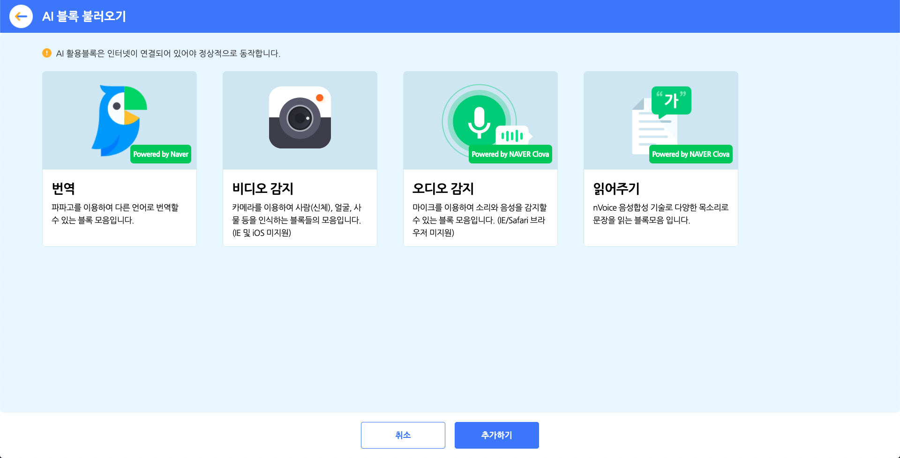
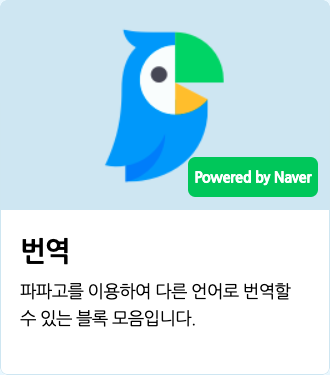
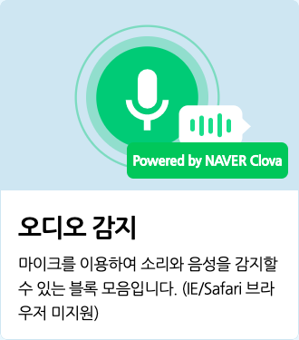
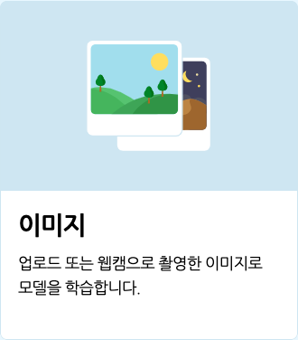
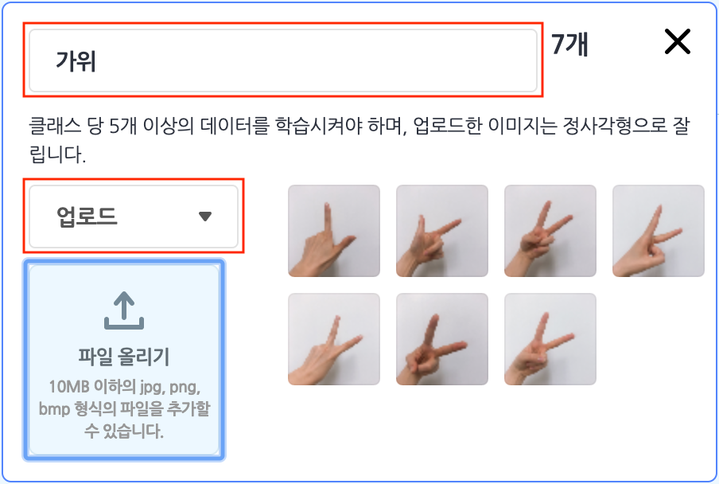
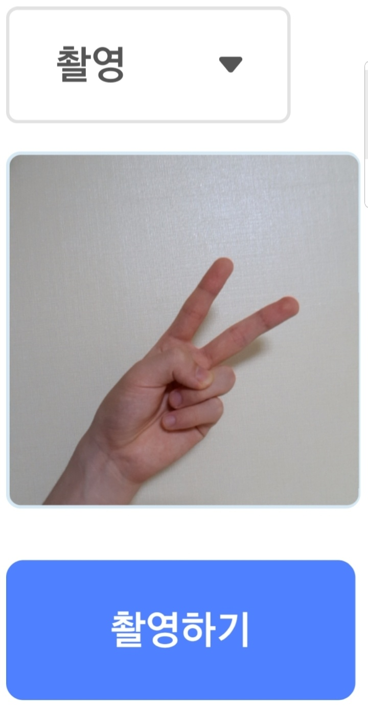
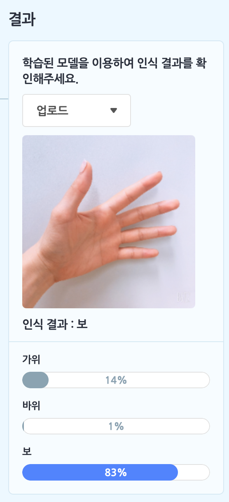
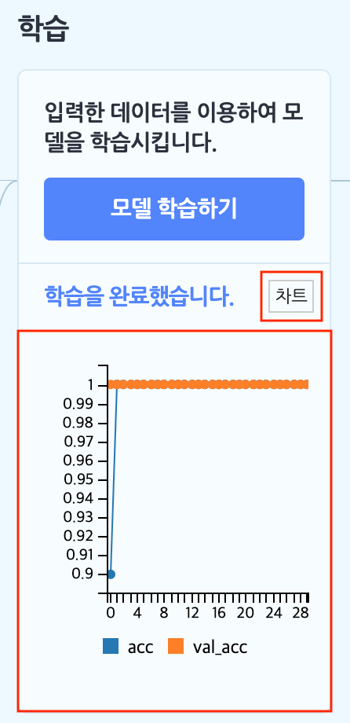
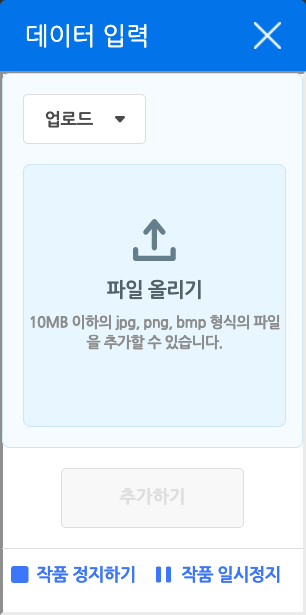
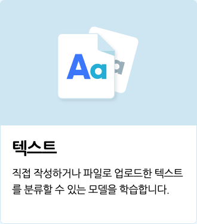

# 인공지능이란

인공지능(AI)이란, 인간의 지혜나 사고 방식을 모방해서 학습하는, 인간과 유사한 능력을 갖는 프로그램입니다. 그 능력은 인간과 비슷할 수도, 훨씬 뛰어날 수도 있어요. 그만큼 가능성은 무궁무진하답니다.

인공지능을 학습시키는 방식은 크게 세 가지로 분류해요.

+ **지도 학습** : 정답의 예시를 알려주고, 예시에서 찾은 특징으로 새로운 데이터를 분류하거나 예측하는 방식입니다. 엔트리의 모델 학습 기능이 지도 학습에 해당해요.
+ **비지도 학습** : 정답을 정하지 않고, 데이터를 주면 비슷한 특징을 찾아서 분류하고, 다시 그 특징으로 새로운 데이터를 분류하는 방식입니다. 예를 들어, '사과'가 무엇인지 알려주지 않아도 사과를 분류할 수 있게 돼요.
+ **강화 학습** : 정답을 정하지 않고, 특정 환경(프로그램)과 최소한의 조건에서 학습한 결과가 좋으면 보상을, 나쁘면 벌을 주며 점점 좋은 결과를 이끌도록 강화하는 방식입니다. 그 유명한 바둑 인공지능 '알파고'가 강화 학습으로 탄생했어요.

인공지능은 다양한 방식으로 우리의 삶 속에 존재해요.

스마트폰을 사용하는 패턴을 학습해서 배터리를 절약하거나, '유튜브'에서 여러분이 좋아할 만한 영상을 추천해줍니다. '구글 어시스턴트', '애플 시리', '카카오 미니' 등의 인공지능(스피커)과 소통하기도 해요.

이렇게 우리 일상에 가까이 있으면서 우리를 편리하게 해 주는 인공지능을 엔트리에서 체험하고 활용해볼 수 있어요. 또한 인공지능 모델을 직접 학습시키며 머신러닝의 원리를 자연스럽게 배워볼 수 있습니다.

+ 모든 인공지능 블록은 인터넷 연결이 필요합니다.

# AI 활용 블록 팝업

인공지능 블록 카테고리의 블록 꾸러미에 있는 'AI 블록 불러오기' 버튼을 클릭하면 나오는 팝업 창입니다.

추가 블록 모음을 선택하고 아래의 '추가하기' 버튼을 클릭해서 블록 꾸러미에 불러올 수 있어요. 중복 선택이 가능해요. 사용하지 않는 블록 모음은 다시 클릭해서 선택을 해제 해 불필요한 로딩을 막을 수 있어요.

아래는 AI 추가 블록 모음의 종류입니다.

+ **번역** : 파파고를 이용해 언어를 번역하는 블록 모음입니다.
+ **비디오 감지** : 카메라를 이용해서 사람(신체), 얼굴, 사물 등을 인식하는 블록들의 모음입니다. (인터넷 익스플로러 및 iOS 미지원)
+ **오디오 감지** : 마이크를 이용해서 소리와 음성을 감지할 수 있는 블록 모음입니다. (인터넷 익스플로러/사파리 미지원)
+ **읽어주기** : nVoice 음성합성 기술을 이용해 다양한 목소리로 문장을 읽는 블록모음 입니다.

AI 활용 블록을 추가하면 작품을 실행하기 전에 해당 기능을 로딩합니다. 실행 환경에 따라 시간이 소요됩니다.

# AI 블록 > 번역

'네이버 랩스'가 자체 개발한 인공신경망 기반 번역 서비스 '파파고'를 활용해 언어를 번역하는 블록입니다.

+ 인터넷에 연결되지 않았거나 인터넷 환경이 불안정할 경우, '알 수 없는 문장입니다.'를 가져오고 다음 블록으로 넘어갑니다.
+ 내용은 3000 자까지 입력이 가능해요.

## 1. (`[한국어]` `(엔트리)` 을(를) `[영어]` 로 번역하기)

입력한 내용을 입력한 언어로 번역하는 값 블록입니다.

아무 내용도 입력하지 않으면 '문장이 없습니다'를 가져와요.

목록 상자()를 클릭하면 번역할 언어를 선택할 수 있어요.

## 2. (`(엔트리)` 의 언어)

입력한 내용의 언어를 가져오는 값 블록입니다.

언어를 알 수 없다면 '알 수 없는 문장입니다.'를 가져와요.

# AI 블록 > 읽어주기

네이버가 개발한 인공지능 플랫폼 '클로바'의 nVoice 음성 합성 기술을 이용해 인공지능이 합성한 다양한 목소리로 문장을 읽는 블록입니다.

+ 인터넷에 연결되지 않았거나 인터넷 환경이 불안정할 경우, '알 수 없는 문장입니다.'를 가져오고 다음 블록으로 넘어갑니다.
+ 내용은 2500 자까지 입력이 가능해요.

## 1. `(엔트리)` 읽어주기

입력한 내용을 설정한 목소리로 읽습니다. 읽기 시작하면 다음 블록이 바로 동작해요.

## 2. `(엔트리)` 읽어주고 기다리기

입력한 내용을 설정한 목소리로 읽고, 다 읽으면 다음 블록이 동작합니다.

## 3. `[여성]` 목소리를 `[보통]` 속도 `[보통]` 음높이로 설정하기

목소리와 읽는 속도, 음높이를 정합니다.

목록 상자()를 클릭하면 목소리와 읽는 속도, 음높이를 선택할 수 있어요.

+ **목소리 (첫 번째 목록 상자)**
  + `여성`, `남성`, `친절한`, `감미로운`, `울리는`, `장난스러운`, `앙증맞은`
+ **읽는 속도 (두 번째 목록 상자)**
  + `매우 느린`, `느린`, `보통`, `빠른`, `매우 빠른`
+ **음 높이 (세 번째 목록 상자)**
  + `매우 낮은`, `낮은`, `보통`, `높은`, `매우 높은`

# AI 블록 > 오디오 감지

네이버가 개발한 인공지능 음성 인식 엔진 '클로바 스피치'를 활용해서, 마이크로 입력하는 소리를 감지하고, 목소리를 문자로 바꿀 수 있는 블록입니다.

+ 오디오 감지 블록은 인터넷 익스플로러, 사파리에서는 동작하지 않습니다.
  (안정적인 동작을 위해 크롬을 사용해주세요.)

+ 오디오 감지 블록은 마이크 연결이 필요한 블록입니다. 데스크탑의 경우 마이크(혹은 마이크가 포함된 이어폰)을 연결해주세요.

+ 마이크를 연결했는데 블록이 동작하지 않거나, 음성이 제대로 입력되지 않는 경우 브라우저 설정을 변경해주세요.
  (크롬의 경우, 주소 표시줄 오른쪽의 카메라 아이콘을 클릭하거나 '설정 > 개인정보 및 보안 > 사이트 설정 > 마이크' 에서 엔트리 사이트의 마이크 사용을 허용해 주세요.)

      

+ 마이크를 통해 입력되는 소리는 **절대로 서버에 저장되거나 외부로 공유되지 않습니다.**

## 1. <마이크가 연결되었는가?>

기기에 마이크가 연결되어 있다면 참으로, 아니라면 거짓으로 판단하는 블록입니다.

## 2. 음성 인식하기

실행 화면에 아래와 같이 목소리를 인식하는 창(음성 인식 창)이 나타납니다.

음성 인식 창이 열려도 작품은 일시 정지하지 않아요.

녹색 마이크 그림이 나타났나요? 자, 이제 말해보세요!

## 3. (음성을 문자로 바꾼 값)

음성 인식 창에서 인식한 목소리를 문자로 바꾸는 값 블록입니다.

목소리를 입력하지 않았거나, 음성 인식 도중에 오류가 발생한 경우에는 0 을 가져와요.

뭐라고 말했는지 엔트리가 잘 알아들었나요?

## 4. (마이크 소리 크기)

음성 인식 창에서 입력한 소리의 크기를 가져오는 값 블록입니다.

# AI 블록 > 비디오 감지

카메라로 입력되는 이미지(영상)을 통해 얼굴/사람(신체)/사물을 인식하는 블록입니다. 카메라에 여러분 스스로를 비춰보고 얼굴 표정, 몸 동작, 다양한 사물을 인공지능이 어떻게 자동으로 감지하고 인식하는지 경험할 수 있어요!

+ 비디오 감지 블록은 Internet Explorer와 iOS에서는 동작하지 않습니다.

  (안정적인 동작을 위해 크롬을 사용해주세요.)

+ 비디오 감지 블록은 카메라 연결이 필요한 블록입니다. 데스크탑의 경우 별도 웹캠을 연결해주세요.

+ 카메라를 연결했는데도 블록이 동작하지 않거나, 영상이 제대로 입력되지 않는 경우 인터넷 브라우저의 설정을 변경해 카메라 사용을 허용해주세요.
  (크롬의 경우, 주소 표시줄 오른쪽의 카메라 아이콘을 클릭하거나 '설정 > 개인정보 및 보안 > 사이트 설정 > 카메라' 에서 엔트리 사이트의 카메라 사용을 허용해 주세요.)

  ​                                                      

+ 카메라를 통해 입력되는 영상은 **절대로 서버에 저장되거나 외부로 공유되지 않습니다.**

+ 비디오 감지 블록은 처음 작동할 때 마다 별도의 로딩이 필요합니다. 약 30초에서 1분 가량 로딩하면 블록을 사용할 수 있어요. 로딩 시간은 컴퓨터 사양, 네트워크 상태에 따라 달라질 수 있습니다. 새로 고침 하거나 다시 접속하는 경우 로딩은 다시 진행됩니다.

+ 부스트 모드에서 비디오 감지 블록을 사용하면 인식 텍스트의 잔상이 남을 수 있어요.

+ 비디오 감지 블록을 반복 블록안에 넣으면 작품이 많이 느려질 수 있으니 주의해 주세요!

아래는 인공지능 블록에서 선택할 수 있는 **인식 모델**입니다.

+ `사람` : 신체의 각 부위를 인식할 수 있는 모델입니다. 인식할 수 있는 부위는 아래와 같습니다.
  + `얼굴`, `목`, `왼쪽 눈`, `오른쪽 눈`, `왼쪽 귀`, `오른쪽 귀`, `왼쪽 어깨`, `오른쪽 어깨`, `왼쪽 팔꿈치`, `오른쪽 팔꿈치`, `왼쪽 손목`, `오른쪽 손목`, `왼쪽 엉덩이`, `오른쪽 엉덩이`, `왼쪽 무릎`, `오른쪽 무릎`, `왼쪽 발목`, `오른쪽 발목`
+ `얼굴` : 얼굴의 각 부위를 인식할 수 있는 모델입니다. 인식할 수 있는 부위는 아래와 같습니다.
  + `왼쪽 눈`, `오른쪽 눈`, `코`, `왼쪽 입꼬리`, `오른쪽 입꼬리`, `윗 입술`, `아랫 입술`
+ `사물` : 미리 지정된 80개의 사물을 인식할 수 있는 모델입니다. 인식할 수 있는 사물은 아래와 같습니다.
  + `사람`, `자전거`, `자동차`, `오토바이`, `비행기`, `버스`, `기차`, `트럭`, `보트`, `신호등`, `소화전`, `정지 표지판`, `주차 미터기`, `벤치`, `새`, `고양이`, `개`, `말`, `양`, `소`, `코끼리`, `곰`, `얼룩말`, `기린`, `배낭`, `우산`, `핸드백`, `넥타이`, `여행 가방`, `원반`, `스키`, `스노보드`, `공`, `연`, `야구 배트`, `야구 글러브`, `스케이트보드`, `서프보드`, `테니스 라켓`, `병`, `와인잔`, `컵`, `포크`, `나이프`, `숟가락`, `그릇`, `바나나`, `사과`, `샌드위치`, `오렌지`, `브로콜리`, `당근`, `핫도그`, `피자`, `도넛`, `케이크`, `의자`, `소파`, `화분`, `침대`, `식탁`, `변기`, `텔레비전`, `노트북`, `마우스`, `리모컨`, `키보드`, `핸드폰`, `전자레인지`, `오븐`, `토스터`, `싱크대`, `냉장고`, `책`, `시계`, `꽃병`, `가위`, `테디베어`, `헤어드라이어`, `칫솔`

## 1. 비디오 화면 `[보이기]`

카메라가 촬영하는 화면(앞으로 '비디오 화면'이라고 부를게요)을 실행화면에서 보이거나 숨깁니다.

목록 상자()를 클릭하면 보일지 숨길지 고를 수 있어요.

## 2. <비디오가 연결되었는가?>

기기에 카메라가 연결되어 있다면 참으로, 아니라면 거짓으로 판단하는 블록입니다.

## 3. 비디오 화면 `[좌우]` 뒤집기

비디오 화면을 실행 화면에서 좌우(가로) 또는 상하(세로)로 뒤집습니다.

기본 화면은 거울을 보는 것처럼 좌우로 뒤집어져 있어요.

목록 상자()를 클릭하면 뒤집을 방향을 선택할 수 있어요.

## 4. 비디오 투명도 효과를 `(0)` 으로 정하기

비디오 화면의 투명도 효과를 입력한 숫자로 정합니다. 0%~100% 범위에서 조절할 수 있어요.

이 블록을 사용하지 않았을 때 기본 투명도 효과는 50%입니다.

## 5. (`[자신]` 에서 감지한 `[움직임]` 값)

비디오 화면에서 오브젝트나 실행 화면이 감지한 움직임 정도를 가져오는 값 블록입니다.

목록 상자()를 클릭하면 감지할 대상과 감지할 값을 선택할 수 있어요.

+ **감지할 대상 (첫 번째 목록 상자)**
  + `자신`  : 해당 오브젝트에서 움직임을 감지합니다.  
  + `실행 화면` : 촬영하는 전체 화면에서 움직임을 감지합니다.
+ **감지할 값 (두 번째 목록 상자)**
  + `움직임` : 움직임이 작고 느릴수록 0 에 가깝고, 크고 많을수록 큰 수를 가져옵니다.
  + `방향` : 오른쪽 또는 위쪽으로 움직일수록 양수로 커지고, 왼쪽 또는 아래쪽으로 움직일수록 음수로 커지는 수를 가져옵니다.

## 6. `[사람]` 인식 `[시작하기]`

모델 인식을 시작하거나 중지합니다.

모델을 인식하려면 꼭 이 블록을 통해 인식을 시작해야 해요.

첫 번째 목록 상자()를 클릭하면 인식할 모델을 선택할 수 있고 두 번째 목록 상자()를 클릭하면 인식을 시작할지 중지할지 선택할 수 있어요.

## 7. <`[사람]` 인식이 되었는가?>

모델을 인식했다면 참으로, 아니라면 거짓으로 판단하는 블록입니다.

선택한 모델의 인식을 시작하지 않았다면 항상 거짓으로 판단해요.

목록 상자()를 클릭하면 인식여부를 확인할 모델을 선택할 수 있어요.

## 8. <사물 중 `[사람]` (이)가 인식되었는가?>

선택한 사물을 인식했다면 참으로, 아니라면 거짓으로 판단하는 블록입니다.

목록 상자()를 클릭하면 인식여부를 확인할 사물을 선택할 수 있어요.

## 9. (인식된 `[사람]` 의 수)

모델을 인식한 수를 가져오는 값 블록입니다.

목록 상자()를 클릭하면 인식한 수를 가져올 모델을 선택할 수 있어요.

## 10. 인식된 `[사람]` `[보이기]`

인식한 모델을 실행 화면에서 보이거나 숨깁니다.

'보이기'를 선택하면 모델이 인식한 대상을 빨간색 상자와 인식한 이름으로 표시해요.

첫 번째 목록 상자()를 클릭하면 인식할 모델을 선택할 수 있고, 두 번째 목록 상자 ()를 클릭하면 그것을 보일지 숨길지 고를 수 있어요.

## 11. (`[1]` 번째 사람의 `[얼굴]` 의 `[x]` 좌표)

신체 부위의 x 또는 y 좌표를 가져오는 값 블록입니다.

사람을 인식하지 않을 때는 0 을 가져와요.

목록 상자()를 클릭하면 인식한 해당 순서의 사람과 신체 부위를 선택할 수 있어요.

## 12. (`[1]` 번째 얼굴의 `[왼쪽 눈]` 의 `[x]` 좌표)

얼굴 부위의 x 또는 y 좌표를 가져오는 값 블록입니다.

얼굴을 인식하지 않을 때는 0 을 가져와요.

목록 상자()를 클릭하면 인식한 해당 순서의 얼굴과 부위를 선택할 수 있어요.

## 13. (`[1]` 번째 얼굴의 `[성별]`)

얼굴의 특징을 가져오는 값 블록입니다.

얼굴의 특징을 가져오려면 꼭 얼굴 인식을 시작한 상태여야 해요. 얼굴을 인식하지 않을 때는 0 을 가져와요.

목록 상자()를 클릭하면 인식한 해당 순서의 얼굴과 그 얼굴의 성별/나이/감정을 선택할 수 있어요.

# 모델 학습

학습할 이미지/음성/텍스트를 데이터로 입력하고, 입력한 데이터를 직접 분류해서 학습시키면 나만의 인공지능 모델이 만들어집니다.

이렇게 학습한 모델은 블록을 통해 작품에서 활용할 수 있어요. 사용자가 새로운 데이터를 입력하면, 인공지능이 자동으로 구별해서 결과를 보여줍니다.

여러분이 학습시키면, 인공지능도 사람처럼 무언가를 분류할 수 있는 능력을 갖게 됩답니다.

+ 모델 학습하기는 크롬 사용을 권장합니다. 다른 브라우저에는 동작하지 않거나, 모델 학습 속도가 (상상 이상으로) 느릴 수 있습니다.
+ 모델은 최대 5개까지 학습시킬 수 있습니다. 학습한 모델이 5개를 초과하면 1개 이상의 모델을 비활성화해야 새로운 모델을 학습시킬 수 있습니다.
+ 비활성화된 모델은 기존 작품에서 더 이상 동작하지 않고, 다시 활성화하기 전에는 사용할 수 없습니다. 모델을 비활성화 할 때는 이미 공유한 작품에 해당 모델이 추가되지 않았는지 꼭 확인해 주세요.
+ 학습한 모델을 추가한 작품에서 코드 보기를 누르거나 작품을 사본으로 저장해도 모델은 확인할 수 없습니다. 학습한 모델은 모델을 만든 사용자만 확인할 수 있습니다.
+ 이미 학습이 완료된 학습 데이터는 서버 환경에 따라 비정기적으로 삭제될 수 있습니다. 학습 데이터가 삭제되더라도 학습한 모델 자체는 유지됩니다.
+ 모델 학습에 사용하는 학습 데이터는 서버에 저장됩니다. 저작권에 문제가 없고 개인정보가 아닌 데이터만 입력해 주세요. 이를 지키지 않아 발생하는 문제는 모두 사용자의 책임입니다.

# 모델 학습하기 팝업

인공지능 블록 카테고리의 블록 꾸러미에 있는 '모델 학습하기' 버튼을 클릭하면 나타나는 팝업 창입니다. (새 탭에서 열립니다.)

학습할 데이터의 유형을 선택하고 모델 학습을 완료하면 해당 유형의 블록을 블록 꾸러미에 추가해요.

아래는 학습할 수 있는 데이터의 유형입니다.

+ **이미지** : 업로드 또는 웹캠으로 촬영한 이미지를 분류할 수 있는 모델을 학습합니다.
+ **텍스트** : 직접 작성하거나 파일로 업로드한 텍스트를 분류할 수 있는 모델을 학습합니다.
+ **음성** : 마이크로 녹음하거나 파일로 업로드한 음성을 분류할 수 있는 모델을 학습합니다.

'나의 모델' 탭에서는 이미 학습한 모델을 다시 학습하거나 바로 추가할 수 있습니다.   한 개의 모델만 선택할 수 있어요.

오른쪽의 '비활성화 모델 함께보기' 토글 버튼을 클릭하면 학습한 모델을 활성화/비활성화할 수 있습니다.

비활성화한 각 모델은 오른쪽 위의 X 버튼을 눌러 모델과 학습 데이터를 삭제할 수 있어요. 해당 모델을 적용해 만든 작품은 정상적으로 동작하지 않게 됩니다.

모델을 비활성화하고 삭제할 때는 이미 공유한 작품에 적용되어 있지는 않은지 꼭 확인해주세요.

# 모델 학습 > 이미지 모델

모델이 학습할 이미지를 업로드하거나 직접 촬영해서 데이터로 입력하고, 입력한 데이터를 직접 분류해서 학습시키면 나만의 인공지능 모델이 만들어집니다.

+ 이미지 모델의 '촬영' 모드는 카메라 사용이 가능한 브라우저에서만 사용할 수 있습니다. 인터넷 익스플로러에서는 카메라 사용이 불가능해 해당 모드를 사용할 수 없습니다.

이미지 모델을 선택하면 아래와 같이 이미지 모델 학습하기 창이 나타납니다.

먼저 모델의 이름부터 지어볼까요? 이름 상자를 클릭해서 모델의 이름을 정합니다.

####  ① 클래스 만들기

모델 학습의 첫 단계는 데이터 입력 영역을 **클래스**로 채우는 것이에요. 클래스는 학습할 데이터의 묶음이고, 데이터를 분류하는 기준입니다. '클래스 추가하기' 버튼을 클릭하면 클래스를 필요한 만큼 추가할 수 있어요.

각 클래스를 선택하면 자세한 정보와 함께 이미지를 입력할 수 있어요. 이름 상자를 클릭하면 클래스의 이름을 정할 수 있습니다. 학습 모델이 알려주는 결과 값으로 클래스 이름을 사용하니까 클래스 이름을 알아보기 쉽게 정해주는 것이 중요해요.

다음으로는 왼쪽의 목록 상자를 클릭하면 이미지를 어떻게 입력할 것인지 선택할 수 있어요.

+ **업로드** : 이미지 파일을 올립니다. 파일은 10MB 이하여야 하고, jpg, png, bmp 형식(확장자)를 지원해요.
+ **촬영** : 기기와 연결한 카메라로 사진을 촬영합니다. 가운데 상자에서 촬영하는 화면을 볼 수 있고, '촬영하기' 버튼을 눌러 사진을 촬영할 수 있어요.
  배경이 너무 화려하면, 모델 학습에 영향을 줄 수 있으므로 가능하면 흰 배경에서 촬영한 이미지를 올려주세요.

이 때 각 클래스를 충분히 학습을 할 수 있도록 최소 5 개 이상의 이미지를 입력해야 합니다. 입력한 이미지는 정사각형으로 잘라서 반영해요. 입력한 각 이미지는 마우스 포인터를 대거나 터치하면 나타나는 X 버튼을 눌러서 삭제할 수 있습니다.

#### ② 학습 조건 설정하기

이렇게 2 개 이상의 클래스를 만들고 나면, 학습 영역의 '모델 학습하기' 버튼을 클릭할 수 있습니다. 이 버튼을 눌러 학습을 바로 완료할 수도 있지만, '모델을 학습시킬 수 있습니다.' 글씨를 클릭해서 다양한 **학습 조건**을 설정할 수 있어요.

+ **세대(Epoch)** : 입력한 데이터를 모두 몇 번씩 학습할 것인지 정하는 부분입니다. 모든 데이터를 1 번씩 학습하는 것을 1 세대라고 불러요. (1 **에포크**라고도 불러요.)
  같은 데이터라고 해도 여러 번 학습할 수록 모델은 똑똑해집니다.
+ **배치 크기(Batch Size)** : 몇 개의 데이터를 학습하고 모델에 반영할지 정하는 부분입니다.
  모든 데이터를 학습하지 않고도 중간중간 지금까지 학습한 데이터를 모델에 반영하는데요. 그것을그것을 몇 개를 기준으로 할지 정한다고 생각하면 돼요.
  다만 배치 크기가 너무 크면 학습한 데이터를 모델에 반영하기 전까지 데이터를 많이 입력해야 하고, 너무 작으면 학습한 데이터를 모델에 바로 반영해 정확성은 높아질 수 있지만, 시간이 오래 걸리고 부정확한 데이터가 있을 경우 편향적인 모델이 만들어질 수 있습니다. 따라서, 적당한 배치 크기를 찾는 것이 중요해요.
+ **학습률(Learning Rate)** : 학습한 내용을 모델에 반영할 때, 학습에서 예상되는 에러를 얼마나 고려할 것인지 정하는 부분입니다. 쉽게 말해서, 얼마나 세밀하게 학습할 것인지를 정하는 비율이에요.
  학습률이 낮을수록 더 세밀하게 학습하기 때문에 속도가 느립니다. 학습률은 조금만 변경해도 결과에 큰 영향을 주는 부분이니 조심해서 설정해야 해요.
+ **검증 데이터 비율(Validation Rate)** : 입력한 데이터 중 어느정도 비율을 학습한 모델을 검증하는 데에 사용할지 정하는 부분입니다.
  검증 데이터 비율을 0.25로 정했다면 4개의 데이터를 입력했을 때 3개는 학습용으로, 1개는 검증용으로 사용하겠다는 뜻이 돼요.

#### ③ 학습 결과 확인하기

학습 조건을 모두 설정했다면 '모델 학습하기' 버튼을 클릭해서 학습을 완료하고, 결과 영역에서 결과를 확인할 수 있습니다.

클래스에 이미지를 입력한 것처럼, 이미지를 업로드해서 학습 모델이 이미지를 제대로 학습했는지 확인할 수 있어요.

각 클래스에 얼마나 가까운지 막대 그래프로 비교해보세요!

이렇게 학습을 완료했다면, 학습 영역에서 '차트' 버튼을 클릭하면 학습의 과정을 그래프로 확인할 수 있어요.

가로축은 세대(Epoch)를 나타냅니다. 세로축에서 **acc**는 훈련 정확도를 의미하고, **val_acc**는 검증 정확도를 나타냅니다. 정확도가 1에 가까울수록 더 정확한 인식 결과를 얻을 수 있어요.

## 1. 학습한 모델로 인식하기

데이터 입력 팝업 창을 열고, 입력한 이미지를 학습한 모델로 인식합니다.

동시에 작품을 일시 정지해요. 오른쪽 아래 버튼을 클릭해서 창을 닫지 않고도 작품을 다시 시작할 수 있습니다.

오른쪽 위의 X 버튼을 클릭하면, 데이터를 입력하지 않고 창을 닫을 수도 있어요.

## 2. (인식 결과)

입력한 데이터를 학습한 모델로 분류한 결과를 가져오는 값 블록입니다.

입력한 데이터와 가장 유사한 클래스의 이름을 가져와요. 만일 데이터를 입력하지 않았다면 아무 것도 가져오지 않아요.

## 3. (`[클래스]` 의 신뢰도)

입력한 데이터가 분류된 클래스에 대한 정확도(또는 신뢰도라고도 할 수 있어요)를 가져오는 값 블록입니다.

만일 데이터를 입력하지 않았다면 0 을 가져와요.

목록 상자()를 클릭하면 정확도를 가져올 클래스를 선택할 수 있어요.

## 4. <인식 결과가 `[클래스]` 인가?>

입력한 데이터가 선택한 클래스와 가장 닮았다면 참, 아니라면 거짓으로 판단하는 블록입니다.

만일 데이터를 입력하지 않았다면 항상 거짓을 가져와요.

목록 상자()를 클릭하면 결과를 확인할 클래스를 선택할 수 있어요.

#  모델 학습 > 텍스트 모델

학습 데이터로 입력한 텍스트를 클래스로 직접 분류하고 학습시키면 새롭게 입력되는 텍스트를 분류할 수 있는 모델을 만들 수 있습니다. 텍스트의 모양이 얼마나 유사한지를 기준으로 분류하는 모델이에요.

모델이 학습할 텍스트는 직접 작성하거나 txt, csv 파일로 업로드할 수 있어요. txt, csv 파일로 업로드하면 이미 입력된 내용의 맨 마지막에 추가됩니다.

+ 텍스트 모델은 고급 모드(학습 조건 설정 및 학습 차트 표시)를 지원하지 않습니다.

텍스트 모델을 선택하면 아래와 같이 텍스트 모델 학습하기 창이 나타납니다.

먼저 모델의 이름부터 지어볼까요? 이름 상자를 클릭해서 모델의 이름을 정합니다.

#### ① 클래스 만들기

모델 학습의 첫 단계는 데이터 입력 영역을 **클래스**로 채우는 것이에요. 클래스는 학습할 데이터의 묶음이고, 데이터를 분류하는 기준입니다.

'클래스 추가하기' 버튼을 클릭하면 클래스를 필요한 만큼 추가할 수 있어요.

각 클래스를 선택하면 자세한 정보와 함께 텍스트를 입력할 수 있어요. 이름 상자를 클릭하면 클래스의 이름을 정할 수 있습니다. 학습 모델이 알려주는 결과 값으로 클래스 이름을 사용하니까 클래스 이름을 알아보기 쉽게 정해주는 것이 중요해요.

각 클래스에 대해서 충분히 학습을 할 수 있도록 각 클래스마다 최소 5개 이상의 텍스트 데이터를 입력해야 합니다. 텍스트 데이터의 구분은 쉼표로 해주세요.

오른쪽 아래의 업로드 버튼을 클릭하면 텍스트 데이터를 텍스트 파일로 올릴 수도 있습니다. 파일은 10MB 이하여야 하고, txt, csv 형식(확장자)를 지원해요. 업로드하면 이미 입력된 내용의 맨 마지막에 추가합니다.

#### ② 학습 결과 확인하기

이렇게 2 개 이상의 클래스를 만들고 나면, 학습 영역의 '모델 학습하기' 버튼을 클릭해서, 결과 영역에서 결과를 확인할 수 있습니다.

클래스에 텍스트를 입력한 것처럼, 텍스트를 입력해서 학습 모델이 텍스트를 제대로 학습했는지 확인할 수 있어요.

각 클래스에 얼마나 가까운지 막대 그래프로 비교해보세요!

## 1. 학습한 모델로 인식하기

데이터 입력 팝업 창을 열고, 입력한 데이터를 학습한 모델로 인식합니다.

동시에 작품을 일시 정지해요. 오른쪽 아래 버튼을 클릭해서 창을 닫지 않고도 작품을 다시 시작할 수 있습니다.

오른쪽 위의 X 버튼을 클릭하면, 데이터를 입력하지 않고 창을 닫을 수도 있어요.

## 2. `(엔트리)` 을(를) 학습한 모델로 인식하기

이 블록의 값 블록()에 입력한 텍스트를 학습한 모델로 인식합니다.

데이터 입력 팝업 창을 열지 않아도 돼요!

## 3. (인식 결과)

입력한 데이터를 학습한 모델로 분류한 결과를 가져오는 값 블록입니다.

입력한 데이터와 가장 유사한 클래스의 이름을 가져와요. 만일 데이터를 입력하지 않았다면 아무 것도 가져오지 않아요.

## 4. (`[클래스]` 의 신뢰도)

입력한 데이터가 분류된 클래스에 대한 정확도(또는 신뢰도라고도 할 수 있어요)를 가져오는 값 블록입니다.

만일 데이터를 입력하지 않았다면 0 을 가져와요.

목록 상자()를 클릭하면 정확도를 가져올 클래스를 선택할 수 있어요.

## 5. <인식 결과가 `[클래스]` 인가?>

입력한 데이터가 선택한 클래스와 가장 닮았다면 참, 아니라면 거짓으로 판단하는 블록입니다.

만일 데이터를 입력하지 않았다면 항상 거짓을 가져와요.

목록 상자()를 클릭하면 결과를 확인할 클래스를 선택할 수 있어요.

# 모델 학습 > 음성 모델

학습 데이터로 입력한 음성을 클래스로 직접 분류하고 학습시키면 새롭게 입력되는 음성을 분류할 수 있는 모델을 만들 수 있습니다. 음성의 파형이 얼마나 유사한지를 기준으로 분류하는 모델이에요.

모델이 학습할 음성은 직접 녹음하거나 wav, mp3 파일로 업로드할 수 있어요. 직접 녹음할 때는 1~3초까지 녹음 길이를 설정할 수 있고, 녹음된 음성의 앞부분과 뒷부분을 잘라낼 수 있는 트리밍 기능을 사용할 수 있답니다.

+ 음성 모델은 사용자의 PC 환경에 따라 로딩 시간이 오래 걸릴 수 있습니다.
+ 음성 모델의 '녹음' 모드는 마이크 사용이 가능한 브라우저에서만 사용할 수 있습니다. 인터넷 익스플로러에서는 마이크 사용이 불가능해 해당 모드를 사용할 수 없습니다.

음성 모델을 선택하면 아래와 같이 음성 모델 학습하기 창이 나타납니다.

먼저 모델의 이름부터 지어볼까요? 이름 상자를 클릭해서 모델의 이름을 정합니다.

#### ① 클래스 만들기

모델 학습의 첫 단계는 데이터 입력 영역을 **클래스**로 채우는 것이에요. 클래스는 학습할 데이터의 묶음이고, 데이터를 분류하는 기준입니다.

'클래스 추가하기' 버튼을 클릭하면 클래스를 필요한 만큼 추가할 수 있어요.

각 클래스를 선택하면 자세한 정보와 함께 음성을 입력할 수 있어요. 이름 상자를 클릭하면 클래스의 이름을 정할 수 있습니다. 학습 모델이 알려주는 결과 값으로 클래스 이름을 사용하니까 클래스 이름을 알아보기 쉽게 정해주는 것이 중요해요.

왼쪽의 목록 상자를 클릭하면 음성을 어떻게 입력할 것인지 선택할 수 있어요.

+ **업로드** : 음성 파일을 올립니다. 파일은 10MB 이하여야 하고, wav, mp3 형식(확장자)를 지원해요.

+ **녹음** : 기기와 연결한 마이크로 음성을 녹음합니다. 가운데 상자에서 녹음하는 음성의 파장을 볼 수 있고, '입력하기' 버튼을 눌러 사진을 촬영할 수 있어요.

1~3 초까지 녹음할 수 있고, 양쪽의 빨간 선을 드래그하면 음성의 앞/뒤를 잘라내는 트리밍 기능을 사용할 수 있어요.

각 클래스에 대해서 충분히 학습을 할 수 있도록 최소 5 개 이상의 음성을 입력해야 합니다. 입력한 각 음성은 마우스 포인터를 대거나 터치하면 나타나는 X 버튼을 눌러서 삭제할 수 있어요.

#### ② 학습 조건 설정하기

이렇게 2 개 이상의 클래스를 만들고 나면, 학습 영역의 '모델 학습하기' 버튼을 클릭할 수 있습니다. 이 버튼을 바로 눌러 학습을 완료할 수도 있지만, '모델을 학습시킬 수 있습니다' 글씨를 클릭해서 다양한 **학습 조건**을 설정할 수 있어요.

+ **세대(Epoch)** : 입력한 데이터를 모두 몇 번씩 학습할 것인지 정하는 부분입니다. 모든 데이터를 1 번씩 학습하는 것을 1 세대라고 불러요. (1 **에포크**라고도 불러요.)
  같은 데이터라고 해도 여러 번 학습하면 학습할 수록 모델은 똑똑해집니다.
+ **배치 크기(Batch Size)** : 몇 개의 데이터를 학습하고 모델에 반영할지 정하는 부분입니다.
  모든 데이터를 학습하지 않고도 중간중간 지금까지 학습한 데이터를 모델에 반영하는데요. 그것을 몇 개를 기준으로 할지 정한다고 생각하면 돼요.
  다만 배치 크기가 너무 크면 학습한 데이터를 모델에 반영하기 전까지 데이터를 많이 입력해야 하고, 너무 작으면 학습한 데이터를 모델에 바로 반영해 정확성은 높아질 수 있지만, 시간이 오래 걸리고 부정확한 데이터가 있을 경우 편향적인 모델이 만들어질 수 있습니다. 따라서, 적당한 배치 크기를 찾는 것이 중요해요.
+ **학습률(Learning Rate)** : 학습한 내용을 모델에 반영할 때, 학습에서 예상되는 에러를 얼마나 고려할 것인지 정하는 부분입니다. 쉽게 말해서, 얼마나 세밀하게 학습할 것인지를 정하는 비율이에요.
  학습률이 낮을수록 더 세밀하게 학습하기 때문에 속도가 느립니다. 학습률은 조금만 변경해도 결과에 큰 영향을 주는 부분이니 조심해서 설정해야 해요.
+ **검증 데이터 비율(Validation Rate)** : 입력한 데이터 중 어느정도 비율을 학습한 모델을 검증하는 데에 사용할지 정하는 부분입니다.
  검증 데이터 비율을 0.25로 정했다면 4개의 데이터를 입력했을 때 3개는 학습용으로, 1개는 검증용으로 사용하겠다는 뜻이 돼요.

#### ③ 학습 결과 확인하기

학습 조건을 모두 설정했다면 '모델 학습하기' 버튼을 클릭해서, 결과 영역에서 결과를 확인할 수 있습니다.

클래스에 음성을 입력하는 것처럼, 음성을 업로드해서 학습 모델이 음성을 제대로 학습했는지 확인할 수 있어요.

각 클래스에 얼마나 가까운지 막대 그래프로 비교해보세요!

이렇게 학습을 완료했다면, 학습 영역에서 '차트' 버튼을 클릭하면 학습의 과정을 그래프로 확인할 수 있어요.

가로축은 세대(Epoch)를 나타냅니다. 세로축에서 **acc**는 훈련 정확도를 의미하고, **val_acc**는 검증 정확도를 나타냅니다. 정확도가 1에 가까울수록 더 정확한 인식 결과를 얻을 수 있어요.

## 1. 학습한 모델로 인식하기

데이터 입력 팝업 창을 열고, 입력한 데이터를 학습한 모델로 인식합니다.

동시에 작품을 일시 정지해요. 오른쪽 아래 버튼을 클릭해서 창을 닫지 않고도 작품을 다시 시작할 수 있습니다.

오른쪽 위의 X 버튼을 클릭하면, 데이터를 입력하지 않고 창을 닫을 수도 있어요.

## 2. (인식 결과)

입력한 데이터를 학습한 모델로 분류한 결과를 가져오는 값 블록입니다.

입력한 데이터와 가장 유사한 클래스의 이름을 가져와요. 만일 데이터를 입력하지 않았다면 아무 것도 가져오지 않아요.

## 3. (`[클래스]` 의 신뢰도)

입력한 데이터가 분류된 클래스에 대한 정확도(또는 신뢰도라고도 할 수 있어요)를 가져오는 값 블록입니다.

만일 데이터를 입력하지 않았다면 0 을 가져와요.

목록 상자()를 클릭하면 정확도를 가져올 클래스를 선택할 수 있어요.

## 4. <인식 결과가 `[클래스]` 인가?>

입력한 데이터가 선택한 클래스와 가장 닮았다면 참, 아니라면 거짓으로 판단하는 블록입니다.

만일 데이터를 입력하지 않았다면 항상 거짓을 가져와요.

목록 상자()를 클릭하면 결과를 확인할 클래스를 선택할 수 있어요.
