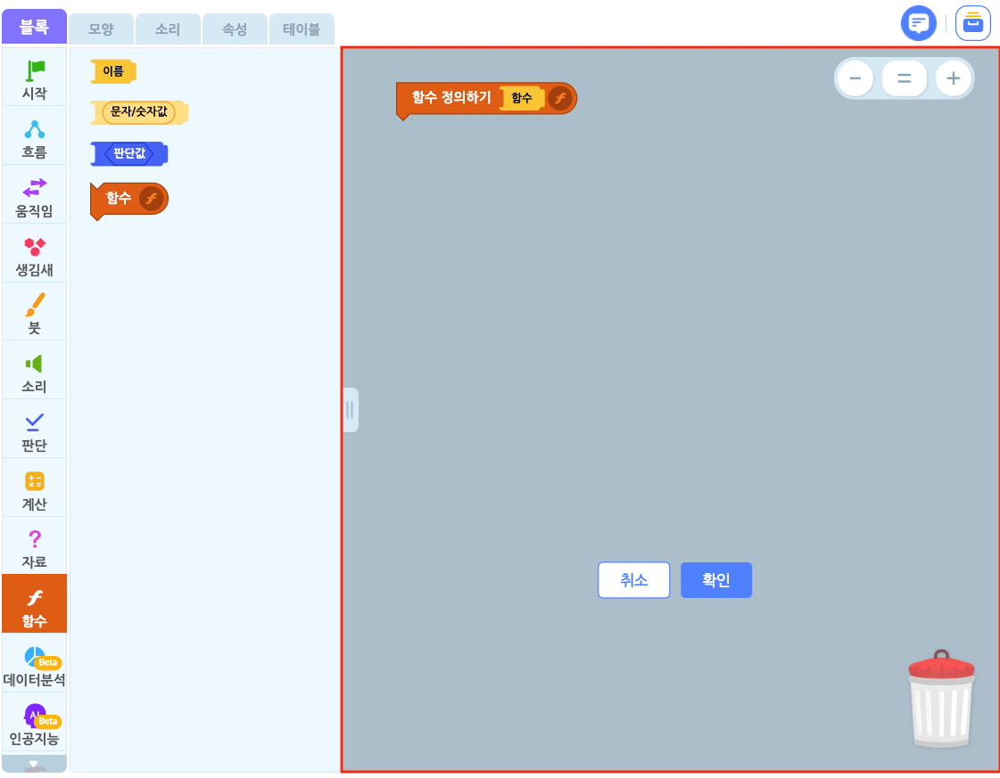
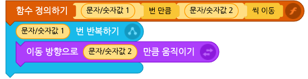
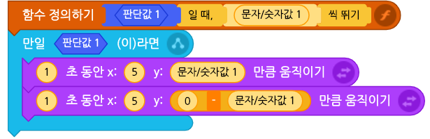

# 개요

함수를 이용하면 여러 블록의 조립을 하나의 블록처럼 사용할 수 있습니다. 하나의 기능을 위해 사용되는 블록의 모음이거나 여러 번 사용해야 하는 블록들을 함수로 만들면 편리하답니다.
마치 '집 밖으로 나가기'라는 하나의 목표를 위해 양치를 하고, 양말을 신고, 현관문을 열어야 하는 것처럼요!

함수를 만들려면 블록 탭의 함수 블록 꾸러미에서 '함수 만들기' 버튼을 클릭하거나, 속성 탭의 함수 카테고리에서 '함수 추가하기'를 클릭합니다. 이미 만들어진 함수가 있을 때는 함수 블록을 더블 클릭하면 함수 블록 꾸러미가 나타납니다.

함수 블록 조립소에는 함수를 정의할 수 있는 '리본 블록'을 볼 수 있어요.

+ **리본 블록**
  + 함수 이름 블록()
  + 함수 값 블록()
  + 함수 판단 블록()

#  튜토리얼

함수를 정의하기 위해서는 리본 블록과 일반 블록을 같이 사용해야 합니다.

함수에 조립된 일반 블록들은 함수가 동작할 때, 같이 동작되는 블록이 됩니다. 리본 블록들은 일반 블록에 입력할 값 블록()과 판단 블록() 자리를 만들어 주는 블록이라고 볼 수 있어요.

처음 함수를 만들면 보이는 함수 정의 블록입니다. 정의한 함수가 동작할 때, 해당 함수에 조립된 블록들이 동작해요.

## 1. 함수 이름 블록

함수 이름 블록은 함수 블록의 이름을 짓는 용도로만 사용합니다. 따라서 '함수 정의하기' 오른쪽에만 들어갈 수 있어요.

리본 블록을 결합하는 순서는 자유로워요. 예를 들어, 아래의 그림과 같이 리본 블록을 결합할 수 있습니다.

만일 함수 이름을 '함수'라고 지었다면, 완성한 함수는 이런 모습입니다.

위의 예시와 같이 함수를 정의한다면, 완성한 함수는 이런 모습입니다.

이렇게 만든 함수 블록은 다른 블록들처럼 언제든지 작품에서 사용할 수 있어요.

어때요? 나만의 블록을 만들 수 있다니, 신기하지 않나요?

## 2. 함수 값 블록

함수 값 블록은 함수 블록에 입력한 문자/숫자를 값 블록()으로 가져오는 역할을 합니다.

함수 값 블록이 함수 정의 블록에 결합되면 왼쪽부터 순서대로 숫자가 나타납니다. 이 순서로 값 블록의 용도를 서로 구분할 수 있어요.

예를 들어, 아래의 그림과 같이 사용할 수 있어요.

값 블록() 부분을 드래그하면 해당 순서의 문자/숫자 값 블록()을 복사할 수 있습니다. 복사된 값 블록은 일반 블록과 결합하여 사용할 수 있어요.

예를 들어, 함수 값 블록 중  문자/숫자값1()에 입력된 문자/숫자 값은 일반 블록에 결합된 문자/숫자값1 값 블록 () 자리에 들어가서 작동하게 됩니다.

위의 예시와 같이 함수를 정의한다면, 함수 블록은 아래와 같이 만들어집니다.

이렇게 만들어진 함수는 밑에 블록과 같은 동작을 하게 되죠.

두 블록코드가 하는 동작은 완전히 똑같지만, 함수 블록는 블록 코드의 개수를 줄여 코드를 더 깔끔하게 만들 수 있답니다!

## 3. 함수 판단 블록

함수 판단 블록은 함수 블록에 입력한 판단 값을 함수 정의 사용하는 판단 블록()으로 가져오는 역할을 합니다.

예를 들어, 아래의 그림과 같이 리본 블록을 결합해서 사용할 수 있어요.

함수 판단 블록이 함수 정의 블록에 결합되면 왼쪽부터 순서대로 숫자가 나타납니다. 이 순서로 값 블록의 용도를 서로 구분할 수 있어요.

이 블록의 판단 블록()을 드래그하면 해당 순서의 판단 블록()을 복사할 수 있습니다.

예를 들어, 함수 판단 블록 중 판단값1 ()에 입력된 판단값은 일반 블록에 결합된 판단값1()에 들어가서 작동하게 됩니다.

위의 예시와 같이 함수를 정의한다면, 완성한 함수는 이런 모습이에요.

함수 블록을 적극적으로 활용하면 조립이 간편하고 블록을 쉽게 재활용할 수 있어서 유용합니다.

자, 이제 여러분만의 특별한 블록을 만들어보세요!
