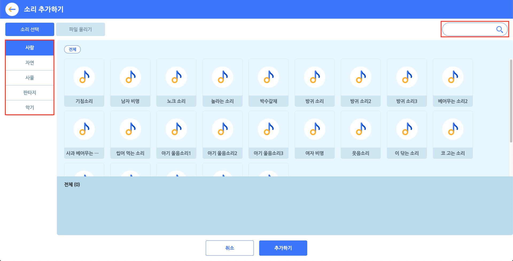

# 소리 목록

오브젝트에 소리를 추가 또는 관리하는 영역입니다.

모든 오브젝트에는 하나의 소리 목록이 있어요. '소리 추가하기' 버튼을 통해 원하는 소리를 이 목록에 추가할 수 있습니다.

소리 목록에 추가한 소리는 소리 블록을 통해 재생할 수 있습니다.

+ 이름 상자를 클릭해서 이름을 수정합니다.
+ 오른쪽의 X 버튼을 클릭해서 삭제합니다.
+ 왼쪽의 재생 아이콘을 클릭해서 재생합니다.
+ 왼쪽의 재생 아이콘을 드래그해서 소리 목록의 순서를 바꿉니다.

+ 소리를 마우스 우클릭하면 이름 수정, 복제, 삭제, PC에 저장이 가능합니다.

+ 선택한 소리를 편집하는 영역

소리 편집 기능은 아직 준비되지 않았어요. 멋진 업데이트로 찾아올 테니, 기대해주실 거죠?

# 소리 추가 팝업

'소리 추가하기' 버튼을 클릭하면 나타나는 팝업 창입니다.

소리를 선택하고, 아래의 '추가하기' 버튼을 클릭하면 소리 목록에 추가할 수 있어요.

오른쪽 위의 검색창을 통해 원하는 소리의 이름을 검색할 수 있어요. 왼쪽의 카테고리를 선택하면 원하는 소리를 더 쉽게 찾을 수 있습니다.

#### ① 소리 선택

원하는 소리를 클릭해서 선택합니다. 중복 선택이 가능해요. 선택한 소리는 아래의 선택 목록 영역에서 볼 수 있어요.

선택한 소리를 다시 클릭하거나, 선택 목록의 소리에 마우스 포인터를 가져갔을 때 나타나는 X 표시를 눌러 선택을 해제할 수 있습니다.

일부 카테고리의 소리는 태그로 분류되어 상단의 태그를 선택하면 원하는 소리를 더 쉽게 찾을 수 있습니다.

#### ② 파일 올리기

원하는 소리를 직접 올릴 수도 있어요.

소리 파일의 용량은 10MB 이하여야 하고, mp3 형식(확장자)를 지원합니다.

올린 소리는 파일 올리기 목록에서 볼 수 있습니다. 선택한 소리만 소리 목록에 추가됩니다. 파일을 올리면 기본적으로 선택한 상태가 되니 유의해 주세요.

> 아래와 같은 소리는 이용약관 및 관련 법률에 의해 제재를 받을 수 있습니다.
>
> + 폭력적이고 잔인한 소리
> + 선정적인 내용의 소리
> + 불쾌감을 주거나 혐오감을 일으키는 소리
> + 무단 사용이 금지된 저작권의 소리 [[저작권에 대해 알아보기]](https://playentry.org/#!/terms/project)
