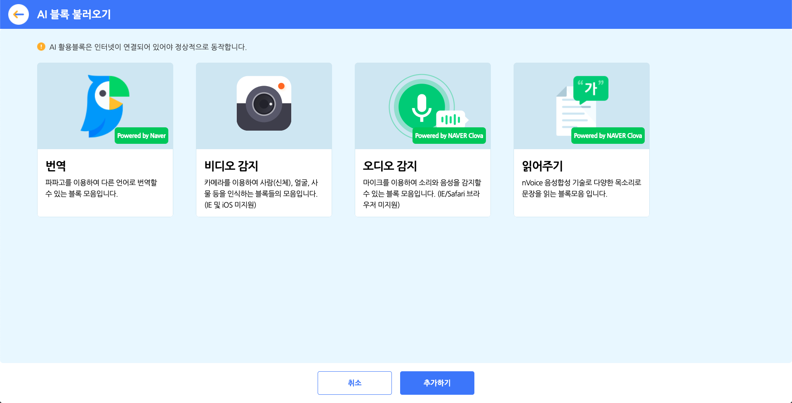
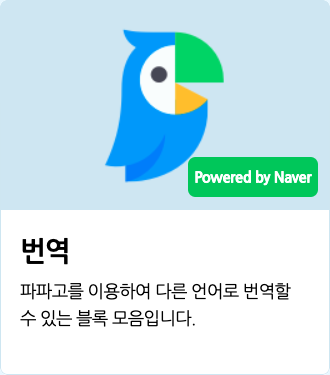
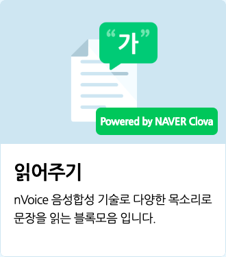
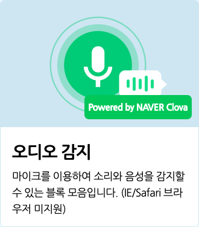

# 인공지능이란?

인공지능(AI)이란, 인간의 지혜나 사고 방식을 모방해서 학습하는, 인간과 유사한 능력을 갖는 프로그램입니다. 그 능력은 인간과 비슷할 수도, 훨씬 뛰어날 수도 있어요. 그만큼 가능성은 무궁무진하답니다.

인공지능을 학습시키는 방식은 크게 세 가지로 분류해요.
+ **지도 학습** : 정답의 예시를 알려주고, 예시에서 찾은 특징으로 새로운 데이터를 분류하거나 예측하는 방식입니다. 엔트리의 모델 학습 기능이 지도 학습에 해당해요.
+ **비지도 학습** : 정답을 정하지 않고, 데이터를 주면 비슷한 특징을 찾아서 분류하고, 다시 그 특징으로 새로운 데이터를 분류하는 방식입니다. 예를 들어, '사과'가 무엇인지 알려주지 않아도 사과를 분류할 수 있게 돼요.
+ **강화 학습** : 정답을 정하지 않고, 특정 환경(프로그램)과 최소한의 조건에서 학습한 결과가 좋으면 보상을, 나쁘면 벌을 주며 점점 좋은 결과를 이끌도록 강화하는 방식입니다. 그 유명한 바둑 인공지능 '알파고'가 강화 학습으로 탄생했어요.

인공지능은 다양한 방식으로 우리의 삶 속에 존재해요.

스마트폰을 사용하는 패턴을 학습해서 배터리를 절약하거나, '유튜브'에서 여러분이 좋아할 만한 영상을 추천해줍니다. '구글 어시스턴트', '애플 시리', '카카오 미니' 등의 인공지능(스피커)과 소통하기도 해요.

이렇게 우리 일상에 가까이 있으면서 우리를 편리하게 해 주는 인공지능을 엔트리에서 체험하고 활용해볼 수 있어요. 또한 인공지능 모델을 직접 학습시키며 머신러닝의 원리를 자연스럽게 배워볼 수 있습니다.

※ 모든 인공지능 블록은 인터넷 연결이 필요합니다.

### AI 활용 블록 팝업

인공지능 블록 카테고리의 블록 꾸러미에 있는 'AI 블록 불러오기' 버튼을 클릭하면 나오는 팝업 창입니다.

추가 블록 모음을 선택하고 아래의 '추가하기' 버튼을 클릭해서 블록 꾸러미에 불러올 수 있어요. 중복 선택이 가능해요. 사용하지 않는 블록 모음은 다시 클릭해서 선택을 해제 해 불필요한 로딩을 막을 수 있어요.

아래는 AI 추가 블록 모음의 종류입니다.
+ **번역** : 파파고를 이용해 언어를 번역하는 블록 모음입니다.
+ **비디오 감지** : 카메라를 이용해서 사람(신체), 얼굴, 사물 등을 인식하는 블록들의 모음입니다. (인터넷 익스플로러 및 iOS 미지원)
+ **오디오 감지** : 마이크를 이용해서 소리와 음성을 감지할 수 있는 블록 모음입니다. (인터넷 익스플로러/사파리 미지원)
+ **읽어주기** : nVoice 음성합성 기술을 이용해 다양한 목소리로 문장을 읽는 블록모음 입니다.

AI 활용 블록을 추가하면 작품을 실행하기 전에 해당 기능을 로딩합니다. 실행 환경에 따라 시간이 소요됩니다.

# AI 블록 > 번역

'네이버 랩스'가 자체 개발한 인공신경망 기반 번역 서비스 '파파고'를 활용해 언어를 번역하는 블록입니다.
+ 인터넷에 연결되지 않았거나 인터넷 환경이 불안정할 경우, '알 수 없는 문장입니다.'를 가져오고 다음 블록으로 넘어갑니다.
+ 내용은 3000 자까지 입력이 가능해요.

## 1. `[한국어]` `(엔트리)` 을(를) `[영어]` 로 번역하기

입력한 내용을 입력한 언어로 번역하는 값 블록입니다.

아무 내용도 입력하지 않으면 '문장이 없습니다'를 가져와요.

목록 상자()를 클릭하면 번역할 언어를 선택할 수 있어요.

## 2. `(엔트리)` 의 언어

입력한 내용의 언어를 가져오는 값 블록입니다.

언어를 알 수 없다면 '알 수 없는 문장입니다.'를 가져와요.

# AI 블록 > 읽어주기

네이버가 개발한 인공지능 플랫폼 '클로바'의 nVoice 음성 합성 기술을 이용해 인공지능이 합성한 다양한 목소리로 문장을 읽는 블록입니다.
+ 인터넷에 연결되지 않았거나 인터넷 환경이 불안정할 경우, '알 수 없는 문장입니다.'를 가져오고 다음 블록으로 넘어갑니다.
+ 내용은 2500 자까지 입력이 가능해요.

## 1. `(엔트리)` 읽어주기

입력한 내용을 설정한 목소리로 읽습니다. 읽기 시작하면 다음 블록이 바로 동작해요.

## 2. `(엔트리)` 읽어주고 기다리기

입력한 내용을 설정한 목소리로 읽고, 다 읽으면 다음 블록이 동작합니다.

## 3. `[여성]` 목소리를 `[보통]` 속도 `[보통]` 음높이로 설정하기

목소리와 읽는 속도, 음높이를 정합니다.

목록 상자()를 클릭하면 목소리와 읽는 속도, 음높이를 선택할 수 있어요.
+ **목소리 (첫 번째 목록 상자)**
  + `여성`, `남성`, `친절한`, `감미로운`, `울리는`, `장난스러운`, `앙증맞은`
+ **읽는 속도 (두 번째 목록 상자)**
  + `매우 느린`, `느린`, `보통`, `빠른`, `매우 빠른`
+ **음 높이 (세 번째 목록 상자)**
  + `매우 낮은`, `낮은`, `보통`, `높은`, `매우 높은`

# AI 블록 > 오디오 감지

네이버가 개발한 인공지능 음성 인식 엔진 '클로바 스피치'를 활용해서, 마이크로 입력하는 소리를 감지하고, 목소리를 문자로 바꿀 수 있는 블록입니다.
+ 오디오 감지 블록은 인터넷 익스플로러, 사파리에서는 동작하지 않습니다.
(안정적인 동작을 위해 크롬을 사용해주세요.)
+ 오디오 감지 블록은 마이크 연결이 필요한 블록입니다. 데스크탑의 경우 마이크(혹은 마이크가 포함된 이어폰)을 연결해주세요.
+ 마이크를 연결했는데 블록이 동작하지 않거나, 음성이 제대로 입력되지 않는 경우 브라우저 설정을 변경해주세요.
(크롬의 경우, 주소 표시줄 오른쪽의 카메라 아이콘을 클릭하거나 '설정 > 개인정보 및 보안 > 사이트 설정 > 마이크' 에서 엔트리 사이트의 마이크 사용을 허용해 주세요.)

    

※ 마이크를 통해 입력되는 소리는 **절대로 서버에 저장되거나 외부로 공유되지 않습니다.**

## 1. <마이크가 연결되었는가?>

기기에 마이크가 연결되어 있다면 참으로, 아니라면 거짓으로 판단하는 블록입니다.

## 2. 음성 인식하기

실행 화면에 아래와 같이 목소리를 인식하는 창(음성 인식 창)이 나타납니다.

음성 인식 창이 열려도 작품은 일시 정지하지 않아요.

녹색 마이크 그림이 나타났나요? 자, 이제 말해보세요!

## 3. 음성을 문자로 바꾼 값

음성 인식 창에서 인식한 목소리를 문자로 바꾸는 값 블록입니다.

목소리를 입력하지 않았거나, 음성 인식 도중에 오류가 발생한 경우에는 0 을 가져와요.

뭐라고 말했는지 엔트리가 잘 알아들었나요?

## 4. 마이크 소리 크기

음성 인식 창에서 입력한 소리의 크기를 가져오는 값 블록입니다.

# AI 블록 > 비디오 감지

카메라로 입력되는 이미지(영상)을 통해 얼굴/사람(신체)/사물을 인식하는 블록입니다. 카메라에 여러분 스스로를 비춰보고 얼굴 표정, 몸 동작, 다양한 사물을 인공지능이 어떻게 자동으로 감지하고 인식하는지 경험할 수 있어요!
+ 비디오 감지 블록은 Internet Explorer와 iOS에서는 동작하지 않습니다.
(안정적인 동작을 위해 크롬을 사용해주세요.)
+ 비디오 감지 블록은 카메라 연결이 필요한 블록입니다. 데스크탑의 경우 별도 웹캠을 연결해주세요.
+ 카메라를 연결했는데도 블록이 동작하지 않거나, 영상이 제대로 입력되지 않는 경우 인터넷 브라우저의 설정을 변경해 카메라 사용을 허용해주세요.
(크롬의 경우, 주소 표시줄 오른쪽의 카메라 아이콘을 클릭하거나 '설정 > 개인정보 및 보안 > 사이트 설정 > 카메라' 에서 엔트리 사이트의 카메라 사용을 허용해 주세요.)

  ​                                                      

※ 카메라를 통해 입력되는 영상은 **절대로 서버에 저장되거나 외부로 공유되지 않습니다.**
+ 비디오 감지 블록은 처음 작동할 때 마다 별도의 로딩이 필요합니다. 약 30초에서 1분 가량 로딩하면 블록을 사용할 수 있어요. 로딩 시간은 컴퓨터 사양, 네트워크 상태에 따라 달라질 수 있습니다. 새로 고침하거나 다시 접속하는 경우 로딩은 다시 진행됩니다.
+ 비디오 감지 블록을 반복 블록 안에 넣으면 작품이 많이 느려질 수 있으니 주의해 주세요!

아래는 인공지능 블록에서 선택할 수 있는 **인식 모델**입니다.
+ `사람` : 신체의 각 부위를 인식할 수 있는 모델입니다. 인식할 수 있는 부위는 아래와 같습니다.
  + `얼굴`, `목`, `왼쪽 눈`, `오른쪽 눈`, `왼쪽 귀`, `오른쪽 귀`, `왼쪽 어깨`, `오른쪽 어깨`, `왼쪽 팔꿈치`, `오른쪽 팔꿈치`, `왼쪽 손목`, `오른쪽 손목`, `왼쪽 엉덩이`, `오른쪽 엉덩이`, `왼쪽 무릎`, `오른쪽 무릎`, `왼쪽 발목`, `오른쪽 발목`
+ `얼굴` : 얼굴의 각 부위를 인식할 수 있는 모델입니다. 인식할 수 있는 부위는 아래와 같습니다.
  + `왼쪽 눈`, `오른쪽 눈`, `코`, `왼쪽 입꼬리`, `오른쪽 입꼬리`, `윗 입술`, `아랫 입술`
+ `사물` : 미리 지정된 80개의 사물을 인식할 수 있는 모델입니다. 인식할 수 있는 사물은 아래와 같습니다.
  + `사람`, `자전거`, `자동차`, `오토바이`, `비행기`, `버스`, `기차`, `트럭`, `보트`, `신호등`, `소화전`, `정지 표지판`, `주차 미터기`, `벤치`, `새`, `고양이`, `개`, `말`, `양`, `소`, `코끼리`, `곰`, `얼룩말`, `기린`, `배낭`, `우산`, `핸드백`, `넥타이`, `여행 가방`, `원반`, `스키`, `스노보드`, `공`, `연`, `야구 배트`, `야구 글러브`, `스케이트보드`, `서프보드`, `테니스 라켓`, `병`, `와인잔`, `컵`, `포크`, `나이프`, `숟가락`, `그릇`, `바나나`, `사과`, `샌드위치`, `오렌지`, `브로콜리`, `당근`, `핫도그`, `피자`, `도넛`, `케이크`, `의자`, `소파`, `화분`, `침대`, `식탁`, `변기`, `텔레비전`, `노트북`, `마우스`, `리모컨`, `키보드`, `핸드폰`, `전자레인지`, `오븐`, `토스터`, `싱크대`, `냉장고`, `책`, `시계`, `꽃병`, `가위`, `테디베어`, `헤어드라이어`, `칫솔`

## 1. 비디오 화면 `[보이기]`

카메라가 촬영하는 화면(앞으로 '비디오 화면'이라고 부를게요)을 실행화면에서 보이거나 숨깁니다.

목록 상자()를 클릭하면 보일지 숨길지 고를 수 있어요.

## 2. <비디오가 연결되었는가?>

기기에 카메라가 연결되어 있다면 참으로, 아니라면 거짓으로 판단하는 블록입니다.

## 3. 비디오 화면 `[좌우]` 뒤집기

비디오 화면을 실행 화면에서 좌우(가로) 또는 상하(세로)로 뒤집습니다.

기본 화면은 거울을 보는 것처럼 좌우로 뒤집어져 있어요.

목록 상자()를 클릭하면 뒤집을 방향을 선택할 수 있어요.

## 4. 비디오 투명도 효과를 `(0)` 으로 정하기

비디오 화면의 투명도 효과를 입력한 숫자로 정합니다. 0%~100% 범위에서 조절할 수 있어요.

이 블록을 사용하지 않았을 때 기본 투명도 효과는 50%입니다.

## 5. `[자신]` 에서 감지한 `[움직임]` 값

비디오 화면에서 오브젝트나 실행 화면이 감지한 움직임 정도를 가져오는 값 블록입니다.

목록 상자()를 클릭하면 감지할 대상과 감지할 값을 선택할 수 있어요.
+ **감지할 대상 (첫 번째 목록 상자)**
  + `자신`  : 해당 오브젝트에서 움직임을 감지합니다.  
  + `실행 화면` : 촬영하는 전체 화면에서 움직임을 감지합니다.
+ **감지할 값 (두 번째 목록 상자)**
  + `움직임` : 움직임이 작고 느릴수록 0 에 가깝고, 크고 많을수록 큰 수를 가져옵니다.
  + `방향` : 오른쪽 또는 위쪽으로 움직일수록 양수로 커지고, 왼쪽 또는 아래쪽으로 움직일수록 음수로 커지는 수를 가져옵니다.

## 6. `[사람]` 인식 `[시작하기]`

모델 인식을 시작하거나 중지합니다.

모델을 인식하려면 꼭 이 블록을 통해 인식을 시작해야 해요.

첫 번째 목록 상자()를 클릭하면 인식할 모델을 선택할 수 있고 두 번째 목록 상자()를 클릭하면 인식을 시작할지 중지할지 선택할 수 있어요.

## 7. <`[사람]` 인식이 되었는가?>

모델을 인식했다면 참으로, 아니라면 거짓으로 판단하는 블록입니다.

선택한 모델의 인식을 시작하지 않았다면 항상 거짓으로 판단해요.

목록 상자()를 클릭하면 인식여부를 확인할 모델을 선택할 수 있어요.

## 8. <사물 중 `[사람]` (이)가 인식되었는가?>

선택한 사물을 인식했다면 참으로, 아니라면 거짓으로 판단하는 블록입니다.

목록 상자()를 클릭하면 인식여부를 확인할 사물을 선택할 수 있어요.

## 9. 인식된 `[사람]` 의 수

모델을 인식한 수를 가져오는 값 블록입니다.

목록 상자()를 클릭하면 인식한 수를 가져올 모델을 선택할 수 있어요.

## 10. 인식된 `[사람]` `[보이기]`

인식한 모델을 실행 화면에서 보이거나 숨깁니다.

'보이기'를 선택하면 모델이 인식한 대상을 빨간색 상자와 인식한 이름으로 표시해요.

첫 번째 목록 상자()를 클릭하면 인식할 모델을 선택할 수 있고, 두 번째 목록 상자 ()를 클릭하면 그것을 보일지 숨길지 고를 수 있어요.

## 11. `[1]` 번째 사람의 `[얼굴]` 의 `[x]` 좌표

신체 부위의 x 또는 y 좌표를 가져오는 값 블록입니다.

사람을 인식하지 않을 때는 0 을 가져와요.

목록 상자()를 클릭하면 인식한 해당 순서의 사람과 신체 부위를 선택할 수 있어요.

## 12. `[1]` 번째 얼굴의 `[왼쪽 눈]` 의 `[x]` 좌표

얼굴 부위의 x 또는 y 좌표를 가져오는 값 블록입니다.

얼굴을 인식하지 않을 때는 0 을 가져와요.

목록 상자()를 클릭하면 인식한 해당 순서의 얼굴과 부위를 선택할 수 있어요.

## 13. `[1]` 번째 얼굴의 `[성별]`

얼굴의 특징을 가져오는 값 블록입니다.

얼굴의 특징을 가져오려면 꼭 얼굴 인식을 시작한 상태여야 해요. 얼굴을 인식하지 않을 때는 0 을 가져와요.

목록 상자()를 클릭하면 인식한 해당 순서의 얼굴과 그 얼굴의 성별/나이/감정을 선택할 수 있어요.
