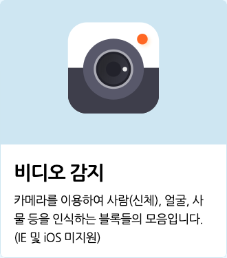
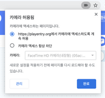

# AI 블록 > 비디오 감지

카메라로 입력되는 이미지(영상)을 통해 얼굴/사람(신체)/사물을 인식하는 블록입니다. 카메라에 여러분 스스로를 비춰보고 얼굴 표정, 몸 동작, 다양한 사물을 인공지능이 어떻게 자동으로 감지하고 인식하는지 경험할 수 있어요!
+ 비디오 감지 블록은 Internet Explorer와 iOS에서는 동작하지 않습니다.
(안정적인 동작을 위해 크롬을 사용해주세요.)
+ 비디오 감지 블록은 카메라 연결이 필요한 블록입니다. 데스크탑의 경우 별도 웹캠을 연결해주세요.
+ 카메라를 연결했는데도 블록이 동작하지 않거나, 영상이 제대로 입력되지 않는 경우 인터넷 브라우저의 설정을 변경해 카메라 사용을 허용해주세요.
(크롬의 경우, 주소 표시줄 오른쪽의 카메라 아이콘을 클릭하거나 '설정 > 개인정보 및 보안 > 사이트 설정 > 카메라' 에서 엔트리 사이트의 카메라 사용을 허용해 주세요.)

  ​                                                      

※ 카메라를 통해 입력되는 영상은 **절대로 서버에 저장되거나 외부로 공유되지 않습니다.**
+ 비디오 감지 블록은 처음 작동할 때 마다 별도의 로딩이 필요합니다. 약 30초에서 1분 가량 로딩하면 블록을 사용할 수 있어요. 로딩 시간은 컴퓨터 사양, 네트워크 상태에 따라 달라질 수 있습니다. 새로 고침하거나 다시 접속하는 경우 로딩은 다시 진행됩니다.
+ 비디오 감지 블록을 반복 블록 안에 넣으면 작품이 많이 느려질 수 있으니 주의해 주세요!

아래는 인공지능 블록에서 선택할 수 있는 **인식 모델**입니다.
+ `사람` : 신체의 각 부위를 인식할 수 있는 모델입니다. 인식할 수 있는 부위는 아래와 같습니다.
  + `얼굴`, `목`, `왼쪽 눈`, `오른쪽 눈`, `왼쪽 귀`, `오른쪽 귀`, `왼쪽 어깨`, `오른쪽 어깨`, `왼쪽 팔꿈치`, `오른쪽 팔꿈치`, `왼쪽 손목`, `오른쪽 손목`, `왼쪽 엉덩이`, `오른쪽 엉덩이`, `왼쪽 무릎`, `오른쪽 무릎`, `왼쪽 발목`, `오른쪽 발목`
+ `얼굴` : 얼굴의 각 부위를 인식할 수 있는 모델입니다. 인식할 수 있는 부위는 아래와 같습니다.
  + `왼쪽 눈`, `오른쪽 눈`, `코`, `왼쪽 입꼬리`, `오른쪽 입꼬리`, `윗 입술`, `아랫 입술`
+ `사물` : 미리 지정된 80개의 사물을 인식할 수 있는 모델입니다. 인식할 수 있는 사물은 아래와 같습니다.
  + `사람`, `자전거`, `자동차`, `오토바이`, `비행기`, `버스`, `기차`, `트럭`, `보트`, `신호등`, `소화전`, `정지 표지판`, `주차 미터기`, `벤치`, `새`, `고양이`, `개`, `말`, `양`, `소`, `코끼리`, `곰`, `얼룩말`, `기린`, `배낭`, `우산`, `핸드백`, `넥타이`, `여행 가방`, `원반`, `스키`, `스노보드`, `공`, `연`, `야구 배트`, `야구 글러브`, `스케이트보드`, `서프보드`, `테니스 라켓`, `병`, `와인잔`, `컵`, `포크`, `나이프`, `숟가락`, `그릇`, `바나나`, `사과`, `샌드위치`, `오렌지`, `브로콜리`, `당근`, `핫도그`, `피자`, `도넛`, `케이크`, `의자`, `소파`, `화분`, `침대`, `식탁`, `변기`, `텔레비전`, `노트북`, `마우스`, `리모컨`, `키보드`, `핸드폰`, `전자레인지`, `오븐`, `토스터`, `싱크대`, `냉장고`, `책`, `시계`, `꽃병`, `가위`, `테디베어`, `헤어드라이어`, `칫솔`

## 1. 비디오 화면 `[보이기]`

카메라가 촬영하는 화면(앞으로 '비디오 화면'이라고 부를게요)을 실행화면에서 보이거나 숨깁니다.

목록 상자()를 클릭하면 보일지 숨길지 고를 수 있어요.

## 2. <비디오가 연결되었는가?>

기기에 카메라가 연결되어 있다면 참으로, 아니라면 거짓으로 판단하는 블록입니다.

## 3. 비디오 화면 `[좌우]` 뒤집기

비디오 화면을 실행 화면에서 좌우(가로) 또는 상하(세로)로 뒤집습니다.

기본 화면은 거울을 보는 것처럼 좌우로 뒤집어져 있어요.

목록 상자()를 클릭하면 뒤집을 방향을 선택할 수 있어요.

## 4. 비디오 투명도 효과를 `(0)` 으로 정하기

비디오 화면의 투명도 효과를 입력한 숫자로 정합니다. 0%~100% 범위에서 조절할 수 있어요.

이 블록을 사용하지 않았을 때 기본 투명도 효과는 50%입니다.

## 5. `[자신]` 에서 감지한 `[움직임]` 값

비디오 화면에서 오브젝트나 실행 화면이 감지한 움직임 정도를 가져오는 값 블록입니다.

목록 상자()를 클릭하면 감지할 대상과 감지할 값을 선택할 수 있어요.
+ **감지할 대상 (첫 번째 목록 상자)**
  + `자신`  : 해당 오브젝트에서 움직임을 감지합니다.  
  + `실행 화면` : 촬영하는 전체 화면에서 움직임을 감지합니다.
+ **감지할 값 (두 번째 목록 상자)**
  + `움직임` : 움직임이 작고 느릴수록 0 에 가깝고, 크고 많을수록 큰 수를 가져옵니다.
  + `방향` : 오른쪽 또는 위쪽으로 움직일수록 양수로 커지고, 왼쪽 또는 아래쪽으로 움직일수록 음수로 커지는 수를 가져옵니다.

## 6. `[사람]` 인식 `[시작하기]`

모델 인식을 시작하거나 중지합니다.

모델을 인식하려면 꼭 이 블록을 통해 인식을 시작해야 해요.

첫 번째 목록 상자()를 클릭하면 인식할 모델을 선택할 수 있고 두 번째 목록 상자()를 클릭하면 인식을 시작할지 중지할지 선택할 수 있어요.

## 7. <`[사람]` 인식이 되었는가?>

모델을 인식했다면 참으로, 아니라면 거짓으로 판단하는 블록입니다.

선택한 모델의 인식을 시작하지 않았다면 항상 거짓으로 판단해요.

목록 상자()를 클릭하면 인식여부를 확인할 모델을 선택할 수 있어요.

## 8. <사물 중 `[사람]` (이)가 인식되었는가?>

선택한 사물을 인식했다면 참으로, 아니라면 거짓으로 판단하는 블록입니다.

목록 상자()를 클릭하면 인식여부를 확인할 사물을 선택할 수 있어요.

## 9. 인식된 `[사람]` 의 수

모델을 인식한 수를 가져오는 값 블록입니다.

목록 상자()를 클릭하면 인식한 수를 가져올 모델을 선택할 수 있어요.

## 10. 인식된 `[사람]` `[보이기]`

인식한 모델을 실행 화면에서 보이거나 숨깁니다.

'보이기'를 선택하면 모델이 인식한 대상을 빨간색 상자와 인식한 이름으로 표시해요.

첫 번째 목록 상자()를 클릭하면 인식할 모델을 선택할 수 있고, 두 번째 목록 상자 ()를 클릭하면 그것을 보일지 숨길지 고를 수 있어요.

## 11. `[1]` 번째 사람의 `[얼굴]` 의 `[x]` 좌표

신체 부위의 x 또는 y 좌표를 가져오는 값 블록입니다.

사람을 인식하지 않을 때는 0 을 가져와요.

목록 상자()를 클릭하면 인식한 해당 순서의 사람과 신체 부위를 선택할 수 있어요.

## 12. `[1]` 번째 얼굴의 `[왼쪽 눈]` 의 `[x]` 좌표

얼굴 부위의 x 또는 y 좌표를 가져오는 값 블록입니다.

얼굴을 인식하지 않을 때는 0 을 가져와요.

목록 상자()를 클릭하면 인식한 해당 순서의 얼굴과 부위를 선택할 수 있어요.

## 13. `[1]` 번째 얼굴의 `[성별]`

얼굴의 특징을 가져오는 값 블록입니다.

얼굴의 특징을 가져오려면 꼭 얼굴 인식을 시작한 상태여야 해요. 얼굴을 인식하지 않을 때는 0 을 가져와요.

목록 상자()를 클릭하면 인식한 해당 순서의 얼굴과 그 얼굴의 성별/나이/감정을 선택할 수 있어요.
