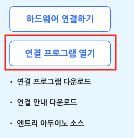
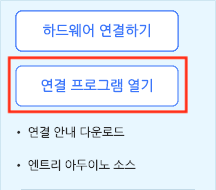

엔트리에 하드웨어를 연결하는 방법은 하드웨어에 따라 다르고, 각 하드웨어마다 사용할 수 있는 블록이 달라요.

이 튜토리얼에서는 하드웨어 연결 프로그램을 설치하는 방법을 알려드릴게요.

## 1) 하드웨어 연결 프로그램 설치

#### ①  온라인 엔트리

하드웨어 블록 꾸러미에는 하드웨어 연결을 위한 다양한 메뉴가 있습니다. 연결에 성공하면 사용할 수 있는 블록이 나타날 거예요.

'연결 프로그램 다운로드' 글씨를 클릭해서 하드웨어 연결에 필요한 (운영체제에 맞는) 프로그램 설치 파일을 다운로드합니다.

+ '연결 안내 다운로드' 글씨를 클릭하면 하드웨어 연결 방법에 대한 자세한 설명 파일을 다운로드할 수 있습니다.
+ '엔트리 아두이노 소스' 글씨를 클릭하면 엔트리로 아두이노에 명령할 수 있도록 아두이노에 업로드하기 위한 ino 형식(확장자)의 파일을 받을 수 있습니다. <!--연결 프로그램에서 펌웨어를 업로드하는 것과 어떤 차이가 있나요?-->

다운로드한 연결 프로그램을 설치했다면, 생성한 실행 아이콘을 더블 클릭하거나 위와 같이 '연결 프로그램 열기' 버튼을 클릭해서 프로그램을 실행해요.

#### ② 오프라인 엔트리

오프라인 엔트리는 하드웨어 연결 프로그램을 기본으로 가지고 있는 덕분에 따로 프로그램을 설치하지 않아요.

바로 '연결 프로그램 열기' 버튼을 클릭하면 하드웨어 연결 창을 열 수 있습니다.

## 2) 하드웨어 찾기

하드웨어 연결 프로그램 창입니다.

연결하려는 하드웨어를 찾아서 클릭하면 연결 화면이 나타나요.

클라우드 PC 연결을 시도한다면 위에 '클라우드 모드' 표시가 나타납니다.

오른쪽 위의 검색창을 통해 원하는 하드웨어의 이름을 검색할 수 있어요.

검색창 아래의 목록 상자에서 카테고리를 선택하면 원하는 하드웨어를 더 쉽게 찾을 수 있습니다.

실행하고자 하는 하드웨어 모양을 클릭하고 관련 펌웨어를 설치하면, 엔트리에서 사용할 수 있는 하드웨어 블록들이 나타납니다.

하드웨어 블록들을 이용하면 우리의 실생활과 더욱 가까운 작품을 만들 수 있겠네요!