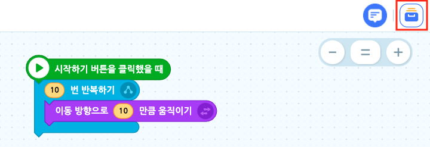
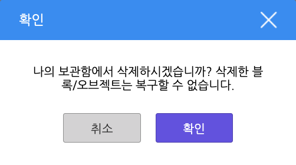
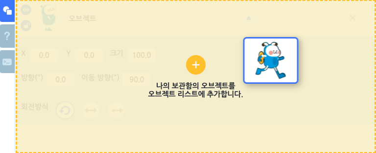

# 나의 보관함

블록이나 오브젝트를 저장해두었다가 언제든지 복사해서 사용하는 편리한 기능입니다.

자주 사용하는 블록이나 블록을 다른 작품으로 옮기고 싶을 때 사용할 수도 있어요!

블록 조립소의 오른쪽 위에 있는 보관함 버튼을 클릭해서 '나의 보관함'을 열 수 있습니다.

+ 이름 상자를 클릭해서 이름을 수정합니다.

  

+ 보관한 블록 또는 오브젝트를 클릭하면 선택할 수 있고, 오른쪽 위의 X 버튼을 클릭하면 삭제할 수 있습니다.

#### ① 블록 추가하기

나의 보관함에 블록을 추가하는 방법은 두 가지가 있어요.

+ 블록 조립소의 블록을 나의 보관함으로 드래그하기

+ 블록 조립소의 블록을 마우스 우클릭한 뒤 '나의 보관함에 추가하기' 클릭

추가한 블록은 블록 조립소에 드래그하면 가져올 수 있어요.

블록에 메모를 추가했다면 나의 보관함에 메모와 함께 추가하고, 추가한 블록을 메모와 함께 가져옵니다.

#### ② 오브젝트 추가하기

나의 보관함에 오브젝트를 추가하는 방법은 두 가지예요.

+ 오브젝트 목록에서 오브젝트를 나의 보관함으로 드래그하기

+ 오브젝트 목록에서 마우스 우클릭한 뒤 '나의 보관함에 추가하기' 클릭

추가한 오브젝트는 오브젝트 목록에 드래그하면 가져올 수 있어요.

오브젝트의 블록 조립소에 블록이 있다면 함께 추가하고, 추가한 오브젝트를 블록과 함께 가져옵니다.
