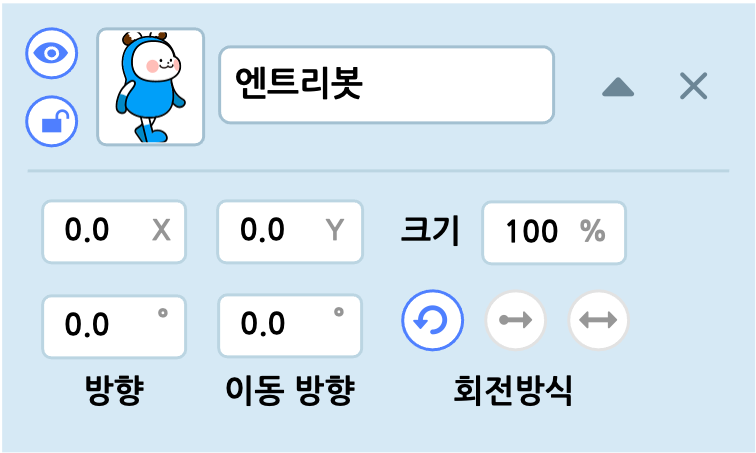

# 오브젝트 목록 탭

선택한 장면에서 오브젝트를 추가하거나 관리하는 영역입니다. 실행 화면 아래에 있습니다.

##  오브젝트 목록

+ 이름 상자를 클릭해서 이름을 수정합니다.
+ 이름 상자 오른쪽의 역삼각형 버튼을 클릭해서 오브젝트의 속성을 관리합니다.
+ 오른쪽의 X 버튼을 클릭해서 삭제합니다.
+ 왼쪽의 눈 아이콘을 클릭해서 오브젝트를 실행 화면에서 나타내거나 숨깁니다.
+ 왼쪽의 자물쇠 아이콘을 클릭해서 오브젝트를 삭제하거나 속성을 수정할 수 없도록 잠급니다. (배경 오브젝트는 추가할 때 기본으로 잠겨 있습니다.)
+ 왼쪽의 썸네일 또는 각 오브젝트 목록의 빈 공간을 드래그해서 오브젝트의 순서를 바꿉니다.

## 오브젝트 속성

역삼각형 버튼을 클릭하면 나타나는 오브젝트의 속성입니다.

+ **X (좌표)** : 오브젝트 중심점의 가로(축) 위치입니다. 가운데는 0 이고, 오른쪽으로 갈수록 양수(+)로 커지고, 왼쪽으로 갈수록 음수(-)로 커져요.

+ **Y (좌표)** : 오브젝트 중심점의 세로(축) 위치입니다. 가운데는 0 이고, 위로 갈수록 양수(+)로 커지고, 아래로 갈수록 음수(-)로 커져요.

+ **크기** : 오브젝트의 크기입니다. 일반 오브젝트의 기본 크기는 100 이고, 배경 오브젝트의 기본 크기는 375이며 1 보다 작아질 수 없어요.

+ **방향(º)** : 오브젝트가 기울어진 정도를 의미합니다. 0º~360º 범위에서 조절할 수 있어요. 이동 방향은 방향을 기준으로 하기에 방향이 바뀌면 이동 방향이 바뀌는 것 처럼 느껴질 수 있지만, 실제로 이동방향은 변하지 않습니다.

  

+ **이동 방향(º)** : 오브젝트의 방향에 대해 상대적인 진행 방향을 의미합니다. 0º~360º 범위에서 조절할 수 있어요.

  

## 오브젝트 회전 방식

오브젝트의 회전 방식은 세 가지입니다.

+ **모든 방향**  : 오브젝트의 방향(기울기)을 자유롭게 변경할 수 있습니다.

  

+ **좌우 방향**  : 오브젝트가 이동방향에 맞춰 좌우로 바뀝니다.  

  + 이동방향이 0º 보다 크거나 같고 180º 보다 작다면 오브젝트의 좌우가 바뀌지 않습니다.                                                                                                                
  + 이동방향이 180º 보다 크거나 같고 360º(0º) 보다 작은 범위에서, 오브젝트는 좌우가 바뀌어 동작합니다.

  

+ **회전 없음**  : 오브젝트가 이동 방향과 상관 없이 원래의 방향(기울기)를 유지합니다. 회전 방식이 회전 없음일 때에는 방향(기울기)을 바꾸는 움직임 블록을 사용해도 방향(기울기)에 영향을 주지 않습니다.

  

## 오브젝트 내보내기

오브젝트를 마우스 우클릭하면 나타나는 복제, 삭제, 복사하기, 붙여넣기, 나의 보관함에 추가하기, 오브젝트 내보내기 등을 선택할 수 있습니다.

'오브젝트 내보내기'를 클릭하면 해당 오브젝트를 eo 형식(확장자)의 파일로 저장합니다.

이 파일은 '오브젝트 추가하기' 팝업 창의 '파일 올리기' 탭에서 다시 올릴 수 있어요.

# 도움말 탭

도움말 탭은 블록 꾸러미나 블록 조립소에 있는 블록을 선택하면 해당 블록의 설명이 나타나는 영역입니다.

작품 만들기 화면의 위(헤더)에 있는 도움말 목록을 클릭해서 이 탭을 열 수도 있어요.

블록을 어떻게 사용해야 할지 감이 잘 안 온다면, 그냥 다 클릭해봐요!

# 엔트리 콘솔 탭

엔트리파이선 모드에서 명령어를 입력하는 데 사용하는 영역입니다. 

블록 코딩 모드에서는 대답 창 대신 대답을 입력하는데 사용할 수도 있어요.

# 하드웨어 상세 탭

엔트리에 연결한 하드웨어의 상세 정보를 확인하는 영역입니다.

작품을 실행하지 않아도 하드웨어의 입력/출력 값을 실시간으로 확인할 수 있어요.

+ 연결한 하드웨어의 이미지가 나타납니다.
+ 청록색으로 표시하는 숫자는 입력 값입니다.
+ 보라색으로 표시하는 숫자는 출력 값입니다.
