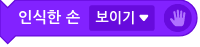

카메라로 입력되는 이미지(영상)을 통해 사람의 손을 인식하는 블록입니다.  
인공지능이 손 각 부위의 위치나, 제스처 등을 인식하는 것을 간단히 경험해 볼 수 있어요!
+ 이 블록은 카메라 연결이 꼭 필요한 블록입니다. 데스크탑의 경우 별도 웹캠을 연결해 주세요.  
※ 카메라를 통해 입력되는 영상은 **절대로 서버에 저장되거나 외부로 공유되지 않습니다.**
+ 이 블록은 인터넷 익스플로러 브라우저와 iOS 운영 체제에서는 동작하지 않습니다.
인터넷 브라우저의 경우, 안정적인 동작을 위해 구글 크롬 또는 네이버 웨일 브라우저의 사용을 권장합니다.
+ 카메라를 연결했는데도 블록이 동작하지 않거나, 영상이 제대로 입력되지 않는 경우 인터넷 브라우저의 설정을 변경해 카메라 사용을 허용해주세요.  
(크롬 브라우저의 경우, 주소 표시줄 오른쪽의 카메라 아이콘을 클릭하거나 '설정 > 개인정보 및 보안 > 사이트 설정 > 카메라' 에서 엔트리 사이트의 카메라 사용을 허용해 주세요.)  
  

손 인식 블록이 인식할 수 있는 부위는 아래와 같습니다.
  + `엄지`, 
    + `끝`, `첫째 마디`
  + `검지`, 
    + `끝`, `첫째 마디`, `둘째 마디`
  + `중지`, 
    + `끝`, `첫째 마디`, `둘째 마디`
  + `약지`, 
    + `끝`, `첫째 마디`, `둘째 마디`
  + `소지`, 
    + `끝`, `첫째 마디`, `둘째 마디`
  + `손목`

## 1. 비디오 화면 `[보이기]`

카메라가 촬영하는 화면(앞으로 '비디오 화면'이라고 부를게요)을 실행 화면에서 보이거나 숨깁니다.

목록 상자()를 클릭하면 보일지 숨길지 고를 수 있어요.

## 2. `[1번]` 카메라로 바꾸기

비디오 화면을 촬영할 카메라를 선택한 카메라로 바꿉니다.

목록 상자()를 클릭하면 기기에 연결된 카메라 목록이 표시되고, 이 중에서 하나를 선택할 수 있어요.

## 3. <카메라가 연결되었는가?>

기기에 카메라가 연결되어 있다면 참으로, 아니라면 거짓으로 판단하는 블록입니다.

## 4. 비디오 화면 `[좌우]` 뒤집기

비디오 화면을 실행 화면에서 좌우(가로) 또는 상하(세로)로 뒤집습니다.

기본 화면은 거울을 보는 것처럼 좌우로 뒤집어져 있어요.

목록 상자()를 클릭하면 뒤집을 방향을 선택할 수 있어요.

## 5. 비디오 투명도 효과를 `(0)` 으로 정하기

비디오 화면의 투명도 효과를 입력한 숫자로 정합니다. 0%~100% 범위에서 조절할 수 있어요.

이 블록을 사용하지 않았을 때 기본 투명도 효과는 50%입니다.

## 6. (`[자신]` 에서 감지한 `[움직임]` 값)

비디오 화면에서 오브젝트나 실행 화면이 감지한 움직임 정도를 가져오는 값 블록입니다.

목록 상자()를 클릭하면 감지할 대상과 감지할 값을 선택할 수 있어요.
+ **감지할 대상 (첫 번째 목록 상자)**
  + `자신`  : 해당 오브젝트에서 움직임을 감지합니다.  
  + `실행 화면` : 촬영하는 전체 화면에서 움직임을 감지합니다.
+ **감지할 값 (두 번째 목록 상자)**
  + `움직임` : 움직임이 작고 느릴수록 0 에 가깝고, 크고 많을수록 큰 수를 가져옵니다.
  + `방향` : 오른쪽 또는 위쪽으로 움직일수록 양수로 커지고, 왼쪽 또는 아래쪽으로 움직일수록 음수로 커지는 수를 가져옵니다.

## 7. 손을 인식했을 때

손을 인식했을 때 아래의 블록이 동작합니다.

한 번 인식을 시작하고 연속적으로 인식이 유지되면 다시 동작하지 않지만, 손이 새롭게 인식되는 순간 다시 블록이 동작합니다.

손 인식을 시작하지 않았다면 블록이 동작하지 않아요.

## 8. 손 인식 `[시작하기]`

손 인식을 시작하거나 중지합니다.

손을 인식하려면 꼭 이 블록을 통해 인식을 시작해야 해요.

목록 상자()를 클릭하면 인식을 시작할지 중지할지 선택할 수 있어요.

## 9. 인식한 손 `[보이기]`

인식한 손을 실행 화면에서 보이거나 숨깁니다.

'보이기'를 선택하면 인식한 손을 점과 그 사이를 잇는 선의 형태로 표시해요.

목록 상자 ()를 클릭하면 인식한 형태를 보일지 숨길지 고를 수 있어요.

## 10. <손을 인식했는가?>

손을 인식했다면 참으로, 아니라면 거짓으로 판단하는 블록입니다.

손 인식을 시작하지 않았다면 항상 거짓으로 판단해요.

## 11. (인식한 손의 수)

인식한 손이 몇 개인지를 가져오는 값 블록입니다.

최대 2개의 손을 인식할 수 있습니다.

## 12. `[1]` 번째 손의 `[엄지]` `[끝]` (으)로 이동하기

이 오브젝트가 손의 선택한 부위로 이동합니다.

목록 상자()를 클릭하면 인식한 순서의 손과 부위를 선택할 수 있어요.

## 13. `(2)` 초 동안 `[1]` 번째 손의 `[엄지]` `[끝]` (으)로 이동하기

입력한 시간()동안 이 오브젝트가 손의 선택한 부위로 이동합니다.

목록 상자()를 클릭하면 인식한 순서의 손과 부위를 선택할 수 있어요.

## 14. (`[1]` 번째 손의 `[엄지]` `[끝]` 의 `[x]` 좌표)

손 부위의 x 또는 y 좌표를 가져오는 값 블록입니다.

손을 인식하지 않을 때는 0 을 가져와요.

목록 상자()를 클릭하면 인식한 순서의 손과 부위를 선택할 수 있어요.

## 15. <`[1]` 번째 손이 `[오른손]` 인가?>

인식한 손과 선택한 오른손/왼손이 같다면 참으로, 아니라면 거짓으로 판단하는 블록입니다.

## 16. (`[1]` 번째 손)

인식한 손이 오른손인지 왼손인지 가져오는 값 블록입니다.

## 17. <`[1]` 번째 손의 모양이 `[쥔 손]` 인가?>

인식한 손의 모양과 선택한 손의 모양이 같다면 참으로, 아니라면 거짓으로 판단하는 블록입니다.

+ **선택할 수 손의 모양**

  + `쥔 손`, `편 손`, `가리킨 손`, `엄지 아래로`, `엄지 위로`, `브이 사인`, `사랑해`

## 18. (`[1]` 번째 손의 모양)

인식한 손의 모양을 가져오는 값 블록입니다.

손 인식 블록이 인식할 수 없는 손의 모양인 경우 '알 수 없음'을 가져옵니다.