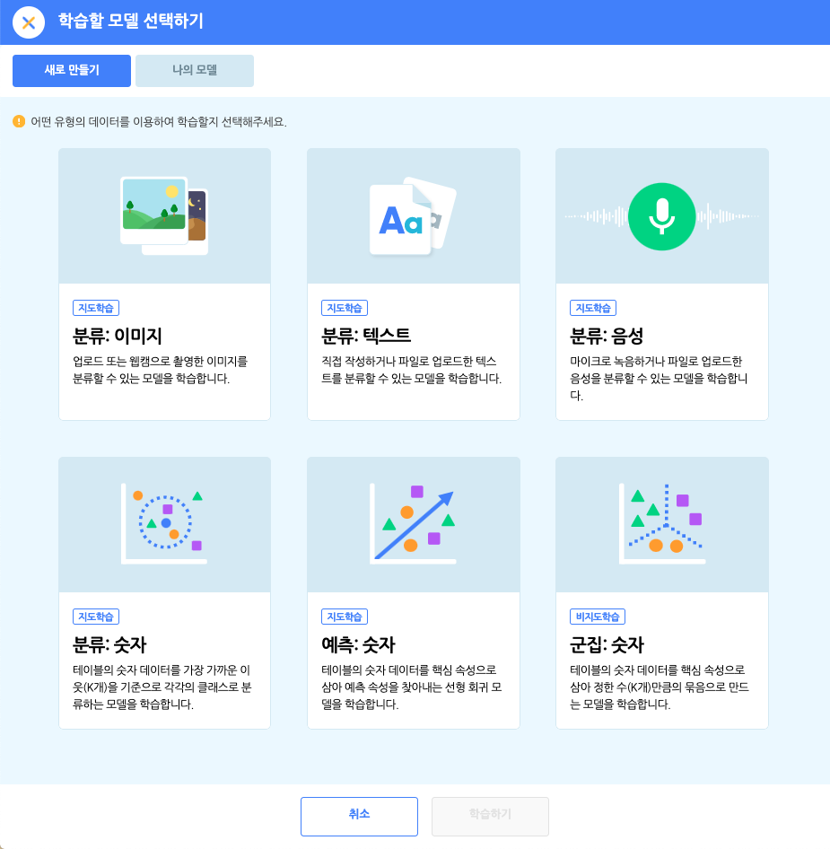
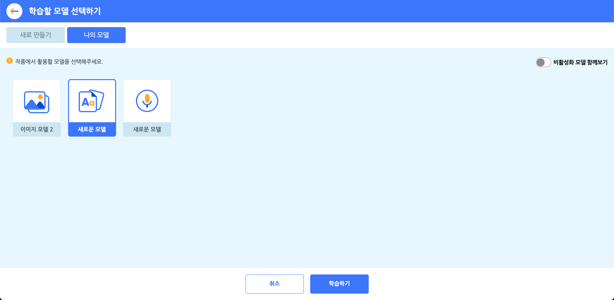
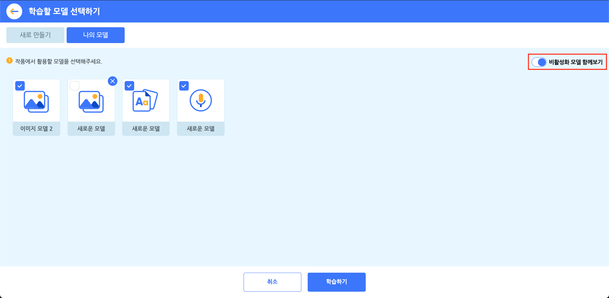

AI 활용 블록을 사용해 봤다면, 이제 직접 인공지능 모델을 한 번 만들어볼까요?
엔트리에서는 **이미지/음성/텍스트를 각각의 클래스로 분류할 수 있는 모델**, **숫자를 분류/예측하거나 군집으로 만드는 모델** 등을 학습할 수 있어요. 엔트리에서 학습한 모델은 블록으로 조립해 작품에서도 활용할 수 있어요. 

모델을 학습하고 나면 사용자가 학습하지 않은 새로운 데이터를 입력해도, 모델이 스스로 새로운 데이터를 학습한 모델에 넣어 나오는 결과값을 알려준답니다.

+ 모델 학습하기는 크롬 사용을 권장합니다. 다른 브라우저에는 동작하지 않거나, 모델 학습 속도가 (상상 이상으로) 느릴 수 있습니다.
+ 모델은 최대 10개까지 학습시킬 수 있습니다. 학습한 모델이 10개를 초과하면 1개 이상의 모델을 비활성화해야 새로운 모델을 학습시킬 수 있습니다.
+ 비활성화된 모델은 기존 작품에서 더 이상 동작하지 않고, 다시 활성화하기 전에는 사용할 수 없습니다. 모델을 비활성화 할 때는 이미 공유한 작품에 해당 모델이 추가되지 않았는지 꼭 확인해 주세요.
+ 학습한 모델을 추가한 작품에서 코드 보기를 누르거나 작품을 사본으로 저장해도 모델은 확인할 수 없습니다. 학습한 모델은 모델을 만든 사용자만 확인할 수 있습니다.
+ 이미 학습이 완료된 학습 데이터는 서버 환경에 따라 비정기적으로 삭제될 수 있습니다. 학습 데이터가 삭제되더라도 학습한 모델 자체는 유지됩니다.
+ 모델 학습에 사용하는 학습 데이터는 서버에 저장됩니다. 저작권에 문제가 없고 개인정보가 아닌 데이터만 입력해 주세요. 이를 지키지 않아 발생하는 문제는 모두 사용자의 책임입니다.

## 학습할 모델 선택하기 > 새로 만들기 

인공지능 블록 카테고리의 블록 꾸러미에 있는 '인공지능 모델 학습하기' 버튼을 클릭하면 나타나는 팝업 창입니다. (새 탭에서 열립니다.)

학습할 데이터의 유형을 선택하고 모델 학습을 완료하면 해당 유형의 블록을 블록 꾸러미에 추가해요.

아래는 학습할 수 있는 데이터의 유형입니다.
+ **분류: 이미지** 
  업로드 또는 웹캠으로 촬영한 이미지를 분류할 수 있는 모델을 학습합니다.
+ **분류: 텍스트**
  직접 작성하거나 파일로 업로드한 텍스트를 분류할 수 있는 모델을 학습합니다.
+ **분류: 음성**
  마이크로 녹음하거나 파일로 업로드한 음성을 분류할 수 있는 모델을 학습합니다.
+ **분류: 숫자**
  테이블의 숫자 데이터를 가장 가까운 이웃(K개)을 기준으로 각각의 클래스로 분류하는 모델을 학습합니다.
+ **예측: 숫자**
  테이블의 숫자 데이터를 핵심 속성으로 삼아 예측 속성을 찾아내는 선형 회귀 모델을 학습합니다.
+ **군집: 숫자**
  테이블의 숫자 데이터를 핵심 속성으로 삼아 정한 수(K개)만큼의 묶음으로 만드는 모델을 학습합니다.

## 학습할 모델 선택하기 > 나의 모델 

'나의 모델' 탭에서는 이미 학습한 모델을 다시 학습하거나 바로 추가할 수 있습니다. 하나의 작품에서 하나의 모델만 선택할 수 있어요.

오른쪽의 '비활성화 모델 함께보기' 토글 버튼을 클릭하면 학습한 모델을 활성화/비활성화할 수 있습니다.

비활성화한 각 모델은 오른쪽 위의 [X] 버튼을 눌러 모델과 학습 데이터를 삭제할 수 있어요. 해당 모델을 적용해 만든 작품은 정상적으로 동작하지 않게 됩니다.

모델을 비활성화하고 삭제할 때는 이미 공유한 작품에 적용되어 있지는 않은지 꼭 확인해주세요.
