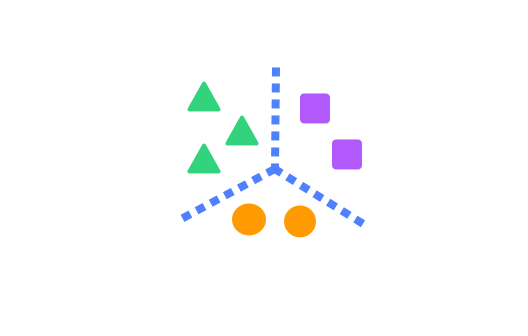
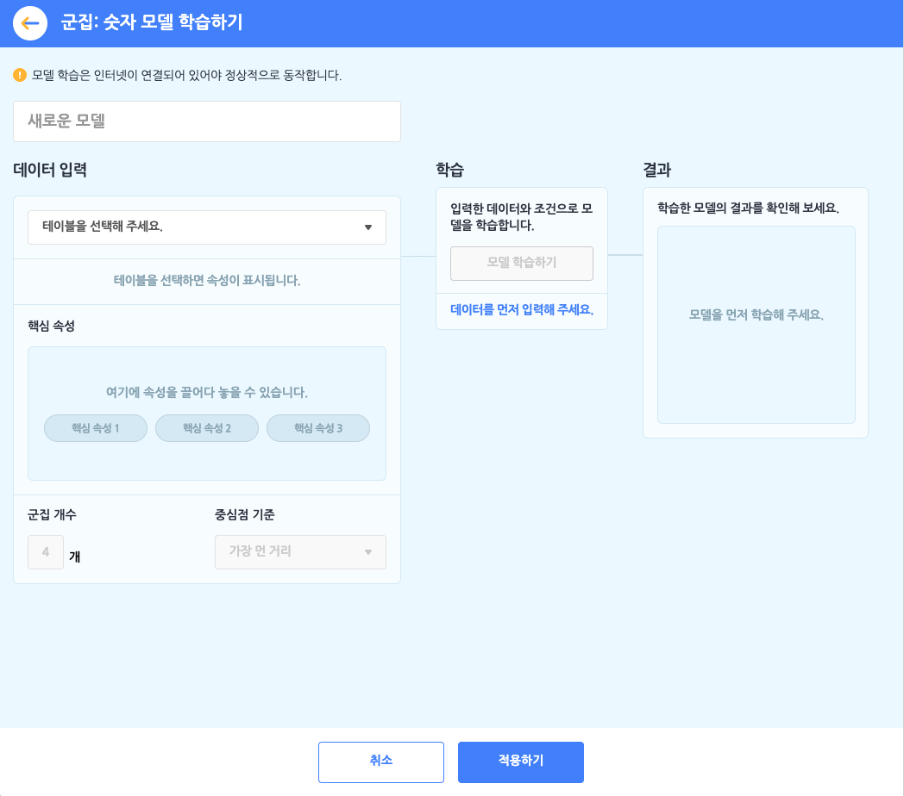
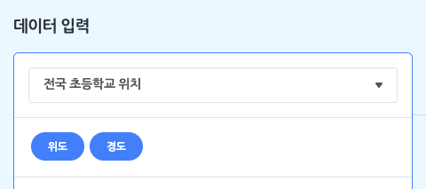
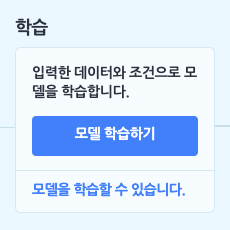
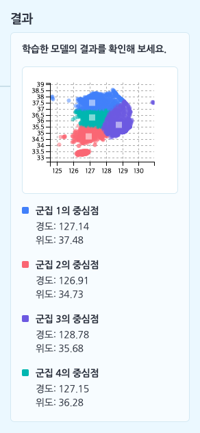

모델이 학습할 숫자를 테이블로 업로드하거나 직접 작성해 데이터로 입력하고, 입력한 데이터를 **설정한 개수(K개)의 묶음으로 군집화**하는 모델을 학습합니다.

이 때, 군집 모델의 특징은 **비지도학습**이라는 점인데요. 비지도학습은 어떻게 학습해야 하는지(결과)를 알려주지 않아도 모델을 학습할 수 있답니다. 

+ 분류 모델에서는 "클래스 속성"을, 예측 모델에서는 "예측 속성"을 설정해야 했지만, 군집 모델은 그런 '결과'를 설정하지 않고, '원인'만 설정해도 됩니다.

+ 군집: 숫자 모델을 학습하려먼 **먼저 데이터로 삼을 테이블을 추가해야 합니다**. 학습하기 전에 데이터 분석 카테고리에서 [테이블 불러오기]를 통해, 기본 테이블, 파일 업로드, 새로 만들기의 방법으로 테이블을 추가 해주세요.

군집: 숫자 모델을 선택하면 아래와 같이 모델 학습하기 창이 나타납니다.

먼저 모델의 이름부터 지어볼까요? 이름 상자를 클릭해서 모델의 이름을 정합니다.

####  ① 데이터 입력하기 = 테이블 선택하기

군집: 숫자 모델 학습의 첫 단계는 데이터 입력 박스에서 모델의 데이터로 삼을 테이블을 선택하는 것이에요. 모델을 학습하기 전에, '데이터 분석 블록' 카테고리에서 테이블을 추가하는 것을 잊지 마세요!

목록 상자를 눌러 작품에 추가한 테이블 중에서 모델 학습에서 사용할 테이블을 선택하면, 바로 아래에 테이블의 속성이 표시됩니다. 여기서 표시되는 속성은 (1행을 제외한) 모든 행이 숫자로 이루어진 속성입니다. (숫자 데이터를 학습하는 모델이니 당연하겠죠?)

+ **핵심 속성**: 핵심 속성은 속성 중에서 '원인'에 해당하는 속성을 말합니다. 조금 어렵게 말하면 '독립 변수' 또는 '설명 변수'를 의미합니다. 
  모델이 학습할 때 어떤 속성을 원인으로 삼을 것인지를 선택하는 부분이에요. 엔트리에서는 최대 3개까지 핵심 속성을 설정할 수 있습니다. 군집 모델에서는 핵심 속성만으로 모델을 학습합니다. 
+ **군집 개수**: 군집 모델의 종류는 여러가지가 있지만, 엔트리에서 사용하는 알고리즘은 'K-평균 알고리즘'이에요. 이 때, K는 몇 개의 군집으로 묶을 것인지를 의미합니다. 군집 개수를 4로 정한다면, 입력한 데이터를 4개의 묶음으로 묶겠다는 뜻이에요.
+ **중심점 기준**: 모델을 학습할 때, 군집의 최초 중심점의 기준을 어떻게 설정할 지, 선택하는 부분입니다. 중심점은 학습이 진행되면서 더 적절한 위치로 계속해서 이동하는데요. 그래도 맨 처음에 어디에 둘지는 먼저 결정해야겠죠? 
  엔트리에서는 '무작위'와 '가장 먼 거리'로 두 가지 선택지가 있어요. 
  + '무작위'는 말 그래도 아무 곳에나 두는 것이고, '가장 먼 거리'는 군집의 중심점이 서로 가장 먼 곳에 두도록 설정하는 것입니다.
  + 사실 학습을 충분히 한다면 처음에 정하는 중심점 기준은 큰 의미가 없어요. 
    가장 적절한 위치를 찾아가는데 걸리는 시간(몇 번만에 찾아가는지)만 달라질 뿐입니다. (물론 시행 회수(epoch)가 충분하다는 전제가 필요합니다!)

#### ② 학습하기

이렇게 핵심 속성, 군집 개수, 중심점 기준을 설정하고 나면, 학습 박스의 [모델 학습하기] 버튼을 클릭할 수 있게 됩니다. 

+ 군집: 숫자 모델은 학습 박스에서 별도의 학습 조건을 설정할 수 없어요.

#### ③ 결과 확인하기

모델 학습이 모두 완료되었다면, 결과 박스에서 학습 결과를 확인할 수 있습니다.
군집 모델의 결과는 학습 데이터를 설정한 군집 개수에 맞춰, 각각의 군집으로 구분되어 표현됩니다. (차트에서 점의 색깔이 서로 다르죠?)

또한 각 군집의 중심점 좌표가 구해집니다. 새로운 데이터는 이 중심점 좌표 중 가장 가까운 좌표의 군집에 속하는 것으로 보면 되겠죠? 핵심 속성의 개수만큼 중심점을 나타내는 차원이 증가합니다.

핵심 속성을 2개로 설정했다면 위와 같이 2차원 좌표 평면에서 군집을 색으로 구분한 점 차트와 각 중심점의 위치를 확인할 수 있습니다.

핵심 속성을 3개 이상 설정했다면 2차원에서 표현할 수 없기 때문에 차트는 표시되지 않습니다.

## 1. 모델 다시 학습하기

모델을 다시 학습합니다. 

모델 설정을 변경하거나 입력 데이터가 되는 테이블의 내용을 수정했다면, 변경된 내용을 바탕으로 모델을 다시 학습합니다.

## 2. <모델이 학습되었는가?>

모델의 학습 상태를 가져오는 판단 블록입니다.

모델이 학습되었다면 '참'을, 학습 중이거나 학습되지 않았다면 '거짓'으로 판단합니다.

## 3. 모델 `[보이기]`

모델의 학습 상태를 표시하는 창을 실행 화면에 보이게 하거나 숨깁니다.

목록 상자()를 클릭해서 보이기/숨기기를 선택할 수 있어요.

## 4. 모델 차트 창 `[열기]`

모델을 학습할 때 입력한 데이터와 모델이 분류한 클래스를 2차원 좌표평면에 나타낸 차트 창을 열거나 닫습니다.

핵심 속성이 3개 이상인 경우 모델의 차트를 2차원 좌표평면 위에 그릴 수 없기 때문에, 이 블록은 표시되지 않습니다. 

목록 상자()를 클릭해서 열기/닫기를 선택할 수 있어요.

## 5. 군집을 `(10)` 개로 바꾸기

군집 개수를 입력한 값으로 바꾸어 설정합니다. 

변경한 군집 개수는 '모델 다시 학습하기' 블록으로 모델을 다시 학습할 때부터 적용됩니다.

## 6. 중심점 기준을 `[가장 먼 거리]` 로 바꾸기

군집의 최초 중심점 기준을 선택한 기준으로 바꾸어 설정합니다. 

변경한 중심점 기준은 '모델 다시 학습하기' 블록으로 모델을 다시 학습할 때부터 적용됩니다.

목록 상자()를 클릭해서 가장 먼 거리/무작위를 선택할 수 있어요.

## 7. 핵심 속성1 `(10)` 핵심 속성2 `(10)` 의 분류 결과

모델의 군집 개수를 가져오는 값 블록입니다.

## 8. 군집 `(1)` 중심점의 `[핵심 속성1]` 값

입력한 군집의 중심점에 대한 핵심 속성의 값을 가져오는 값 블록입니다. 

목록 상자()를 클릭해서 모델을 학습할 때 설정한 속성 중 하나를 선택할 수 있습니다.

## 9. 핵심 속성1 `(10)` 핵심 속성2 `(10)` 의 군집

핵심 속성의 값을 입력해 모델이 묶은 군집 중 어디에 속하는 지를 가져오는 값 블록입니다.

값은 숫자(군집 이름)로 표현됩니다. 