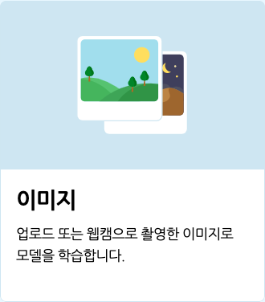
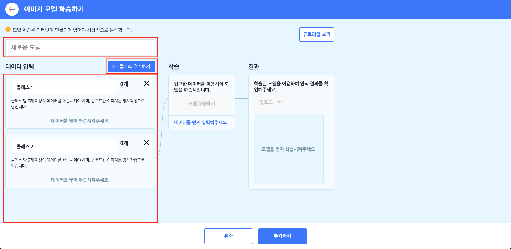
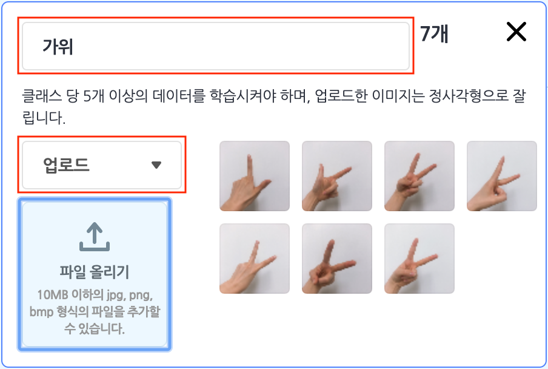
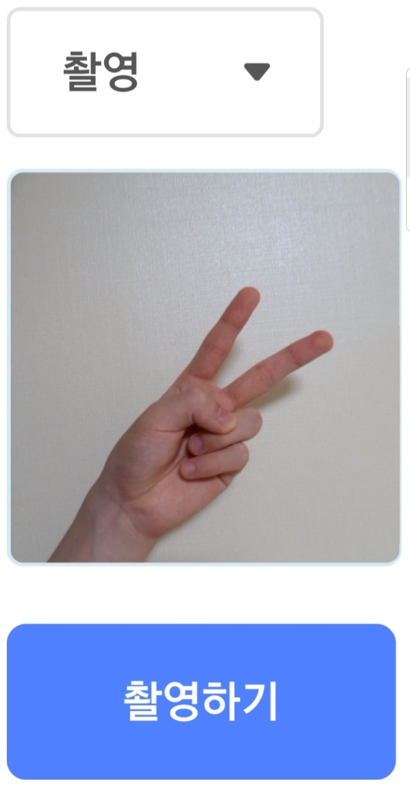
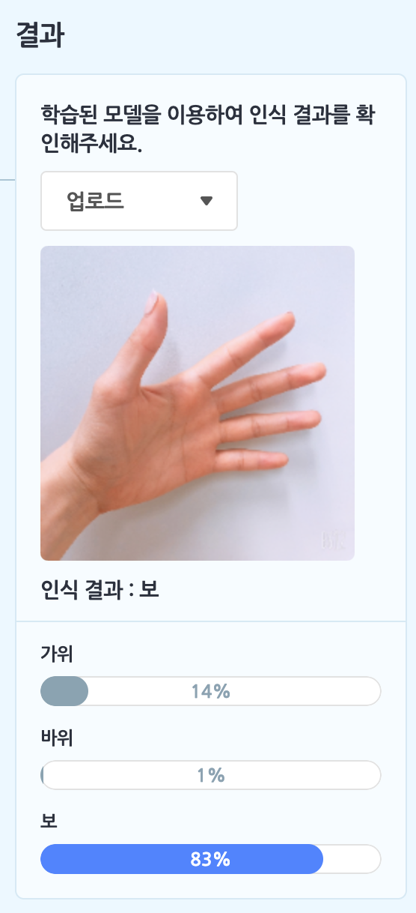
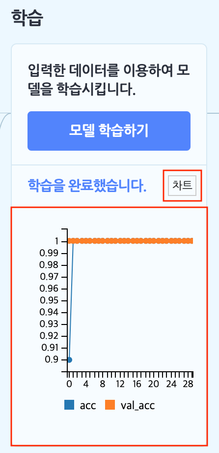
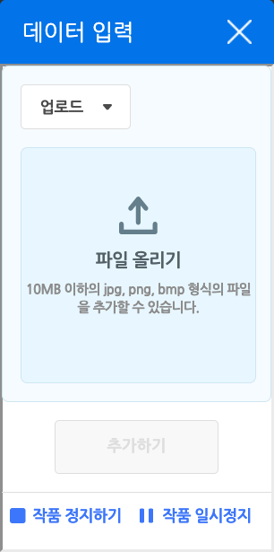

모델이 학습할 이미지를 업로드하거나 직접 촬영해서 데이터로 입력하고, 입력한 데이터를 직접 분류해서 학습시키면 나만의 인공지능 모델이 만들어집니다.
+ 이미지 모델의 '촬영' 모드는 카메라 사용이 가능한 브라우저에서만 사용할 수 있습니다. 인터넷 익스플로러에서는 카메라 사용이 불가능해 해당 모드를 사용할 수 없습니다.

이미지 모델을 선택하면 아래와 같이 이미지 모델 학습하기 창이 나타납니다.

먼저 모델의 이름부터 지어볼까요? 이름 상자를 클릭해서 모델의 이름을 정합니다.

####  ① 클래스 만들기

모델 학습의 첫 단계는 데이터 입력 영역을 **클래스**로 채우는 것이에요. 클래스는 학습할 데이터의 묶음이고, 데이터를 분류하는 기준입니다. '클래스 추가하기' 버튼을 클릭하면 클래스를 필요한 만큼 추가할 수 있어요.

각 클래스를 선택하면 자세한 정보와 함께 이미지를 입력할 수 있어요. 이름 상자를 클릭하면 클래스의 이름을 정할 수 있습니다. 학습 모델이 알려주는 결과 값으로 클래스 이름을 사용하니까 클래스 이름을 알아보기 쉽게 정해주는 것이 중요해요.

다음으로는 왼쪽의 목록 상자를 클릭하면 이미지를 어떻게 입력할 것인지 선택할 수 있어요.
+ **업로드** : 이미지 파일을 올립니다. 파일은 10MB 이하여야 하고, jpg, png, bmp 형식(확장자)를 지원해요.
+ **촬영** : 기기와 연결한 카메라로 사진을 촬영합니다. 가운데 상자에서 촬영하는 화면을 볼 수 있고, '촬영하기' 버튼을 눌러 사진을 촬영할 수 있어요.
배경이 너무 화려하면, 모델 학습에 영향을 줄 수 있으므로 가능하면 흰 배경에서 촬영한 이미지를 올려주세요.

이 때 각 클래스를 충분히 학습을 할 수 있도록 최소 5 개 이상의 이미지를 입력해야 합니다. 입력한 이미지는 정사각형으로 잘라서 반영해요. 입력한 각 이미지는 마우스 포인터를 대거나 터치하면 나타나는 X 버튼을 눌러서 삭제할 수 있습니다.

#### ② 학습 조건 설정하기

이렇게 2개 이상의 클래스를 만들고 나면, 학습 영역의 '모델 학습하기' 버튼을 클릭할 수 있습니다. 이 버튼을 눌러 학습을 바로 완료할 수도 있지만, '모델을 학습시킬 수 있습니다.' 글씨를 클릭해서 다양한 **학습 조건**을 설정할 수 있어요.

+ **세대(Epoch)** : 입력한 데이터를 모두 몇 번씩 학습할 것인지 정하는 부분입니다. 모든 데이터를 1 번씩 학습하는 것을 1 세대라고 불러요. (1 **에포크**라고도 불러요.)
같은 데이터라고 해도 여러 번 학습할 수록 모델은 똑똑해집니다.
+ **배치 크기(Batch Size)** : 몇 개의 데이터를 학습하고 모델에 반영할지 정하는 부분입니다.
모든 데이터를 학습하지 않고도 중간중간 지금까지 학습한 데이터를 모델에 반영하는데요. 그것을그것을 몇 개를 기준으로 할지 정한다고 생각하면 돼요.
다만 배치 크기가 너무 크면 학습한 데이터를 모델에 반영하기 전까지 데이터를 많이 입력해야 하고, 너무 작으면 학습한 데이터를 모델에 바로 반영해 정확성은 높아질 수 있지만, 시간이 오래 걸리고 부정확한 데이터가 있을 경우 편향적인 모델이 만들어질 수 있습니다. 따라서, 적당한 배치 크기를 찾는 것이 중요해요.
+ **학습률(Learning Rate)** : 학습한 내용을 모델에 반영할 때, 학습에서 예상되는 에러를 얼마나 고려할 것인지 정하는 부분입니다. 쉽게 말해서, 얼마나 세밀하게 학습할 것인지를 정하는 비율이에요.
학습률이 낮을수록 더 세밀하게 학습하기 때문에 속도가 느립니다. 학습률은 조금만 변경해도 결과에 큰 영향을 주는 부분이니 조심해서 설정해야 해요.
+ **검증 데이터 비율(Validation Rate)** : 입력한 데이터 중 어느정도 비율을 학습한 모델을 검증하는 데에 사용할지 정하는 부분입니다.
검증 데이터 비율을 0.25로 정했다면 4개의 데이터를 입력했을 때 3개는 학습용으로, 1개는 검증용으로 사용하겠다는 뜻이 돼요.

#### ③ 학습 결과 확인하기

학습 조건을 모두 설정했다면 '모델 학습하기' 버튼을 클릭해서 학습을 완료하고, 결과 영역에서 결과를 확인할 수 있습니다.

클래스에 이미지를 입력한 것처럼, 이미지를 업로드해서 학습 모델이 이미지를 제대로 학습했는지 확인할 수 있어요.

각 클래스에 얼마나 가까운지 막대 그래프로 비교해보세요!

이렇게 학습을 완료했다면, 학습 영역에서 '차트' 버튼을 클릭하면 학습의 과정을 그래프로 확인할 수 있어요.

가로축은 세대(Epoch)를 나타냅니다. 세로축에서 **acc**는 훈련 정확도를 의미하고, **val_acc**는 검증 정확도를 나타냅니다. 정확도가 1에 가까울수록 더 정확한 인식 결과를 얻을 수 있어요.

## 1. 학습한 모델로 인식하기

데이터 입력 팝업 창을 열고, 입력한 이미지를 학습한 모델로 인식합니다.

동시에 작품을 일시 정지해요. 오른쪽 아래 버튼을 클릭해서 창을 닫지 않고도 작품을 다시 시작할 수 있습니다.

오른쪽 위의 X 버튼을 클릭하면, 데이터를 입력하지 않고 창을 닫을 수도 있어요.

## 2. 인식 결과

입력한 데이터를 학습한 모델로 분류한 결과를 가져오는 값 블록입니다.

입력한 데이터와 가장 유사한 클래스의 이름을 가져와요. 만일 데이터를 입력하지 않았다면 아무 것도 가져오지 않아요.

## 3. `[클래스]` 의 신뢰도

입력한 데이터가 분류된 클래스에 대한 정확도(또는 신뢰도라고도 할 수 있어요)를 가져오는 값 블록입니다.

만일 데이터를 입력하지 않았다면 0 을 가져와요.

목록 상자()를 클릭하면 정확도를 가져올 클래스를 선택할 수 있어요.

## 4. <인식 결과가 `[클래스]` 인가?>

입력한 데이터가 선택한 클래스와 가장 닮았다면 참, 아니라면 거짓으로 판단하는 블록입니다.

만일 데이터를 입력하지 않았다면 항상 거짓을 가져와요.

목록 상자()를 클릭하면 결과를 확인할 클래스를 선택할 수 있어요.
