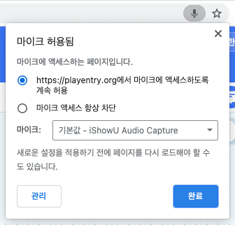
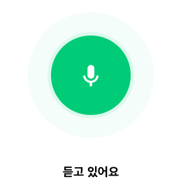
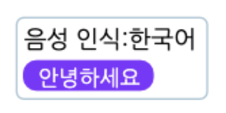

네이버가 개발한 인공지능 음성 인식 엔진 '클로바 스피치'를 활용해서, 마이크로 입력되는 음성을 인식해 문자로 바꿔 주는 블록의 모음입니다.
+ 음성 인식 블록은 인터넷 익스플로러, 사파리에서는 동작하지 않습니다.
(안정적인 동작을 위해 크롬을 사용해주세요.)
+ 음성 인식 블록은 마이크 연결이 필요한 블록입니다. 데스크탑의 경우 마이크(혹은 마이크가 포함된 이어폰)을 연결해주세요.
+ 마이크를 연결했는데 블록이 동작하지 않거나, 음성이 제대로 입력되지 않는 경우 브라우저 설정을 변경해주세요.
(크롬의 경우, 주소 표시줄 오른쪽의 카메라 아이콘을 클릭하거나 '설정 > 개인정보 및 보안 > 사이트 설정 > 마이크' 에서 엔트리 사이트의 마이크 사용을 허용해 주세요.)

    

※ 마이크를 통해 입력되는 소리는 **절대로 서버에 저장되거나 외부로 공유되지 않습니다.**

## 1. <마이크가 연결되었는가?>

기기에 마이크가 연결되어 있다면 참으로, 아니라면 거짓으로 판단하는 블록입니다.

## 2. (마이크 소리 크기)

마이크로 입력된 소리의 크기를 가져오는 값 블록입니다.

## 3. `[한국어]` 음성 인식하기

선택한 언어로 음성 인식을 시작합니다.

블록이 동작하면 실행 화면에 아래와 같이 음성 인식 애니메이션이 나타납니다.

위 애니메이션이 표시되고 2초 이상 마이크에 음성이 입력되지 않았다면 인식을 종료합니다. 

목록 상자()를 클릭해서 인식할 언어를 선택할 수 있어요.
+ **인식 가능 언어**
  + `한국어`, `영어`, `일본어`

## 4. `(10)` 초 동안 `[한국어]` 음성 인식하기

선택한 언어로 입력한 시간()동안 음성을 인식합니다.

블록이 동작하면 실행 화면에 아래와 같이 음성 인식 애니메이션이 나타납니다.

위 애니메이션이 표시되고 입력한 시간이 지나면 인식을 종료합니다.

목록 상자()를 클릭해서 인식할 언어를 선택할 수 있어요.
+ **인식 가능 언어**
  + `한국어`, `영어`, `일본어`

## 5. 인식한 음성 `[보이기]`

음성 인식 창을 실행 화면에서 나타내거나 숨깁니다.

위와 같이 음성 인식 창에서는 인식할 언어와 직전에 인식된 음성을 문자로 바꾼 값을 확인할 수 있습니다.

목록 상자()를 클릭하면 음성 인식 창을 나타낼지 숨길지 고를 수 있어요.

## 6. (음성을 문자로 바꾼 값)

음성 인식 창에서 인식한 목소리를 문자로 바꾸는 값 블록입니다.

목소리를 입력하지 않았거나, 음성 인식 도중에 오류가 발생한 경우에는 0 을 가져와요.

뭐라고 말했는지 엔트리가 잘 알아들었나요?

