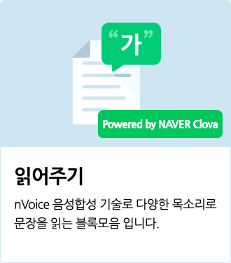

네이버가 개발한 인공지능 플랫폼 '클로바'의 nVoice 음성 합성 기술을 이용해 인공지능이 합성한 다양한 목소리로 문장을 읽는 블록입니다.
+ 인터넷에 연결되지 않았거나 인터넷 환경이 불안정할 경우, '알 수 없는 문장입니다.'를 가져오고 다음 블록으로 넘어갑니다.
+ 내용은 2500 자까지 입력이 가능해요.

## 1. `(엔트리)` 읽어주기

입력한 내용을 설정한 목소리로 읽습니다. 읽기 시작하면 다음 블록이 바로 동작해요.

## 2. `(엔트리)` 읽어주고 기다리기

입력한 내용을 설정한 목소리로 읽고, 다 읽으면 다음 블록이 동작합니다.

## 3. `[여성]` 목소리를 `[보통]` 속도 `[보통]` 음높이로 설정하기

목소리와 읽는 속도, 음높이를 정합니다.

목록 상자()를 클릭하면 목소리와 읽는 속도, 음높이를 선택할 수 있어요.
+ **목소리 (첫 번째 목록 상자)**
  + `여성`, `남성`, `친절한`, `감미로운`, `울리는`, `장난스러운`, `앙증맞은`
+ **읽는 속도 (두 번째 목록 상자)**
  + `매우 느린`, `느린`, `보통`, `빠른`, `매우 빠른`
+ **음 높이 (세 번째 목록 상자)**
  + `매우 낮은`, `낮은`, `보통`, `높은`, `매우 높은`

