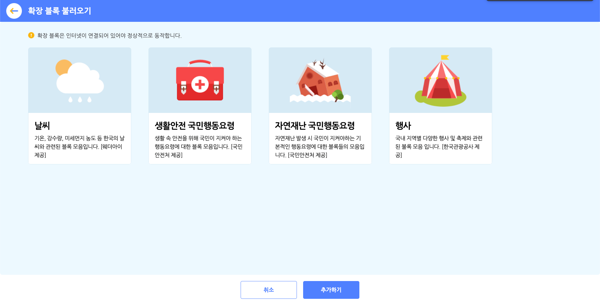
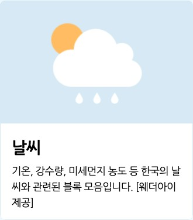
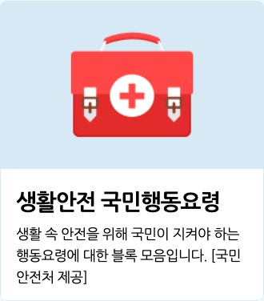

## 확장 블록 불러오기 팝업

확장 블록 카테고리의 블록 꾸러미에 있는 '확장 블록 가져오기' 버튼을 클릭하면 나타나는 팝업 창입니다.

추가 블록 모음을 선택하고 아래의 '추가하기' 버튼을 클릭해서 블록 꾸러미에 불러올 수 있어요. 중복 선택이 가능해요.

아래는 확장 추가 블록 모음의 종류입니다.

+ **날씨** : 기온, 강수량, 미세먼지 농도 등 한국의 날씨와 관련된 블록 모음입니다. [웨더아이 제공]
+ **생활안전 국민행동요령** : 생활 속 안전을 위해 국민이 지켜야 하는 행동요령에 대한 블록 모음입니다. [국민안전처 제공]
+ **자연재난 국민행동요령** : 자연재난 발생 시 국민이 지켜야 하는 기본적인 행동요령에 대한 블록 모음입니다. [국민안전처 제공]
+ **행사** : 국내 지역별 다양한 행사 및 축제와 관련된 블록 모음입니다. [한국관광공사 제공]  

---

# 날씨

기온, 강수량, 미세먼지 농도 등 한국의 날씨와 관련된 블록 모음입니다. [웨더아이 제공]

아래는 날씨 확장 블록에서 선택할 수 있는 항목입니다.

+ **날짜**
  + `어제`, `오늘`, `내일`, `모레`, `3일 후`, `4일 후`, `5일 후`, `6일 후`
+ **시/도 (지역)**
  + `서울`, `강원`, `경기`, `경남`, `경북`, `광주`, `대구`, `대전`, `부산`, `세종`, `울산`, `인천`, `전남`, `전북`, `제주`, `충남`, `충북`
+ **시/군/구 (지역)**
  + 선택한 시/도에 따라 달라집니다.
+ **날씨**
  + `맑음`, `구름조금`, `구름많음`, `흐림`, `비`, `진눈깨비`, `눈`
+ **정보**
  + `최저기온(ºc)`, `최고기온(ºc)`, `습도(%)`, `강수량(mm)`, `강수확률(%)`, `풍속(m/s)`

## 1. <`[오늘]` `[서울]` `[전체]` 의 날씨가 `[맑음]` 인가?>

선택한 날짜와 지역의 실제 날씨가 선택한 날씨와 같다면 참, 아니라면 거짓으로 판단하는 블록입니다.

목록 상자()를 클릭하면 날짜와 지역, 날씨를 선택할 수 있어요.

## 2. <현재 `[서울]` `[전체]` 의 미세먼지 등급이 `[좋음]` 인가?>

선택한 지역의 실제 미세먼지 등급이 선택한 등급과 같다면 참, 아니라면 거짓으로 판단하는 블록입니다.

목록 상자()를 클릭하면 지역과 등급을 선택할 수 있어요.

## 3. `[오늘]` `[서울]` `[전체]` 의 `[최저기온(ºc)]`

선택한 날짜와 지역의 정보를 가져오는 값 블록입니다.

목록 상자()를 클릭하면 날짜와 지역, 정보를 선택할 수 있어요.

## 4. 현재 `[서울]` `[전체]` 의 `[기온(ºc)]`

현재 시각에서 선택한 지역의 정보를 가져오는 값 블록입니다.

과  달리 현재 시각을 반영해요.

목록 상자()를 클릭하면 지역과 정보를 선택할 수 있어요.

## 5. 오늘 `[서울]` `[전체]` 의 `[00]` 시 기온

선택한 지역에서 오늘의 시간대별 기온을 가져오는 값 블록입니다.

목록 상자()를 클릭하면 지역과 시간대를 선택할 수 있어요.  
　
---

#  생활안전 국민행동요령

생활 속 안전을 위해 국민이 지켜야 하는 행동요령에 대한 블록 모음입니다. [국민안전처 제공]

아래는 생활안전 국민행동요령 확장 블록에서 선택할 수 있는 항목입니다.

+ **생활 속 문제**
  + `응급처치`, `심폐소생술`, `소화기/소화전 사용법`, `식중독`, `산행안전`, `실종유괴`, `성폭력`, `학교폭력`, `가정 폭력`, `억류 및 납치`, `교통사고`, `승강기 안전사고`, `미세먼지`
+ **상황**
  + 선택한 생활 속 문제에 따라 달라집니다.

## 6. `[응급처치]` 에서 `[화상 처치]` 방법의 수

선택한 생활 속 문제에서 해야 할 행동요령의 수를 가져오는 값 블록입니다.

목록 상자()를 클릭하면 생활 속 문제와 행동요령을 선택할 수 있어요.

## 7. `[응급처치]` 에서 `[화상 처치]` 방법 `(1)` 번째 항목

선택한 생활 속 문제에서 해야 할 행동요령 중 입력한 순서()에 맞는 것을 가져오는 값 블록입니다.

목록 상자()를 클릭하면 생활 속 문제와 행동요령을 선택할 수 있어요.  
　
---

# 자연재난 국민행동요령

자연재난 발생 시 국민이 지켜야 하는 기본적인 행동요령에 대한 블록 모음입니다. [국민안전처 제공]

아래는 자연재난 국민행동요령 확장 블록에서 선택할 수 있는 항목입니다.

+ **자연재난**
  + `태풍`, `홍수`, `호우`, `강풍`, `대설`, `한파`, `풍랑`, `황사`, `폭염`, `가뭄`, `지진`, `해일`, `산사태`
+ **상황**
  + 선택한 자연재해가 오기 전/왔을 때/지나간 후

## 8. `[태풍]` `[태풍이 오기 전]` 해야할 행동요령 수

선택한 자연재난에서 해야 할 행동요령의 수를 가져오는 값 블록입니다.

목록 상자()를 클릭하면 자연재해와 상황을 선택할 수 있어요.

## 9. 자연재난 `[태풍]` `[태풍이 오기 전]` 해야할 행동요령 `(1)` 번째 항목

선택한 자연재난에서 해야 할 행동요령 중 입력한 순서()에 맞는 것을 가져오는 값 블록입니다.

목록 상자()를 클릭하면 자연재해와 상황을 선택할 수 있어요.  
　
---

# 행사

국내 지역별 다양한 행사 및 축제와 관련된 블록 모음입니다. [한국관광공사 제공]

아래는 행사 확장 블록에서 선택할 수 있는 항목입니다.

+ **시/도**
  + `서울`, `강원`, `경기`, `경남`, `경북`, `광주`, `대구`, `대전`, `부산`, `세종`, `울산`, `인천`, `전남`, `전북`, `제주`, `충남`, `충북`
+ **행사일**
  + `1월`, `2월`, `3월`, `4월`, `5월`, `6월`, `7월`, `8월`, `9월`, `10월`, `11월`, `12월`
+ **정보**
  + `제목`, `지역`, `시작일`, `종료일`, `주소`, `개요`, `홈페이지`

## 10. `[서울]` `[1월]` 행사의 수

선택한 지역에서 선택한 달에 열리는 행사의 수를 가져오는 값 블록입니다.

목록 상자()를 클릭하면 지역과 달을 선택할 수 있어요.

## 11. `[서울]` `[1월]` 행사 `(1)` 번째 항목의 `[제목]`

선택한 지역에서 선택한 달에 열리는 행사 중 입력한 순서()에 해당하는 것을 가져오는 값 블록입니다.

목록 상자()를 클릭하면 지역과 달, 정보를 선택할 수 있어요.
