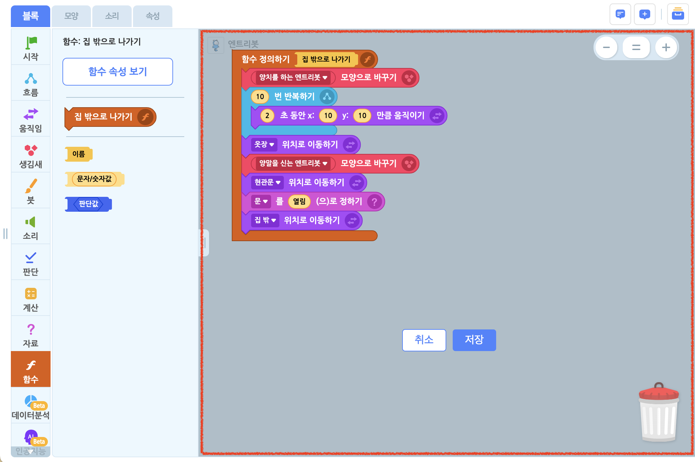
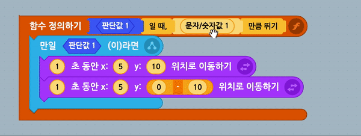

## 함수란?

함수를 이용하면 여러 블록을 조립해 하나의 블록처럼 사용할 수 있습니다. 이걸 함수를 정의한다고 말하는데요.  
하나의 특별한 목적을 달성하고자 사용하는 블록의 모음이나, 반복해서 여러 번 사용해야 하는 블록들을 함수로 정의하면 편리하게 사용할 수 있답니다.  
마치 '집 밖으로 나가기'라는 하나의 목적을 위해 양치를 하고, 양말을 신고, 현관문을 열어야 하는 것처럼요!  

  
'집 밖으로 나가기'라는 목적을 달성하는 함수를 정의한다면 이렇게 만들 수 있겠네요.

* * *

## 함수 만들기 화면

함수는 '함수 만들기' 화면에서 정의합니다. 블록 조립소에서 바로 정의하지 않고, 각각의 함수만을 조립할 수 있는 별도의 영역이에요.  
(원래의 블록 조립소 위에 불투명하게 덮여서 표시되는 걸 볼 수 있죠?)  

 
새로운 함수를 만드려면 블록 탭의 함수 블록 꾸러미에서 '함수 만들기' 버튼을 클릭하거나, 속성 탭의 함수 카테고리에서 '함수 추가하기'를 클릭해 함수 만들기 화면에 들어갑니다. 이미 만들어진 함수가 있을 때는 블록 탭에서 만들어진 함수 블록을 더블 클릭하거나, 속성 탭에서 해당 함수를 클릭하면 함수 만들기 화면에 들어갈 수 있습니다.

함수 만들기 화면에서는 다른 블록을 조립해 함수를 정의할 수 있는 '함수 정의하기 블록'이 표시되고, 이 때의 블록 꾸러미에서는 함수를 정의하는 데 활용하는 '리본 블록'과 이미 정의한 다른 함수 블록이 표시돼요. 이 블록들을 사용하는 방법은 뒤에서 더 자세하게 알아보겠습니다.

함수 만들기 화면을 빠져 나오려면 '저장' 버튼을 눌러 변경 내역을 저장하거나, '취소' 버튼을 눌러 변경 내역을 저장하지 않고 빠져 나올 수 있습니다. 

* * *

## 함수 정의하기

함수 만들기 화면의 함수 정의하기 블록에 일반 블록과 리본 블록을 조립/결합하면 함수를 정의할 수 있습니다.  
함수 정의하기 블록과 리본 블록은 아래와 같이 생겼어요.  

**함수 정의하기 블록**

함수 정의하기 블록은 흐름 블록과 비슷하게 일반 블록을 감싸는 형태입니다.

+ **기본 형태** (결괏값을 가지지 않음)  

+ **결괏값을 가지는 형태**  

함수 정의하기 블록에 일반 블록을 조립하면, 함수가 동작할 때 각각의 블록이 조립된 순서대로 동작합니다.  
이 때 조립한 블록은 작품에서 조립되었을 때와 동일하게 동작해요. (기능 상의 차이는 없습니다.)

**리본 블록**
 
리본 블록은 함수 정의하기 블록에만 결합할 수 있는 특수한 블록입니다. 다른 곳에서는 사용되지 않아요.  
리본 블록의 종류는 총 세 가지로, 함수의 이름을 설정하거나, 값 블록()을 대신하거나, 판단 블록()을 대신하는 역할을 합니다.

+ **이름 리본 블록**  
  
함수의 이름을 설정하는 리본 블록입니다. 
  + 만일 이름 리본 블록에 '함수'라고 입력하고 함수 정의하기 블록에 결합했다면  
    
  완성한 함수 블록은 이런 모습이 됩니다.  
  
+ **값 리본 블록**  
  
함수 내부에 결합되는 값 블록()을 대신해, 함수 블록을 사용할 때마다 바꿔 끼울 수 있는 자리를 만드는 리본 블록입니다.  
  + 값 리본 블록이 함수 정의하기 블록에 결합되면 왼쪽 위부터 순서대로 숫자가 붙습니다.  
  이 숫자로 각각의 값 블록을 구분해 사용합니다. 
  + 값 리본 블록에 결합되어 있는 값 블록을 뚝 떼면, 블록이 분리되는 것이 아니라 복제됩니다.  
  이렇게 분리한 값 블록을 다른 블록에 결합해 사용합니다. 
  + 하나의 값 리본 블록을 여러 번 분리해 각각 다른 곳에서 결합해 사용할 수 있어요.
+ **판단 리본 블록**  
  
함수 내부에 결합되는 판단 블록()을 대신해, 함수 블록을 사용할 때마다 바꿔 끼울 수 있는 자리를 만드는 리본 블록입니다.
  + 판단 리본 블록이 함수 정의하기 블록에 결합되면 왼쪽 위부터 순서대로 숫자가 붙습니다.  
  이 숫자로 각각의 판단 블록을 구분해 사용합니다.  
  + 판단 리본 블록에 결합되어 있는 판단 블록을 뚝 떼면, 블록이 분리되는 것이 아니라 복제됩니다.  
  이렇게 분리한 판단 블록을 다른 블록에 결합해 사용합니다. 
  + 하나의 판단 리본 블록을 여러 번 분리해 각각 다른 곳에서 결합해 사용할 수 있어요.

리본 블록은 여러 개를 한꺼번에 결합할 수 있고, 순서도 자유롭게 설정할 수 있습니다.

예를 들어, 아래와 같이 리본 블록 여러 개를 결합해 함수를 정의하면  
  

실제 함수 블록은 이렇게 만들어 집니다.  
  

**리본 블록 사용 예시**

값/판단 리본 블록을 사용하는 방법은 방금 전의 예시를 통해 더 자세히 알아보도록 할게요.  
사용 방법은 동일하니 값 리본 블록으로 설명합니다.

값 리본 블록()은 함수 정의하기 블록의 맨 위에 결합됩니다.  
잘 결합되었다면 리본 블록의 이름에 숫자가 붙는 것()을 볼 수 있어요.  
만약 숫자가 붙지 않았다면 결합이 되지 않았다는 뜻이니, 다시 한번 결합을 잘 확인해 주세요.

이 때, 결합된 리본 블록에서 값 블록()을 분리할 수 있는데요.  
분리를 하면 결합된 값 블록이 떨어져 나오는 것이 아니라, 복제되는 것을 볼 수 있습니다.  

이제 이 복제한 값 블록을 함수 정의하기 블록에 조립한 '`(1)` 초 동안 x: `(5)` y: `(10)` 만큼 움직이기' 블록과 '`(1)` 초 동안 x: `(5)` y: `((0)-(10))` 만큼 움직이기' 블록에 아래와 같이 결합하면

  

함수 블록은 이렇게 만들어 집니다.  
  
(`<판단값 1>`, `(문자/숫자값 1)` 자리에 기본값으로 `<참>`, `(10)`이 입력되어 있네요.)  

* * *

## 함수 사용하기

**함수 블록**

함수를 모두 정의했다면 그 결과로 블록 꾸러미의 함수 카테고리에 내가 만든 함수 블록이 표시됩니다.  
이 함수 블록을 블록 조립소에서 자유롭게 조립해 사용하면 됩니다. 

+ **기본 형태** (일반 블록)  

+ **결괏값 형태** (값 블록)  
  
함수 블록은 일반 블록의 형태 뿐만 아니라, 값 블록의 형태로도 만들어 줄 수 있어요.  
함수에 조립된 블록들이 모두 동작한 후, 결괏값을 반환하는 형태가 되는 거죠!  
(그래서 최종적으로 만들어 지는 함수 블록도 값 블록 모양이 되는 거에요.)

블록 조립소에서 함수 블록을 조립해 사용할 때는, 함수 블록의 `(문자/숫자값 1)` 자리에 입력된 값(`(40)`)이 함수를 정의할 때 사용한 일반 블록에 결합된 모든 `(문자/숫자값 1)`의 자리에 똑같이 들어가서 동작하게 됩니다.

  

  

* * *

일반 블록을 조립한 코드와 함수 블록으로 만든 코드가 하는 동작은 완전히 똑같지만, 함수 블록은 블록 코드의 개수를 줄일 수 있어 조립이 더욱 간편해 집니다. 코드를 쉽게 재활용할 수도 있어 유용하기도 하구요.

자, 그럼 이제 함수를 이용해 여러분만의 특별한 블록을 만들어 볼까요?