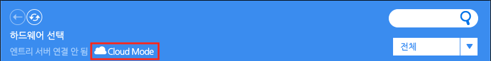
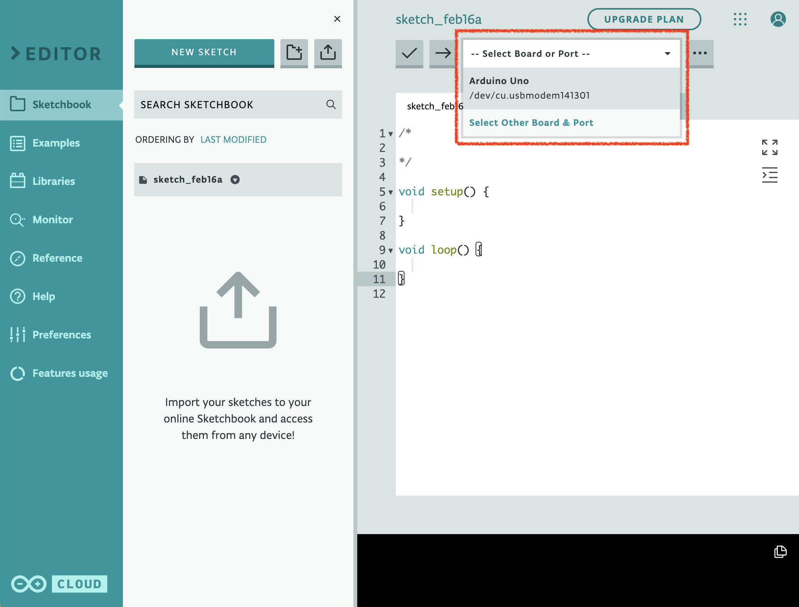

엔트리 작품을 통해 작품 실행 화면의 오브젝트 말고도 현실 세계의 로봇이나 모듈, 보드를 조작할 수 있습니다.

엔트리를 통해 하드웨어를 조작하려면, 엔트리와 하드웨어를 서로 연결하고, 연결한 하드웨어를 위해 만들어진 전용 블록을 여러분이 만든 작품에 조립하고 작품을 실행하면 됩니다.

여기서는 엔트리에 하드웨어를 연결하는 두 가지 방법을 알아볼게요.

| 방법 | 연결할 수 있는 하드웨어 | 지원하는 운영체제 |
| --- | --- | --- |
| 하드웨어 연결 프로그램 사용하기 | 엔트리에 연동된 모든 하드웨어 | Windows, macOS |
| 웹 브라우저로 연결하기 | 햄스터, 마이크로비트(V1/V2), 아두이노 우노, 아두이노 나노 | Whale OS, Chrome OS, macOS |

## 방법 1. 하드웨어 연결 프로그램 사용하기

#### 하드웨어 연결 프로그램 설치

하드웨어 블록 꾸러미에는 하드웨어 연결을 위한 다양한 메뉴가 있습니다. 연결에 성공하면 사용할 수 있는 블록이 나타날 거예요.

'연결 프로그램 다운로드' 글씨를 클릭해서 하드웨어 연결에 필요한 (운영체제에 맞는) 프로그램 설치 파일을 다운로드합니다.

다운로드한 연결 프로그램을 설치했다면, 엔트리 하드웨어 연결 프로그램 실행 아이콘을 더블 클릭하거나 하드웨어 블록 꾸러미의 '연결 프로그램 열기' 버튼을 클릭해서 프로그램을 실행해요.

#### 연결할 하드웨어 찾기

하드웨어 연결 프로그램 창입니다.

연결하려는 하드웨어를 찾아서 클릭하면 연결 화면이 나타나요.

클라우드 PC 연결을 시도한다면 위에 '클라우드 모드' 표시가 나타납니다.

오른쪽 위의 검색창을 통해 원하는 하드웨어의 이름을 검색할 수 있어요.

검색창 아래의 목록 상자에서 카테고리를 선택하면 원하는 하드웨어를 더 쉽게 찾을 수 있습니다.

실행하고자 하는 하드웨어 모양을 클릭하고 관련 펌웨어를 설치하면, 엔트리에서 사용할 수 있는 하드웨어 블록들이 나타납니다.

## 방법 2. 웹 브라우저로 바로 연결하기

하드웨어 연결 프로그램을 설치하지 않고도 하드웨어를 연결할 수 있는 방법입니다. 

단, 이 기능을 통해 하드웨어를 연결하려면 하드웨어 제조사의 별도의 연동 작업이 우선 이루어져야 합니다.

해당 연동 작업을 마쳐 웹 브라우저로 연결할 수 있는 하드웨어는 아래와 같이 팝업에서 확인할 수 있습니다.

## POINT: 아두이노 사용하기

엔트리에 아두이노(Arduino)를 연결할 때는 다른 하드웨어와 달리 추가 작업이 필요합니다.
사용할 아두이노 보드에 먼저 '엔트리 아두이노 소스 코드'를 업로드해야 엔트리 하드웨어 연결 기능을 사용할 수 있습니다.
+ 엔트리 아두이노 소스 코드는 보드에 한 번만 업로드하면 됩니다. 이미 업로드한 경우에는 바로 **3단계**를 진행합니다.
+ 아래의 설명은 아두이노 웹 에디터(Arduino Web Editor)를 사용하는 것을 기준으로 작성되었지만,
설치형 프로그램인 아두이노 IDE를 통해서도 같은 방법으로 소스 코드를 업로드할 수 있습니다.

#### 1단계 - 아두이노와 PC를 연결

먼저, [아두이노 웹 에디터](https://create.arduino.cc/editor)에 접속합니다. (앞으로 '에디터'라 부를게요.)
아두이노 웹사이트에 로그인 하면 에디터 화면이 표시됩니다.
+ 아두이노 웹 에디터를 사용하려면 아두이노 계정이 필요합니다.
이메일 또는 구글, 페이스북, 애플 계정으로 가입할 수 있습니다.
+ 이메일로 가입한 경우, 이메일 인증이 필요합니다. 입력한 이메일 주소로 발송된 인증 메일의 인증 버튼을 클릭하면 가입이 완료됩니다.

다음으로 PC와 아두이노를 연결할 수 있게 해주는 '아두이노 크리에이트' 프로그램을 설치합니다.
+ **Windows**와 **macOS**를 사용하는 경우, [아두이노 크리에이트 에이전트](https://create.arduino.cc/getting-started/plugin/welcome)를 설치합니다.
위 페이지에 접속하면 자동으로 사용하는 운영체제에 맞는 프로그램을 다운로드 받을 수 있습니다.
+ **Whale OS**, **Chrome OS** 등 크로미움 기반 운영체제를 사용하는 경우, [아두이노 크리에이트 크롬 확장 프로그램](https://chrome.google.com/webstore/detail/arduino-create-for-educat/elmgohdonjdampbcgefphnlchgocpaij)을 설치합니다.

이제, 아두이노와 PC를 USB 케이블로 연결합니다. 케이블이 올바르게 끼워졌는지 확인해 주세요.

보드가 정상적으로 인식되었다면 에디터 화면의 오른쪽 위에서 `Arduino {연결한 종류} has been connected` 라는 토스트가 표시되고,

`Select Board or Port` 목록 상자를 눌러 연결할 보드를 선택할 수 있게 됩니다.

#### 2단계 - 엔트리 아두이노 소스 코드 업로드

[엔트리 아두이노 소스 코드](https://github.com/entrylabs/entry-hw/releases/download/v1.6.10/board.ino)를 다운로드 합니다. (앞으로 '소스 코드'라 부를게요.)

에디터 화면 상단의 임포트(import) 버튼을 눌러 아까 다운로드 한 소스 코드를 불러옵니다.
+ 파일 이름은 `board.ino` 입니다. 파일 선택 창에서 이 파일을 선택해 주세요.
+ 임포트 버튼이 보이지 않는다면, 화면 왼쪽의 `Sketchbook` 메뉴를 클릭해 패널을 표시합니다.

소스 코드를 잘 불러왔다면 업로드(upload) 버튼을 눌러 보드에 업로드합니다.
업로드가 완료되면 완료 메시지가 표시됩니다.

#### 3단계 - 작품 만들기 화면에서 아두이노를 연결

이제 모든 준비가 끝났습니다. 엔트리의 작품 만들기 화면으로 돌아와 아두이노를 연결합니다.

하드웨어 연결 프로그램을 사용(방법 1)하거나 인터넷 브라우저로 바로 연결(방법 2)할 수 있습니다. 

엔트리와 아두이노가 연결되면 블록 꾸러미에서 아두이노 블록이 표시됩니다.

연결이 잘 이루어졌는데도 블록이 표시되지 않는다면 아래를 확인해 주세요.
+ 블록 꾸러미의 '하드웨어 연결하기' 버튼을 클릭해 블록 꾸러미를 새로 고침합니다.
+ 하드웨어 연결 프로그램을 사용하는 경우, 프로그램 창 오른쪽 위에 '엔트리 서버 연결됨'이 표시되는지 확인해 주세요.  
'엔트리 서버 연결 안 됨'이 표시되면 작품 만들기 창이 잘 열려 있는지 확인하고 프로그램을 새로 고침해 주세요.
+ 하드웨어 연결 프로그램의 버전이 1.9.39 이상인지 확인해 주세요.
인증서가 갱신되어 1.9.39 이하 버전에서는 블록이 정상적으로 표시되지 않습니다.