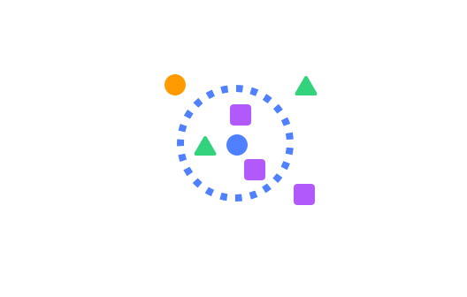
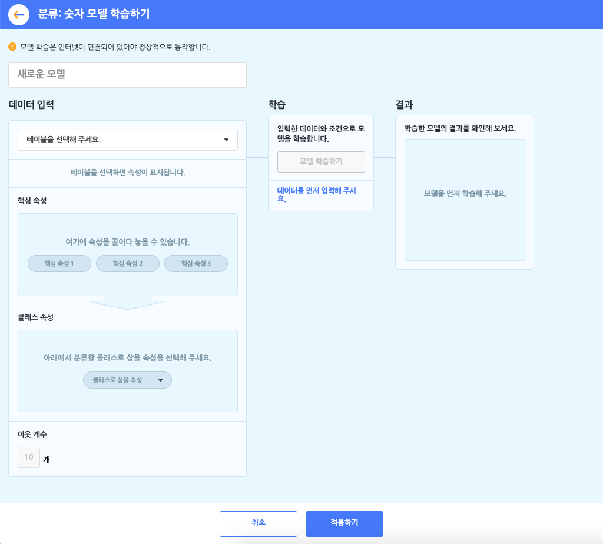
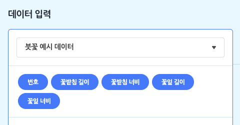
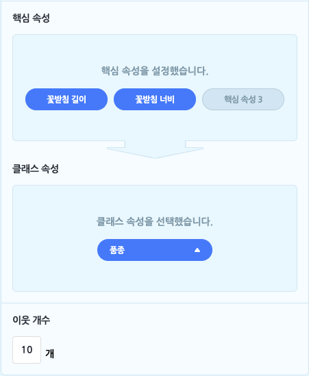
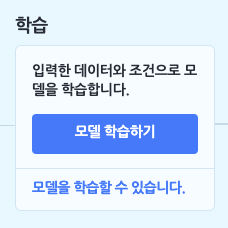
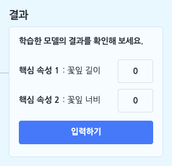

모델이 학습할 숫자를 테이블로 업로드하거나 직접 작성해 데이터로 입력하고, 입력한 데이터를 **가장 가까운 이웃(K개)을 기준으로 각각의 클래스로 분류**하는 모델을 학습합니다.

+ 분류: 숫자 모델을 학습하려먼 **먼저 데이터로 삼을 테이블을 추가해야 합니다**. 학습하기 전에 데이터 분석 카테고리에서 [테이블 불러오기]를 통해, 기본 테이블, 파일 업로드, 새로 만들기의 방법으로 테이블을 추가 해주세요.

분류: 숫자 모델을 선택하면 아래와 같이 모델 학습하기 창이 나타납니다.

먼저 모델의 이름부터 지어볼까요? 이름 상자를 클릭해서 모델의 이름을 정합니다.

####  ① 데이터 입력하기 = 테이블 선택하기

분류: 숫자 모델 학습의 첫 단계는 데이터 입력 박스에서 모델의 데이터로 삼을 테이블을 선택하는 것이에요. 모델을 학습하기 전에, '데이터 분석 블록' 카테고리에서 테이블을 추가하는 것을 잊지 마세요!

목록 상자를 눌러 작품에 추가한 테이블 중에서 모델 학습에서 사용할 테이블을 선택하면, 바로 아래에 테이블의 속성이 표시됩니다. 여기서 표시되는 속성은 (1행을 제외한) 모든 행이 숫자로 이루어진 속성입니다. (숫자 데이터를 학습하는 모델이니 당연하겠죠?)

+ **핵심 속성**: 핵심 속성은 속성 중에서 '원인'에 해당하는 속성을 말합니다. 조금 어렵게 말하면 '독립 변수' 또는 '설명 변수'를 의미합니다. 
  모델이 학습할 때 어떤 속성을 원인으로 삼을 것인지를 선택하는 부분이에요. 엔트리에서는 최대 3개까지 핵심 속성을 설정할 수 있습니다. 
  
  + 예를 들어, 소고기의 '지방 함량', '색', '숙성도'를 핵심 속성으로 삼는다고 생각해 보세요.
  
    
+ **클래스 속성**: 클래스 속성은 분류: 숫자 모델의 '결과'에 해당하는 클래스를 의미하는 속성을 말합니다. 다르게 말하면 '종속 변수'에 해당해요.
  분류 모델이 학습의 결과로, 입력한 데이터를 어떤 클래스로 분류할지 선택하는 부분이에요. 
  앞에서 전부 숫자로 이루어진 값을 가져야 하는 속성과는 달리, 클래스는 이름(또는 범주)을 의미하기 때문에 숫자 뿐만 아니라 문자여도 상관이 없답니다.
  그래서 길쭉한 원 모양의 목록 상자를 누르면, 숫자로만 이루어진 속성 뿐만 아니라 모든 속성이 표시되고, 그 중에 하나를 클래스 속성으로 설정할 수 있어요.
  
  + 예를 들어, 소고기의 '등급'(1++등급, 1+등급, 1등급, 2등급, 3등급)을 클래스 속성으로 삼는다고 생각해 보세요.
    핵심 속성이 원인이고 클래스 속성이 결과니까, 
    학습한 모델이 소고기의 '지방 함량', '색', '숙성도'를 가지고 '등급'을 분류해낼 수 있겠죠?
    
    
+ **이웃 개수**: 엔트리의 분류 모델은 'K-최근접 이웃'이라는 이름의 알고리즘을 사용합니다. 쉽게 말하면, 분류하려는 데이터와 가장 가까운 K개의 다른 데이터들의 클래스를 가지고 그 중에서 가장 많은 클래스로 분류하는 방법을 말해요.
  (이 때 가장 가깝다는 것은 유클리드 거리를 기준으로 합니다.)
  이웃 개수는 데이터의 개수, 분류하려는 클래스 개수에 따라 적절한 개수가 달라집니다. 다양하게 입력해서 학습해보고 적절한 K개를 찾아봅시다.

#### ② 학습하기

이렇게 핵심 속성, 클래스 속성, 이웃 개수를 설정하고 나면, 학습 박스의 [모델 학습하기] 버튼을 클릭할 수 있게 됩니다. 

+ 분류: 숫자 모델은 학습 박스에서 별도의 학습 조건을 설정할 수 없어요.

#### ③ 결과 확인하기

모델 학습이 모두 완료되었다면, 결과 박스에서 학습 결과를 확인할 수 있습니다.

핵심 속성으로 설정한 속성에 새로운 데이터(숫자)를 직접 입력하고, [입력하기] 버튼을 클릭하면 학습된 모델이 새로운 데이터를 클래스로 분류한답니다!

## 1. 모델 다시 학습하기

모델을 다시 학습합니다. 

모델 설정을 변경하거나 입력 데이터가 되는 테이블의 내용을 수정했다면, 변경된 내용을 바탕으로 모델을 다시 학습합니다.

## 2. 모델이 학습되었는가?

모델의 학습 상태를 가져오는 판단 블록입니다.

모델이 학습되었다면 '참'을, 학습 중이거나 학습되지 않았다면 '거짓'으로 판단합니다.

## 3. 모델 `[보이기]`

모델의 학습 상태를 표시하는 창을 실행 화면에 보이게 하거나 숨깁니다.

목록 상자()를 클릭해서 보이기/숨기기를 선택할 수 있어요.

## 4. 모델 차트 창 `[열기]`

모델을 학습할 때 입력한 데이터와 모델이 분류한 클래스를 2차원 좌표평면에 나타낸 차트 창을 열거나 닫습니다.

핵심 속성이 3개 이상인 경우 모델의 차트를 2차원 좌표평면 위에 그릴 수 없기 때문에, 이 블록은 표시되지 않습니다. 

목록 상자()를 클릭해서 열기/닫기를 선택할 수 있어요.

## 5. 이웃을 `(10)` 개로 바꾸기

이웃 개수를 입력한 값으로 바꾸어 설정합니다. 

변경한 이웃 개수는 '모델 다시 학습하기' 블록으로 모델을 다시 학습할 때부터 적용됩니다.

## 6. 핵심 속성1 `(10)` 핵심 속성2 `(10)` 의 분류 결과

핵심 속성의 값을 직접 입력해 모델이 분류한 클래스를 가져오는 값 블록입니다. 

값은 모델의 클래스 이름(텍스트)으로 표현됩니다. 

'핵심 속성1', '핵심 속성2' 등은 모델 학습 시 선택한 속성 이름으로 표시되며, 설정한 핵심 속성의 개수에 따라 값 블록을 결합할 수 있는 개수도 함께 늘어납니다.

## 7. 핵심 속성1 `(10)` 핵심 속성2 `(10)` `[클래스1]` 에 대한 `[신뢰도]`

핵심 속성의 값을 직접 입력해 선택한 클래스에 대한 신뢰도 또는 이웃 개수를 가져오는 값 블록입니다. 

이 때 가져오는 값는 값은 숫자로 표현됩니다.

'핵심 속성1', '핵심 속성2' 등은 모델 학습 시 선택한 속성 이름으로 표시되며, 설정한 핵심 속성의 개수에 따라 값 블록을 결합할 수 있는 개수도 함께 늘어납니다.

목록 상자()를 클릭해서 클래스와 신뢰도 또는 이웃 개수를 선택할 수 있어요.

+ **클래스 (첫 번째 목록 상자)**
  
  + `클래스 속성의 모든 항목`
  
    
+ **신뢰도와 이웃 개수 (두 번째 목록 상자)**
  
  + `신뢰도`, `이웃 개수`

## 8. 핵심 속성1 `(10)` 핵심 속성2 `(10)` 의 분류 결과가 `[클래스1]` 인가?

핵심 속성의 값을 직접 입력해 분류 결과가 선택한 클래스인 경우 '참'을 가져오는 판단 블록입니다.

'핵심 속성1', '핵심 속성2' 등은 모델 학습 시 선택한 속성 이름으로 표시되며, 설정한 핵심 속성의 개수에 따라 값 블록을 결합할 수 있는 개수도 함께 늘어납니다.

목록 상자()를 클릭해서 클래스를 선택할 수 있어요.

