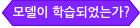
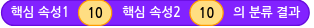
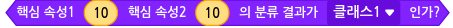
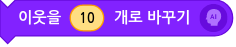
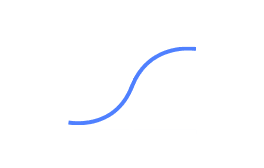
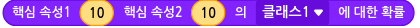
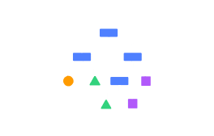

# I. 분류 - 숫자 모델 공통 블록

## 1. 모델 다시 학습하기

모델을 다시 학습합니다. 

모델 설정을 변경하거나 입력 데이터가 되는 테이블의 내용을 수정했다면, 변경된 내용을 바탕으로 모델을 다시 학습합니다.

## 2. 모델이 학습되었는가?

모델의 학습 상태를 가져오는 판단 블록입니다.

모델이 학습되었다면 '참'을, 학습 중이거나 학습되지 않았다면 '거짓'으로 판단합니다.

## 3. 모델 `[보이기]`

모델의 학습 상태를 표시하는 창을 실행 화면에 보이게 하거나 숨깁니다.

목록 상자()를 클릭해서 보이기/숨기기를 선택할 수 있어요.

## 4. 핵심 속성1 `(10)` 핵심 속성2 `(10)` 의 분류 결과

핵심 속성의 값을 직접 입력해 모델이 분류한 클래스를 가져오는 값 블록입니다. 

값은 모델의 클래스 이름(텍스트)으로 표현됩니다. 

'핵심 속성1', '핵심 속성2' 등은 모델 학습 시 선택한 속성 이름으로 표시되며, 설정한 핵심 속성의 개수에 따라 값 블록을 결합할 수 있는 개수도 함께 늘어납니다.

## 5. 핵심 속성1 `(10)` 핵심 속성2 `(10)` 의 분류 결과가 `[클래스1]` 인가?

핵심 속성의 값을 직접 입력해 분류 결과가 선택한 클래스인 경우 '참'을 가져오는 판단 블록입니다.

'핵심 속성1', '핵심 속성2' 등은 모델 학습 시 선택한 속성 이름으로 표시되며, 설정한 핵심 속성의 개수에 따라 값 블록을 결합할 수 있는 개수도 함께 늘어납니다.

목록 상자()를 클릭해서 클래스를 선택할 수 있어요.

-----

# II. 최근접 이웃(kNN) 알고리즘

테이블의 숫자 데이터를 가장 가까운 이웃(k개)을 기준으로 각각의 클래스로 분류하는 모델을 학습합니다.

## 1. 모델 차트 창 `[열기]`

모델을 학습할 때 입력한 데이터와 모델이 분류한 클래스를 2차원 좌표평면에 나타낸 차트 창을 열거나 닫습니다.

핵심 속성이 3개 이상인 경우 모델의 차트를 2차원 좌표평면 위에 그릴 수 없기 때문에, 이 블록은 표시되지 않습니다. 

목록 상자()를 클릭해서 열기/닫기를 선택할 수 있어요.

## 2. 이웃을 `(10)` 개로 바꾸기

이웃 개수를 입력한 값으로 바꾸어 설정합니다. 

변경한 이웃 개수는 '모델 다시 학습하기' 블록으로 모델을 다시 학습할 때부터 적용됩니다.

## 3. 핵심 속성1 `(10)` 핵심 속성2 `(10)` `[클래스1]` 에 대한 `[이웃 개수]`

핵심 속성의 값을 직접 입력해 선택한 클래스에 대한 이웃 개수를 가져오는 값 블록입니다. 

이 때 가져오는 값은 숫자로 표현됩니다.

'핵심 속성1', '핵심 속성2' 등은 모델 학습 시 선택한 속성 이름으로 표시되며, 설정한 핵심 속성의 개수에 따라 값 블록을 결합할 수 있는 개수도 함께 늘어납니다.

목록 상자()를 클릭해서 클래스를 선택할 수 있어요.

+ **클래스**
  
  + `클래스 속성의 모든 항목`

-----

# III. 로지스틱 회귀 알고리즘

테이블의 숫자 데이터를 로지스틱 회귀 알고리즘을 활용해 각각의 클래스로 분류하는 모델을 학습합니다.

## 1. 학습 조건 `[학습률]` 을(를) `(10)` (으)로 바꾸기

모델의 학습 조건을 변경합니다.  

변경한 학습 조건은 '모델 다시 학습하기' 블록으로 모델을 다시 학습할 때부터 적용됩니다.

+ **학습 조건**
  
  + `학습률`, `에포크`, `검증 데이터 비율`

## 2. 최적화 알고리즘을 `[Adam]` 으(로) 바꾸기

모델의 최적화 알고리즘을 변경합니다.  

변경한 최적화 알고리즘은 '모델 다시 학습하기' 블록으로 모델을 다시 학습할 때부터 적용됩니다.

## 3. 핵심 속성1 `(10)` 핵심 속성2 `(10)` 의 `[클래스1]` 에 대한 확률

입력한 데이터의 선택한 클래스에 대한 확률을 가져오는 값 블록입니다.  

이 때 가져오는 값은 숫자로 표현됩니다.

## 4. 모델의 `[정확도]`

모델의 성능 평가 지표 값을 가져오는 값 블록입니다.

+ **성능 평가 지표**
  
  + `정확도`, `F1`, `정밀도`, `재현율`

-----

# IV. 서포트 벡터 머신(SVM) 알고리즘

테이블의 숫자 데이터를 서포트 벡터 머신 알고리즘을 활용해 각각의 클래스로 분류하는 모델을 학습합니다.

## 1. 학습 조건 `[C]` 을(를) `(0.00001)` (으)로 바꾸기

모델의 학습 조건을 변경합니다.  

변경한 학습 조건은 '모델 다시 학습하기' 블록으로 모델을 다시 학습할 때부터 적용됩니다.

+ **학습 조건**
  
  + `C`

## 2. 커널을 선형으로 바꾸기

학습 조건 중 커널을 선형으로 변경합니다.  

변경한 학습 조건은 '모델 다시 학습하기' 블록으로 모델을 다시 학습할 때부터 적용됩니다.

## 3. 커널을 `[다항식]` (으)로 바꾸고 `[차수]` 를 `(3)` (으)로 정하기

학습 조건 중 커널을 다항식 또는 RBF로 변경합니다.  

커널을 다항식으로 선택하면 차수를, RBF로 선택하면 감마 값을 설정할 수 있습니다.  

변경한 학습 조건은 '모델 다시 학습하기' 블록으로 모델을 다시 학습할 때부터 적용됩니다.

## 4. 모델의 `[정확도]`

모델의 성능 평가 지표 값을 가져오는 값 블록입니다.

+ **성능 평가 지표**
  
  + `정확도`, `F1`, `정밀도`, `재현율`

-----

# V. 결정 트리 알고리즘

테이블의 숫자 데이터를 결정 트리 알고리즘을 활용해 각각의 클래스로 분류하는 모델을 학습합니다.

## 1. 학습 조건 `[트리의 최대 깊이]` 을(를) `(10)` (으)로 바꾸기

모델의 학습 조건을 변경합니다.  

변경한 학습 조건은 '모델 다시 학습하기' 블록으로 모델을 다시 학습할 때부터 적용됩니다.

+ **학습 조건**
  
  + `트리의 최대 깊이`, `단말 노드의 최소 데이터 수`

## 2. 학습한 트리 `[열기]`

학습한 트리를 나타낸 창을 열거나 닫습니다.

## 3. 모델의 `[정확도]`

모델의 성능 평가 지표 값을 가져오는 값 블록입니다.

+ **성능 평가 지표**
  
  + `정확도`, `F1`, `정밀도`, `재현율`