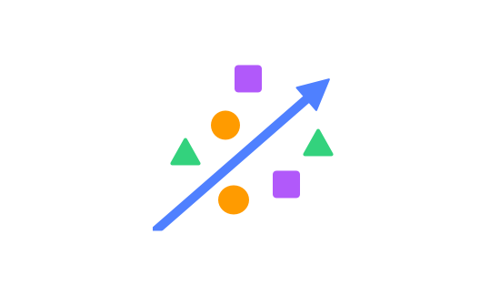
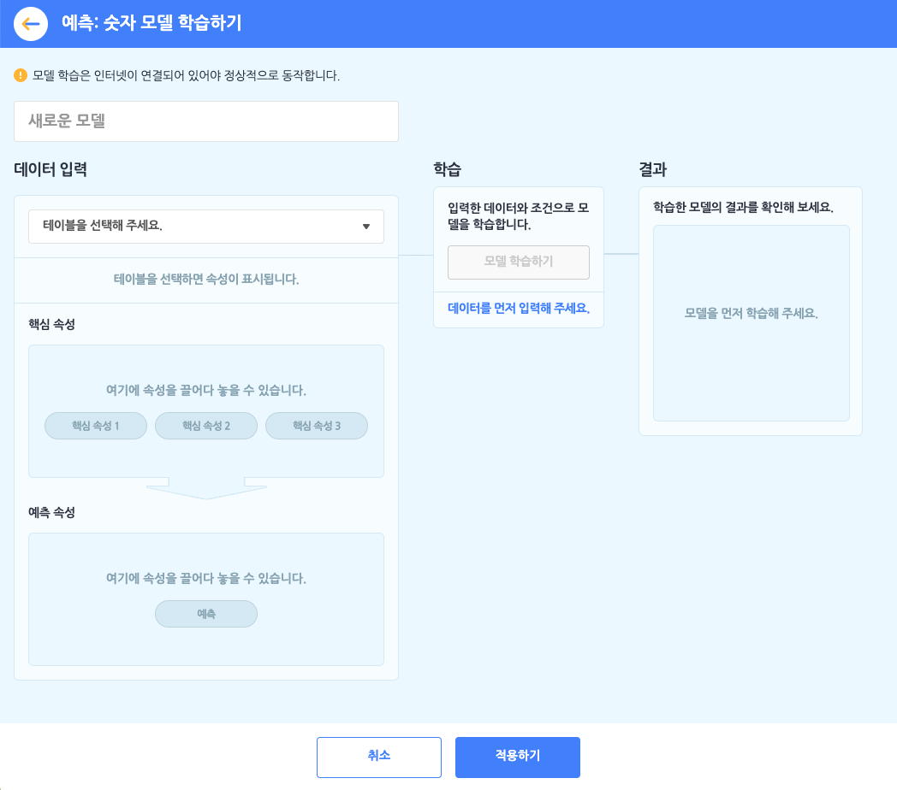
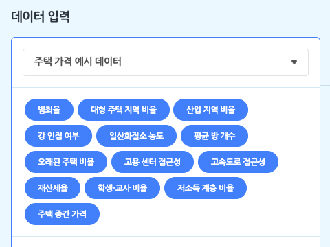
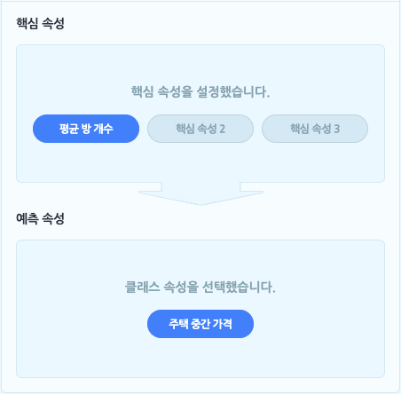
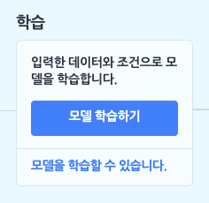
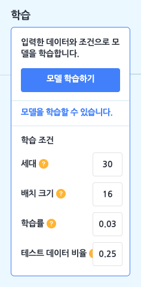
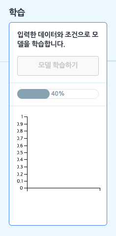
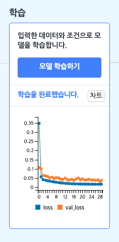
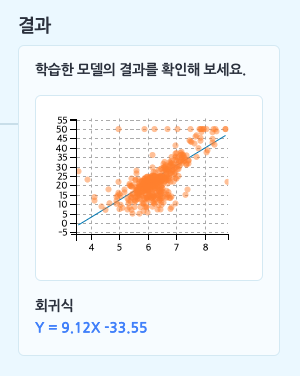
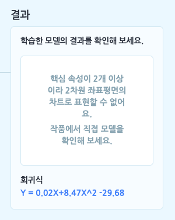

모델이 학습할 숫자를 테이블로 업로드하거나 직접 작성해 데이터로 입력하고, 입력한 데이터의 **몇몇 속성을 바탕으로 하나의 속성을 예측**하는 모델을 학습합니다.

+ 예측: 숫자 모델을 학습하려먼 **먼저 데이터로 삼을 테이블을 추가해야 합니다**. 학습하기 전에 데이터 분석 카테고리에서 [테이블 불러오기]를 통해, 기본 테이블, 파일 업로드, 새로 만들기의 방법으로 테이블을 추가 해주세요.

예측: 숫자 모델을 선택하면 아래와 같이 모델 학습하기 창이 나타납니다.

먼저 모델의 이름부터 지어볼까요? 이름 상자를 클릭해서 모델의 이름을 정합니다.

####  ① 데이터 입력하기 = 테이블 선택하기

예측: 숫자 모델 학습의 첫 단계는 데이터 입력 박스에서 모델의 데이터로 삼을 테이블을 선택하는 것이에요. 모델을 학습하기 전에, '데이터 분석 블록' 카테고리에서 테이블을 추가하는 것을 잊지 마세요!

목록 상자를 눌러 작품에 추가한 테이블 중에서 모델 학습에서 사용할 테이블을 선택하면, 바로 아래에 테이블의 속성이 표시됩니다. 여기서 표시되는 속성은 (1행을 제외한) 모든 행이 숫자로 이루어진 속성입니다. (숫자 데이터를 학습하는 모델이니 당연하겠죠?)

+ **핵심 속성**: 핵심 속성은 속성 중에서 '원인'에 해당하는 속성을 말합니다. 조금 어렵게 말하면 '독립 변수' 또는 '설명 변수'를 의미합니다. 
  모델이 학습할 때 어떤 속성을 원인으로 삼을 것인지를 선택하는 부분이에요.
  엔트리에서는 최대 3개까지 핵심 속성을 설정할 수 있습니다. 

  + 예를 들어, 어떤 지역에 있는 집의 '건축 연도', '역과의 거리', '면적'을 핵심 속성으로 삼는다고 생각해 보세요.

    

+ **예측 속성**: 예측 속성은 예측: 숫자 모델의 '결과'에 해당하는 예측 값이 되는 속성을 말합니다. 다르게 말하면 '종속 변수'에 해당해요.
  예측 모델이 학습의 결과로, 입력한 데이터를 어떤 속성의 값으로 예측할지 선택하는 부분이에요. 
  예측 속성도 핵심 속성과 마찬가지로 모든 행이 숫자로 이루어진 속성만 선택할 수 있어요.

  + 예를 들어, 집의 '월세'를 예측 속성으로 삼는다고 생각해 보세요.
    핵심 속성이 원인이고 예측 속성이 결과니까, 
    학습한 모델이  집의 '건축 연도', '역과의 거리', '면적'를 가지고 '월세'를 예측해낼 수 있겠죠?

    

#### ② 학습하기

이렇게 핵심 속성, 예측 속성을 설정하고 나면, 학습 박스의 [모델 학습하기] 버튼을 클릭할 수 있게 됩니다. 이 버튼을 눌러 학습을 바로 시작할 수도 있지만, '모델을 학습할 수 있습니다.' 글씨를 클릭해서 다양한 **학습 조건**을 설정할 수도 있어요.

+ **세대(Epoch)**
  입력한 데이터 전체를 몇 번 반복하여 학습할지 정하는 부분입니다. 입력한 모든 데이터 전체를 1번 학습하는 것을 1세대라고 부르고, 세대는 에포크라고도 불러요.

  다양한 문제(데이터)가 담긴 문제집 1권을 총 몇 번을 푸냐는 것과 같은 것이지요. 그러나 문제집을 1번만 봐서 문제를 잘 푸는 사람이 없듯이 1번만 학습하면 정확하지 않은 결과가 나올 수도 있어요. 반면 하나의 문제집만 너무 반복해서 학습하면 계속 같은 문제만 학습하다 보니 응용력이 부족해지겠죠?

  적당히 학습해야 좋은 결과를 얻을 수 있습니다.

+ **배치 크기(Batch Size)**
  입력한 데이터 전체를 얼마큼 작은 부분으로 쪼개서 학습할지 정하는 부분입니다.

  다양한 문제(데이터)가 담긴 문제집 1권에서 숙제를 어디서부터 어디까지 할지 범위를 정하는 것과 비슷해요. 숙제의 범위가 넓으면 문제집 한 권을 빠르게 끝낼 수 있고, 숙제의 범위가 좁으면 숙제를 여러 번 해야 문제집을 다 끝낼 수 있는 것과 같습니다.

+ **학습률(Learning Rate)**
  데이터를 얼마나 세세하게 학습할지를 정하는 부분입니다.

  모델이 계속 학습하면서 가장 나은 결과를 갖는 점을 찾아간다고 상상하면, 그 때의 보폭의 크기를 정하는 것과 같아요. 보폭이 작으면 가장 나은 결과를 찾을 수는 있겠지만 시간이 오래 걸릴 것이고, 보폭이 크면 가장 나은 결과를 자꾸 지나치면서 제대로 된 결과를 찾아내지 못 할 수 있어요.

+ **테스트 데이터 비율(Test Data Rate)**
입력한 데이터 중 어느정도 비율을 학습한 모델을 테스트하는 데에 사용할지 정하는 부분입니다.
  
  테스트 데이터 비율을 0.3로 정했다면 10개의 데이터를 입력했을 때 7개는 학습용으로,  3개는 테스트용으로 사용하겠다는 뜻이 돼요.

학습 조건을 기본값으로 두거나, 조건을 변경한 후 [모델 학습하기] 버튼을 클릭하면 모델 학습이 시작됩니다.

이렇게 학습을 모두 완료했다면, [차트] 버튼을 클릭해 학습한 과정을 그래프로도 확인할 수 있어요. 이 때, 예측 모델에서 보여주는 그래프는 모델의 정확도가 아니라 **평균 제곱 오차**(MSE)입니다. 평균 제곱 오차는 정확도와는 반대로 작으면 작을 수록 모델이 정확하다는 뜻이에요.

가로축은 세대(Epoch)를 나타냅니다. 세로축에서 **loss**는 학습 오차(MSE)를 의미하고, **val_loss**는 검증 오차를 나타냅니다. 오차가 0에 가까울수록 더 정확한 결과라는 것을 의미해요.

#### ③ 결과 확인하기

모델 학습이 모두 완료되었다면, 결과 박스에서 학습 결과를 확인할 수 있습니다.
예측 모델의 결과는 핵심 속성의 값을 대입하면 예측 값을 얻을 수 있는 함수 형태로 구해지는데요. 핵심 속성의 개수만큼 회귀식의 X(독립 변수)의 개수가 늘어납니다. 

핵심 속성을 1개, 예측 속성을 1개 설정했다면 모델이 만든 회귀식과 위와 같이 2차원 좌표 평면에서 점 차트와 회귀선(회귀식으로 그린 직선)을 확인할 수 있습니다.

+ 그어진 회귀선이 데이터를 가장 잘 표현하는 직선인지 확인해 보세요!

핵심 속성을 2개 이상 설정했다면 모델이 만든 회귀식을 확인할 수 있습니다. 단, 2차원에서 표현할 수 없기 때문에 차트는 표시되지 않습니다.

이제 예측 모델을 학습해 봤으니, 작품에서 한 번 활용해 볼까요?

## 1. 모델 다시 학습하기

모델을 다시 학습합니다. 

모델 설정을 변경하거나 입력 데이터가 되는 테이블의 내용을 수정했다면, 변경된 내용을 바탕으로 모델을 다시 학습합니다.

## 2. 모델이 학습되었는가?

모델의 학습 상태를 가져오는 판단 블록입니다.

모델이 학습되었다면 '참'을, 학습 중이거나 학습되지 않았다면 '거짓'으로 판단합니다.

## 3. 모델 `[보이기]`

모델의 학습 상태를 표시하는 창을 실행 화면에 보이게 하거나 숨깁니다.

목록 상자()를 클릭해서 보이기/숨기기를 선택할 수 있어요.

## 4. 모델 차트 창 `[열기]`

모델을 학습할 때 입력한 데이터와 모델이 분류한 클래스를 2차원 좌표평면에 나타낸 차트 창을 열거나 닫습니다.

핵심 속성이 2개 이상인 경우 모델의 차트를 2차원 좌표평면 위에 그릴 수 없기 때문에, 이 블록은 표시되지 않습니다. 

목록 상자()를 클릭해서 열기/닫기를 선택할 수 있어요.

## 5. 학습 조건 `[학습률]` 을 `(10)` 으로 바꾸기

선택한 학습 조건을 입력한 값으로 바꾸어 설정합니다.

변경한 학습 조건은 '모델 다시 학습하기' 블록으로 모델을 다시 학습할 때부터 적용됩니다.

세대가 자연수가 아닌 경우, 학습률과 테스트 데이터 비율이 0 보다 작거나 1보다 큰 경우에는 (조건이 옳지 않기 때문에) 작품 실행 시 오류가 발생합니다.

+ **학습 조건**
  + `학습률`,`  세대`, ` 테스트 데이터 비율`

## 6. 핵심 속성1 `(10)` 의 예측 값

핵심 속성의 값을 입력해 모델이 분류한 클래스를 가져오는 값 블록입니다. 

값은 숫자로 표현됩니다.

'핵심 속성1' 등은 모델 학습 시 선택한 속성 이름으로 표시되며, 설정한 핵심 속성의 개수에 따라 값 블록을 결합할 수 있는 개수도 함께 늘어납니다.

## 7. 결정 계수

모델의 결정 계수를 가져오는 값 블록입니다. 

모델이 얼마나 잘 예측하는지, 모델의 설명력을 표현하는 값입니다. 단, 모델의 정확도와 완전히 같은 것은 아니니 사용에 주의해 주세요.