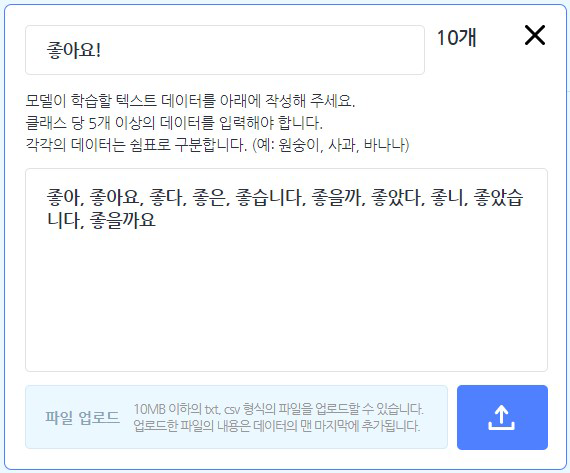

학습 데이터로 입력한 텍스트를 클래스로 직접 분류하고 학습시키면 새롭게 입력되는 텍스트를 분류할 수 있는 모델을 만들 수 있습니다. 텍스트의 **의미가 아니라 형태가 얼마나 비슷한지**를 기준으로 분류하는 모델이에요.

모델이 학습할 텍스트는 직접 작성하거나 txt, csv 파일로 업로드할 수 있어요. txt, csv 파일로 업로드하면 이미 입력된 내용의 맨 마지막에 추가됩니다.
+ 텍스트 모델은 고급 모드(학습 조건 설정 및 학습 차트 표시)를 지원하지 않습니다.

텍스트 모델을 선택하면 아래와 같이 텍스트 모델 학습하기 창이 나타납니다.

먼저 모델의 이름부터 지어볼까요? 이름 상자를 클릭해서 모델의 이름을 정합니다.

#### ① 클래스 만들기

모델 학습의 첫 단계는 데이터 입력 영역을 **클래스**로 채우는 것이에요. 클래스는 학습할 데이터의 묶음이고, 데이터를 분류하는 기준입니다.

[클래스 추가하기] 버튼을 클릭하면 클래스를 필요한 만큼 추가할 수 있어요.

각 클래스를 선택하면 자세한 정보와 함께 텍스트를 입력할 수 있어요. 이름 상자를 클릭하면 클래스의 이름을 정할 수 있습니다. 학습 모델이 알려주는 결과 값으로 클래스 이름을 사용하니까 클래스 이름을 알아보기 쉽게 정해주는 것이 중요해요.

각 클래스에 대해서 충분히 학습을 할 수 있도록 각 클래스마다 최소 5개 이상의 텍스트 데이터를 입력해야 합니다. 텍스트 데이터의 구분은 쉼표로 해주세요.

오른쪽 아래의 업로드 버튼을 클릭하면 텍스트 데이터를 텍스트 파일로 올릴 수도 있습니다. 파일은 10MB 이하여야 하고, txt, csv 형식(확장자)를 지원해요. 업로드하면 이미 입력된 내용의 맨 마지막에 추가합니다.

#### ② 학습 결과 확인하기

이렇게 2개 이상의 클래스를 만들고 나면, 학습 영역의 [모델 학습하기] 버튼을 클릭해서, 결과 박스에서 결과를 확인할 수 있습니다.

클래스에 텍스트를 입력한 것처럼, 텍스트를 입력해서 학습 모델이 텍스트를 제대로 학습했는지 확인할 수 있어요.

각 클래스에 얼마나 가까운지 막대 그래프로 비교해보세요!

## 1. 학습한 모델로 분류하기

데이터 입력 팝업 창을 열고, 입력한 데이터를 학습한 모델로 분류합니다.

동시에 작품을 일시 정지해요. 오른쪽 아래 버튼을 클릭해서 창을 닫지 않고도 작품을 다시 시작할 수 있습니다.

오른쪽 위의 [X] 버튼을 클릭하면, 데이터를 입력하지 않고 창을 닫을 수도 있어요.

## 2. `(엔트리)` 을(를) 학습한 모델로 분류하기

이 블록의 값 블록()에 입력한 텍스트를 학습한 모델로 분류합니다.

데이터 입력 팝업 창을 열지 않아도 돼요!

## 3. 분류 결과

입력한 데이터를 학습한 모델로 분류한 결과를 가져오는 값 블록입니다.

입력한 데이터와 가장 비슷한 클래스의 이름을 가져와요. 만일 데이터를 입력하지 않았다면 아무 것도 가져오지 않아요.

## 4. `[클래스]` 의 신뢰도

입력한 데이터가 분류된 클래스에 대한 신뢰도를 가져오는 값 블록입니다.

만일 데이터를 입력하지 않았다면 0 을 가져와요.

목록 상자()를 클릭하면 신뢰도를 가져올 클래스를 선택할 수 있어요.

## 5. <인식 결과가 `[클래스]` 인가?>

입력한 데이터가 선택한 클래스와 가장 비슷하다면 참, 아니라면 거짓으로 판단하는 블록입니다.

만일 데이터를 입력하지 않았다면 항상 거짓을 가져와요.

목록 상자()를 클릭하면 결과를 확인할 클래스를 선택할 수 있어요.
