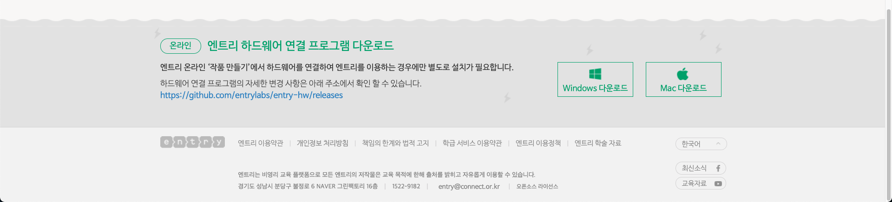
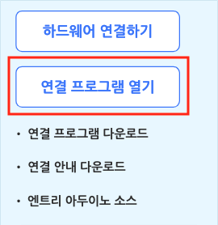
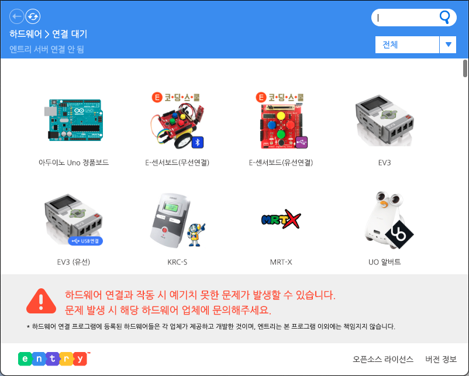
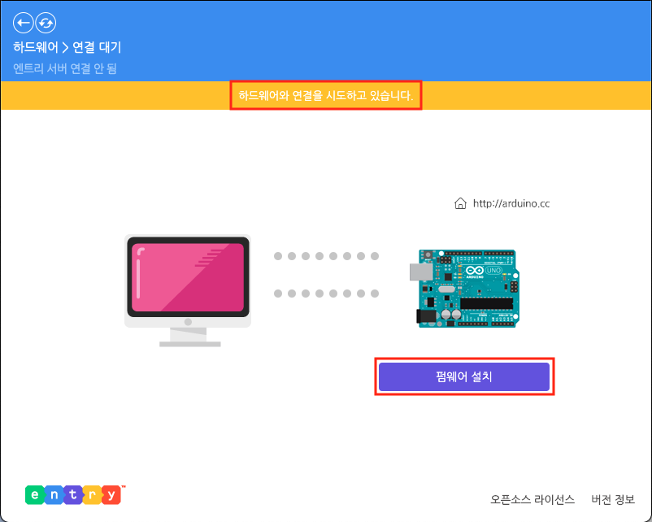
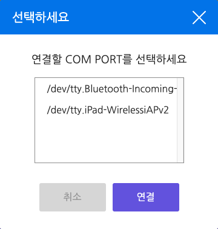
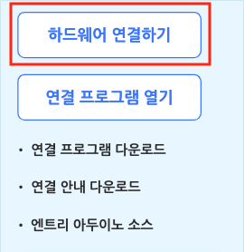
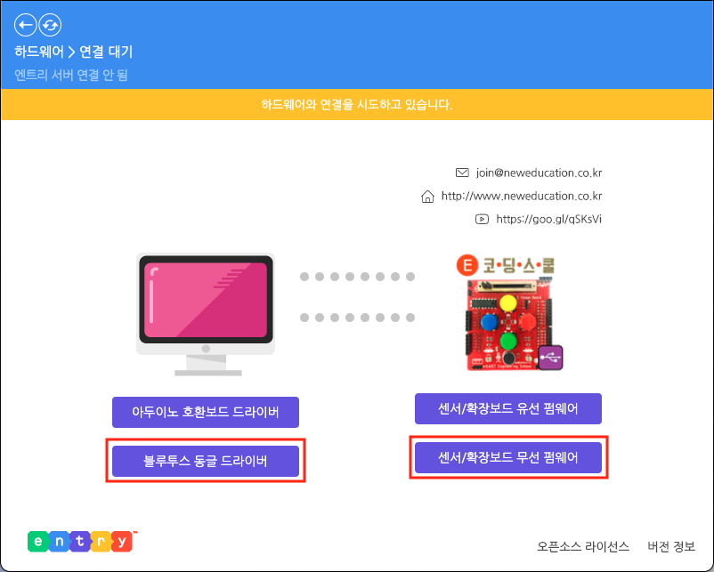
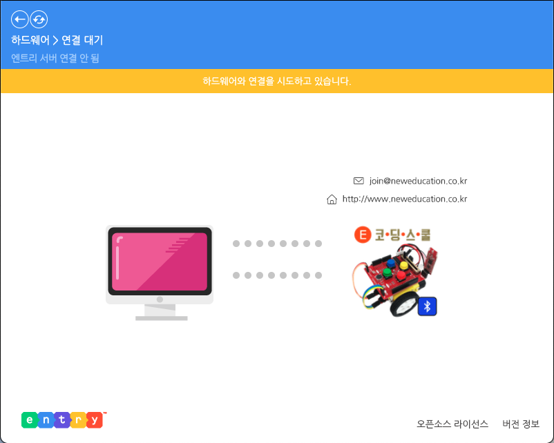

## 하드웨어

엔트리에 하드웨어를 연결하는 방법은 하드웨어에 따라 달라요. 이 튜토리얼에서는 두 가지 방법으로 설명하도록 하겠습니다.

### 1) 하드웨어 연결 프로그램 설치

##### ①  온라인 엔트리

하드웨어 블록 꾸러미에는 하드웨어 연결을 위한 다양한 메뉴가 있습니다. 연결에 성공하면 사용할 수 있는 블록이 나타날 거예요.

'연결 프로그램 다운로드' 글씨를 클릭해서 하드웨어 연결에 필요한 (운영체제에 맞는) 프로그램 설치 파일을 다운로드합니다.

+ '연결 안내 다운로드' 글씨를 클릭하면 하드웨어 연결 방법에 대한 자세한 설명 파일을 다운로드할 수 있습니다.
+ '엔트리 아두이노 소스' 글씨를 클릭하면 엔트리로 아두이노에 명령할 수 있도록 아두이노에 업로드하기 위한 ino 형식(확장자)의 파일을 다운로드합니다. <!--연결 프로그램에서 펌웨어를 업로드하는 것과 어떤 차이가 있나요?-->

또는 엔트리 상단 바 > 다운로드 > 페이지 아래의 '엔트리 하드웨어 연결 프로그램 다운로드'를 통해 설치 파일을 다운로드할 수 있어요.

다운로드한 연결 프로그램을 설치했다면, 생성한 실행 아이콘을 더블 클릭하거나 위와 같이 '연결 프로그램 열기' 버튼을 클릭해서 프로그램을 실행해요.

'연결 프로그램 열기' 버튼을 클릭해서 프로그램을 실행해야, 한 대의 컴퓨터에 여러 대의 모니터를 연결해 사용하는 클라우드 PC 환경에서 정상 작동합니다.

##### ② 오프라인 엔트리

오프라인 엔트리는 하드웨어 연결 프로그램을 기본으로 가지고 있는 덕분에 따로 프로그램을 설치하지 않아요.

바로 '연결 프로그램 열기' 버튼을 클릭하면 하드웨어 연결 창을 열 수 있습니다.

<!--어떤 조건에서 버튼이 이렇게 바뀌는지 잘 모르겠습니다.-->

한 대의 컴퓨터에 여러 대의 모니터를 연결해 사용하는 클라우드 PC 환경에서....

### 2) 하드웨어 찾기

하드웨어 연결 프로그램 창입니다.

연결하려는 하드웨어를 찾아서 클릭하면 연결 화면이 나타나요.

클라우드 PC 연결을 시도한다면 위에 '클라우드 모드' 표시가 나타납니다.

오른쪽 위의 검색창을 통해 원하는 하드웨어의 이름을 검색할 수 있어요.

검색창 아래의 목록 상자에서 카테고리를 선택하면 원하는 하드웨어를 더 쉽게 찾을 수 있습니다.

### 3) 아두이노 연결

'아두이노 Uno 정품보드'를 클릭한 화면입니다.

위의 노란색 영역에 '펌웨어를 선택해주세요.'가 나타나면 아래의 '펌웨어 설치' 버튼을 클릭해요.

펌웨어를 설치하고, 위의 노란색 영역에 '펌웨어가 업로드 되었습니다.'가 잠깐 나타나면 연결 성공입니다.

'아두이노 Uno 호환보드', 'E-센서보드' 등의 하드웨어는 연결할 포트를 선택하는 팝업 창이 나타날 수 있습니다. 이 때, 팝업 창이 열린 상태에서 포트를 연결하면 하드웨어를 연결한 포트를 쉽게 알 수 있어요.

하드웨어 연결 프로그램 창에서 연결에 성공했다면 자동으로 엔트리와 연결되어 해당 하드웨어 블록이 나타납니다.

연결에 성공했는데도 블록이 나타나지 않는다면, '하드웨어 연결하기' 버튼을 클릭하면 직접 엔트리와 연결할 수 있어요.

아래는 아두이노를 연결했을 때 사용할 수 있는 블록입니다.

-----

#### 1. (아날로그 `([0])` 번 센서값)

아날로그 핀 센서값을 가져오는 값 블록입니다.

아날로그 핀 센서값은 0~1023 범위의 값을 가져요.

목록 상자()를 클릭하면 0~5 범위에서 핀 순서를 선택할 수 있어요.

-----

#### 2. <디지털 `([0])` 번 센서값>

디지털 핀이 켜져 있다면 참, 아니라면 거짓으로 판단하는 블록입니다.

아날로그 핀 역시 디지털 핀처럼 사용할 수 있답니다. 아날로그 핀 센서값이 0 일 때 참, 1023 일 때 거짓으로 판단해요.

목록 상자()를 클릭하면 0~13 범위에서 핀 순서를 선택할 수 있어요.

-----

#### 3. 디지털 `([0])` 번 핀 `[켜기]`

디지털 핀을 켜꺼나 끕니다.

만일  PWM 핀(`3`, `5`, `6`, `9`, `10`, `11`)을 선택했다면 출력값을 255 로 정해요.

목록 상자()를 클릭하면 0~13 범위에서 핀 순서를 선택할 수 있어요.

-----

#### 4. 디지털 `([3])` 번 핀을 `(255)` (으)로 정하기

펄스값을 입력할 수 있는 디지털 핀(PWM)의 출력값을 입력한 값()으로 정합니다.

기본 출력값은 0 이고, 0~255 범위에서 조절할 수 있어요.

목록 상자()를 클릭하면 PWM 핀을 선택할 수 있어요.

+ **선택할 수 있는 핀**
  + `3`, `5`, `6`, `9`, `10`, `11`

-----

#### 5. (`(아날로그 ([0]) 번 센서값)` 값의 범위를 `(0)` ~ `(1023)` 에서 `(0)` ~ `(100)` (으)로 바꾼 값)

아날로그 핀 센서값의 범위를 첫 번째로 입력한 범위( ~ )에서 두 번째 범위( ~ )로 바꾼 값을 가져오는 값 블록입니다.

목록 상자()를 클릭하면 0~5 범위에서 핀을 선택할 수 있어요.

-----

### 4) E-센서보드 연결

##### ① 유선 연결

'E-센서보드(유선연결)'을 선택한 화면입니다.

먼저 '아두이노 호환보드 드라이버' 버튼을 클릭해서 드라이버를 설치합니다. (최초 한 번만 설치하면 됩니다.)

위의 노란색 영역에 '펌웨어를 선택해주세요.'가 나타나면 아래의 '센서/확장보드 유선 펌웨어' 버튼을 클릭해요.

펌웨어를 설치하고, 위의 노란색 영역에 '펌웨어가 업로드 되었습니다.'가 나타나면 연결에 성공합니다.

+ '펌웨어를 선택해주세요'가 나타나지 않는다면  연결한 포트를 다른 포트에 꽂아보세요.
+ (하드웨어 연결 프로그램에서) 연결에 성공했을 때, 프로그램을 종료하면 연결도 끊깁니다. 연결을 유지하기 위해 창을 최소화하는 것을 권장합니다.

##### ② 무선 연결

무선 연결이 가능한 E-센서로봇은 블루투스 동글로 엔트리에 연결할 수 있어요. E-센서보드를 무선으로 연결하려면 기기(컴퓨터)에 연결한 블루투스 동글과 페어링 상태여야 합니다.

E-센서보드를 무선으로 연결하는 방법은 두 가지가 있습니다.

###### 방법 1) 'E-센서보드(유선연결)' 선택

'E-센서보드(유선연결)'을 선택하고, E-센서보드 블루투스 동글을 선택한 후 '연결' 버튼을 클릭합니다. 이 때, 팝업 창이 열린 상태에서 포트를 연결하면 하드웨어를 연결한 포트를 쉽게 알 수 있어요.

먼저 '블루투스 동글 드라이버' 버튼을 클릭해서 드라이버를 설치합니다. (최초 한 번만 설치하면 됩니다.)

위의 노란색 영역에 '펌웨어를 선택해주세요.'가 나타나면 '센서/확장보드 무선 펌웨어' 버튼을 클릭해요.

펌웨어를 설치하고 위의 노란색 영역에 '펌웨어가 업로드 되었습니다.'가 나타나면 연결에 성공합니다! 

+ '펌웨어를 선택해주세요.'가 나타나지 않는다면  연결한 포트를 다른 포트에 꽂아보세요.

###### 방법 2) 'E-센서보드(무선)' 선택

'E-센서보드(무선연결)'을 선택하고, E-센서보드 블루투스 동글을 선택한 후 '연결' 버튼을 클릭합니다.       이 때, 팝업 창이 열린 상태에서 포트를 연결하면 하드웨어를 연결한 포트를 쉽게 알 수 있어요.

'E-센서보드(무선연결)'을 선택한 화면입니다.

위의 노란색 영역에 '하드웨어가 업로드 되었습니다.'가 나타나면 연결에 성공합니다!

+ (하드웨어 연결 프로그램에서) 연결에 성공했을 때, 프로그램을 종료하면 연결도 끊깁니다. 연결을 유지하기 위해 창을 최소화하는 것을 권장합니다.

하드웨어 연결 프로그램 창에서 연결에 성공했다면 자동으로 엔트리와 연결되어 해당 하드웨어의 블록이 나타납니다.

연결에 성공했는데도 블록이 나타나지 않는다면, '하드웨어 연결하기' 버튼을 클릭하면 직접 엔트리와 연결할 수 있어요.

하드웨어 블록은 연결한 하드웨어의 특징에 따라 알아보기 쉽도록 블록마다 이름이 있습니다. 예를 들어, 아두이노에 E-센서보드를 장착해서 엔트리에 연결하면 E-센서보드에 있는 센서와 4색 버튼, 4색 LED를 이용하는 블록이 나타납니다.

-----

#### 1. (`[소리]` 센서값)

E-센서보드의 센서값을 가져오는 값 블록입니다.

목록 상자()를 클릭하면 값을 가져올 센서를 선택할 수 있어요.

+ **선택할 수 있는 센서**
  + `소리` : 아날로그 0 번 핀
  + `빛 감지 `: 아날로그 1 번 핀
  + `슬라이더 `: 아날로그 2 번 핀
  + `온도 `: 아날로그 3 번 핀

-----

#### 2. <`[빨간]` 버튼을 눌렀는가?>

선택한 색의 버튼을 눌렀다면 참, 아니라면 거짓으로 판단하는 블록입니다.

목록 상자()를 클릭하면 버튼의 색을 선택할 수 있어요.

+ **선택할 수 있는 색**
  + `빨간` : 디지털 8 번 핀
  + `파란` : 디지털 9 번 핀
  + `노랑` : 디지털 10 번 핀
  + `초록` : 디지털 11 번 핀

-----

#### 3. `[빨간]` LED `[켜기]`

선택한 색의 LED를 켜거나 끕니다.

목록 상자()를 클릭하면 LED를 선택할 수 있어요.

+ **선택할 수 있는 색**
  + `빨간` : 디지털 2 번 핀
  + `파란` : 디지털 3 번 핀
  + `노랑` : 디지털 4 번 핀
  + `초록` : 디지털 5 번 핀

-----

(아래부터는 아두이노의 블록과 같습니다.)

#### 4. (아날로그 `([0])` 번 센서값)

아날로그 핀 센서값을 가져오는 값 블록입니다.

아날로그 핀 센서값은 0~1023 범위의 값을 가져요.

목록 상자()를 클릭하면 0~5 범위에서 핀 순서를 선택할 수 있어요.

-----

#### 5. <디지털 `([0])` 번 센서값>

디지털 핀이 켜져 있다면 참, 아니라면 거짓으로 판단하는 블록입니다.

아날로그 핀 역시 디지털 핀처럼 사용할 수 있답니다. 아날로그 핀 센서값이 0 일 때 참, 1023 일 때 거짓으로 판단해요.

목록 상자()를 클릭하면 0~13 범위에서 핀 순서를 선택할 수 있어요.

-----

#### 6. 디지털 `([0])` 번 핀 `[켜기]`

디지털 핀을 켜꺼나 끕니다.

만일  PWM 핀(`3`, `5`, `6`, `9`, `10`, `11`)을 선택했다면 출력값을 255 로 정해요.

목록 상자()를 클릭하면 0~13 범위에서 핀 순서를 선택할 수 있어요.

-----

#### 7. 디지털 `([3])` 번 핀을 `(255)` (으)로 정하기

펄스값을 입력할 수 있는 디지털 핀(PWM)의 출력값을 입력한 값()로 정합니다.

기본 출력값은 0 이고, 0~255 범위에서 조절할 수 있어요. 

목록 상자()를 클릭하면 PWM 핀을 선택할 수 있어요.

+ **선택할 수 있는 핀**
  + `3`, `5`, `6`, `9`, `10`, `11`

-----

#### 8. (`(아날로그 ([0]) 번 센서값)` 값의 범위를 `(0)` ~ `(1023)` 에서 `(0)` ~ `(100)` (으)로 바꾼 값)

아날로그 핀 센서값의 범위를 첫 번째로 입력한 범위( ~ )에서 두 번째 범위( ~ )로 바꾼 값을 가져오는 값 블록입니다.

목록 상자()를 클릭하면 0~5 범위에서 핀을 선택할 수 있어요.

