## 속성 탭

#### 1) 속성 목록

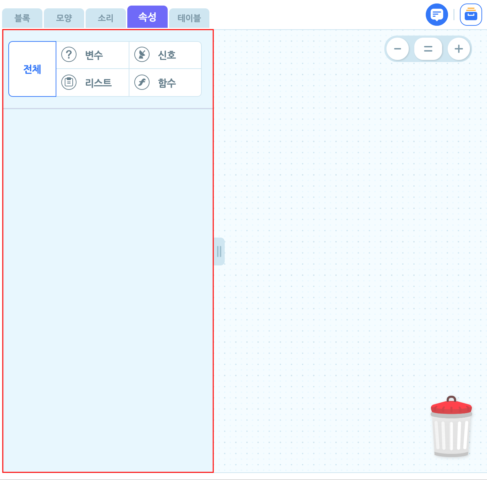

여러분의 작품에서 사용하는 다양한 속성을 관리하는 영역입니다.

카테고리를 클릭하면 모든 속성을 보거나, **변수**, **리스트**, **신호**, **함수**로 나누어 볼 수 있어요.

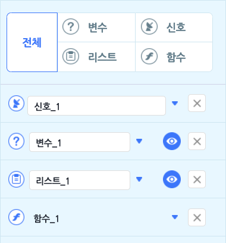

카테고리의 각 항목 사용법은 다음과 같습니다. 

+ 이름 상자를 클릭해서 이름을 수정합니다.
+ 왼쪽의 아이콘으로 각 속성의 종류를 구분합니다.
+ 이름 상자 오른쪽의 역삼각형 버튼을 클릭해서 속성을 관리합니다.
+ 오른쪽의 X 버튼을 클릭해서 속성을 삭제합니다.
+ 변수/리스트는 오른쪽의 눈 버튼을 클릭해서 실행 화면에서 나타내거나 숨깁니다.

-----

#### 2) 변수

변수는 변하는 수를 담는 속성입니다. 더 쉽게 말하면, 어떤 숫자든 담을 수 있는 상자예요.

엔트리의 변수는 숫자와 문자를 가질 수 있어요.

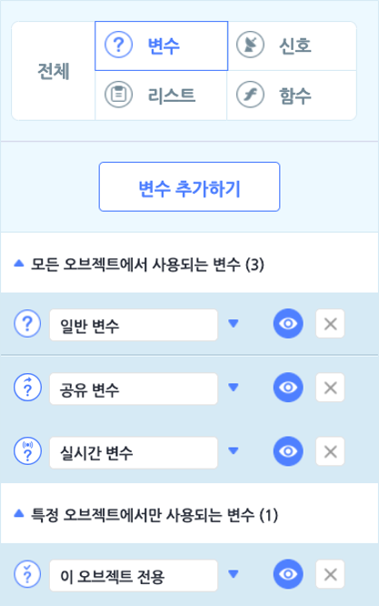

'변수' 카테고리를 선택해서 변수를 추가하거나 모아봅니다.

변수의 종류는 네 가지고, 모든 오브젝트에서 사용하는 변수와 특정 오브젝트에서만 사용하는 변수로 분류합니다. 

왼쪽의 아이콘으로 변수의 종류를 확인할 수 있어요.

'변수 추가하기' 버튼을 클릭하면 변수의 이름과 종류를 선택할 수 있어요.

+ **모든 오브젝트에 사용**
  +  **일반 변수로 사용 (작품에 저장)**  : 작품을 정지하면 기본값으로 초기화하는 변수입니다.
  
  +  **공유 변수로 사용 (서버에 저장)** : 작품을 정지하면 서버에 저장하는 변수입니다.
  
  +  **실시간 변수로 사용 (서버에 저장)** : 작품을 실행하는 도중에 실시간으로 서버에 저장하는 변수입니다.
  
    
  
+  **이 오브젝트에서 사용** : 선택한 오브젝트에서만 사용하는 일반 변수입니다. 해당 오브젝트의 복제본도 다른 오브젝트가 사용할 수 없는 변수를 가집니다.

  

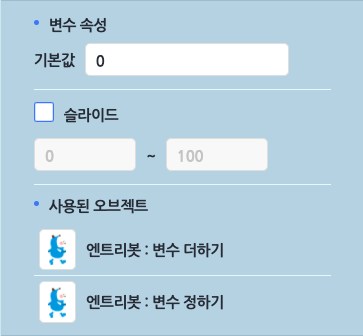

역삼각형 버튼을 클릭하면 나타나는 각 변수의 설정입니다.

+ **변수 속성**

  + **기본값** : 변수가 작품을 실행할 때부터 가질 값을 정합니다.

  + **슬라이드** : 실행 화면에서 이 변수의 슬라이드를 보이거나 숨깁니다. 최댓값과 최솟값 사이에서 사용자가 변수를 직접 조절할 수 있습니다. 

    아래는 최솟값이 0, 최댓값이 100일 때 슬라이드 손잡이가 가운데에 위치할 때의 모습입니다.

    

    ​                                                                                                         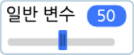   

    

+ **사용된 오브젝트** : 어떤 오브젝트가 이 변수를 어떻게 사용하는지 확인합니다. 각 정보를 클릭하면, 이 변수를 사용하는 장면과 오브젝트를 선택하고 블록을 강조 표시합니다. 일일이 찾지 않아도 클릭 한 번으로 찾을 수 있어요. 

  + 변수 더하기 : 사용된 오브젝트에 변수를 더합니다.
+ 변수 정하기 : 사용된 오브젝트의 변수를 정합니다. 

-----

#### 3) 리스트

변수는 변하는 수를 담는 속성입니다. 더 쉽게 말하면, 어떤 숫자든 담을 수 있는 상자예요.

예를 들어, 오브젝트 목록도 다양한 오브젝트를 추가하고 삭제할 수 있으므로 리스트와 같아요.

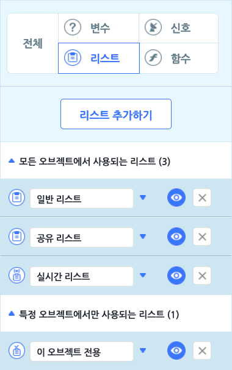

'리스트' 카테고리를 선택해서 리스트를 추가하거나 모아봅니다.

리스트의 종류는 네 가지고, 모든 오브젝트에서 사용하는 리스트와 특정 오브젝트에서만 사용하는 리스트

로 분류합니다. 왼쪽의 아이콘으로 리스트의 종류를 확인할 수 있어요.

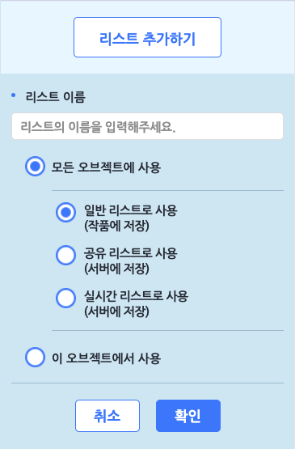

'리스트 추가하기' 버튼을 클릭하면 리스트의 이름과 종류를 선택할 수 있어요.

+ **모든 오브젝트에 사용**
  +  **일반 리스트로 사용 (작품에 저장)** : 작품을 정지하면 기본값으로 초기화하는 리스트입니다.
  
  +  **공유 리스트로 사용 (서버에 저장)** : 작품을 정지하면 서버에 저장하는 리스트입니다.
  
  +  **실시간 리스트로 사용 (서버에 저장)** : 작품을 실행하는 도중에 실시간으로 서버에 저장하는 리스
  
    트입니다.
    
    
  
+  **이 오브젝트에서 사용** : 선택한 오브젝트에서만 사용하는 일반 리스트입니다. 해당 오브젝트의 복제본 

  역시 다른 오브젝트가 사용할 수 없는 리스트를 가집니다.

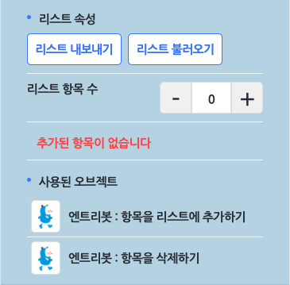

역삼각형 버튼을 클릭하면 나타나는 각 리스트의 설정입니다.

+ **리스트 속성**
  + **리스트 내보내기** : 이 버튼을 클릭하면 리스트 항목의 내용을 복사하거나, 엑셀로 내려받을 수 있는 팝업 창이 나타납니다.

    

    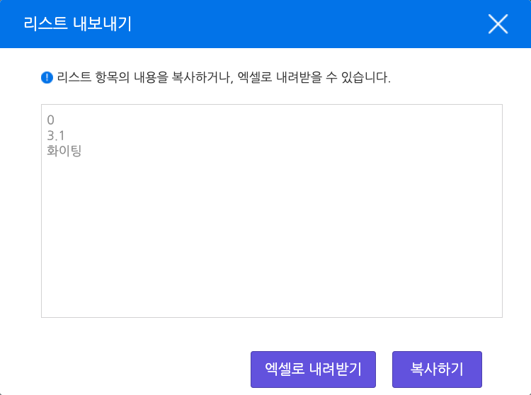

     

    

  + **리스트 불러오기** : 이 버튼을 클릭하면 리스트의 항목을 올릴 수 있는 팝업 창이 나타납니다. 한 줄이 하나의 항목이며, 기존의 리스트 항목이 있다면 새로 올리는 항목으로 변경합니다.

    

    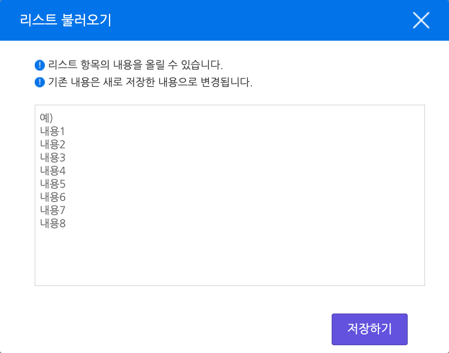

     

  + **리스트 항목 수** : 오른쪽의 '-'와 '+'를 클릭하거나 직접 개수를 입력해서 리스트의 항목 수를 추가 또는 삭제합니다.

    

    ​                                                     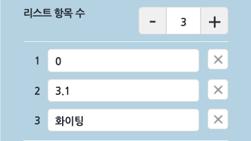 

    

+ **사용된 오브젝트** : 어떤 오브젝트가 이 리스트를 어떻게 사용하는지 확인할 수 있습니다. 각 정보를 클

  릭하면, 이 리스트를 사용하는 장면과 오브젝트를 선택하고 블록을 강조 표시합니다. 일일이 찾지 않

  아도 클릭 한 번으로 찾을 수 있어요. <!--이미지 설명이 필요하면 추가 예정입니다.-->

-----

#### 4) 신호

신호는 하나 또는 여러 오브젝트에게 원하는 시점에 명령할 수 있는 기능입니다. 마치 방송국에서 신호를 보내면 전국의 라디오로 동시에 같은 방송을 들을 수 있는 것처럼요.

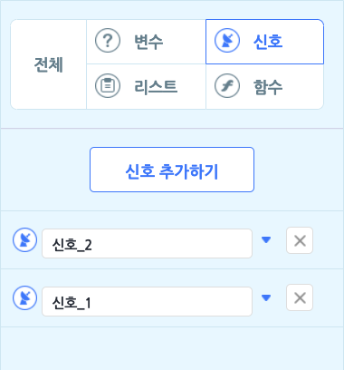

'신호' 카테고리를 선택해서 신호를 추가하거나 모아봅니다.

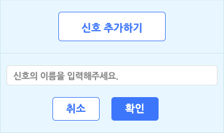

'신호 추가하기' 버튼을 클릭하면 이름을 입력하고 신호를 추가할 수 있습니다.

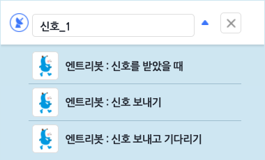

역삼각형 버튼을 클릭하면 어떤 오브젝트가 이 신호를 어떻게 사용하는지 확인할 수 있습니다.

각 정보를 클릭하면, 이 신호를 사용하는 장면과 오브젝트를 선택하고 블록을 강조 표시합니다. 일일이 찾

지 않아도 클릭 한 번에 찾을 수 있어요. <!--이미지 설명이 필요하면 추가 예정입니다.-->

-----

#### 5) 함수

함수는 여러 블록을 조립한 것을 하나의 블록처럼 사용할 수 있는 편리한 기능입니다. 하나의 용도이거나 여러 번 사용해야 하는 블록 모음을 하나의 함수 블록으로 만들 수 있어요.
마치 '집 밖으로 나가기'라는 하나의 목표를 위해 양치를 하고, 양말을 신고, 현관문을 열어야 하는 것처럼요. 

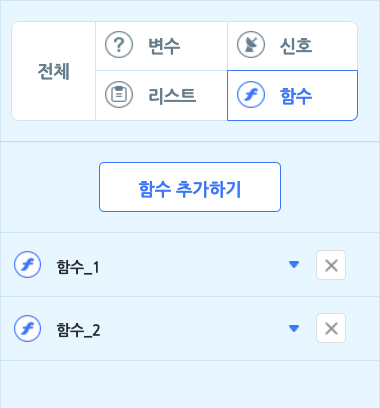

'함수' 카테고리를 선택해서 함수를 추가하거나 모아봅니다.

'함수 추가하기' 버튼을 클릭하면 함수 블록 조립소에서 함수를 만들 수 있어요.

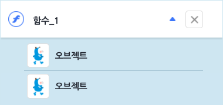

역삼각형 버튼을 클릭하면 어떤 오브젝트가 이 함수를 사용하는지 확인할 수 있습니다.

각 정보를 클릭하면, 해당 함수 블록을 사용하는 장면과 오브젝트를 선택하고 블록을 강조합니다. 

