## 모양 탭

#### 1) 모양 목록

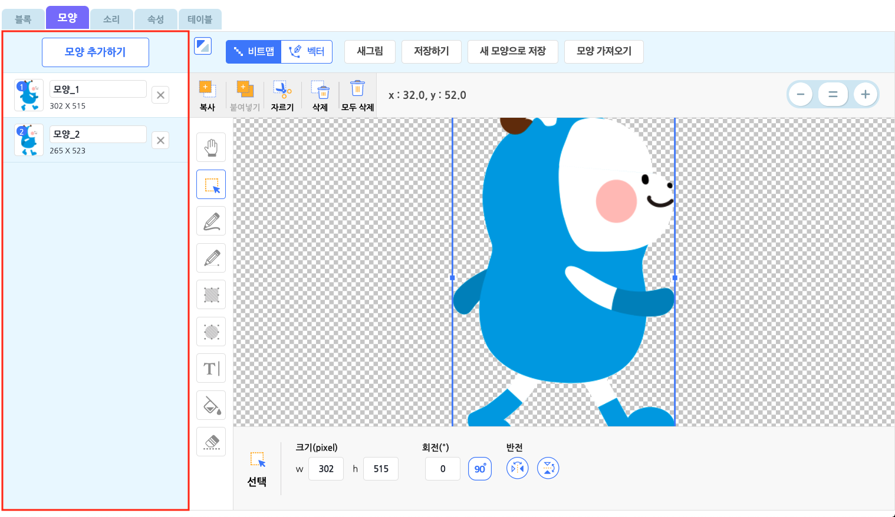

오브젝트의 모양을 추가 또는 관리하는 영역입니다.

모든 오브젝트에는 하나의 모양 목록이 있어요. '모양 추가하기' 버튼을 통해 원하는 모양을 이 목록에 추가할 수 있습니다. 조금 더 자세히 살펴볼까요? 

이름 상자를 클릭해서 이름을 수정하고 오른쪽의 X 버튼을 클릭해서 삭제합니다.

왼쪽의 썸네일 아이콘을 드래그해서 모양 목록의 순서를 바꿀 수 있습니다.  모양의 번호를 이용하는 블록이 있으니 순서를 잘 정해두는 것이 좋겠죠?

+ 모양을 마우스 오른쪽 클릭하면 나타나는 메뉴

  

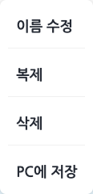

모든 오브젝트에는 항상 한 개 이상의 모양이 있어야 합니다. 오브젝트에 모양이 하나만 남았다면, 더 이상 모양을 삭제할 수 없어요!

-----

#### 2) 모양 추가 팝업

+ '모양 추가하기' 버튼을 클릭하면 나타나는 팝업 창

  

모양을 선택하고, 아래의 '추가하기' 버튼을 클릭해서 모양 목록에 추가해요.

오른쪽 위의 검색창을 통해 원하는 모양의 이름을 검색할 수 있어요. 왼쪽의 카테고리를 참고하면 원하는 모양을 더 쉽게 찾을 수 있습니다.

##### ① 모양 선택

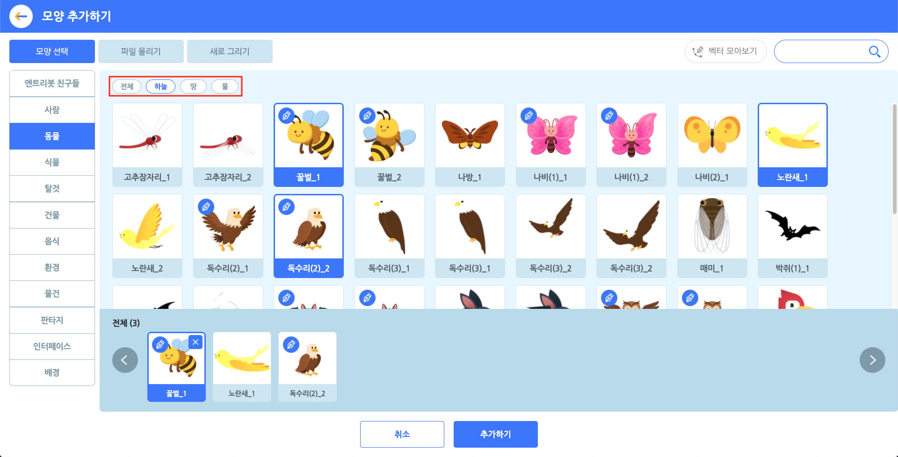

원하는 모양을 클릭해서 선택합니다. 중복 선택이 가능해요. 선택한 모양은 아래의 선택 목록 영역에서 볼 

수 있어요. 선택한 모양을 다시 클릭하거나, 선택 목록의 모양에 마우스 포인터를 가져갔을 때 나타나는 X 

표시를 누르면 선택을 해제할 수 있습니다. 일부 카테고리의 모양은 태그로 분류해요. 모양 선택 영역 상단

의 태그를 선택하면 원하는 모양을 더 쉽게 찾을 수 있습니다.

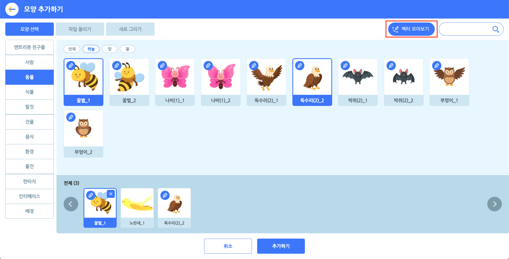

오른쪽 상단의 '벡터 모아보기' 버튼을 클릭하면 벡터 모양만 모아볼 수 있습니다.

각 모양의 좌측 상단에 있는 만연필 아이콘으로 벡터 모양을 구분할 수 있어요.

벡터를 포함한 모양은 앞으로도 엔트리에 계속 추가될 예정이니, 지켜봐주세요!

##### ② 파일 올리기

원하는 모양을 직접 올릴 수도 있어요.

모양 파일의 용량은 10MB 이하여야 하고, jpg, png, bmp, svg 형식(확장자)의 파일을 지원해요. jpg, png, 

bmp 형식은 비트맵 모드, svg 형식은 벡터 모드로 적용합니다.

올린 모양은 파일 올리기 목록에서 볼 수 있습니다. 파일을 올리면 기본적으로 선택한 상태가 되며 선택

한 모양만 모양 목록에 추가됩니다. 

> 아래와 같은 그림은 이용약관 및 관련 법률에 의해 제재를 받을 수 있습니다.
>
> + 폭력적이고 잔인한 그림
> + 선정적인 내용의 그림
> + 불쾌감을 주거나 혐오감을 일으키는 그림
> + 무단 사용이 금지된 저작권의 그림 [[저작권에 대해 알아보기]](https://playentry.org/#!/terms/project)

##### ③ 새로 만들기

원하는 모양을 찾을 수 없다고요? 그럼 직접 그려보는 것은 어떨까요!

그림을 직접 그려서 모양으로 저장할 수 있습니다. 아래 '이동하기' 버튼을 클릭해서 새로 그릴 모양을 목록

에 추가해요. 뭐든 그릴 수 있는 도화지를 추가하는 셈이죠!

> 아래와 같은 모양은 이용약관 및 관련 법률에 의해 제재를 받을 수 있습니다.
>
> + 폭력적이고 잔인한 그림
> + 선정적인 내용의 그림
> + 불쾌감을 주거나 혐오감을 일으키는 그림
> + 무단 사용이 금지된 저작권의 그림 [[저작권에 대해 알아보기]](https://playentry.org/#!/terms/project)

-----

#### 3) 그림판

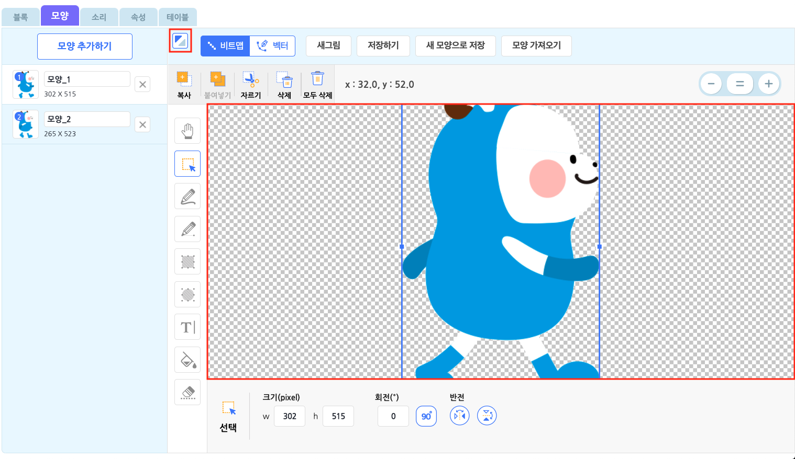

오브젝트의 모양을 그리거나 편집할 수 있는 공간입니다.

영역이 좁아서 불편하시나요? 좌측 상단의 최대화 버튼을 클릭하면 더 넓게 볼 수 있습니다.

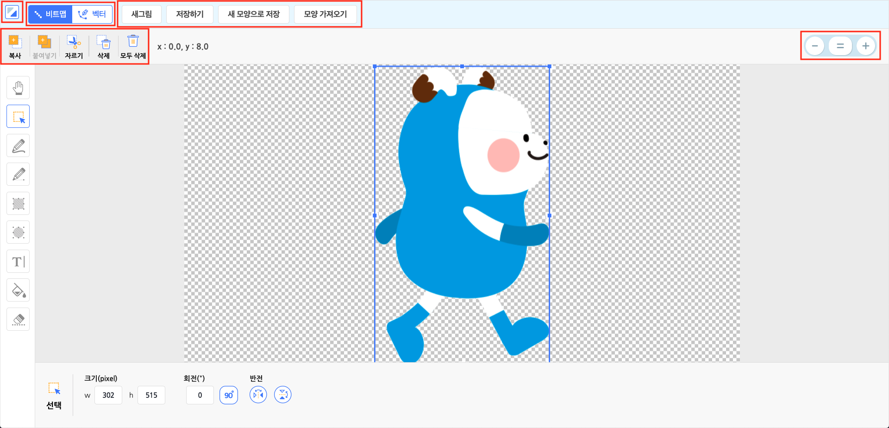

좌측 상단의 버튼을 다시 눌러 원래의 크기로 축소할 수 있습니다.

그림판에는 다양한 기능이 있어요! 각 영역 별로 나누어 살펴봅시다.

+ **새그림/ 저장하기/ 새 모양으로 저장/ 모양 가져오기**

  

  

  

  + **새 그림** : '새로 만들기'처럼 그림이 없는 모양을 그림 목록에 추가합니다.
  + **저장하기** : 현재 그림을 저장합니다.
  + **새 모양으로 저장** : 현재 모양을 유지하고 새 모양으로 추가해서 저장합니다.
  + **모양 가져오기** : 그림판에 원하는 모양을 추가합니다.

​		 

+ **복사/ 붙여넣기/ 자르기/ 삭제/ 모두 삭제**

  

  

  

  + **복사** : 선택한 영역의 그림을 복사합니다.

  + **붙여넣기** : 복사한 그림을 그림판에 붙여넣습니다. 

  + **자르기** : 선택한 영역의 그림을 복사하고 삭제합니다.

  + **삭제** : 선택한 영역의 그림을 삭제합니다.

  + **모두 삭제** : 이 그림판의 모든 그림을 삭제합니다.

    

​		일부 기능은 단축키로도 편리하게 사용할 수 있어요.

| 기능             | 단축키 (윈도우/맥 공통)                                      |
| ---------------- | ------------------------------------------------------------ |
| 복사             | `ctrl` + `c`                                                 |
| 붙여넣기         | `ctrl` + `v`                                                 |
| 삭제             | `del`                                                        |
| 선택한 그림 이동 | `위쪽 화살표`, `아래쪽 화살표`, `오른쪽 화살표`, `왼쪽 화살표` |

+ **확대/ 축소 기능**

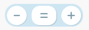

그림판의 우측 상단에 위치한 이 버튼을 클릭해서 그림을 확대/축소 또는 표준 크기로 조절해요.

표준 크기는 100%이고, 30%~250% 사이의 크기로 조절할 수 있습니다. 

그림을 더욱 세밀하고 수월하게 그릴 수 있겠네요!

**① 비트맵**

그림판의 모드를 선택할 수 있습니다. **비트맵**과 **벡터**를 지원해요.

비트맵은 픽셀(pixel)의 집합으로 표현하는 형식의 그림입니다. 더 쉽게 말하면, 점들이 모여서 나타내는 그

림이에요. 따라서 확대/축소 기능으로 비트맵 그림을 확대해보면 정사각형이 점처럼 그림을 이루고 있는 

것을 볼 수 있습니다. 인터넷 상의 그림 대부분이 비트맵인 만큼 가장 일반적인 그림 형식이랍니다!

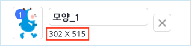

모양에 표시되는 숫자는 이 그림의 해상도입니다. 이 그림이 가로, 세로로 몇 개의 점을 차지하는지 알 수 

있어요. 그림의 해상도는 오브젝트의 크기에도 영향을 줍니다.

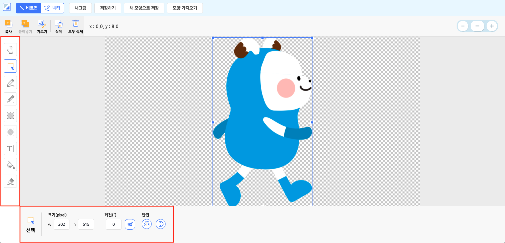

그림판의 좌측에는 그림 도구가 있습니다. 비트맵 모드의 각 도구를 클릭하면 하단의 영역에서 해당 도구

의 속성을 볼 수 있어요. 한 번 자세히 알아볼까요? 

+ **이동** : 그림판을 드래그해서 공간을 움직입니다.

  

  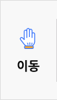

  

+ **선택** : 그림판을 드래그해서 그림을 영역으로 선택합니다. 그림을 충분히 포함해서 선택해야 합니다. 빈 공간은 선택할 수 없어요!

  
  
  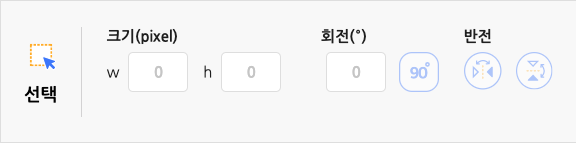
  
  
  
  + **크기(pixel)** : 선택한 영역의 그림의 가로 길이(w) 또는 세로 길이(h)를 정합니다.
  
  + **회전(º)** : 선택한 영역의 그림을 회전합니다. '90º' 버튼을 클릭하면 오른쪽으로 90도씩 회전합니
  
    다.
    
  + **반전** : 선택한 영역의 그림을 뒤집습니다. 가로 또는 세로로 뒤집을 수 있습니다. 아래의 그림과 같
  
    이 그림판에서 선택 영역의 파란색 상자를 드래그하면 크기를 조절하거나 뒤집을 수 있어요. 또한 
    
    주황색 원을 드래그하면 회전할 수 있습니다.
    
    

​                                                                                                        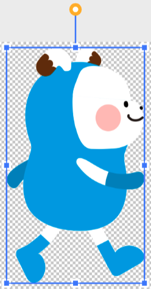

+ **펜** : 그림판에 클릭 또는 드래그해서 그림을 그립니다.

  

  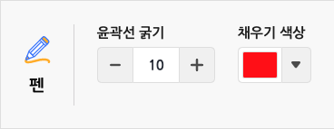

  

  + **윤곽선 굵기** : 펜의 굵기를 조절합니다.
  + **채우기 색상** : 펜의 색상을 정합니다.
  
  
  
+ **직선** : 그림판에 드래그해서 직선을 그립니다.

  
  
  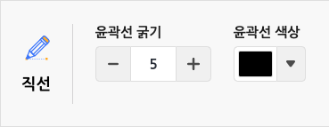
  
  
  
  + **윤곽선 굵기** : 직선의 굵기를 조절합니다.
  + **윤곽선 색상** : 직선의 색상을 정합니다.

+ **사각형** : 그림판에 드래그해서 사각형을 그립니다.

  

  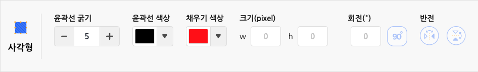

  

  + **윤곽선 굵기** : 사각형 테두리 선의 굵기를 조절합니다.

  + **윤곽선 색상** : 사각형 테두리 선의 색상을 정합니다.

  + **채우기 색상** : 사각형의 영역을 채울 색상을 정합니다.

  + **크기(pixel)** : 사각형의 가로 길이(w) 또는 세로 길이(h)를 정합니다.

  + **회전(º)** : 사각형을 회전합니다. '90º' 버튼을 클릭하면 오른쪽으로 90도씩 회전할 수 있습니다. 

  + 그림판에서 선택 영역의 파란색 상자를 드래그하면 크기를 조절하거나 뒤집을 수 있어요. 또한 주

    황색 원을 드래그하면 회전할 수 있습니다.

+ **원** : 그림판에 드래그해서 원을 그립니다.

  

  

  

  + **윤곽선 굵기** : 원 테두리 선의 굵기를 조절합니다.

  + **채우기 색상** : 원형의 영역을 채울 색상을 정합니다.

  + **크기(pixel)** : 원의 가로 길이(w) 또는 세로 길이(h)를 정합니다.

  + **회전(º)** : 원을 회전합니다. '90º' 버튼을 클릭하면 오른쪽으로 90도씩 회전할 수 있습니다.

  + 그림판에서 선택 영역의 파란색 상자를 드래그하면 크기를 조절하거나 뒤집을 수 있어요. 

    또한 주황색 원을 드래그하면 회전할 수 있습니다.

  

+ **글상자** : 그림판에 클릭한 위치에 글을 작성합니다.

  

  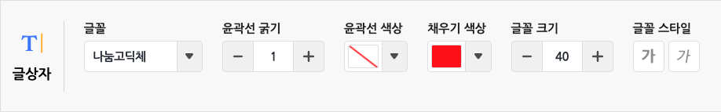

  

  + **글꼴** : 글상자의 글꼴을 선택합니다.
  + **윤곽선 굵기** : 글상자 테두리 선의 굵기를 조절합니다.
  + **윤곽선 색상** : 글상자 테두리 선의 색상을 정합니다.
  + **채우기 색상** : 글상자의 영역을 채울 색상을 정합니다.
  + **글꼴 크기** : 글꼴의 크기를 조절합니다. 글상자의 영역에 영향을 줍니다.
  + **글꼴 스타일** : 글꼴의 스타일을 **볼드체**와 *이태릭체*로 선택할 수 있습니다. 중복 선택이 가능해요.

+ **채우기** : 그림판을 클릭해서 그림에 색을 채웁니다. 

  

  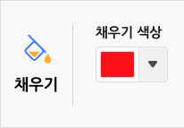

  

  + **채우기 색상** : 그림을 채울 색상을 정합니다.
  
  
  
+ **지우기** : 그림판에 클릭 또는 드래그해서 그림을 지웁니다.

  

  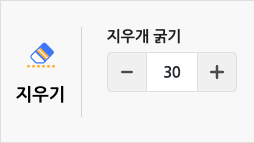

  

  + **지우개 굵기** : 지우개의 굵기를 조절합니다. 수가 작을수록 세밀하게 지울 수 있고, 클수록 한 번에 많은 양을 지울 수 있습니다.

  
  

##### ② 벡터

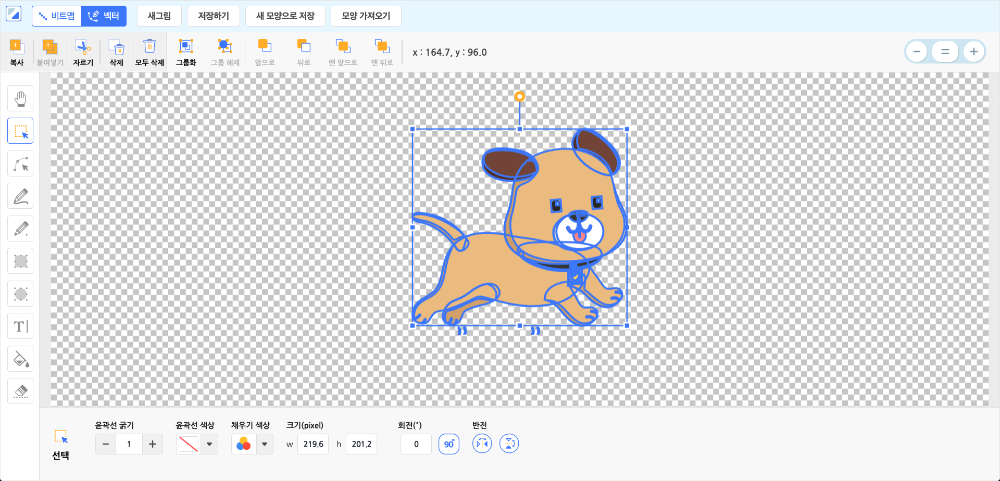

벡터는 점과 점 사이의 관계를 점과 점을 잇는 선으로 이미지를 표현하는 방식입니다. 

선은 직선일 수도 있고 곡선일 수도 있습니다.  더 쉽게 말하면, 점들을 이은 선과 면으로 나타내는 그림이

에요. 비트맵과 달리 점과 선으로 그림을 그리기 떄문에 이미지를 자유롭게 늘리고 변형해도 깨져 보이지 

않는답니다! 따라서 비트맵과 벡터는 아래의 내용처럼 다른 장점을 가져요! 

> + **비트맵** 모드는 사진처럼 정교한 이미지를 표현하기에 유용합니다.
> + **벡터** 모드는 확대/축소를 빈번하게 하는 이미지 혹은 레이어 별로 수정을 해야하는 경우에 유용합니다.

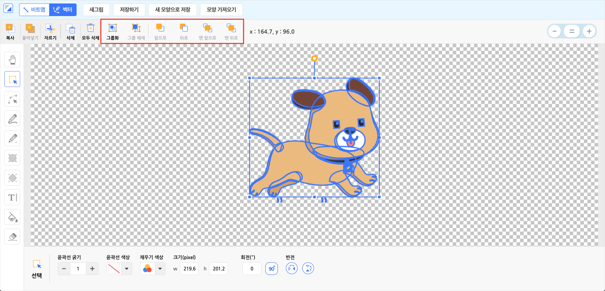

벡터 모드에서는 상단에 벡터 그림에 필요한 메뉴가 나타납니다. 좀 더 자세히 살펴볼까요? 

+ **그룹화/ 그룹 해제/ 앞으로/ 뒤로/ 맨 앞으로/ 맨 뒤로** 

  
  
  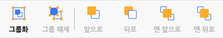
  
  
  
  + **그룹화** : 선택한 모든 요소를 하나의 요소로 묶습니다.
  + **그룹 해제** : 그룹화한 요소를 다시 개별 요소로 나눕니다.
  + **앞으로** : 선택한 요소가 보이는 순서를 한 번 올립니다.
  + **뒤로** : 선택한 요소가 보이는 순서를 한 번 내립니다.
  + **맨 앞으로** : 선택한 요소가 맨 앞에서 보입니다.
  + **맨 뒤로** : 선택한 요소가 맨 뒤에서 보입니다.

​		벡터 모드에서만 사용할 수 있는 편리한 단축키도 있어요.

| 기능                      | 단축키 (윈도우/맥 공통)      |
| ------------------------- | ---------------------------- |
| 여러 개체 선택            | `shift` + `마우스 왼쪽 클릭` |
| 선택한 개체를 앞으로 이동 | `ctrl` + `[`                 |
| 선택한 개체를 뒤로 이동   | `ctrl` + `]`                 |

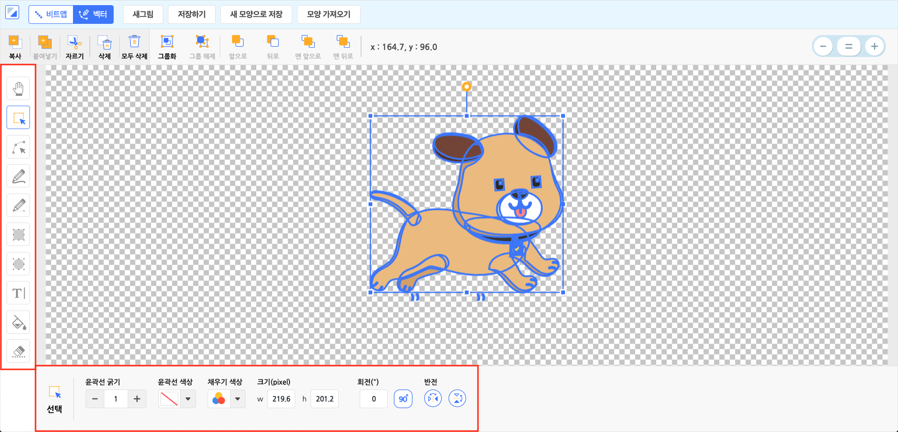

그림판의 좌측에는 그림 도구가 있습니다. 

백터 모드의 각 도구를 클릭하면 하단의 영역에서 해당 도구의 속성을 볼 수 있어요.

+ **이동** : 그림판을 드래그해서 공간을 움직입니다.

  

+ **선택** : 그림판을 드래그해서 요소를 선택합니다. 하나 이상의 요소를 포함해서 선택해야 합니다. 빈 공

  간은 선택할 수 없어요!

  

  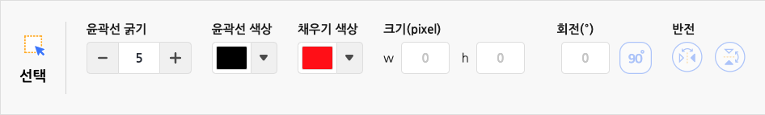

  

  + **윤곽선 굵기** : 선택한 요소의 테두리 선의 굵기를 바꿉니다. 윤곽선이 없으면 영향을 주지 않아요.

  + **윤곽선 색상** : 선택한 요소의 테두리 선의 색상을 정합니다. 윤곽선이 없으면 영향을 주지 않아요. 

    직선의 색상도 바꿀 수 있습니다.

  + **채우기 색상** : 선택한 요소의 영역을 채울 색상을 정합니다. 윤곽선만 있으면 영향을 주지 않아요. 

    펜으로 그린 그림의 색상도 바꿀 수 있습니다.

  + **크기(pixel)** : 선택한 요소의 가로 길이(w) 또는 세로 길이(h)를 정합니다.

  + **회전(º)** : 선택한 요소를 회전합니다. '90º' 버튼을 클릭하면 오른쪽으로 90도씩 회전합니다. 

  + **반전** : 선택한 요소를 뒤집습니다. 가로 또는 세로로 뒤집을 수 있습니다.

  + 아래의 그림과 같이 그림판에서 선택 영역의 파란색 상자를 드래그하면 크기를 조절하거나 반전 

  ​        할 수 있어요. 또한 주황색 원을 드래그하면 회전할 수 있습니다.

​                                                                                                               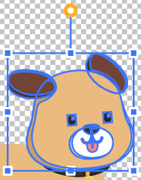 

+ **형태** : 그림판을 드래그해서 요소의 형태를 선택합니다.

  

  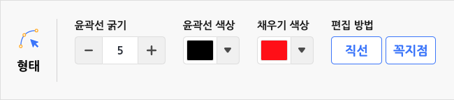

  

  + **윤곽선 굵기** : 선택한 요소의 테두리 선의 굵기를 바꿉니다. 윤곽선이 없으면 영향을 주지 않아요.

  + **윤곽선 색상** : 선택한 요소의 테두리 선의 색상을 정합니다. 윤곽선이 없으면 영향을 주지 않아요.  

    직선의 색상도 바꿀 수 있습니다.

  + **채우기 색상** : 선택한 요소의 영역을 채울 색상을 정합니다. 윤곽선만 있으면 영향을 주지 않아요. 

  ​       펜으로 그린 그림의 색상도 바꿀 수 있습니다.

  + **편집 방법** :  선택한 요소가 구부러진 지점에서, 주황색 선으로 연결된 파란색 상자를 드래그하면 

  ​       선의 구부러진 정도를 조절할 수 있습니다. 방법은 두 가지가 있어요.  

  + **둥글게** : 양쪽 선을 동시에 조절하여 두 선을 자연스럽게 잇습니다. 두 주황색 선이 직선의 형태로 

    함께 회전합니다.

  

  ​                                                                                                              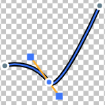 

  + **각지게** :  한 쪽 선만을 움직여 구부러진 정도를 조절할 수 있습니다. 두 주황색 선이  따로 회전합

    니다. 

  ​                                                                                                               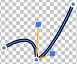  

  

  아래의 그림과 같이 선택 영역의 점을 드래그하면 형태를 조절할 수 있어요.

  

  ​                                                                                                                 

+ **펜** : 그림판에 클릭 또는 드래그해서 그림을 그립니다. 클릭을 해제할 때까지 그린 그림이 하나의 요소
  
  가 되어요.
  
  
  
  
  
  
  
  + **윤곽선 굵기** : 펜의 굵기를 조절합니다.
  + **채우기 색상** : 펜의 색상을 정합니다.

+ **직선** : 그림판에 드래그해서 직선을 그립니다.
  
  
  
  
  
  
  
  + **윤곽선 굵기** : 직선의 굵기를 조절합니다.
  + **윤곽선 색상** : 직선의 색상을 정합니다.

+ **사각형** : 그림판에 드래그해서 사각형을 그립니다.
  
  
  
  
  
  
  
  + **윤곽선 굵기** : 사각형 테두리 선의 굵기를 조절합니다.
  + **윤곽선 색상** : 사각형 테두리 선의 색상을 정합니다.
  + **채우기 색상** : 사각형의 영역을 채울 색상을 정합니다.
  + **크기(pixel)** : 사각형의 가로 길이(w) 또는 세로 길이(h)를 정합니다.
  + **회전(º)** : 사각형을 회전합니다. '90º' 버튼을 클릭하면 오른쪽으로 90도씩 회전할 수 있습니다.

+ **원** : 그림판에 드래그해서 원을 그립니다.
  
  
  
  
  
  
  
  + **윤곽선 굵기** : 원 테두리 선의 굵기를 조절합니다.
  + **윤곽선 색상** : 원 테두리 선의 색상을 정합니다.
  + **채우기 색상** : 원형의 영역을 채울 색상을 정합니다.
  + **크기(pixel)** : 원의 가로 길이(w) 또는 세로 길이(h)를 정합니다.
  + **회전(º)** : 원을 회전합니다. '90º' 버튼을 클릭하면 오른쪽으로 90도씩 회전합니다.

+ **글상자** : 그림판에 클릭한 위치에 글을 작성합니다. (글상자는 벡터 모드에서도 벡터 형태가 아닙니다!)

  

  

  

  + **글꼴** : 글상자의 글꼴을 선택합니다. 글꼴 목록은 글상자 오브젝트와 같습니다.

  + **윤곽선 굵기** : 글상자 테두리 선의 굵기를 조절합니다.
  + **윤곽선 색상** : 글상자 테두리 선의 색상을 정합니다.
  + **채우기 색상** : 글상자의 영역을 채울 색상을 정합니다.

  + **글꼴 크기** : 글꼴의 크기를 조절합니다. 글상자의 영역에 영향을 줍니다.

  + **글꼴 스타일** : 글꼴의 스타일을 **볼드체**와 *이태릭체*로 선택할 수 있습니다. 중복 선택이 가능해요.

+ **채우기** : 그림판을 클릭해서 요소에 색을 채웁니다.
  
  
  
  
  
  
  
  + **채우기 색상** : 그림을 채울 색상을 정합니다.

+ **지우기** : 그림판에 클릭 또는 드래그해서 그림을 지웁니다.
  
  
  
  
  
  
  
  + 그림의 일부가 지워지면, 요소의 형태가 바뀌어요.
  + **지우개 굵기** : 지우개의 굵기를 조절합니다. 수가 작을수록 세밀하게 지울 수 있고, 클수록 한 번에 많은 양을 지울 수 있습니다.

