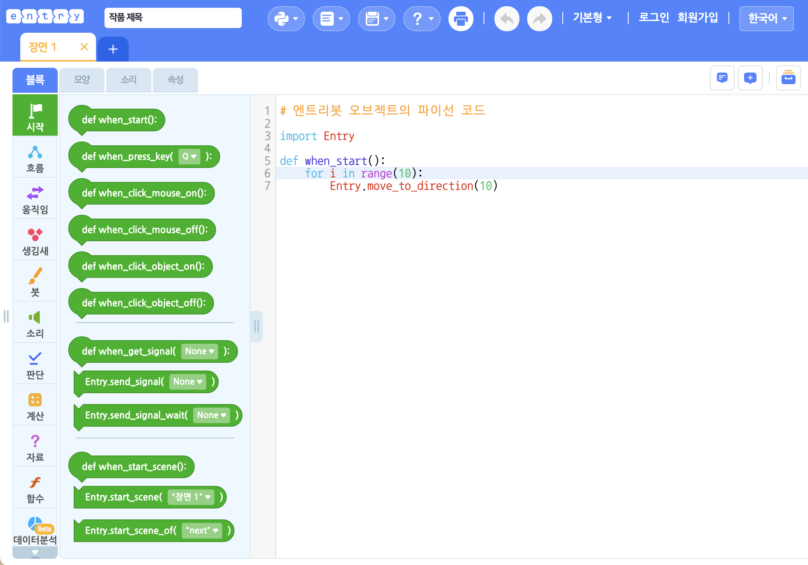
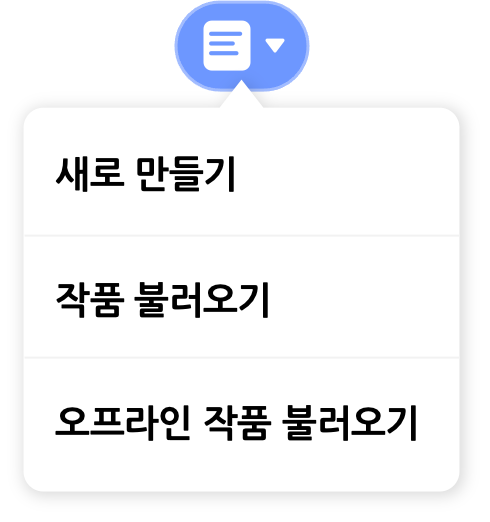
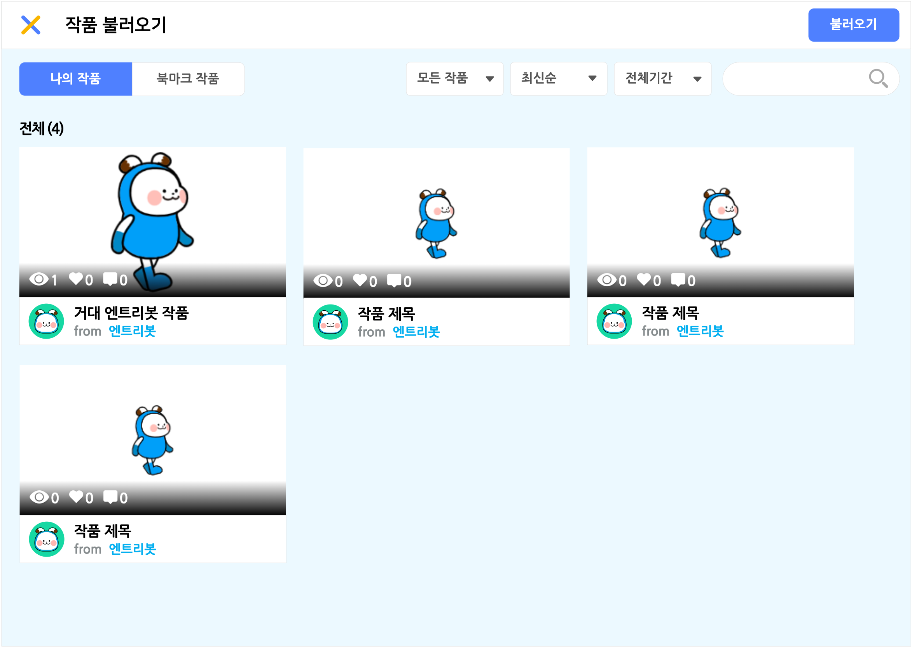
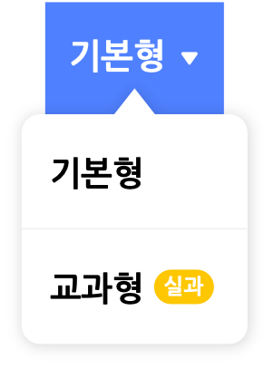
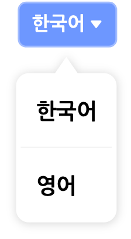

## 헤더

헤더란 작품 만들기 화면 맨 위에 있는, 작품을 구성하는 기본적인 메뉴가 모여 있는 영역입니다.

왼쪽부터 차례대로 살펴볼게요.

#### 1) 엔트리 로고

프로그래밍의 첫걸음, 엔트리의 로고입니다. 클릭하면 엔트리 홈페이지로 이동해요.

#### 2) 작품 제목

작품의 이름을 확인하거나, 이름 상자를 클릭해서 수정합니다.

#### 3) 만들기 모드

엔트리에서 작품을 만드는 방법을 선택합니다. 엔트리는 두 가지 만들기 모드가 있어요.

##### ① 블록코딩

기본 만들기 모드입니다.

블록을 드래그해서 조립/결합하는 방식으로 코딩할 수 있어요.

##### ② 엔트리파이선

프로그래밍 언어 중 하나인 '파이선(python)'과 같은 문법을 사용하는 엔트리의 텍스트 코딩 모드입니다.

블록 꾸러미의 블록을 '텍스트 입력소'에 드래그하면 블록의 이름을 붙여넣거나 직접 입력하는 방식으로 코딩할 수 있어요.

#### 4) 작품 새로 만들기/불러오기

새 작품을 만들거나, 온라인/오프라인에서 작품을 불러올 수 있어요.

각 메뉴를 클릭하면 지금 열려있는 작품에서 나가므로 꼭 저장해주세요.

+ **새로 만들기** : 새 작품을 만듭니다. '작품 만들기'를 클릭하는 것과 같아요.
+ **온라인 작품 불러오기** : 로그인한 계정의 '나의 작품' 또는 '관심 작품'에서 작품을 불러옵니다.
+ **오프라인 작품 불러오기** : 내 컴퓨터에서 ent 형식(확장자)의 엔트리 작품 파일을 불러옵니다.

'온라인 작품 불러오기'를 클릭하면 나타나는 팝업 창입니다.

작품을 선택하고, 아래의 '불러오기' 버튼을 클릭해서 작품을 불러와요.

오른쪽 위의 검색창을 통해 원하는 작품의 이름을 검색할 수 있어요. 검색창 왼쪽의 카테고리를 선택하면 원하는 작품을 더 쉽게 찾을 수 있습니다.

+ **작품 카테고리**
  + 모든 작품, 게임, 애니메이션, 미디어 아트, 피지컬, 기타
+ **작품 정렬**
  + 최신순, 조회순, 좋아요순, 댓글순
+ **작품 기간**
  + 전체기간, 오늘, 최근 1주일, 최근 1개월, 최근 3개월

##### ① 나의 작품

로그인한 계정이 저장한 작품을 불러올 수 있습니다.

계정에 저장한 작품이 없다면, '작품 만들기' 버튼을 클릭해서 새 작품을 만들 수 있어요.

##### ② 관심 작품

로그인한 계정의 '관심 작품'을 불러올 수 있습니다.

'관심 작품'에 작품이 없다면, '작품 만들기' 버튼을 클릭해서 새 작품을 만들 수 있어요.

로그인하지 않았거나 오프라인 엔트리를 사용하는 경우 그림과 같이 두 기능만 사용할 수 있습니다.

#### 5) 저장

작품을 로그인한 계정의 '나의 작품'(서버) 또는 내 컴퓨터에 저장합니다.

+ **저장하기** : 지금 만들고 있는 작품을 저장합니다. 작품이 '나의 작품'에 없다면 새로 저장해요.
+ **복사본으로 저장하기** : 작품이 '나의 작품'에 없다면 새로 저장하고, 아니라면 해당 작품을 원본으로 두는 새 작품으로 저장합니다.
+ **내 컴퓨터에 저장하기** : 내 컴퓨터에 ent 형식(확장자)의 엔트리 프로젝트 파일을 저장합니다.

로그인하지 않은 경우 '내 컴퓨터에 저장하기'만 사용할 수 있습니다.

오프라인 엔트리를 사용하는 경우 그림과 같이 두 기능만 사용할 수 있습니다.

이 기능은 단축키로도 편리하게 사용할 수 있어요.

| 기능                | 단축키 (윈도우/맥 공통) |
| ------------------- | ----------------------- |
| 저장하기            | `ctrl` + `z`            |
| 복사본으로 저장하기 | `ctrl` + `shift` + `z`  |

#### 6) 도움말

블록, 하드웨어, 엔트리파이선에 대한 안내를 받을 수 있습니다.

'블록 도움말'을 클릭하면 보조 조작부에서 도움말 탭으로 이동해요. 블록 꾸러미나 블록 조립소에 있는 블록을 선택하면 해당 블록의 설명이 나타납니다. 

['하드웨어 연결 안내'](https://playentry.org/data/%EC%97%94%ED%8A%B8%EB%A6%AC%20%ED%95%98%EB%93%9C%EC%9B%A8%EC%96%B4%20%EC%97%B0%EA%B2%B0%20%EB%A7%A4%EB%89%B4%EC%96%BC(%EC%98%A8%EB%9D%BC%EC%9D%B8%EC%9A%A9).zip) 또는 ['엔트리파이선 이용 안내'](https://playentry.org/data/Python.Guide.zip)를 클릭하면 각 안내 파일을 다운로드할 수 있습니다.

#### 7) 출력하기

실행 화면과 모든 오브젝트, 코드, 속성(변수, 리스트, 신호, 함수)을 정리해서 볼 수 있는 기능이에요.

출력하기 버튼을 클릭하면 나타나는 창입니다.

오른쪽 위의 인쇄 버튼을 클릭하면 전체 페이지를 인쇄할 수 있어요.

#### 8) 되돌리기/되살리기

작품 내 대부분의 작업을 이전으로 되돌리거나 이후로 되살리는 유용한 기능이니다. 

왼쪽 버튼을 누르면 되돌리고, 오른쪽 버튼을 누르면 되살립니다.

이 기능은 단축키로도 편리하게 사용할 수 있어요.

| 기능      | 단축키 (윈도우/맥 공통) |
| --------- | ----------------------- |
| 실행 취소 | `ctrl` + `z`            |
| 다시 실행 | `ctrl` + `shift` + `z`  |

#### 9) 기본형/교과형 선택

엔트리에서 가능한 만들기 형태입니다. 하나씩 살펴볼게요. 

##### ① 기본형

기본형에서는 엔트리의 모든 기능을 사용할 수 있어요.

##### ② 교과형

교과형은 수업에서 활용하기에 적합한 만들기 형태입니다.

난이도를 낮추기 위해 복잡한 기능을 빼 최소한의 기능만 이용할 수 있어요.

'하드웨어' 카테고리는 친숙한 이름의 '로봇'으로 바꾸어요.

#### 10) 계정

로그인한 계정을 클릭하면 나타나는 메뉴입니다.

각 메뉴를 클릭하면 지금 열려있는 작품에서 나가기 때문에 꼭 저장해주세요.

로그인하지 않은 경우 '로그인' 또는 '회원가입'을 클릭할 수 있어요.

##### ① 로그인

'로그인'을 클릭하면 나타나는 창입니다.

로그인을 완료하면 지금 열려있는 작품에서 나가지 않고 만들기를 계속할 수 있어요.

##### ② 회원가입

'회원가입'을 클릭하면 나타나는 창입니다.

회원가입을 완료하면 창을 닫고, 다시 '로그인'을 클릭해서 로그인할 수 있어요.

#### 10) 언어

언어를 변경할 수 있습니다.

사용 가능한 언어는 순서대로 한국어, 영어, 일본어, 베트남어 입니다.

