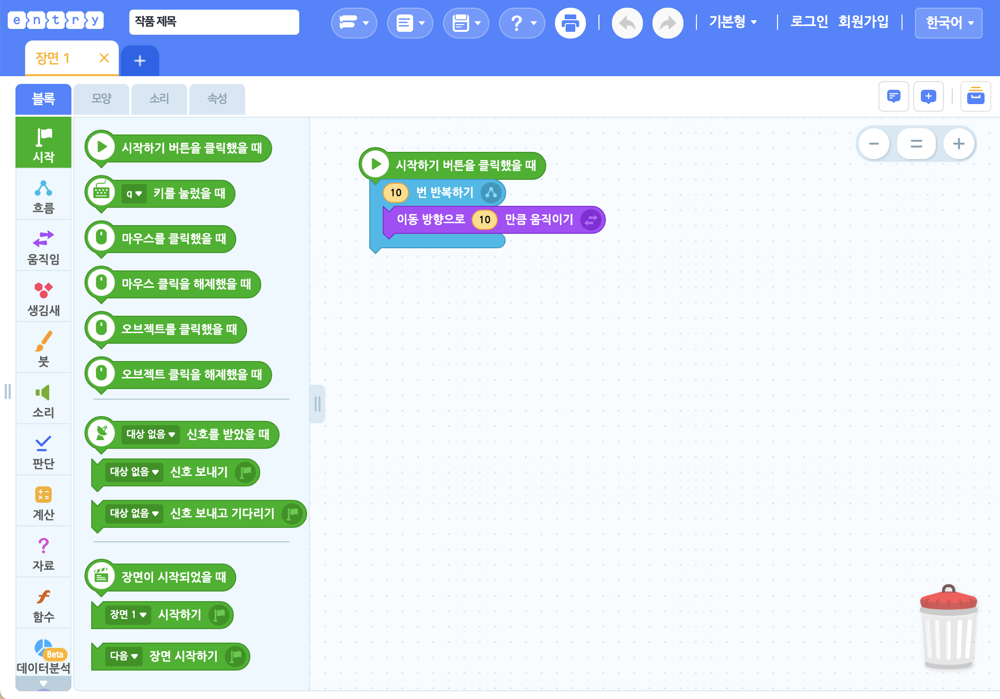
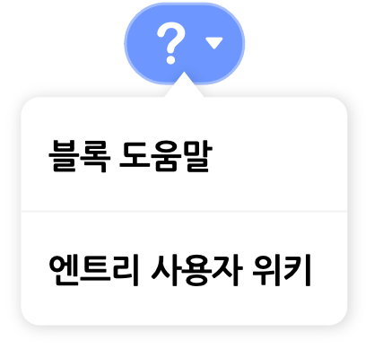
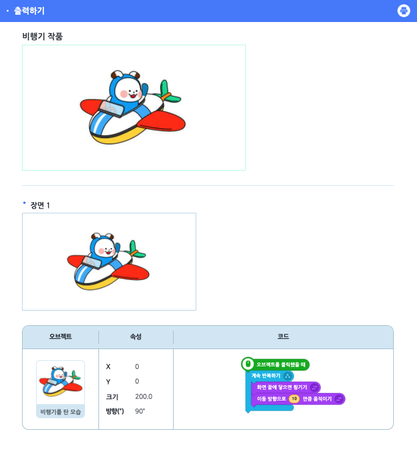
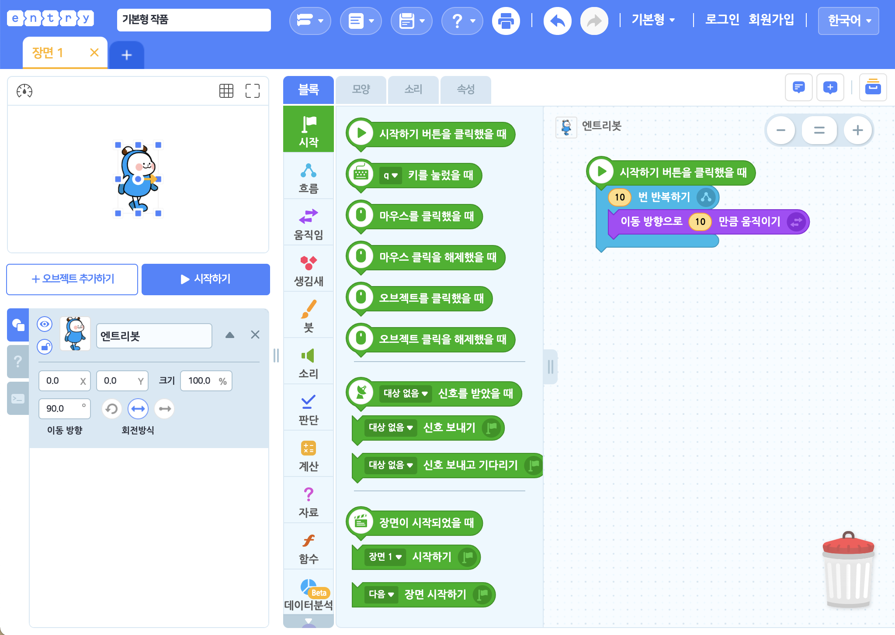

작품 만들기 화면의 상단 메뉴에는 작품의 제목을 짓거나, 저장하고 불러오는 등 작품의 기본적인 설정을 할 수 있는 메뉴들이 모여 있습니다.

가장 왼쪽부터 차례대로 살펴볼게요.

## 엔트리 로고

프로그래밍의 첫걸음, 엔트리의 로고입니다. 클릭하면 말풍선 메뉴가 표시됩니다. 

말풍선 메뉴를 통해 엔트리 홈으로 이동하거나, 만들고 있는 작품의 상세 페이지로 이동할 수 있어요.

## 작품 제목

작품의 제목을 확인하고, 클릭해 새로 입력하거나 수정할 수 있습니다.

작품을 효과적으로 관리하기 위해서는 작품마다 각각 제목을 입력해주는 것이 좋아요!

## 만들기 모드

엔트리에서 작품을 만드는 방법을 선택합니다. 

선택한 모드에 따라 블록 탭의 모양이 바뀌는데 블록을 조립해서 작품을 만들거나(블록 코딩), 텍스트를 직접 입력해 작품을 만드는(엔트리파이썬) 두 가지 모드가 있어요.

#### ① 블록 코딩

기본적인 만들기 모드입니다.

블록을 드래그해서 조립/결합하는 방식으로 코딩할 수 있어요.

#### ② 엔트리파이썬

프로그래밍 언어 중 하나인 '파이썬(python)'과 같은 문법을 사용하는 엔트리의 텍스트 코딩 모드입니다.

블록 꾸러미의 블록을 '텍스트 입력소'에 드래그하면 블록의 이름을 붙여넣거나 직접 입력하는 방식으로 코딩할 수 있어요.

## 새로 만들기/불러오기

새 작품을 만들거나, 온라인/오프라인에서 작품을 불러올 수 있어요.

각 메뉴를 클릭하면 지금 열려있는 작품에서 빠져나가게 되니 꼭 미리 작품을 저장해 주세요.

+ **새로 만들기** : 새 작품을 만듭니다. '작품 만들기'를 클릭하는 것과 같아요.
+ **작품 불러오기** : 로그인한 계정의 '나의 작품' 또는 '북마크 작품'에서 작품을 불러옵니다.
+ **오프라인 작품 불러오기** : 내 컴퓨터에서 ent 형식(확장자)의 엔트리 작품 파일을 불러옵니다.

'작품 불러오기'를 클릭하면 나타나는 팝업 창입니다.

작품을 선택하고, 오른쪽 위의 '불러오기' 버튼을 클릭해서 작품을 불러와요.

버튼 아래의 검색창을 이용해 원하는 작품의 이름을 검색할 수 있어요. 검색창 왼쪽의 목록 상자를 선택하면 원하는 작품을 더 쉽게 찾을 수 있습니다.

+ **작품 유형**
  + 모든 작품, 게임, 생활과 도구, 스토리텔링, 예술, 지식 공유, 기타
+ **작품 정렬**
  + 최신순, 조회순, 좋아요순, 댓글순
+ **작품 기간**
  + 전체기간, 오늘, 최근 1주일, 최근 1개월, 최근 3개월

#### ① 나의 작품

로그인한 계정에 저장한 작품을 불러올 수 있습니다.

계정에 저장한 작품이 없다면, '작품 만들기' 버튼을 클릭해서 새 작품을 만들 수 있어요.

로그인하지 않았거나 오프라인 엔트리를 사용하는 경우에는 온라인 작품을 불러올 수 없습니다.

#### ② 북마크 작품

로그인한 계정으로 북마크한 작품을 불러올 수 있습니다.

## 저장하기

작품을 로그인한 계정의 '나의 작품'(서버) 또는 내 컴퓨터에 저장합니다.

+ **저장하기** : 지금 만들고 있는 작품을 저장합니다. 작품이 '나의 작품'에 없다면 새로 저장해요.
+ **복사본으로 저장하기** : 작품이 '나의 작품'에 없다면 새로 저장하고, 아니라면 해당 작품을 원본으로 두는 새 작품으로 저장합니다.
+ **내 컴퓨터에 저장하기** : 내 컴퓨터에 ent 형식(확장자)의 엔트리 프로젝트 파일을 저장합니다.

로그인하지 않은 경우 '내 컴퓨터에 저장하기'만 사용할 수 있으며, 오프라인 엔트리를 사용하는 경우에는 '저장하기'와 '복사본으로 저장하기'만 사용하실 수 있습니다.

## 도움말

'블록 도움말'을 클릭하면 보조 창에서 도움말 탭으로 이동해요. 블록 꾸러미나 블록 조립소에 있는 블록을 선택하면 해당 블록의 설명이 나타납니다.

'엔트리 사용자 위키'를 클릭하면 지금 보고 있는 사용자 위키 페이지가 새 창에서 열립니다.

## 출력하기

실행 화면과 모든 오브젝트, 코드, 속성(변수, 리스트, 신호, 함수)을 정리해서 볼 수 있는 기능이에요.

출력하기 버튼을 클릭하면 나타나는 창입니다.

오른쪽 위의 인쇄 버튼을 클릭하면 전체 페이지를 인쇄할 수 있어요.

## 되돌리기/되살리기

작품 내 대부분의 작업을 이전으로 되돌리거나 이후로 되살리는 유용한 기능입니다.

왼쪽 버튼을 누르면 되돌리고, 오른쪽 버튼을 누르면 되살립니다.

이 기능은 단축키로도 편리하게 사용할 수 있어요.

| 기능      | 단축키 (윈도우/맥 공통) |
| --------- | ----------------------- |
| 실행 취소 | `ctrl` + `z`            |
| 다시 실행 | `ctrl` + `shift` + `z`  |

## 기본형/교과형 선택

엔트리에서 가능한 만들기 형태입니다. 하나씩 살펴볼게요.

#### ① 기본형

기본형에서는 엔트리의 모든 기능을 사용할 수 있어요.

#### ② 교과형

교과형은 수업에서 활용하기에 적합한 만들기 형태입니다.

난이도를 낮추기 위해 복잡한 기능을 뺀 최소한의 기능만 이용할 수 있어요. 블록의 이름도 기본형과 아주 조금 다르니 유의해 주세요.

## 로그인 메뉴

로그인한 계정을 클릭하면 나타나는 메뉴입니다.

각 메뉴를 클릭하면 지금 열려있는 작품에서 빠져 나가기 때문에 꼭 먼저 저장해주세요.

로그인하지 않은 경우 '로그인' 또는 '회원가입'을 클릭할 수 있어요.

## 언어 선택

만들기 화면에서 표시되는 언어를 변경할 수 있습니다.

사용 가능한 언어는 한국어와 영어입니다. 