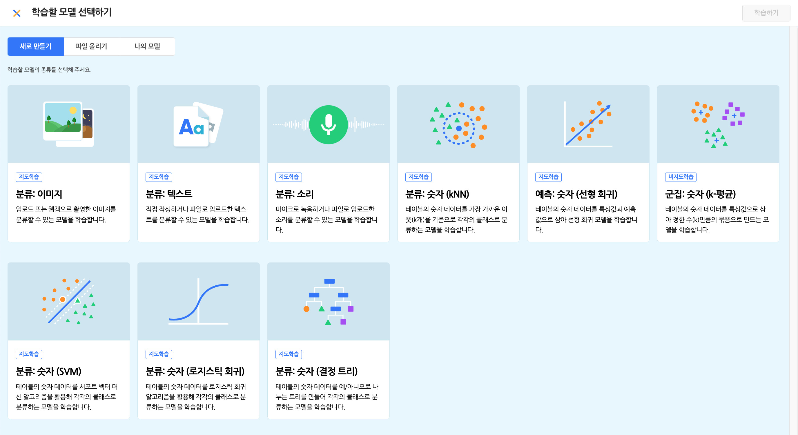
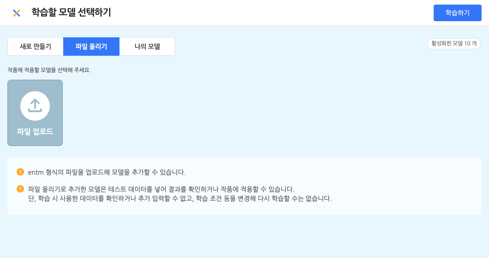
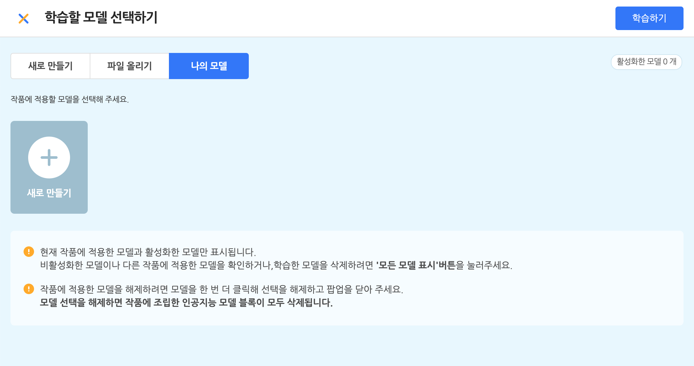
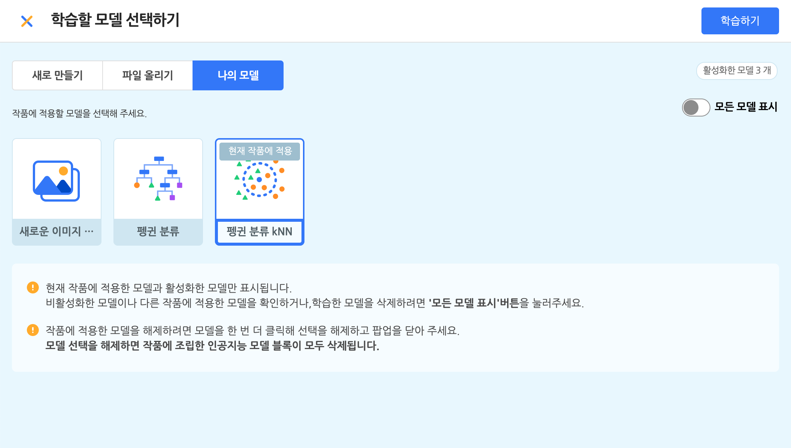
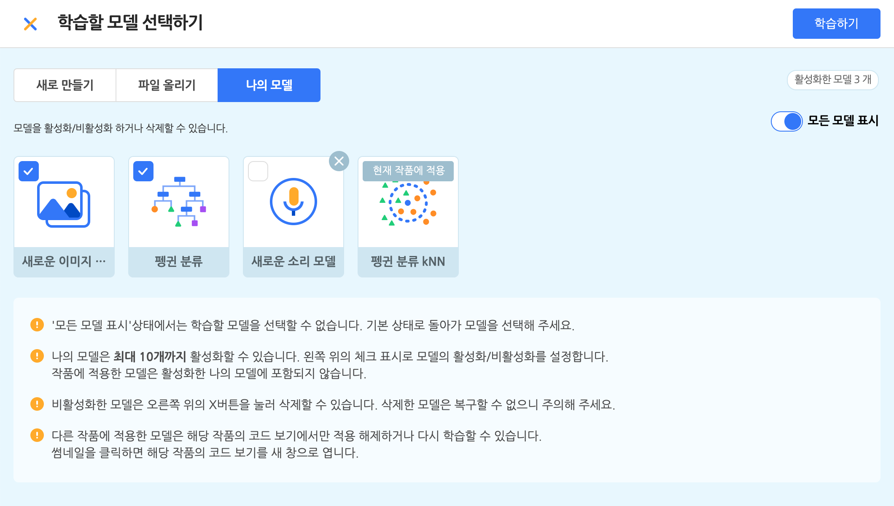

## 인공지능 모델 학습하기 팝업

인공지능 블록 꾸러미에서 '인공지능 모델 학습하기' 버튼을 누르면 인공지능 모델 학습하기 팝업이 표시됩니다. (새 탭에서 열립니다.)  
새로운 모델을 학습하거나, 이미 학습한 모델을 선택하고 '추가하기' 버튼을 누르면 해당 모델의 블록이 블록 꾸러미에 표시됩니다.

## 1. 학습할 모델 선택하기 

### ① 새로 만들기 탭 

'새로 만들기' 탭에서는 새로운 모델을 학습할 수 있습니다.  

아래는 학습할 수 있는 데이터의 유형입니다.

+ **분류: 이미지** 
  업로드 또는 웹캠으로 촬영한 이미지를 분류할 수 있는 모델을 학습합니다.
+ **분류: 텍스트**
  직접 작성하거나 파일로 업로드한 텍스트를 분류할 수 있는 모델을 학습합니다.
+ **분류: 소리**
  마이크로 녹음하거나 파일로 업로드한 소리를 분류할 수 있는 모델을 학습합니다.
+ **분류: 숫자 (kNN)**
  테이블의 숫자 데이터를 가장 가까운 이웃(K개)을 기준으로 각각의 클래스로 분류하는 모델을 학습합니다.
+ **분류: 숫자 (SVM, 서포트 벡터 머신)**
  테이블의 숫자 데이터를 서포트 벡터 알고리즘을 활용해 각각의 클래스로 분류하는 모델을 학습합니다.
  + **분류: 숫자 (로지스틱 회귀)**
  테이블의 숫자 데이터를 로지스틱 회귀를 활용해 각각의 클래스로 분류하는 모델을 학습합니다.
  + **분류: 숫자 (결정 트리, 의사 결정 나무)**
  테이블의 숫자 데이터를 예/아니오로 나누는 트리를 만들어 각각의 클래스로 분류하는 모델을 학습합니다.
+ **예측: 숫자 (선형 회귀)**
  테이블의 숫자 데이터를 핵심 속성으로 삼아 예측 속성을 찾아내는 선형 회귀 모델을 학습합니다.
+ **군집: 숫자 (k-평균)**
  테이블의 숫자 데이터를 핵심 속성으로 삼아 정한 수(K개)만큼의 묶음으로 만드는 모델을 학습합니다.

### ② 파일 올리기 탭

'파일 올리기' 탭에서는 엔트리에서 학습하고 다운로드 받은 모델 파일을 다시 업로드해 추가할 수도 있어요.  

여기서는 entm 형식(확장자)의 파일을 업로드 할 수 있어요.  
(entm 형식의 파일은 엔트리 모델 파일입니다. 모델 목록에서, 모델을 우클릭하면 나타나는 메뉴에서 저장할 수 있어요.)

이렇게 추가한 모델은 다시 학습하거나 수정할 수는 없지만, 작품에 적용해 활용할 수 있습니다.

### ③ 나의 모델 탭

'나의 모델' 탭에서는 이미 학습한 모델을 다시 학습하거나 바로 추가할 수 있습니다. 

오른쪽의 '모든 모델 표시' 토글 버튼을 클릭하면 활성화한 모델만 표시할지, 비활성화한 모델 및 다른 작품에 적용한 모델을 포함한 모든 모델을 표시할지를 정할 수 있습니다.

'모든 모델 표시' 상태에서는 모델의 왼쪽 위에서 표시되는 체크박스를 눌러, 학습한 모델을 활성화/비활성화할 수 있습니다.

비활성화한 각 모델은 오른쪽 위의 [X] 버튼을 눌러 모델과 학습 데이터를 모두 삭제할 수 있어요.  
이렇게 모델을 삭제하면 해당 모델을 적용한 작품은 더 이상 제대로 동작하지 않게 됩니다.  
모델을 비활성화하고 삭제할 때는 이미 공유한 작품에 적용되어 있지는 않은지 꼭 확인해 주세요.