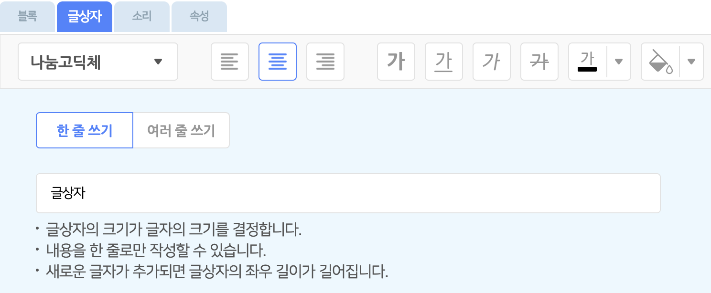

---
layout: page
title: 오브젝트 추가하기
date: 2024-02-06 11:00:00
type: userGuide
category: "팝업"
order: 40
---  

## 오브젝트 추가하기 팝업

실행 화면 아래의 '오브젝트 추가하기' 버튼을 누르면 오브젝트 추가하기 팝업이 표시됩니다.  
여기에서는 원하는 오브젝트를 오브젝트 목록에 추가할 수 있습니다.

오브젝트를 선택하거나, 직접 파일을 업로드 한 뒤 '추가하기' 버튼을 클릭해서 오브젝트 목록에 추가해요.
또는 그림판에서 직접 모양을 그리거나 글상자의 형태로도 오브젝트를 추가할 수 있어요.

### ① 오브젝트 선택 탭

원하는 오브젝트를 클릭해서 선택합니다. 중복 선택이 가능해요.  
선택한 오브젝트는 아래의 선택 목록 영역에서 볼 수 있어요.

선택한 오브젝트를 다시 클릭하거나, 선택 목록의 오브젝트에 마우스 포인터를 가져갔을 때 나타나는 X 표시를 누르면 선택을 해제할 수 있습니다.

오브젝트 선택 영역의 왼쪽과 위쪽의 대분류, 소분류를 활용하면 원하는 모양을 더 쉽게 찾을 수 있습니다.
오른쪽 위의 검색창을 통해 원하는 오브젝트의 이름을 검색할 수도 있어요. 

오른쪽 상단의 '벡터 모아보기' 버튼을 클릭하면 벡터 형식으로 만들어진 오브젝트만 모아볼 수 있습니다.

각 모양의 왼쪽 위에 있는 펜촉 아이콘으로 벡터 오브젝트를 구분할 수 있어요. 벡터에 대한 더 자세한 설명은 모양 탭 문서에서 확인할 수 있습니다.

벡터 오브젝트는 앞으로도 엔트리에 계속해서 추가될 예정이니, 지켜봐주세요!

### ② 파일 올리기 탭

원하는 오브젝트의 모양을 직접 올릴 수도 있어요.

모양 파일의 용량은 5MB 이하여야 하고, jpg, png, bmp, svg 또는 eo 형식(확장자)의 파일을 지원해요. jpg, png, bmp 형식은 비트맵 모드, svg 형식은 벡터 모드로 적용합니다.

(eo 형식의 파일은 엔트리 오브젝트 파일입니다. 오브젝트 목록에서, 오브젝트를 우클릭하면 나타나는 메뉴에서 저장할 수 있어요.)

올린 모양은 파일 올리기 목록에서 볼 수 있습니다. 파일을 올리면 기본적으로 선택한 상태가 되며 선택한 모양만 모양 목록에 추가됩니다.

> 아래와 같은 그림은 이용약관 및 관련 법률에 의해 제재를 받을 수 있습니다.
>
> + 폭력적이고 잔인한 그림
> + 선정적인 신체노출 그림
> + 불쾌감을 주거나 혐오감을 일으키는 그림
> + 무단 사용이 금지된 저작권의 그림 [[저작권에 대해 알아보기]](https://playentry.org/#!/terms/project)

### ③ 새로 그리기 탭

원하는 오브젝트를 찾을 수 없다고요? 그럼 직접 그려보는 것은 어떨까요!

그림을 직접 그려서 오브젝트로 저장할 수 있습니다. 아래 '이동하기' 버튼을 클릭해서 새로 그릴 오브젝트를 오브젝트 목록에 추가해요. 뭐든 그릴 수 있는 도화지를 추가하는 셈이죠!

> 아래와 같은 모양은 이용약관 및 관련 법률에 의해 제재를 받을 수 있습니다.
>
> + 폭력적이고 잔인한 그림
> + 선정적인 신체노출 그림
> + 불쾌감을 주거나 혐오감을 일으키는 그림
> + 무단 사용이 금지된 저작권의 그림 [[저작권에 대해 알아보기]](https://playentry.org/#!/terms/project)

### ④ 글상자 탭

글상자 오브젝트를 추가하는 탭입니다.

글상자는 일반 오브젝트와 달리 모양 대신에 문자를 실행 화면에 나타내요. 이 창에서 글상자를 꾸미거나, 바로 아래의 '적용하기' 버튼을 클릭하면(글상자의 내용은 '글상자'가 됩니다) 오브젝트 목록에 추가할 수 있습니다.

+ **첫 번째 목록 상자 (글꼴)**
  + `나눔고딕`, `나눔명조`, `나눔바른펜`, `나눔손글씨`, `나눔스퀘어라운드`, `마루 부리`, `본고딕`, `D2 Coding`, `잘난체`, `디자인하우스체`, `둥근모꼴체`, `어비마이센체`, `산돌 코믹스탠실`, `산돌 초록우산 어린이`, `산돌 씨네마극장`, `산돌 맵씨`, `산돌 별이샤방샤방`, `산돌 목각`, `산돌 용비어천가`

+ **글씨 효과**
  + **볼드체**(굵은 글씨), <u>밑줄</u>, *이탤릭체*(기울어진 글씨), ~~가로줄~~(취소선)

+ **두 번째 목록 상자 (글씨색)** : 글씨색을 정합니다.
  팔레트 모드에서 색깔을 선택하거나 슬라이더 모드에서 색깔을 조절할 수 있어요.

+ **세 번째 목록 상자 (배경색, 채우기 색상)** : 글상자의 영역을 채울 색깔(배경색)을 정합니다.
  팔레트 모드에서 색깔을 선택하거나 슬라이더 모드에서 색깔을 조절할 수 있어요.

+ **쓰기 방식**
  + **한 줄 쓰기** : 내용을 한 줄로만 작성할 수 있습니다.
    새로운 글자가 추가되면 글상자의 좌우 길이가 길어집니다.
  + **여러 줄 쓰기** : 내용 작성시 엔터키로 줄바꿈을 할 수 있습니다.
    
    글상자의 크기가 글자가 쓰이는 영역을 결정합니다.
새로운 글자 추가 시 문장의 길이가 글상자의 가로 영역을 넘어가면 자동으로 줄이 바뀝니다.

+ **글 정렬**

  

글상자 오브젝트를 선택하면 모양 탭 대신에 글상자 탭이 나타나요.

이 탭에서는 글상자의 영역에서 글씨를 왼쪽/가운데/오른쪽으로 정렬하는 버튼을 사용할 수 있습니다.