## 테이블 불러오기 팝업

데이터 분석 블록 꾸러미에서 '테이블 불러오기' 버튼을 누르면 테이블 불러오기 팝업이 표시됩니다.  
작품에서 활용하고자 하는 테이블을 선택하고 '추가' 버튼을 클릭하면 데이터 분석 블록이 블록 꾸러미에 표시됩니다.

**테이블 목록**

작품에서 사용할 테이블을 추가하거나 삭제하는 등 테이블을 관리할 수 있는 영역입니다.
'테이블 추가하기' 버튼을 통해 원하는 테이블을 이 목록에 추가할 수 있어요.

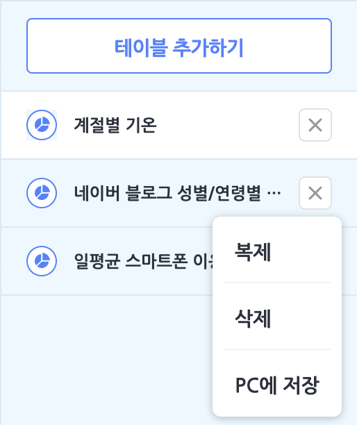

+ 작품에 추가한 테이블은 모두 테이블 목록에서 표시됩니다.
+ 마우스 왼쪽 버튼으로 테이블을 클릭해 선택합니다. 선택한 테이블의 내용이 테이블 편집 영역에 표시됩니다.
+ 테이블 이름 오른쪽의 'X' 버튼을 클릭해 테이블을 삭제할 수 있습니다.
+ 마우스 오른쪽 버튼을 테이블을 클릭하면 툴팁 메뉴가 표시됩니다. 테이블을 복제하거나 삭제할 수 있고, 엑셀 파일로 PC에 저장할 수 있어요.

 **테이블 상세**

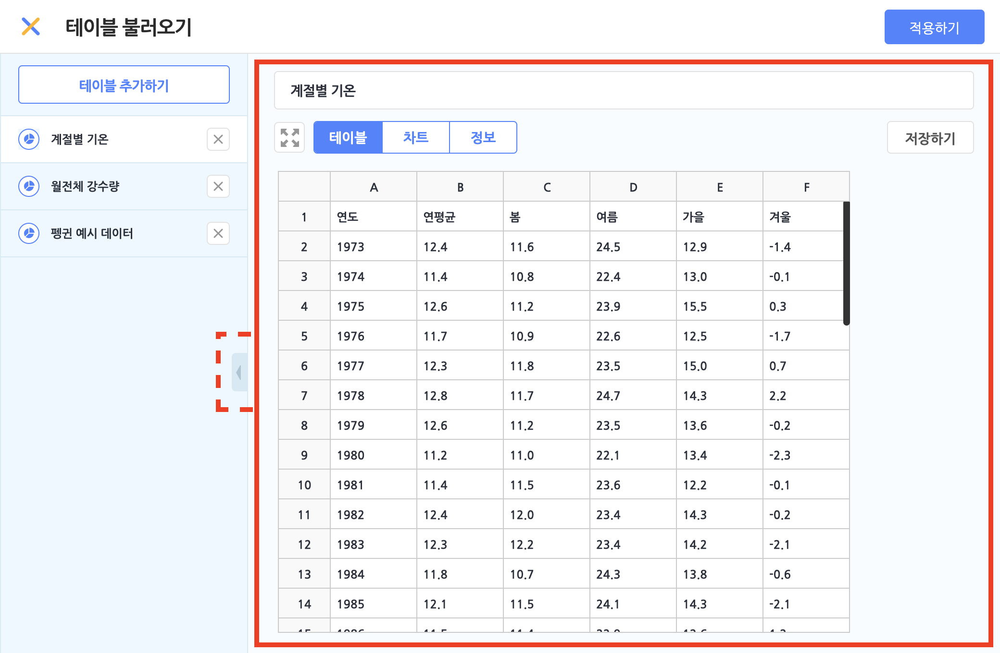

테이블을 분석하고 데이터나 차트를 추가하거나 편집할 수 있는 영역입니다.
영역이 좁아서 불편하신가요? '◀︎' 버튼을 클릭해 테이블 목록을 접으면 테이블 상세 영역을 더 넓게 볼 수 있습니다.

### ① 테이블 탭

테이블의 데이터를 편집할 수 있는 탭입니다.
테이블은 **행**과 **열**, 그리고 각각의 행과 열에 해당하는 데이터(**셀**)를 담는 표를 의미합니다. 
이렇게 데이터 하나하나가 테이블의 형태로 만들어지면 의미있는 정보로 활용할 수 있어요.

- **행**(가로줄)은 항목, **열**(세로줄)은 속성이라고도 부릅니다. 행은 숫자, 열은 알파벳으로 그 순서를 나타내지요. 행과 열을 조합하면 셀의 이름이 됩니다. 
  - 예를 들어 테이블의 가장 왼쪽 위의 셀은 `A1`이라는 이름을 가집니다.
  - 행/열을 나타내는 회색 음영은 테이블을 스크롤 해도 계속 표시됩니다.
- 속성은 같은 의미의 데이터가 들어가는 자리라는 뜻이고, 항목은 각각 다른 개별 데이터가 들어가는 자리라는 뜻입니다.
  - 예를 들어 '연도'라는 속성에는 '1973', '1974', '1975' 등의 개별 데이터, 즉 항목이 들어갑니다.
    속성의 이름은 1행에 들어있는 경우가 일반적입니다.
- 마우스 왼쪽 버튼을 눌러 셀을 선택합니다. (커서를 표시합니다.)
  커서가 표시된 상태에서 내용을 입력하면 셀의 내용을 (바로) 수정합니다.  
  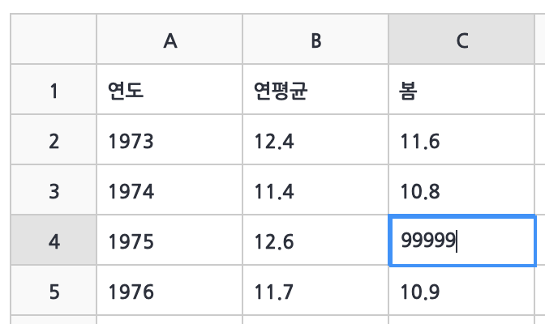
- 각 셀을 클릭하거나 방향키로 이동하면 커서를 움직일 수 있습니다. 
  방향키 외에도 Tab키와 Enter키를 눌러 셀 사이를 이동할 수 있습니다.
  Tab은 바로 오른쪽 셀로, Enter키는 바로 아래 셀로 이동하고 
  Tab키로 이동하던 도중 Enter키를 누르면 Tab키를 누른 맨 처음 위치의 바로 아래로 이동합니다.
- 마우스 오른쪽 버튼을 누르면 툴팁 메뉴가 표시됩니다. 툴팁 메뉴에서 잘라내기/복사, 붙여넣기, 셀 내용 삭제가 가능합니다.  
  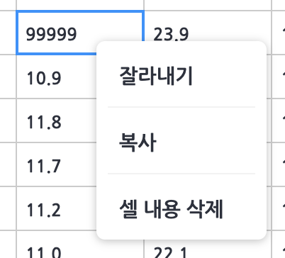
- 마우스를 드래그하면 여러 셀을 한꺼번에 선택할 수 있습니다. 
  이렇게 다중 선택한 셀을 잘라내기/복사해 다른 위치에 붙여 넣을 수 있습니다.

### ② 차트 탭

테이블의 차트를 추가하고 편집하는 탭입니다.  
**차트**(또는 '그래프'라고도 부릅니다.)는 데이터 사이의 관계를 그림으로 표현해, 데이터를 직관적으로 이해할 수 있도록 돕는 도구입니다.  
이렇게 차트를 작성하는 것은 다르게 표현해, 데이터를 시각화한다고도 말합니다.

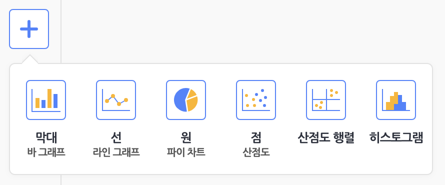

왼쪽 위의 [+] 표시를 클릭해서 추가할 차트의 모양을 선택할 수 있습니다. 차트는 최대 10개까지 추가할 수 있어요.
테이블의 데이터를 가장 잘 설명할 수 있는 차트를 골라보세요.
만든 차트를 클릭하면 차트 표시 영역에서 선택한 차트를 볼 수 있습니다.

- **막대 차트**

  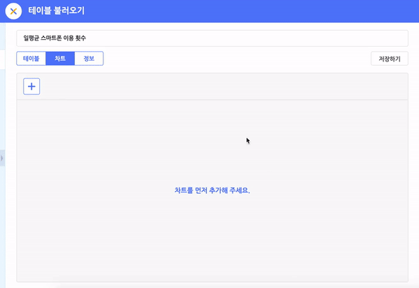

  막대 차트는 여러 데이터의 크기를 단순히 비교하며 분석할 때 사용하기 좋은 차트예요.  ('바 그래프'라고도 불러요.)
  그래프의 가로축과 계열에 해당하는 속성을 선택하면 막대 차트를 그려요.  
  막대에 마우스를 올리면 해당 막대의 데이터 정보를 보여주는 상자가 나타납니다.

- **선 차트**

  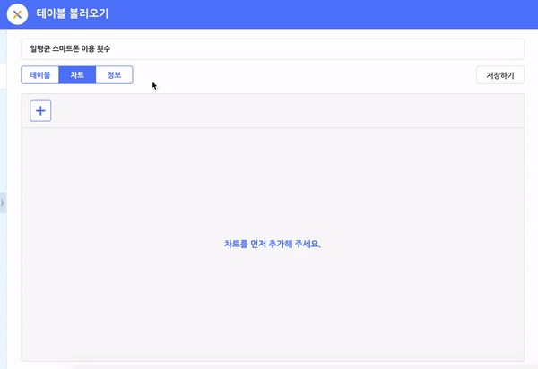

  선 차트는 시간의 흐름 또는 순서에 따라 달라지는 데이터를 분석할 때 사용하기 좋은 차트예요. ('라인 그래프'라고도 불러요.)  
  그래프의 가로축과 계열의 속성을 선택하면 선 차트를 그려요.  
  선의 점에 마우스를 올리면 해당 점의 데이터 정보를 보여주는 상자가 나타납니다.

- **원 차트**

  

  원 차트는 전체 중에서 어떤 데이터가 차지하는 정도를 분석할 때 사용하기 좋은 차트예요.  ('파이 차트'라고도 불러요.)  
  그래프의 계열, 값의 속성을 선택하면 원 차트를 그려요.  
  원 조각에 마우스를 올리거나 터치를 유지하면 해당 조각의 데이터 정보를 보여주는 상자가 나타납니다.

- **점 차트**

  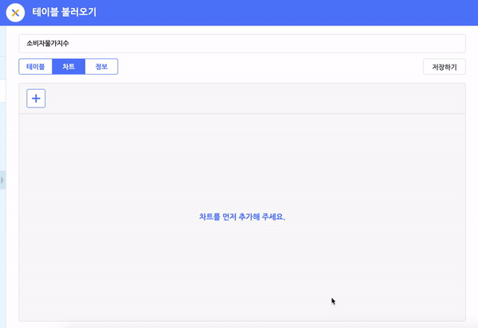
  
  점 차트는 두 가지 속성 간의 관계를 분석할 때 사용하기 좋은 차트예요.  ('산점도'라고도 불러요.)  
  그래프의 가로축과 세로축, 계열의 속성을 선택하면 점 차트를 그려요.  
  가로축과 세로축은 수로 이루어진 속성만 선택할 수 있습니다.  
  점에 마우스를 올리거나 터치를 유지하면 해당 점의 데이터 정보를 보여주는 상자가 나타납니다.

- **산점도 행렬 차트**
  
  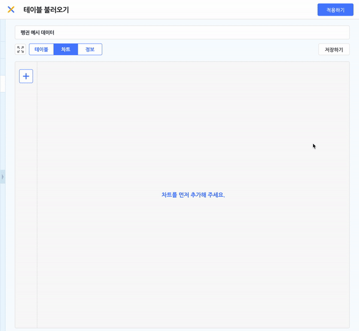

  산점도 행렬 차트는 여러 속성 간의 관계를 분석할 때 사용하기 좋은 차트예요.  
  그래프의 계열 속성을 두 개 이상 선택하면 점 차트를 상하좌우로 나란히 놓은 것과 같은 산점도 행렬 차트를 그려요.  
  계열은 수로 이루어진 속성만 선택할 수 있습니다.  
  기본은 '모든 점 표시' 모드이고, '상관계수' 모드를 선택하면 대각선을 기준으로 오른쪽 위의 차트는 점 대신 각 속성 간의 상관계수를 표시합니다. 

- **히스토그램 차트**
  
  

히스토그램 차트는 전체 중에서 데이터의 분포를 파악할 때 사용하기 좋은 차트에요.  
그래프의 계열 속성을 선택하면 히스토그램 차트를 그려요.  
계열은 수로 이루어진 속성만 선택할 수 있습니다.  
계급 수를 조정하면 계급 폭이 자동으로 결정됩니다. 
계급 경계는 '왼쪽 닫힘', '오른쪽 닫힘' 중에 선택할 수 있습니다.  
계급 위에 마우스를 올리면 해당 계급의 데이터 정보를 보여주는 상자가 나타납니다.

### ③ 정보 탭

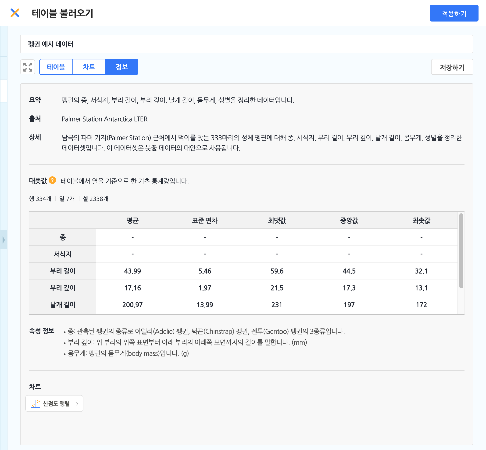

테이블에 대한 기본 정보를 보여주는 탭입니다.

- **요약**: 테이블에 대한 간략한 설명입니다. 엔트리가 직접 등록한 기본 테이블에서만 표시됩니다.
- **테이블**: 테이블의 각 속성(열)에 대한 기초 통계량입니다. 데이터가 숫자가 아니라면 계산하지 않고 `-` 으로 표시합니다.
  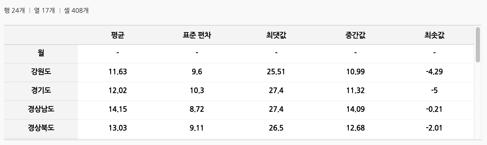
  - **평균**: 각 속성에 있는 모든 데이터의 크기를 더하고 개수로 나눈 수입니다. 
  - **표준 편차**: 각 속성의 모든 데이터가 평균에서 얼마나 떨어져 있는지 보여줍니다.
  - **최댓값**: 각 속성의 데이터 중 가장 큰 수입니다.
  - **중간값**: 각 속성의 데이터를 크기에 따라 순서를 정렬했을 때, 한가운데에 있는의 수입니다. 평균과 달리 데이터의 크기가 아니라 순서만 고려합니다.
  - **최솟값**: 각 속성의 데이터 중 가장 작은 수입니다.
- **차트**: 테이블에서 추가한 차트를 한 눈에 확인할 수 있습니다. 

## 테이블 추가하기 팝업

테이블 불러오기 팝업에서 '테이블 추가하기' 버튼을 클릭하면 테이블 추가하기 팝업이 표시됩니다.

### ① 테이블 선택 탭

엔트리가 미리 준비한 기본 테이블입니다. 기본 테이블은 꾸준히 추가될 예정입니다.
테이블을 선택하고, 아래의 '추가하기' 버튼을 클릭해서 테이블 목록에 추가해요.
파란색 글씨(하이퍼링크)를 클릭하면 해당 테이블을 활용하는 예시 작품이나 링크를 확인할 수 있습니다.

따로 준비한 테이블이 없어도, 바로 기본 테이블을 선택해서 데이터 분석을 해볼 수 있어요. 테이블이 너무 많아서 원하는 테이블을 찾기 어렵다면 오른쪽 상단의 검색을 활용해 주세요.

### ② 파일 올리기 탭

엑셀(XLS, XLSX) 파일이나 CSV 파일을 직접 업로드해 테이블을 추가할 수도 있어요.
이미 만들어 둔 테이블이 있거나, 공공 데이터셋 등 공개 데이터가 담긴 테이블을 가지고 있다면 파일로 업로드해 작품에서 활용해 보세요.

단, 엑셀 함수 등은 계산되지 않고 함수 문장이 그대로 표시되니 주의해 주세요. 
(엑셀 등의 별도 프로그램에서 미리 함수가 포함된 셀의 데이터를 '값'으로 변경해 업로드 하면 됩니다.)
올릴 수 있는 파일의 최대 용량은 10MB 이하입니다.

### ③ 새로 만들기 탭

엔트리에서 직접 데이터를 입력해서 테이블을 만들 수도 있어요.
새로 만들기 탭에서 '추가' 버튼을 누르면 30행, 10열을 가지는 새로운 빈 테이블이 만들어 집니다. 

한 가지 주의할 점은, 엔트리의 테이블은 값이 들어있는 부분까지만 잘라서 저장합니다.
새로운 테이블을 만들고 값을 아무것도 입력하지 않은 채로 저장하면,
1행, 1열의 테이블로 줄어들어 저장되니 저장하기 전에 입력하고자 하는 값을 모두 입력하고 저장해 주세요.
(Tip: 가장 바깥의 셀 하나만 입력해도 테이블은 줄어들지 않아요!)