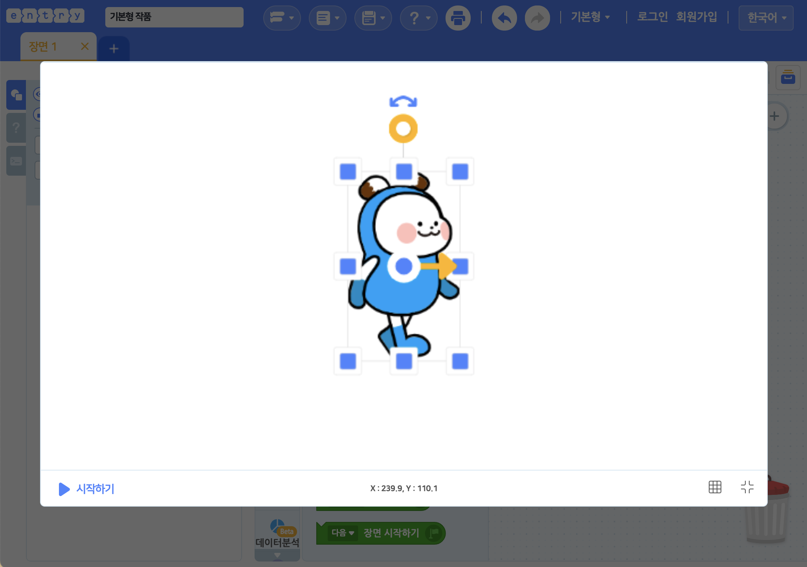

## 작품 실행

작품 만들기 화면의 왼쪽 위에 있는 실행 화면입니다. '시작하기' 버튼을 누르면 작품을 실행할 수 있습니다.

+ 단축키 `ctrl` + `r` 을 눌러서 실행할 수도 있습니다.

작품이 실행 중이라면 '일시정지' 버튼과 '정지하기' 버튼이 나타나요.

+ **일시정지 버튼**  : 작품을 잠시동안 정지합니다. '다시 시작' 버튼 을 다시 누르면 작품이 정지된 부분부터 다시 시작해요.

+ **정지하기 버튼**  : 작품을 완전히 정지하고 처음 상태로 되돌립니다. 단축키 `ctrl` + `r` 을 눌러서 정지할 수도 있습니다.

실행 화면 위에 나타나는 좌표는 마우스 포인터의 좌표입니다. 실행 화면 안에 마우스 포인터를 대보세요.

속도 조절 버튼을 누르면 작품의 실행 속도를 1~5 범위에서 조절할 수 있어요. 블록의 실행 순서를 눈으로 천천히 확인하고자 할 때 유용합니다.

'모눈종이' 버튼을 클릭하면 실행 화면에 눈금 좌표계가 나타납니다.

+ 실행 화면의 가운데가 좌표계의 원점입니다.
+ 실행 화면 안의 x 좌표 범위는 -240~240 입니다. 오른쪽으로 갈수록 양수(+)로 커지고, 왼쪽으로 갈수록 음수(-)로 커져요.
+ 실행 화면 안의 y 좌표 범위는 -135~135 입니다. 위로 갈수록 양수(+)로 커지고, 아래로 갈수록 음수(-)로 커져요.

오브젝트의 위치를 파악할 때 유용해요.

오른쪽 위의 크게 보기 버튼을 클릭하면 실행 화면을 크게 볼 수 있어요.

큰 실행 화면 아래에서 속도 조절 버튼을 제외한 모든 기능을 사용할 수 있습니다.

큰 실행 화면은 오른쪽 아래의 작게 보기 버튼을 클릭하면 원래의 크기로 되돌릴 수 있습니다.

## 오브젝트 조절

(잠금을 해제한 상태인) 오브젝트는 아래의 그림과 같이 실행 화면에서 오브젝트의 속성을 조절할 수 있어요.

+ 모양을 드래그해서 오브젝트의 위치를 움직입니다.
+ **셀렉트 박스**  : 드래그해서 모양의 가로, 세로 크기를 조절합니다. 오브젝트의 **크기**도 함께 바뀌어요.
+ **중심점, 중심축**  : 드래그해서 중심 위치를 조절합니다. 중심점은 오브젝트 속성의 **좌표**예요. 오브젝트를 이동할 때에도 이 중심점을 기준으로 이동하며 오브젝트의 방향을 회전할 때의 중심축이기도 합니다.
+ **오브젝트 방향 핸들**  : 오브젝트의 중심을 기준으로 드래그를 하며 방향을 조절합니다. 오브젝트 방향 핸들을 바꾸면 오브젝트가 바라보는 **방향**도 함께 바뀌어요.
+ **이동 방향 표시**  : 드래그해서 이동 방향을 조절합니다. 오브젝트 속성의 **이동 방향**도 함께 바뀌어요. 방향과 이동방향은 다른 것임을 주의하세요! 방향을 조절할 때 이동 방향도 함께 바뀌는 것처럼 보이지만, '이동 방향'은 오브젝트가 움직이는 방향이기 때문에 바뀌지 않아요.
