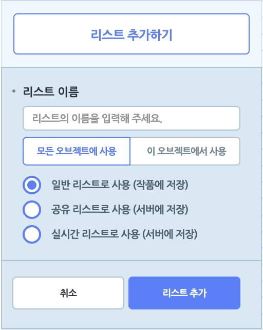
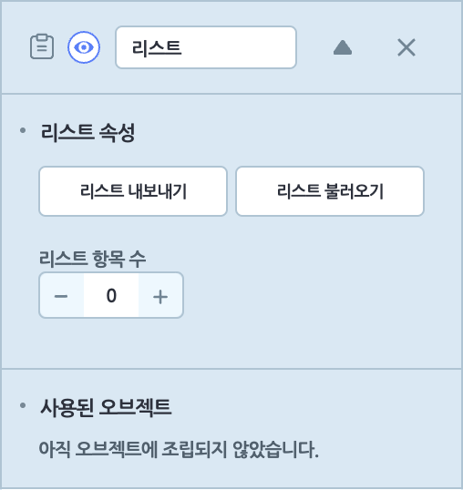
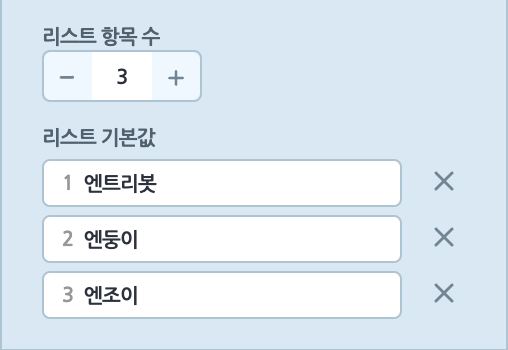

## 속성 목록

작품에서 사용하는 **변수, 리스트, 신호, 함수**를 관리하는 영역입니다.

각 속성들의 사용법은 다음과 같습니다.

+ 왼쪽의 아이콘으로 각 속성의 종류를 구분할 수 있습니다.
  +  **변수**
  +  **리스트**
  +  **신호**
  +  **함수**
+ 속성을 선택하면 해당 항목이 펼쳐지며 세부 내용을 확인하거나, 사용된 오브젝트 등을 변경할 수 있습니다.  
자세한 내용은 아래 각 속성 설명에서 확인할 수 있습니다.
+ X 버튼을 클릭하면 속성을 삭제할 수 있습니다.
+ 눈 모양 버튼을 클릭하면 실행 화면에서 표시되는 변수/리스트 창의 기본 표시 여부를 정할 수 있습니다.

## 변수

변수는 숫자나 문자 데이터를 저장할 수 있는 공간입니다. 필요할 때마다 찾아서 데이터를 넣고 뺄 수 있는 상자를 떠올려보세요.
변수에는 한 번에 한 가지 데이터만 저장할 수 있으며, 데이터는 언제든지 수정, 변경할 수 있습니다.

'변수' 카테고리를 선택해서 변수를 추가하거나 모아봅니다.

변수의 종류는 네 가지고, 모든 오브젝트에서 사용하는 변수와 특정 오브젝트에서만 사용하는 변수로 분류합니다.

왼쪽의 아이콘으로 변수의 종류를 확인할 수 있어요.

'변수 추가하기' 버튼을 클릭하면 추가할 변수의 종류를 선택할 수 있어요.

+ **모든 오브젝트에 사용**

  +  **일반 변수로 사용 (작품에 저장)**  : 작품을 정지하면 기본값으로 초기화되는 변수입니다.

  +  **공유 변수로 사용 (서버에 저장)** : 작품을 정지하면 서버에 저장되는 변수입니다.

  +  **실시간 변수로 사용 (서버에 저장)** : 작품을 실행하는 도중에 실시간으로 서버에 저장되는 변수입니다.

+  **이 오브젝트에서 사용** : 선택한 오브젝트에서만 사용하는 일반 변수입니다. 해당 오브젝트의 복제본도 다른 오브젝트가 사용할 수 없는 변수를 가집니다.

역삼각형 버튼을 클릭하면 나타나는 각 변수의 설정입니다.

+ **변수 속성**

  + **기본값** : 변수가 작품을 실행할 때부터 가질 값을 정합니다.

  + **슬라이드** : 실행 화면에서 이 변수의 슬라이드를 보이거나 숨깁니다. 최댓값과 최솟값 사이에서 사용자가 변수를 직접 조절할 수 있습니다.

    실행 화면에 다음과 같은 슬라이드가 나타나 작품 실행 도중에 변수를 변경할 수 있어요.

       

+ **사용된 오브젝트** : 어떤 오브젝트가 이 변수를 어떻게 사용하는지 확인합니다. 각 정보를 클릭하면, 이 변수를 사용하는 장면과 오브젝트를 선택하고 블록을 강조 표시합니다. 일일이 찾지 않아도 클릭 한 번으로 찾을 수 있어요.

  + 변수 더하기 : 사용된 오브젝트에 변수를 더합니다.
  + 변수 정하기 : 사용된 오브젝트의 변수를 정합니다.

## 리스트

리스트는 숫자나 문자 데이터를 여러개 저장할 수 있는 공간입니다. 필요할 때마다 물건을 담거나 뺄 수 있는 여러 칸 짜리 서랍을 떠올려보세요.

리스트 각 항목에는 한 가지 데이터만 저장할 수 있으며, 데이터들은 언제든지 수정, 변경이 가능합니다. 또한 리스트 항목에는 순서대로 번호가 붙어있어, 데이터를 불러오거나 수정할 때 항목 번호를 이용할 수 있어요.

'리스트' 카테고리를 선택해서 리스트를 추가하거나 모아봅니다.

리스트의 종류는 네 가지고, 모든 오브젝트에서 사용하는 리스트와 특정 오브젝트에서만 사용하는 리스트로 분류합니다. 왼쪽의 아이콘으로 리스트의 종류를 확인할 수 있어요.

'리스트 추가하기' 버튼을 클릭하면 추가할 리스트의 종류를 선택할 수 있어요.

+ **모든 오브젝트에 사용**

  +  **일반 리스트로 사용 (작품에 저장)** : 작품을 정지하면 기본값으로 초기화되는 리스트입니다.

  +  **공유 리스트로 사용 (서버에 저장)** : 작품을 정지하면 서버에 저장되는 리스트입니다.

  +  **실시간 리스트로 사용 (서버에 저장)** : 작품을 실행하는 도중에 실시간으로 서버에 저장되는 리스

    트입니다.

+  **이 오브젝트에서 사용** : 선택한 오브젝트에서만 사용하는 일반 리스트입니다. 해당 오브젝트의 복제본 역시 다른 오브젝트가 사용할 수 없는 리스트를 가집니다.

역삼각형 버튼을 클릭하면 나타나는 각 리스트의 설정입니다.

+ **리스트 속성**

+ **리스트 내보내기** : 이 버튼을 클릭하면 리스트 항목의 내용을 복사하거나, 엑셀로 내려받을 수 있는 팝업창이 나타납니다.

  

+ **리스트 불러오기** : 이 버튼을 클릭하면 리스트의 항목을 올릴 수 있는 팝업 창이 나타납니다. 한 줄이 하나의 항목이며, 기존의 리스트 항목이 있다면 새로 올리는 항목으로 변경합니다.

  

+ **리스트 항목 수** : '-'와 '+'를 클릭하거나 직접 개수를 입력해서 리스트의 항목 수를 추가 또는 삭제합니다.

  ​                                                     

+ **사용된 오브젝트** : 어떤 오브젝트가 이 리스트를 어떻게 사용하는지 확인할 수 있습니다. 각 정보를 클릭하면, 이 리스트를 사용하는 장면과 오브젝트를 선택하고 블록을 강조 표시합니다. 일일이 찾지 않아도 클릭 한 번으로 찾을 수 있어요.

## 신호

신호는 어떤 오브젝트가 원하는 때에 다른 오브젝트의 블록이 동작할 타이밍을 알려주는 기능을 말합니다. 오브젝트끼리 주고 받는 대화라고도 볼 수 있어요.
신호를 이용하면 내가 원하는 시점과 조건에 맞춰 오브젝트가 동작하는 순서를 정할 수 있습니다.

'신호' 카테고리를 선택해서 신호를 추가하거나 모아봅니다.

'신호 추가하기' 버튼을 클릭하면 이름을 입력하고 신호를 추가할 수 있습니다.

역삼각형 버튼을 클릭하면 어떤 오브젝트가 이 신호를 어떻게 사용하는지 확인할 수 있습니다.

각 정보를 클릭하면, 이 신호를 사용하는 장면과 오브젝트를 선택하고 블록을 강조 표시합니다. 일일이 찾지 않아도 클릭 한 번에 찾을 수 있어요.

## 함수

함수를 이용하면 여러 블록의 조립을 하나의 블록처럼 사용할 수 있습니다. 하나의 기능을 위해 사용되는 블록의 모음이거나 여러 번 사용해야 하는 블록들을 함수로 만들면 편리하답니다.

마치 '집 밖으로 나가기'라는 하나의 목표를 위해 양치를 하고, 양말을 신고, 현관문을 열어야 하는 것처럼요!

'함수' 카테고리를 선택해서 함수를 추가하거나 모아봅니다.

'함수 추가하기' 버튼을 클릭하면 함수 블록 조립소에서 함수를 만들 수 있어요.

역삼각형 버튼을 클릭하면 어떤 오브젝트가 이 함수를 사용하는지 확인할 수 있습니다.
