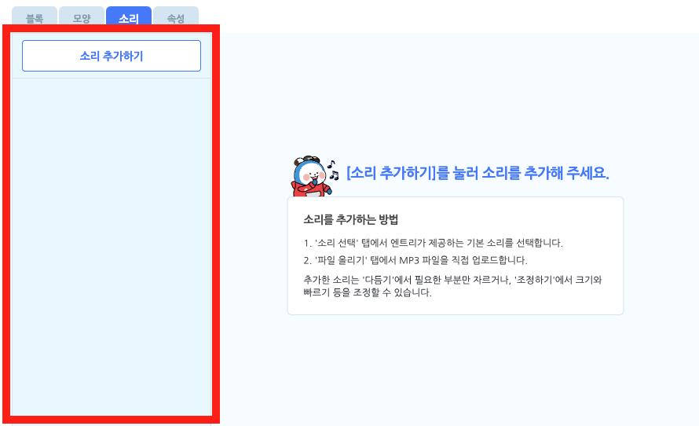
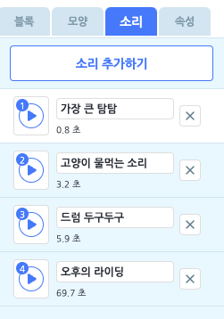
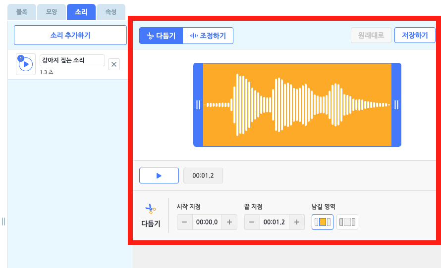
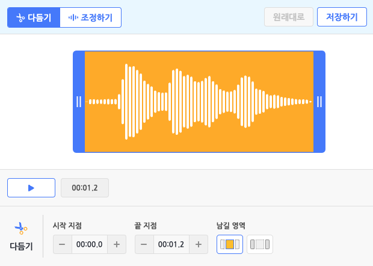
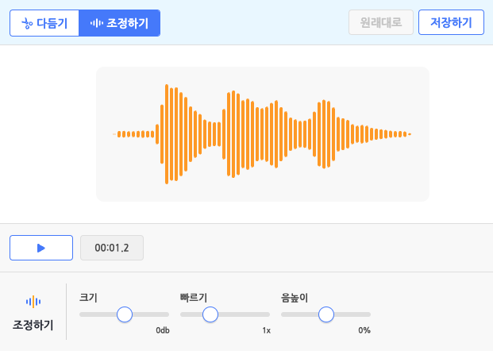
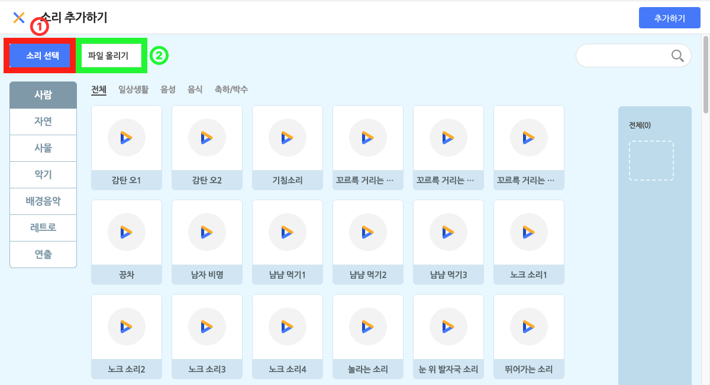
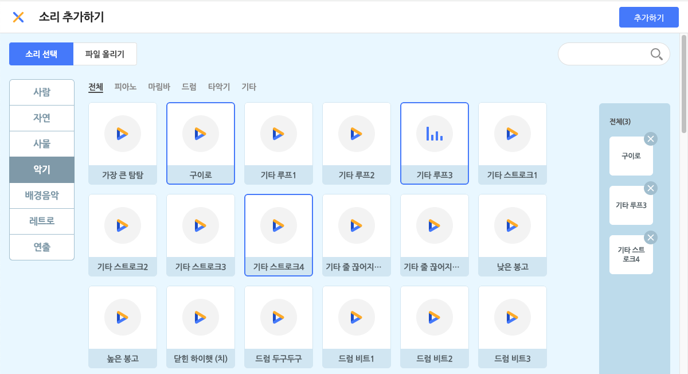
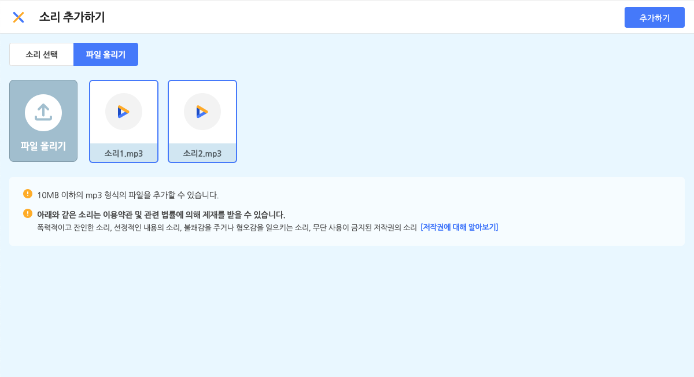

## 소리 목록

오브젝트에 소리를 추가 또는 관리하는 영역입니다.

모든 오브젝트에는 하나의 소리 목록이 있어요. '소리 추가하기' 버튼을 통해 원하는 소리를 이 목록에 추가할 수 있습니다.

소리 목록에 추가한 소리는 소리 블록을 통해 재생할 수 있습니다.

+ 이름 상자를 클릭해서 이름을 수정합니다.
+ 오른쪽의 X 버튼을 클릭해서 삭제합니다.
+ 왼쪽의 재생 아이콘을 클릭해서 재생합니다.
+ 왼쪽의 재생 아이콘을 드래그해서 소리 목록의 순서를 바꿉니다.
+ 소리를 마우스 우클릭하면 이름 수정, 복제, 삭제, PC에 저장이 가능합니다.

## 소리 편집

소리의 구간을 잘라 다듬거나 조정할 수 있는 공간입니다.

+ **원래대로 / 저장하기**
  + **원래대로**: 편집한 소리를 처음 불러온 상태로 되돌립니다.  
  한 번 저장하고 나면 그 이전으로는 되돌릴 수 없습니다.  
  (아무 것도 편집하지 않았다면, '원래대로' 버튼은 비활성화 상태가 됩니다.)
  + **저장하기**: 현재 소리를 저장합니다.

소리 편집에서는 상단 탭에서 모드를 선택할 수 있습니다. 현재는 **다듬기** 모드와 **조정하기** 모드를 제공해요.

#### **①다듬기**

다듬기는 추가한 소리의 일부 구간을 잘라 다듬을 수 있는 모드입니다.  

+ **파형** :  
추가한 소리의 파형을 표시하는 부분입니다.  
다듬기 모드에서는 파란색 막대(다듬기 커서라고 불러요)가 함께 표시됩니다. 
+ **재생 버튼 / 시점 표시** :  
다듬기 커서를 조절해 원하는 구간을 선택했다면 재생 버튼을 눌러 미리 들어볼 수 있어요.  
이 때는 전체 소리가 아니라, 선택한 구간만 재생합니다.  
재생 중에는 재생 위치를 표시하는 빨간색 막대(재생 커서라고 불러요)가 파형 위에서 표시됩니다.  
또한, 정지 상태일 때는 재생 버튼의 오른쪽에서 소리의 전체 길이가 표시되고,  
재생(일시 정지 포함) 상태 일때는 현재 재생하고 있는 시점이 표시됩니다.
+ **시작 지점 / 끝 지점** :  
세세한 조정이 필요하다면 파형 아래의 패널에서 시작 지점, 끝 지점을 0.1초 단위로 지정해 선택할 수도 있습니다. 
+ **남길 영역** :  
남길 영역의 첫 번째 버튼은 선택한 구간의 안쪽을 남기는 방식이고,   
두 번째 버튼은 선택한 구간의 바깥쪽을 남기는 방식입니다.  
(파형에서와 마찬가지로 노란색 배경 부분의 소리를 남깁니다.)

원하는 방식으로 구간을 선택했다면, 위쪽의 '저장하기' 버튼을 눌러 편집을 마칩니다.

#### **②조정하기**

조정하기는 추가한 소리의 다양한 속성을 조정해 새로운 소리를 만들 수 있는 모드입니다.

+ **파형** :  
추가한 소리의 파형을 표시하는 부분입니다.
+ **재생 버튼 / 시점 표시** :  
재생 버튼을 누르면 조정한 소리를 미리 들어볼 수 있어요. 이 때는 항상 전체 소리를 재생합니다.  
재생 중에는 재생 위치를 표시하는 빨간색 막대(재생 커서라고 불러요)가 파형 위에서 표시됩니다.  
또한, 정지 상태일 때는 재생 버튼의 오른쪽에서 소리의 전체 길이가 표시되고,  
재생(일시 정지 포함) 상태 일때는 현재 재생하고 있는 시점이 표시됩니다.
+ **크기 / 빠르기 / 음높이**
  + **크기**(volume) : 소리의 크기를 조정합니다.  
  기본값은 0dB(데시벨)이고, -12dB과 12dB 사이에서 정할 수 있습니다.
  + **빠르기**(speed) : 소리의 빠르기를 조정합니다.  
  기본값은 1x(배)이고, 0.5x와 2x 사이에서 정할 수 있습니다. 
  + **음높이**(pitch) : 소리의 음높이를 조정합니다.  
  기본값은 0%이고, -100%와 100% 사이에서 정할 수 있습니다.

## 소리 추가 팝업

'소리 추가하기' 버튼을 클릭하면 나타나는 팝업 창입니다.

소리를 선택하고, 아래의 '추가하기' 버튼을 클릭하면 소리 목록에 추가할 수 있어요.

#### ① 소리 선택

원하는 소리를 클릭해서 선택합니다. 중복 선택이 가능해요. 선택한 소리는 아래의 선택 목록 영역에서 볼 수 있어요.

선택한 소리를 다시 클릭하거나, 선택 목록의 소리에서 X 버튼을 눌러 선택을 해제할 수 있습니다.

오른쪽 위의 검색창을 통해 원하는 소리의 이름을 검색할 수 있어요. 왼쪽의 카테고리를 선택하면 원하는 소리를 더 쉽게 찾을 수 있습니다.

#### ② 파일 올리기

원하는 소리를 직접 올릴 수도 있어요.

소리 파일의 용량은 10MB 이하여야 하고, mp3 형식(확장자)을 지원합니다.

올린 소리는 파일 올리기 목록에서 볼 수 있습니다. 선택한 소리만 소리 목록에 추가됩니다. 파일을 올리면 기본적으로 선택한 상태가 되니 유의해 주세요.

> 아래와 같은 소리는 이용약관 및 관련 법률에 의해 제재를 받을 수 있습니다.
>
> + 폭력적이고 잔인한 소리
> + 선정적인 내용의 소리
> + 불쾌감을 주거나 혐오감을 일으키는 소리
> + 무단 사용이 금지된 저작권의 소리  [[저작권에 대해 알아보기]](https://playentry.org/#!/terms/project)

