## 테이블 탭

테이블 탭은 여러분의 작품에서 사용하는 테이블을 관리할 수 있는 영역입니다. 테이블은 행과 열로 이루어진 데이터를 저장하는 객체를 말합니다. 더 쉽게 말해서, 무엇이든 정리하고 담을 수 있는 창고를 생각하면 돼요.

테이블이 있으면 다양한 데이터를 쉽게 추가, 분류하고 관리할 수 있으며, 데이터를 요약하거나 그림으로 그려서 한 눈에 볼 수도 있어요. 이렇게 테이블을 보며 데이터가 어떤 의미를 가지는지 고민해보고, 블록을 통해 데이터를 바로 작품에 활용할 수도 있습니다.

그 말은 즉, 데이터를 작품에 활용하든 그렇지 않든 테이블은 아주 유용한 정보라는 뜻이에요.

#### 1) 테이블 목록

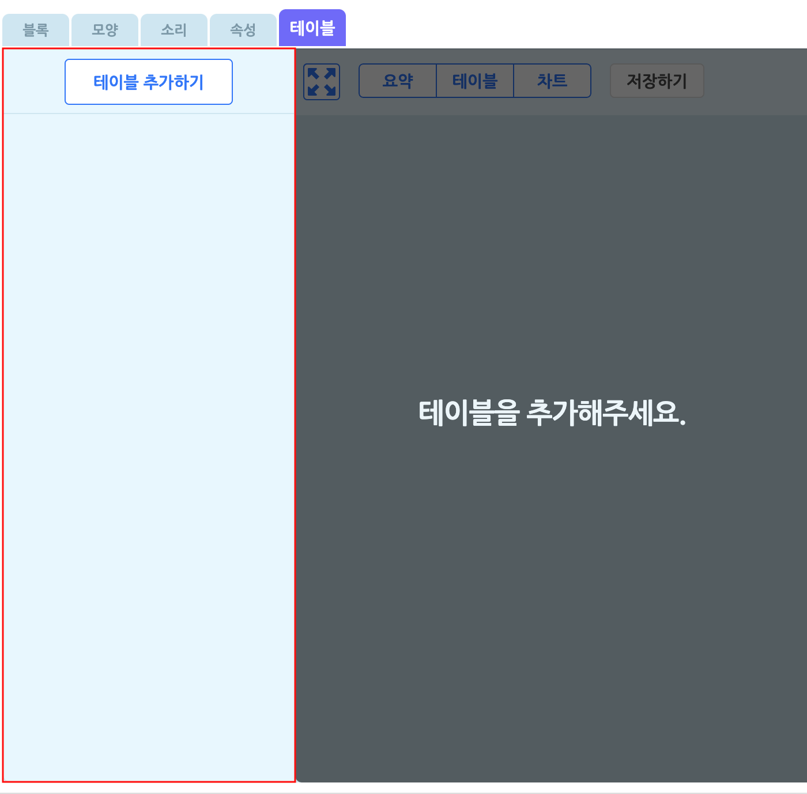

작품에서 사용할 테이블을 추가하거나 삭제하는 등 테이블을 관리할 수 있는 영역입니다.

'테이블 추가하기' 버튼을 통해 원하는 테이블을 이 목록에 추가할 수 있어요.

+ 이름 상자를 클릭해서 이름을 수정합니다.
+ 오른쪽의 X 버튼을 클릭해서 삭제합니다.
+ 왼쪽의 테이블 아이콘을 드래그해서 모양 목록의 순서를 바꿉니다.

-----

#### 2) 테이블 추가 팝업

테이블 탭에서 '테이블 추가하기' 버튼을 클릭하거나, 데이터분석 블록 꾸러미에서 '데이터 화면 열기' 버튼을 클릭하면 나타나는 팝업 창입니다.

##### ① 테이블 선택

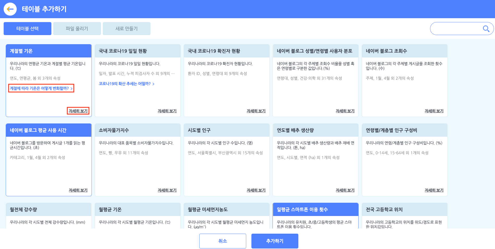

엔트리에서 준비한 기본 테이블의 간략한 설명을 볼 수 있습니다. 테이블을 선택하고, 아래의 '추가하기' 버튼을 클릭해서 테이블 목록에 추가해요.

일부 테이블의 파란색 글씨(하이퍼 링크)를 클릭하면 해당 테이블을 활용하는 예시 작품을 확인할 수 있습니다.

각 테이블 오른쪽 아래의 '<u>자세히 보기</u>'를 클릭하면, 아래와 같이 해당 테이블의 데이터에 대한 자세한 설명을 확인할 수 있어요.

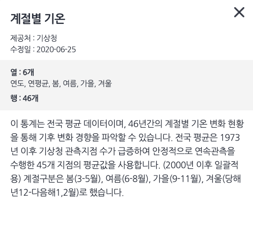

기본 테이블은 앞으로도 엔트리에 계속 추가될 예정이니, 지켜봐주세요!

##### ② 파일 올리기

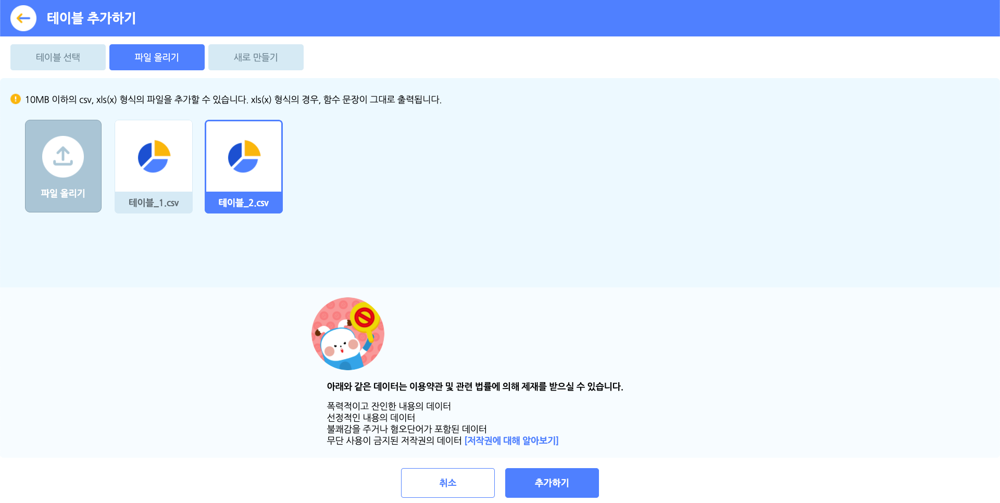

원하는 테이블을 직접 올릴 수도 있어요.

테이블 파일의 용량은 10MB 이하여야 하고, csv, xls, xlsx 형식(확장자)를 지원합니다. 단 xls, xlsx 형식의 경우, 셀(각 데이터)에서 함수를 사용한다면 함수 문장이 그대로 출력되니 주의해주세요.

올린 테이블은 파일 올리기 목록에서 볼 수 있습니다. 파일을 올리면 기본적으로 선택한 상태가 됩니다. 선택한 테이블만 테이블 목록에 추가되고요. 파일을 올렸다고 해도 선택하지 않으면 목록에 추가되지 않으니 주의하세요.

> 아래와 같은 데이터는 이용약관 및 관련 법률에 의해 제재를 받을 수 있습니다.
>
> + 폭력적이고 잔인한 데이터
> + 선정적인 내용의 데이터
> + 불쾌감을 주거나 혐오감을 일으키는 데이터
> + 무단 사용이 금지된 저작권의 데이터 [[저작권에 대해 알아보기]](https://playentry.org/#!/terms/project)

##### ③ 새로 만들기

미리 만들어진 테이블 말고, 테이블에 직접 내가 원하는 값들을 입력해서 사용할 수도 있어요!

데이터를 직접 입력해서 테이블로 저장할 수 있습니다. 아래의 '이동하기' 버튼을 클릭해서 빈 테이블을 테이블 목록에 추가해요. 뭐든 담을 수 있는 창고를 추가하는 셈이죠.

> 아래와 같은 데이터는 이용약관 및 관련 법률에 의해 제재를 받을 수 있습니다.
>
> + 폭력적이고 잔인한 데이터
> + 선정적인 내용의 데이터
> + 불쾌감을 주거나 혐오감을 일으키는 데이터
> + 무단 사용이 금지된 저작권의 데이터 [[저작권에 대해 알아보기]](https://playentry.org/#!/terms/project)

-----

#### 3) 테이블 분석 창

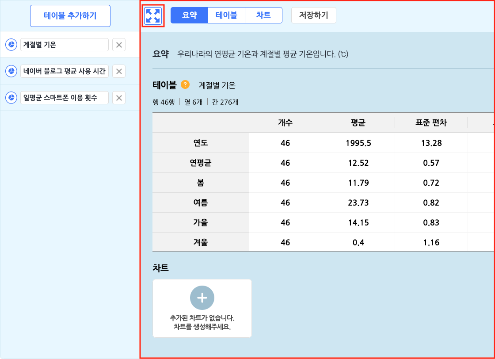

테이블을 분석하고 데이터나 차트를 추가하거나 편집할 수 있는 영역입니다.

테이블 분석 창에는 다양한 기능이.. 앗, 영역이 좁아서 불편하시나요? 좌측 상단의 최대화 버튼을 클릭하면 더 넓게 볼 수 있습니다.

##### ① 요약 탭

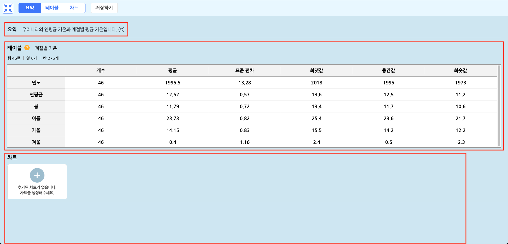

테이블의 정보를 요약해서 보이는 영역입니다.

+ **요약** : 테이블의 간략한 설명이나 테이블의 이름을 보입니다.

+ **테이블** : 테이블을 요약한 표입니다.
  
  
  
  + 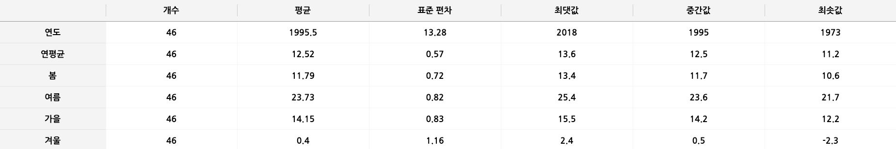
  + **행(가로줄)** : 테이블의 각 속성입니다. (테이블에서는 열에 해당해요.)
  + **열(세로줄)** : 각 속성의 데이터가 한 눈에 보이도록 여러 기준에 따라 요약합니다.
    + **개수** : 각 속성의 셀 개수입니다.
    + **평균** : 각 속성 모든 데이터의 평균입니다.
    + **표준 편차** : 각 속성 모든 데이터가 평균에서 얼마나 떨어져 있는지 보입니다.
    + **최댓값** : 각 속성의 데이터 중 가장 높은 수입니다.
    + **중간값** : 각 속성의 데이터를 크기에 따라 순서를 정할 때, 가운데 순서의 수입니다. 순서만 고려한다는 점이 평균과 달라요.
    + **최솟값** : 각 속성의 데이터 중 가장 낮은 수입니다.
  
+ **차트** : 테이블에서 추가한 차트의 모습을 모아서 보입니다. 차트가 없다면, '+' 표시를 클릭하면 차트 탭으로 이동할 수 있어요.

##### ② 테이블 탭

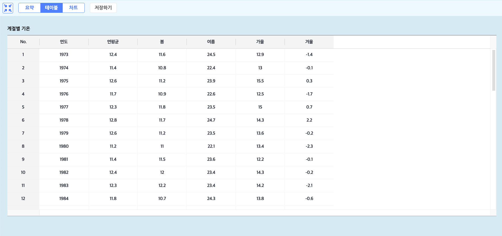

테이블의 데이터를 편집할 수 있는 영역입니다.

테이블은 **행**과 **열**, 그리고 각각의 행과 열에 해당하는 데이터(**셀**)를 담는 표예요. 이렇게 여러 데이터들이 테이블에 모이면 의미있는 정보가 된답니다.

+ 각각의 셀을 클릭해서 내용을 수정합니다.

  

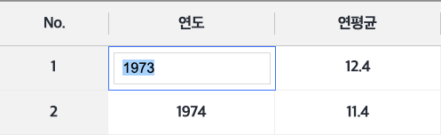

+ 각각의 셀을 마우스 오른쪽 클릭 또는 길게 터치해서 선택합니다.

  

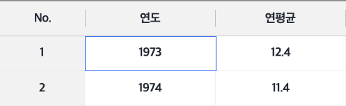

+ 선택한 셀은 단축키를 사용할 수 있어요.

+ 각각의 행(가로줄)은 같은 종류의 데이터를 가집니다. 맨 왼쪽의 번호로 행의 순서를 구분해요.

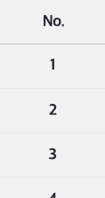

+ 번호를 마우스 오른쪽 클릭 또는 길게 터치하면 나타나는 메뉴

  

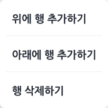

+ 번호를 클릭해서 행의 모든 셀을 선택합니다. 이 때, 선택한 모든 셀을 복사, 붙여넣기, 삭제가 가능합니다.

+ 각각의 열(세로줄)은 같은 속성의 데이터를 가집니다. 맨 위쪽의 이름으로 열의 속성을 구분해요.

+ 속성을 더블 클릭하면 이름을 바꿀 수 있습니다.

  

+ 속성을 마우스 오른쪽 클릭 또는 길게 터치하면 나타나는 메뉴

  

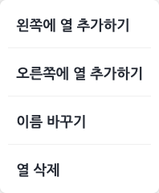

+ 속성을 클릭해서 열의 모든 셀을 선택합니다. 이 때, 선택한 모든 셀을 복사, 붙여넣기, 삭제가 가능합니다.

##### ③ 차트 탭

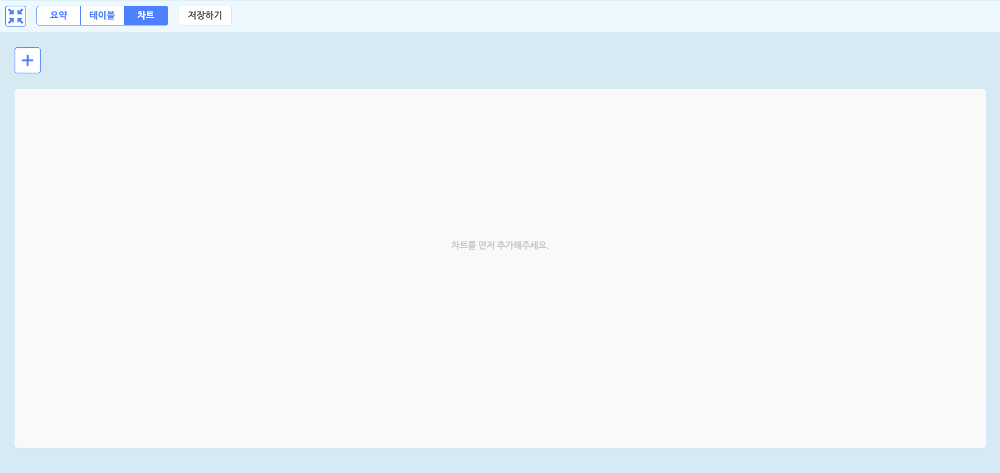

테이블의 차트를 추가하고 편집하는 영역입니다.

테이블을 행과 열로 분류한 여러 데이터 사이의 관계를 그림으로 그려서 더 이해하게 쉽게 보일 수 있어요. 이것을 데이터의 시각화라고 부릅니다. 

데이터 분석의 꽃이죠.

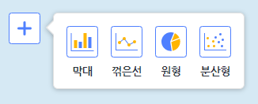

왼쪽 위의 + 표시를 클릭해서 추가할 차트의 모양을 선택할 수 있습니다. 차트는 최대 10 개까지 추가할 수 있어요. 

테이블을 가장 잘 설명할 수 있는 차트를 골라보세요.

만든 차트를 클릭하면 차트 표시 영역에서 선택한 차트를 볼 수 있어요. 

+ 막대 그래프 

  

  

  여러 데이터의 크기를 단순히 비교하며 분석할 때 좋은 차트예요.

  그래프의 가로축과 세로축, 표현값의 속성을 선택하면 막대 차트를 그려요. 세로축은 수로 이루어진 속성만 선택할 수 있습니다. 막대에 마우스를 올리거나 터치를 유지하면 해당 막대의 데이터 정보를 보여주는 상자가 나타납니다.

  

  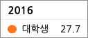

  

  + 위의 내용은 가로축입니다. 
  + 색이 있는 점의 내용은 표현값입니다. 
  + 오르쪽의 내용은 세로축입니다. 

+ 꺾은선 차트 

  

  

  시간의 흐름 또는 순서에 따라 달라지는 데이터를 분석할 때 좋은 차트예요.

  그래프의 가로축과 세로축, 표현값의 속성을 선택하면 꺾은선 차트를 그려요. 세로축은 수로 이루어진 속성만 선택할 수 있습니다. 꺾은선의 점에 마우스를 올리거나 터치를 유지하면 해당 점의 데이터 정보를 보여주는 상자가 나타납니다.

  

  

  

  + 위의 내용은 가로축입니다.
  + 색이 있는 점의 내용은 표현값입니다.
  + 오른쪽의 내용은 세로축입니다.

+ 원형 차트

  

  

  전체 중에서 어떤 데이터가 차지하는 정도를 분석할 때 좋은 차트예요. 그래프의 열 이름(속성), 표현값의 속성을 선택하면 원형 차트를 그려요. 원형 조각에 마우스를 올리거나 터치를 유지하면 해당 조각의 데이터 정보를 보여주는 상자가 나타납니다.

  

  

  

  + 첫 번째 내용은 열 이름입니다.
  + 두 번째 내용은 표현값입니다.
  + 세 번째 내용은 전체(100%) 중에서 데이터가 차지하는 정도입니다.

###### 

+ 분산형 차트

  

  

  

  두 가지 속성 간의 관계를 분석할 때 좋은 차트예요. 그래프의 가로축과 세로축, 표현값의 속성을 선택하면 분산형 차트를 그려요. 세로축은 수로 이루어진 속성만 선택할 수 있습니다. 오른쪽 위의 '표현값' 버튼을 클릭하면 색이 있는 점의 표현값을 볼 수 있습니다. 점에 마우스를 올리거나 터치를 유지하면 해당 점의 데이터 정보를 보여주는 상자가 나타납니다.

  

  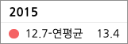

  

  + 위의 내용은 가로축입니다.
  + 색이 있는 점의 내용은 표현값과 그 내용입니다.
  + 오른쪽의 내용은 세로축입니다.