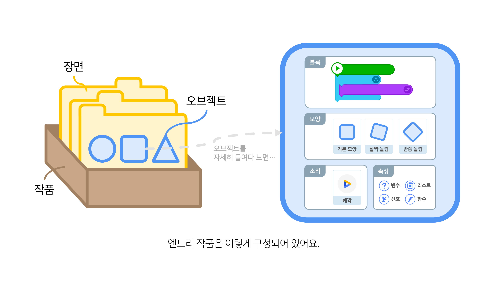
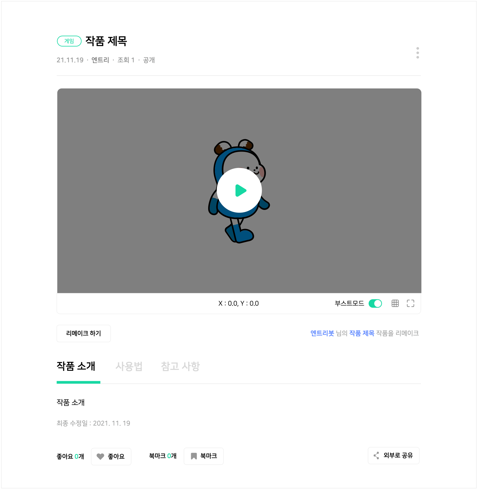
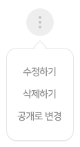
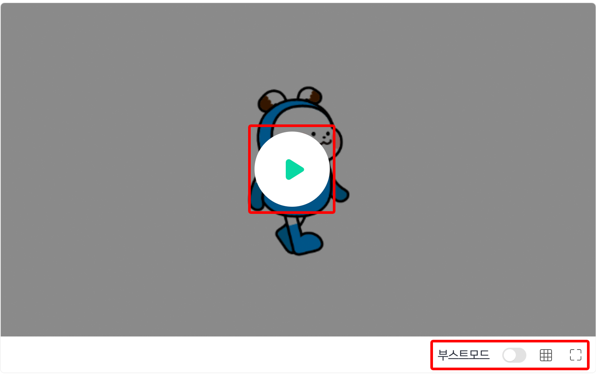
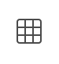
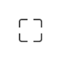

## 작품이란?

엔트리에서 **작품**은 장면 속의 오브젝트들이 (우리의 의도에 따라) 다양하게 동작하도록 하기 위해, 각각의 동작에 해당하는 블록을 일정한 순서에 맞춰 조립한 결과물을 말해요.  

작품은 여러 개의 '장면'으로 이루어져 있고, 장면은 또한 여러 개의 '오브젝트'로 이루어져 있습니다. (물론 하나의 장면과 하나의 오브젝트만으로도 작품을 만들 수 있어요!)

#### ① 장면
'장면'은 마치 **드라마나 영화의 한 장면**과 같은 의미에요. **오브젝트가 존재하는 공간**이라고도 할 수 있습니다. 

엔트리 작품은 한 번에 모든 오브젝트가 "짠!" 하고 등장하는 것이 아니라, 여러 개의 장면을 사용해서 각각 원하는 시점에 원하는 오브젝트만 등장하도록 만들거나, 일정한 조건과 순서에 따라 작품 내용이 진행되도록 만들 수 있습니다.

한 장면에서 다음 장면으로 넘어가면 화면에 등장하는 인물과 배경에 변화가 있듯이, 엔트리 작품에서도 새로운 장면에서는 새로운 오브젝트들과 코드가 필요합니다.  
이전 장면의 오브젝트와 코드는 더 이상 다음 장면에 영향을 줄 수 없어요.  

+ 오른쪽의 [+] 버튼을 클릭해서 새 장면을 추가합니다.
+ 장면 이름을 클릭하면 이름을 수정할 수 있습니다.
+ 장면을 클릭하면 장면을 선택할 수 있습니다. 해당 장면의 실행 화면, 오브젝트 목록이 나타납니다.
+ 선택한 장면 오른쪽의 X 버튼을 클릭해서 삭제합니다.

#### ② 오브젝트

'오브젝트'는 **장면 속의 등장인물**과 같습니다. 물론 인물 뿐만 아니라 등장하는 배경일 수도 있고, 눈에는 보이지 않지만 그곳(장면)에 있는 어떤 것이 될 수도 있어요. 

이러한 **오브젝트는 블록 코딩의 가장 기본적인 단위**가 되며, **모든 블록은 오브젝트에 포함되어 조립**됩니다. 

오브젝트는 모두 4가지 종류의 정보를 담고 있는데요. 이는 각각 '블록', '모양', '소리', '속성' 정보입니다.

+ **블록**

  오브젝트가 '어떻게 동작할 것인지'에 대한 정보를 담고 있습니다.
  엔트리에서 텍스트 코드 대신 사용되는 블록 코드가 바로 여기에 들어 있어요.
  블록을 조립할 때는 꼭 '시작 블록'부터 조립해야 합니다. (그렇지 않으면 해당 블록은 실행할 수 없어요) 
  블록에 대한 더 자세한 설명은 '블록 탭' 문서를 확인해 주세요.

+ **모양**
  오브젝트가 '어떻게 보일 것인지'에 대한 정보를 담고 있습니다.
  하나 또는 여러 개의 이미지로 이루어지고, 각각 순서를 정할 수 있습니다.
  이미지는 엔트리에서 기본적으로 제공하는 것 중에서 고를 수도 있고, 
  이미지 파일을 업로드하거나 그림판 기능을 이용해 직접 그려 사용하는 것도 가능합니다. 
  모양에 대한 더 자세한 설명은 '모양 탭' 문서를 확인해 주세요.

+ **소리**
  오브젝트에서 '어떤 소리가 날 것인지'에 대한 정보를 담고 있습니다.
  모양과 비슷하게 하나 또는 여러 개의 오디오로 이루어지고, 각각 순서를 정할 수 있습니다.
  소리는는 엔트리에서 기본적으로 제공하는 것 중에서 고르거나, 오디오 파일을 업로드해 사용할 수 있습니다. 
  소리에 대한 더 자세한 설명은 '소리 탭' 문서를 확인해 주세요.

+ **속성**
  오브젝트에서 '어떤 값을 활용할 것인지'에 대한 정보를 담고 있습니다.
  속성에는 '변수', '리스트', '신호', '함수'가 있고 이는 모두 오브젝트가 동작하는데 필요한 값에 대한 정보입니다.
  속성에 포함되는 각각의 항목에 대한 더 자세한 설명은 '속성 탭' 문서를 확인해 주세요. 

이렇게 작품을 만드는 것은 우리가 '프로그램'이나 '앱'이라고 부르는 것들을 만드는 과정과 아주 비슷해요.

여러분은 엔트리에서 게임, 애니메이션, 미디어 아트 등 무엇이든 작품으로 만들어 볼 수 있어요. 그리고 그 작품이 여러분이 직접 만든, 여러분만의 프로그램이고 앱이 되는 것이랍니다.

어서 엔트리로 작품을 만들어 보고 싶지 않나요?

작품 목록에서 작품을 클릭하면 나타나는 페이지입니다. 작품 상세 페이지라고 불러요.

실행 화면 가운데의 실행 버튼을 클릭해서 작품을 실행하거나, 작품의 상세한 정보를 확인할 수 있는 페이지에요. 
여러분의 작품이라면, 더 보기()를 눌러 작품 정보를 수정하거나 삭제할 수 있고, 공개 설정을 변경할 수 있습니다.

## 작품 실행 화면

작품의 실행 결과를 볼 수 있는 화면입니다.

가운데의 작품 실행하기 버튼을 클릭하면 작품을 실행할 수 있어요.
작품이 모두 로딩되기 전에는 이 버튼이 표시되지 않아요.

실행 화면 아래쪽에서 부스트모드(), 격자보기(), 크게 보기 기능()을 사용할 수 있어요. 

## 작품 수정하기

더 보기()를 눌러 '수정하기' 버튼을 클릭하면 작품의 제목과 카테고리, 공개 범위, 작품 소개, 사용법, 참고 사항을 수정할 수 있어요.

작품 자체를 수정하려면 '코드 보기' 버튼을 눌러 만들기 화면으로 이동하면 됩니다. 
